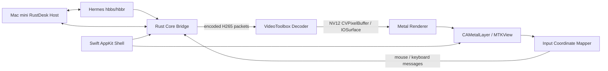

# RustDesk Native Viewer 架构基线

状态：Phase 0–3 已实现并完成 Intel/Hermes 验收；后续页面产品化见 `product-ui-design.md`  
更新时间：2026-08-03  
目标平台：macOS 13+，首要验收设备为 Intel MacBook Pro

## 1. 项目目标

构建一个面向 macOS 的原生 RustDesk 控制端（Viewer）。它复用 RustDesk 的连接、认证、加密和输入协议，只替换当前 macOS 客户端中成本较高的视频解码与显示路径。

第一目标不是复刻完整 RustDesk，而是在 Intel MacBook Pro 上证明下面这条 GPU 管线可以稳定工作：

```text
RustDesk H265 packet
  -> VideoToolbox hardware decode
  -> NV12 CVPixelBuffer / IOSurface
  -> CVMetalTextureCache
  -> Metal YUV-to-RGB + scaling
  -> CAMetalLayer / MTKView
```

成功标准是：Mac mini 维持正常可用的 HiDPI 桌面时，MBP 控制端不再把完整视频帧转换、复制为 CPU 侧 RGBA 后交给 Flutter 合成。

## 2. 背景与已验证事实

### 2.1 测试环境

| 角色 | 环境 |
| --- | --- |
| 被控端 | Mac mini（Apple Silicon），RustDesk 1.4.9，PHL BDM4350，30 Hz |
| 控制端 | MacBook Pro 16-inch 2019，Intel i7-9750H，Intel UHD 630 + Radeon Pro 5300M，macOS 13.7.8 |
| 自建服务 | Hermes，`192.168.50.44`，RustDesk hbbs/hbbr |
| 局域网 | iperf3 实测接收约 512 Mbit/s，不是当前瓶颈 |
| 开发机 | Apple Silicon Mac mini，Xcode 26.3、Swift 6.2.4、Rust 1.92 |
| Intel 验收机 | Xcode 15.2、Swift 5.9.2、Rust 1.82，可通过 `ssh mbp` 访问 |

### 2.2 性能证据

| Mac mini 实际编码 | MBP RustDesk CPU | 说明 |
| --- | ---: | --- |
| `4096x2304 @ 30 FPS` | 约 `103%–119%` | HiDPI，逻辑 `2048x1152`、backing buffer 2x |
| `2560x1440 @ 30 FPS` | 约 `57%–72%` | 逻辑 `1280x720`、backing buffer 2x |
| `2048x1152 @ 30 FPS` | 约 `41%–47%` | BetterDisplay LoDPI，逻辑与物理 1:1 |
| `1280x720 @ 30 FPS` | 约 `17%–24%` | LoDPI |

其他证据：

- RustDesk 日志确认 `hevc` VideoToolbox decoder 创建成功，并非 H265 软件解码回退。
- 采样时 `VTDecoderXPCService` 约占 `2.3%`，RustDesk 主进程约占 `43%`。
- RustDesk 主进程热点集中于 FlutterMacOS、QuartzCore、IOSurface 和 `flutter_custom_cursor`。
- RustDesk 1.4.9 的 macOS 构建使用 `hwcodec` RAM 解码路径：硬解后调用 `image.to_fmt(rgb, i420)`，再交给 `texture_rgba_renderer`。
- RustDesk 的 `vram` GPU texture 路径当前构建脚本注明仅支持 Windows。

结论：当前主要成本不是 HEVC 熵解码，而是硬解后的视频格式转换、CPU 内存拷贝、Flutter texture 更新及 QuartzCore 合成。像素数量增至 4 倍时，CPU 明显上升，符合该判断。

## 3. 范围

### 3.1 第一阶段必须具备

- 连接自建 RustDesk hbbs/hbbr。
- 配置服务地址、公钥、远端 ID 和一次性/固定密码。
- 单显示器会话。
- H265 视频。
- VideoToolbox 硬件解码。
- Metal 原生显示，支持适应窗口与原始比例。
- 鼠标移动、左右键、滚轮。
- 基础键盘输入与常用修饰键。
- 连接、认证、断开和错误状态。
- 实时 FPS、解码耗时、呈现耗时、丢帧数和 CPU 基准记录。
- `arm64` 开发构建和 `x86_64` Intel MBP 构建。

### 3.2 暂不实现

- 作为被控端运行。
- 地址簿、账户登录和云同步。
- 文件传输。
- 音频和语音通话。
- 多显示器、多窗口。
- 剪贴板与文件剪贴板。
- 远程终端、隐私模式、录制。
- iOS、Windows、Linux 客户端。
- VP8、VP9、AV1 软件解码。
- 公网 RustDesk 公共服务器兼容性；首轮只验自建服务。

这些能力不得阻塞第一轮 GPU 性能验证。

## 4. 总体架构



最终用户只启动一个 `RustDeskNative.app`。Rust 核心作为 App 内部静态库或动态库加载，不要求同时打开官方 RustDesk 客户端。

运行关系：

```text
Hermes:    继续运行现有 hbbs/hbbr
Mac mini:  继续运行官方 RustDesk 作为被控端
MacBook:   运行 RustDeskNative.app，官方 RustDesk 控制端可关闭
```

## 5. 组件设计

### 5.1 Rust Core Bridge

职责：

- 复用 RustDesk 客户端连接、NAT、加密、认证和协议实现。
- 在现有客户端解码前取得编码后的视频帧。
- 通过稳定、最小的 C ABI 向 Swift 暴露事件和操作。
- 不在 Swift 中重新实现 RustDesk wire protocol。

建议以 RustDesk `1.4.9` tag（commit `6c578292e8ebbbec708b76986ba8c4bc7c509747`）作为首个兼容基线，避免直接依赖未固定的 master。

建议的 C ABI 草案：

```c
typedef struct RDNClient RDNClient;

typedef enum {
    RDN_CODEC_H264,
    RDN_CODEC_H265
} RDNCodec;

typedef struct {
    RDNCodec codec;
    const uint8_t *data;
    size_t length;
    uint64_t sequence;
    uint64_t timestamp_us;
    bool keyframe;
    uint32_t width;
    uint32_t height;
} RDNEncodedVideoFrame;

RDNClient *rdn_client_create(const RDNCallbacks *callbacks, void *context);
void rdn_client_destroy(RDNClient *client);
int32_t rdn_client_connect(RDNClient *client, const RDNConnectionConfig *config);
void rdn_client_disconnect(RDNClient *client);
int32_t rdn_client_send_pointer(RDNClient *client, const RDNPointerEvent *event);
int32_t rdn_client_send_key(RDNClient *client, const RDNKeyEvent *event);
int32_t rdn_client_send_text(RDNClient *client, const uint8_t *utf8, size_t length);
```

边界规则：

- 视频回调中的字节指针只在回调期间有效。
- 第一版允许复制压缩后的 H265 packet；禁止复制解码后的 4K RGBA frame。
- Rust 回调不得直接修改 AppKit/SwiftUI 状态，Swift 必须切换到合适队列。
- 网络线程、解码线程、渲染线程相互隔离。
- 输入法只把 AppKit 已提交的 UTF-8 文本经窄 ABI 交给 Rust Core；组合态和候选内容不得写入日志。
- 视频队列最多保留 2 帧；积压时丢弃旧的非关键帧，优先低延迟而不是完整播放。

### 5.2 VideoToolbox Decoder

建议使用 Swift/Objective-C 可直接管理的 `VTDecompressionSession`：

- 输入 H265 VPS/SPS/PPS 与 NAL units。
- 必要时将 RustDesk/FFmpeg packet 的 Annex-B 格式转换为 AVCC 长度前缀格式。
- 从 VPS/SPS/PPS 创建并在参数变化时重建 `CMVideoFormatDescription`。
- 输出格式优先 `kCVPixelFormatType_420YpCbCr8BiPlanarVideoRange`（NV12）。
- 设置实时、低延迟属性；不启用不必要的帧重排。
- 分辨率、codec 或 parameter set 变化时安全重建 decoder。
- 解码失败后等待下一关键帧恢复，不允许无限积压或忙循环。

不能把 `CVPixelBuffer` 转换为 `CGImage`、`NSImage` 或 CPU RGBA 缓冲再显示，否则失去本项目的主要价值。

### 5.3 Metal Renderer

实现建议：

- 使用 `MTKView` 或直接使用 `CAMetalLayer`；SwiftUI 只负责容器和设置界面。
- 使用 `CVMetalTextureCacheCreateTextureFromImage` 将 NV12 的 Y、UV plane 映射为 Metal texture。
- Metal fragment shader 完成 YUV -> RGB。
- vertex/fragment shader 完成 aspect-fit、原始比例和裁切。
- `CVPixelBuffer` 生命周期至少覆盖 GPU command buffer 完成时刻。
- 呈现线程只保留最新一帧，不等待旧帧。
- 光标作为独立 Metal quad/overlay，不触发整棵 SwiftUI/AppKit 视图更新。
- 支持 BT.601/BT.709 矩阵选择；首轮以 RustDesk 实际 H265 色彩信息为准。

GPU 选择：

- Intel MBP 首先测试 Intel UHD 630（`MTLDevice.isLowPower == true`），尽量与 VideoToolbox/Quick Sync 共享 IOSurface。
- 同时保留 Radeon Pro 5300M 的基准开关。
- 不预设独显一定更快；用 CPU、GPU time、功耗和帧丢失数据决定默认设备。

### 5.4 输入与坐标

- AppKit `NSView` 接收鼠标和键盘事件。
- 输入坐标必须根据视频原始尺寸、窗口内容区域、aspect-fit 偏移和缩放比例映射。
- 远端分辨率变化时原子更新映射参数。
- 第一版不修改远端显示分辨率，避免重新触发 macOS HiDPI 2x 模式。
- 键盘先覆盖字母数字、方向键、Escape、Return、Tab、Command/Control/Option/Shift 和常见组合键。
- IME、功能键和完整布局映射作为后续专项。

### 5.5 应用层

UI 建议使用 SwiftUI 管理普通界面，视频视图通过 `NSViewRepresentable` 嵌入 AppKit/Metal：

- 连接页：服务器、Key、远端 ID、密码。
- 会话页：视频画面、连接状态、FPS/延迟/丢帧监控。
- 设置页：GPU 选择、适应窗口、画质、FPS 上限。

安全要求：

- 密码只存 Keychain；默认不持久化。
- 服务地址和公钥可存普通配置，但不得把密码、token 或完整认证消息写入日志。
- 日志只记录脱敏 peer ID、codec、分辨率、帧率、耗时和错误分类。

## 6. 项目结构建议

```text
rustdeskNative/
├── docs/
│   ├── README.md
│   ├── architecture.md
│   └── product-ui-design.md
├── RustDeskNative.xcodeproj
├── App/
│   ├── RustDeskNativeApp.swift
│   ├── Connection/
│   ├── Session/
│   ├── Input/
│   └── UI/
├── Video/
│   ├── VideoToolboxDecoder.swift
│   ├── MetalVideoView.swift
│   ├── MetalVideoRenderer.swift
│   └── Shaders.metal
├── CoreBridge/
│   ├── include/rustdesk_native.h
│   └── rustdesk-native-core/
├── Vendor/
│   └── rustdesk/              # 固定 tag/commit；具体引入方式在实现时决定
├── Tests/
│   ├── VideoPipelineTests/
│   ├── CoordinateMappingTests/
│   └── CoreBridgeTests/
└── Scripts/
    ├── build-rust-core.sh
    ├── build-universal.sh
    └── benchmark-mbp.sh
```

不要直接把 `/Applications/RustDesk.app` 内部的 `liblibrustdesk.dylib` 当作长期 SDK：它是 Flutter 客户端的内部产物，没有稳定 ABI，也没有提供所需的编码视频 packet 回调。

## 7. 开发阶段

### Phase 0：可测基线

- 初始化 Git/Xcode 工程和最低 macOS 13 target。
- 建立 arm64 + x86_64 构建。
- 提供统一 benchmark 脚本，记录进程 CPU、内存、分辨率、FPS 和运行时长。
- 固化本文中的官方 RustDesk 基线数据。

完成条件：空白 App 能在 Mac mini 构建并在 Intel MBP 启动，测试和 benchmark 命令可重复执行。

### Phase 1：本地 H265 GPU 管线

- 使用固定 H265 fixture 驱动 VideoToolbox。
- NV12 `CVPixelBuffer` 直接映射 Metal texture。
- 支持 `2048x1152` 和 `4096x2304`、30 FPS。
- 验证无 CPU RGBA frame copy。

完成条件：在 Intel MBP 连续运行 10 分钟，无崩溃、内存持续增长或队列积压。

### Phase 2：Rust Core Bridge

- 固定 RustDesk 1.4.9 基线。
- 提供连接、状态、编码视频 packet 和断开回调。
- Swift 收到真实 H265 packet 并送入 Phase 1 管线。

完成条件：能通过 Hermes 连接 Mac mini 并稳定显示实时画面。

### Phase 3：输入与可用 Viewer

- 鼠标、滚轮、基础键盘。
- aspect-fit 坐标映射。
- 基础连接 UI、错误提示、全屏和性能 HUD。

完成条件：可完成 30 分钟日常远程操作，不依赖官方 RustDesk 控制端。

2026-08-03 Intel MBP 正式验收已满足该条件：经 Hermes 操作真实
4096x2304 Mac mini 连续 1800.081 秒，鼠标、拖拽、滚轮、中英文输入、
按键重复、快捷键、全屏、HUD 与脱敏错误状态均由操作者确认通过；完整
性能、稳定性和 SHA256 证据保存在 `Evidence/IntelMBP/2026-08-03/Phase3/`。

Phase 3 验收后的兼容性跟进增加可显式开启的“独占键盘”模式：默认标准
模式继续使用本地 AppKit 输入法；独占模式通过 macOS session event tap
截获受支持的键盘事件，经 ABI v5 传递 macOS 物理键位，并复用 pinned
RustDesk Core 的 keyboard-map 路径，使 `Command-Space`、`Command-Tab`
等系统快捷键和输入法组合由远端处理。
`Control-Option-Shift-Escape` 是本地逃生组合；窗口或应用失焦时必须立即
释放远端按键并恢复本地输入，用户返回 Viewer 后仅在此前明确开启过独占
模式时自动恢复。手动关闭、逃生组合、连接失去控制权、权限失败或 event
tap 被系统停用时必须清除自动恢复意图。该跟进不修改既有 Phase 3 正式
证据，须另行通过 Intel/Hermes 实机验证后才算独占快捷键能力验收完成。

Phase 3 当前连接界面不得出现验收环境名称或 Core 动态库路径。用户只配置
设备 ID、一次性密码、RustDesk ID 服务器与服务器公钥；正常部署由
RustDesk Core 从 hbbs 发现中继，强制中继仅作为高级连接模式。当前实现中
服务器、公钥与设备 ID 只在用户勾选后保存在本机，密码不进入普通持久化
profile。后续多设备、Keychain 凭据与快速连接以
`product-ui-design.md` 为准。

macOS 产品包固定使用 `io.rustdesknative.viewer`，由同一 Apple Development
身份签名并安装到 `~/Applications/RustDesk Native Viewer.app`。构建脚本
必须拒绝把 CDHash 绑定的 ad-hoc 包作为可安装产品，以保证二进制和构建号
变化后 TCC 仍根据稳定 designated requirement 识别同一应用。辅助功能与
输入监控只需在首次安装或签名身份真正变化时重新授权。

最终安装包 `2026080306` 已在 Intel MBP 完成跨重打包 TCC 验证和真实链路
组合验收。当前远端运行中由 `4096x2304` 切换至 `3840x2160`，固定分辨率
单次门禁因此如实失败；同一最终 build 的独立短验分别覆盖
`4096x2304` 管线以及当前 `3840x2160`、全屏、HUD 和独占键盘自动恢复。
组合证据位于 `Evidence/IntelMBP/2026-08-03/Productization/`，既有 Phase 3
证据保持不变。固定 4096x2304 性能基线与允许分辨率切换的产品稳定性门禁
必须继续分开解释，不能通过降低原性能门槛消除失败记录。

### Phase 4：稳态与打包

- 断线重连、关键帧恢复、分辨率变化。
- universal 或分别输出 arm64/x86_64 构建。
- 签名、打包和 AGPL 源码交付说明。

## 8. 性能验收

首轮核心验收场景：Mac mini 输出 `4096x2304 @ 30 FPS H265`，Intel MBP 全屏/适应窗口显示。

| 指标 | 最低目标 | 理想目标 |
| --- | ---: | ---: |
| RustDeskNative 主进程 CPU | `<= 60%` | `<= 35%` |
| VTDecoderXPCService CPU | `<= 10%` | `<= 5%` |
| 10 分钟内存增长 | `<= 50 MB` | `<= 20 MB` |
| 平稳场景帧率 | `>= 28 FPS` | `>= 29.5 FPS` |
| 视频队列深度 | `<= 2` | `<= 1` |
| 连续运行 | 30 分钟无崩溃 | 2 小时无崩溃 |

性能声明必须同时记录：

- 远端实际编码尺寸和 codec。
- 本地窗口尺寸和 GPU。
- CPU/内存采样周期。
- FPS、丢帧、解码耗时和呈现耗时。
- 是否发生软件解码或 RGBA fallback。

不能用 `2048x1152 LoDPI` 的低负载冒充 4K HiDPI 场景通过验收。

## 9. 测试策略

- 单元测试：NAL/parameter set 解析、坐标映射、队列丢帧、状态机。
- 视频 fixture：分辨率变化、关键帧丢失、损坏 packet、VPS/SPS/PPS 更新。
- 集成测试：Hermes -> Mac mini -> RustDeskNative 真实链路。
- 性能测试：固定 10 分钟和 30 分钟场景，在 Intel MBP 采样。
- 回归对照：同一时段、同一分辨率、同一 FPS 与官方 RustDesk 1.4.9 对比。

## 10. 风险与决策

### 10.1 RustDesk 没有稳定的 Viewer SDK

需要维护一个窄 C ABI facade，并将上游变更隔离在 Rust 层。Swift 不直接依赖 RustDesk 内部 Rust 类型。

### 10.2 H265 packet 格式

必须先确认 RustDesk 交给现有 FFmpeg decoder 的 packet 是 Annex-B、AVCC 还是混合格式，以及关键帧和 parameter set 的传递方式。Phase 2 不得凭假设接入。

### 10.3 Intel 双 GPU

VideoToolbox 与 Metal 若落在不同 GPU，可能发生隐式跨 GPU 拷贝。必须分别测 UHD 630 和 Radeon 5300M；默认选择以数据为准。

### 10.4 协议与许可证

RustDesk 客户端使用 AGPL-3.0。本项目复用或修改 RustDesk 核心时按 AGPL 项目管理：保留许可证和版权说明；若分发或提供网络交互版本，提供相应源码。商业闭源计划需单独进行许可证评估。

### 10.5 不把语言当作优化结论

SwiftUI/AppKit 并不天然比 Flutter 快。只有在实际消除 CPU RGBA 转换、完整帧复制和高频 UI rebuild 后，才算达成性能目标。

## 11. 第一轮开发任务

开发任务从 Phase 0 和 Phase 1 开始，不要先接 RustDesk 网络协议：

1. 初始化 macOS 13+ Xcode 工程和测试 target。
2. 建立 Intel MBP 可执行的 x86_64 构建与部署脚本。
3. 建立可重复的官方 RustDesk / Native Viewer benchmark 采样脚本。
4. 实现 H265 fixture -> VideoToolbox -> NV12 CVPixelBuffer。
5. 实现 NV12 -> Metal -> MTKView，不创建 CPU RGBA frame。
6. 在 `2048x1152` 与 `4096x2304 @ 30 FPS` 下运行 10 分钟测试。
7. 输出新鲜 CPU、内存、FPS、丢帧和稳定性证据。

只有 Phase 1 的零拷贝管线在 Intel MBP 上取得明确收益后，才进入 RustDesk Core Bridge 集成。
