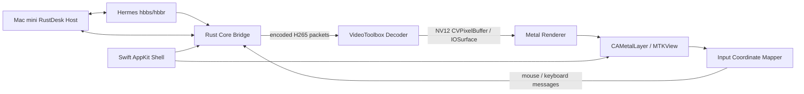

# FarPane 架构基线

状态：Phase 0–3 已实现并完成 Intel/Hermes 验收；后续页面产品化见 `product-ui-design.md`  
更新时间：2026-08-03  
目标平台：macOS 13+，首要验收设备为 Intel MacBook Pro

## 1. 项目目标

构建一个面向 macOS 的原生 RustDesk 控制端（Viewer）。它复用 RustDesk 的连接、认证、加密和输入协议，只替换当前 macOS 客户端中成本较高的视频解码与显示路径。

第一目标不是复刻完整 RustDesk，而是在 Intel MacBook Pro 上证明下面这条 GPU 管线可以稳定工作：

```text
RustDesk H265 packet
  -> VideoToolbox hardware decode
  -> NV12 CVPixelBuffer / IOSurface
  -> CVMetalTextureCache
  -> Metal YUV-to-RGB + scaling
  -> CAMetalLayer / MTKView
```

成功标准是：Mac mini 维持正常可用的 HiDPI 桌面时，MBP 控制端不再把完整视频帧转换、复制为 CPU 侧 RGBA 后交给 Flutter 合成。

## 2. 背景与已验证事实

### 2.1 测试环境

| 角色 | 环境 |
| --- | --- |
| 被控端 | Mac mini（Apple Silicon），RustDesk 1.4.9，PHL BDM4350，30 Hz |
| 控制端 | MacBook Pro 16-inch 2019，Intel i7-9750H，Intel UHD 630 + Radeon Pro 5300M，macOS 13.7.8 |
| 自建服务 | Hermes，`192.168.50.44`，RustDesk hbbs/hbbr |
| 局域网 | iperf3 实测接收约 512 Mbit/s，不是当前瓶颈 |
| 开发机 | Apple Silicon Mac mini，Xcode 26.3、Swift 6.2.4、Rust 1.92 |
| Intel 验收机 | Xcode 15.2、Swift 5.9.2、Rust 1.82，可通过 `ssh mbp` 访问 |

### 2.2 性能证据

| Mac mini 实际编码 | MBP RustDesk CPU | 说明 |
| --- | ---: | --- |
| `4096x2304 @ 30 FPS` | 约 `103%–119%` | HiDPI，逻辑 `2048x1152`、backing buffer 2x |
| `2560x1440 @ 30 FPS` | 约 `57%–72%` | 逻辑 `1280x720`、backing buffer 2x |
| `2048x1152 @ 30 FPS` | 约 `41%–47%` | BetterDisplay LoDPI，逻辑与物理 1:1 |
| `1280x720 @ 30 FPS` | 约 `17%–24%` | LoDPI |

其他证据：

- RustDesk 日志确认 `hevc` VideoToolbox decoder 创建成功，并非 H265 软件解码回退。
- 采样时 `VTDecoderXPCService` 约占 `2.3%`，RustDesk 主进程约占 `43%`。
- RustDesk 主进程热点集中于 FlutterMacOS、QuartzCore、IOSurface 和 `flutter_custom_cursor`。
- RustDesk 1.4.9 的 macOS 构建使用 `hwcodec` RAM 解码路径：硬解后调用 `image.to_fmt(rgb, i420)`，再交给 `texture_rgba_renderer`。
- RustDesk 的 `vram` GPU texture 路径当前构建脚本注明仅支持 Windows。

结论：当前主要成本不是 HEVC 熵解码，而是硬解后的视频格式转换、CPU 内存拷贝、Flutter texture 更新及 QuartzCore 合成。像素数量增至 4 倍时，CPU 明显上升，符合该判断。

## 3. 范围

### 3.1 第一阶段必须具备

- 连接自建 RustDesk hbbs/hbbr。
- 配置服务地址、公钥、远端 ID 和一次性/固定密码。
- 单显示器会话。
- H265 视频。
- VideoToolbox 硬件解码。
- Metal 原生显示，支持适应窗口与原始比例。
- 鼠标移动、左右键、滚轮。
- 基础键盘输入与常用修饰键。
- 连接、认证、断开和错误状态。
- 实时 FPS、解码耗时、呈现耗时、丢帧数和 CPU 基准记录。
- `arm64` 开发构建和 `x86_64` Intel MBP 构建。

### 3.2 暂不实现

- 作为被控端运行。
- 地址簿、账户登录和云同步。
- 文件传输。
- 音频和语音通话。
- 多显示器、多窗口。
- 剪贴板与文件剪贴板。
- 远程终端、隐私模式、录制。
- iOS、Windows、Linux 客户端。
- VP8、VP9、AV1 软件解码。
- 公网 RustDesk 公共服务器兼容性；首轮只验自建服务。

这些能力不得阻塞第一轮 GPU 性能验证。

## 4. 总体架构



最终用户只启动一个 `FarPane.app`。Rust 核心作为 App 内部静态库或动态库加载，不要求同时打开官方 RustDesk 客户端。

运行关系：

```text
Hermes:    继续运行现有 hbbs/hbbr
Mac mini:  继续运行官方 RustDesk 作为被控端
MacBook:   运行 FarPane.app，官方 RustDesk 控制端可关闭
```

## 5. 组件设计

### 5.1 Rust Core Bridge

职责：

- 复用 RustDesk 客户端连接、NAT、加密、认证和协议实现。
- 在现有客户端解码前取得编码后的视频帧。
- 通过稳定、最小的 C ABI 向 Swift 暴露事件和操作。
- 不在 Swift 中重新实现 RustDesk wire protocol。

建议以 RustDesk `1.4.9` tag（commit `6c578292e8ebbbec708b76986ba8c4bc7c509747`）作为首个兼容基线，避免直接依赖未固定的 master。

建议的 C ABI 草案：

```c
typedef struct RDNClient RDNClient;

typedef enum {
    RDN_CODEC_H264,
    RDN_CODEC_H265
} RDNCodec;

typedef struct {
    RDNCodec codec;
    const uint8_t *data;
    size_t length;
    uint64_t sequence;
    uint64_t timestamp_us;
    bool keyframe;
    uint32_t width;
    uint32_t height;
} RDNEncodedVideoFrame;

RDNClient *rdn_client_create(const RDNCallbacks *callbacks, void *context);
void rdn_client_destroy(RDNClient *client);
int32_t rdn_client_connect(RDNClient *client, const RDNConnectionConfig *config);
void rdn_client_disconnect(RDNClient *client);
int32_t rdn_client_send_pointer(RDNClient *client, const RDNPointerEvent *event);
int32_t rdn_client_send_key(RDNClient *client, const RDNKeyEvent *event);
int32_t rdn_client_send_text(RDNClient *client, const uint8_t *utf8, size_t length);
int32_t rdn_client_send_clipboard_text(RDNClient *client, const uint8_t *utf8,
                                       size_t length);
```

边界规则：

- 视频回调中的字节指针只在回调期间有效。
- 第一版允许复制压缩后的 H265 packet；禁止复制解码后的 4K RGBA frame。
- Rust 回调不得直接修改 AppKit/SwiftUI 状态，Swift 必须切换到合适队列。
- 网络线程、解码线程、渲染线程相互隔离。
- Viewer ABI v8 保留 v7 的小文本/富文本边界并新增独立的图片方向；六个方向均默认关闭，
  由本地策略分别约束；
  Rust 只收发至多 64 KiB 的单条 UTF-8 文本，不轮询或写入 macOS pasteboard。
- Viewer 产品层显式开启小文本、富文本与图片六个方向，系统 pasteboard 只由单一 Swift/AppKit owner
  访问；owner 在认证后启动，先快照而不上传会话前内容，以 changeCount 抑制回环并把
  fallback 轮询从 125 ms 动态退避到 4 s，terminal/Home/App teardown 均先停 owner
  再断开 Core。Host Control ABI v15 保留默认关闭的小文本 read/write 策略，并新增
  与其独立、同样默认关闭的 rich 与 image read/write 策略；Rust 只在任一小文本、富文本或图片方向
  显式开启时持久化上游单一 Boolean，小文本 opt-in 不会隐式开放 RTF/HTML 或图片。Host
  bootstrap schema v4 投影小文本、富文本与图片六个独立方向；v1 全部迁移为关闭，
  v2 保留原有小文本方向并把富文本/图片迁移为关闭，v3 保留小文本/富文本并把图片迁移为关闭。
  前台 legacy Host 与后台 Agent 消费同一策略，Home 仅在 Host 关闭时提供六个逐方向开关；
  变更后重新发布 immutable bootstrap，发布不 coherent 时禁止开启 Host。因此小型文本、
  RTF/HTML 与 RGBA/PNG/SVG 在用户显式开启后具备端到端路径、默认仍关闭；文件 promise 仍不受支持。
- ABI v8 保留 v7 的富文本 payload：原子携带可选的 64 KiB plain fallback，以及各自最多 1 MiB
  的 RTF/HTML；重复、未知、图片/special、畸形 metadata、非法 UTF-8、NUL 和超限输入
  均拒绝。receive 门禁在解析/解压前检查并在 callback 前复核，Swift 同步复制 callback
  bytes 并复用 disconnect gate。Host 可在独立 rich 方向策略下传递同一 bundle；Viewer
  产品配置已显式开启 rich receive/send，并由上述同一个 AppKit owner 接入；Host 产品
  通过 bootstrap schema v3 与 Home 提供独立、默认关闭的 rich read/write 开关。
- ABI v8 的 image payload 单独携带 RGBA/PNG/SVG：RGBA 要求正尺寸、单边不超过 8192、
  总像素不超过 7680×4320 且恰好每像素 4 bytes；PNG 上限 128 MiB 并检查 canonical
  structure；SVG 上限 4 MiB UTF-8，拒绝 NUL、DOCTYPE 与非 `<svg>` root，但不是渲染
  sanitizer。receive 门禁在解析/解压前检查并在 callback 前复核，send 复用同一
  lifecycle/permission authority；Swift 同步复制 callback bytes 后再次检查格式、metadata、
  大小和结构。Core 的 image read/write 默认仍关闭，但设备连接、自动恢复与环境 live mode
  三条 Viewer 产品入口显式开启；同一个 AppKit owner 只在 changeCount 变化后读取 exactly one
  item，优先 `public.svg-image`、其次 PNG、最后 TIFF。TIFF 在 128 MiB 输入上限与像素门禁后
  转为 canonical PNG，远端 RGBA 也转为 PNG 写入；畸形图片整项拒绝，不降级发送 rich/plain。
- Host 在两个方向准入前先分类 clipboard wire format：只有无 NUL 的有界 UTF-8 `Text`
  可进入小文本路径；RTF/HTML 必须组成 owned atomic bundle 并由 matching rich direction
  显式准入；RGBA/PNG/SVG 必须是 exactly one validated image envelope 并由 matching image
  direction 准入。远端 `Special` 名称、未知 enum 与多图片消息继续 fail closed。
- RTF/HTML 先进入 Rust-owned semantic envelope：只接受 exact format、空 special metadata
  与零图像尺寸，wire 与 bounded decompression 后的 UTF-8 payload 都限制为 1 MiB，解码后
  由 Rust `String` 独立持有并拒绝 NUL。Host ABI v17 保留独立 rich read/write；进入 pinned
  pasteboard helper 或 network writer 前先重建 canonical uncompressed Text/RTF/HTML，且
  active-session directional revoke 先于 format admission。Viewer AppKit owner 只在 changeCount
  变化后读取一个 pasteboard item，rich 优先且不会重复发送 plain，远端 bundle 也用一个
  `NSPasteboardItem` 原子写入并记录最终 owned-write count。Host rich 方向只在用户明确开启
  对应 Home 开关后生效；Viewer 图片 owner 已开启，Host 图片方向也通过 bootstrap schema v4
  与 Home 提供显式默认关闭的开关；文件 promise 仍保持关闭。
- RGBA/PNG/SVG 进入 Rust-owned image envelope 后才可被标记为需要独立 transfer：RGBA
  要求正尺寸、单边不超过 8192、总像素不超过 7680×4320，bounded zstd 解码后必须恰好
  为每像素 4 bytes；PNG 保持 pinned upstream 的无二次 zstd canonical 形状，以 128 MiB
  wire 上限检查 signature、IHDR/IDAT/IEND chunk framing、合法 header 与同一尺寸/像素门禁；
  SVG 的 wire/解码 UTF-8 分别限制为 4 MiB，拒绝 NUL、DOCTYPE 与非 canonical `<svg>`
  root。三类 payload 均复制为 Rust-owned bytes；SVG 只完成语义形状校验，不是渲染安全
  sanitizer。Viewer ABI v8 已提供独立、默认关闭的 image API；Host ABI v17 也提供独立、
  默认关闭的 image read/write，真实 incoming/outgoing data-plane 只在 active direction 与
  matching image policy 同时允许时，把 exactly one validated envelope 重建为 canonical
  uncompressed image 后交给 pinned pasteboard helper 或 network writer。Viewer AppKit owner
  已接入三种图片语义并复用 session epoch、owned-write suppression 与动态退避；Host
  bootstrap/Home opt-in 已接入且默认关闭，双机验收尚未完成。
- 断开后不得投递排队中的旧剪贴板回调；富文本可跨 Viewer ABI v8 并已接单一产品 owner；
  图片可跨 Viewer ABI v8 与 Host ABI v17 Core 边界，并在 Host 用户显式 opt-in 后进入产品路径；
  文件 promise 不跨 ABI。
- Host ABI v17 单独携带默认关闭的 file-transfer permission 与 immutable
  `file_transfer_receive_root`；关闭时 root 必须为空，开启时必须是 owner 可通过
  descriptor/no-follow contract 接纳的 existing private absolute directory，否则 create 在网络
  runtime 前 fail closed。Rust 同时在启动网络 runtime 前
  精确持久化并 readback `enable-file-transfer=Y/N`，pinned upstream 的 dedicated file login
  使用同一 option 拒绝未授权 scope。当前 App/Agent 不传 opt-in，且没有 Viewer file UI，
  因而这里只建立能力门，不表示产品文件传输已经开放。
- pinned file service 的 wire/decoded block 已统一限制为 128 KiB；FarPane-owned receive root、
  descriptor-relative create/resume/mutation 与唯一 owner core 已建立。Native Host mutation dispatch
  已在 dedicated file scope 内把 create-directory、remove-file、non-recursive remove-directory 与
  same-parent no-replace rename 交给 bound owner；成功返回 upstream done，拒绝/不可用只返回固定、
  不含路径的错误码，非 native build 继续走原 CM fallback。Native Host new-file write jobs 已由
  connection 本地持有：整批只接受最多 1,024 个 file entry、1 MiB 文件名元数据和 8 个并发 job，
  文件大小总和必须与声明一致；每个文件先写入同 parent 的 reserved `*.farpane-part`，128 KiB
  wire/decoded block、文件顺序、单文件/总大小均在写入时复核，完成时设置 mtime、`sync_all` 后用
  no-replace rename 提交。single-file resume 只接受 expected size 不超过 `UInt32` offset 上限的
  exact size/mtime，并以 descriptor xattr 持久化 committed offset 与 SHA-256 prefix digest；恢复前
  重算 prefix、截断未 checkpoint 尾部，篡改或矛盾状态 fail closed。job admission 原子独占 staging
  path；disconnect 保留已验证 partial，cancel/error 删除当前 staging，connection 回复验证后的真实
  offset。existing-target decision 现在只通过 descriptor-relative、read-only/no-follow 打开当前用户
  `0600` single-link regular target，并把实际 size/mtime/identical 摘要返回发送端；决定到达前 block
  fail closed。明确 skip 会保留原目标、清除安全的旧 staging，并计入多文件逻辑总大小；replace/offset
  决定继续以稳定错误拒绝，最终提交仍是 `RENAME_EXCL` no-replace。只读侧已建立同一 pinned root
  descriptor 下的安全快照 primitive：目录用独立 `openat(".") + fdopendir/readdir` 枚举，只接受当前
  用户精确 `0700` 目录与 `0600` single-link regular file，隐藏 private staging，单目录/整批均限制
  1,024 entries、1 MiB metadata 与 64 层深度；下载打开会复核 snapshot 的 device/inode/size/mtime。
  dedicated file connection 已把虚拟 `/` 的目录/空目录/递归列表与 Generic Send 接到该 owner；最多
  8 个 connection-local read jobs 发送 snapshot-bound directory、每文件 digest、128 KiB bounded block
  与 done，并在 skip/offset confirmation、cancel、remote error、Host unbind 或 connection teardown 时
  fail closed/释放 descriptor。确认与 EOF 都重新验证 snapshot，替换后的文件不会继续发送；完全不存在
  Native Host 时才回退上游 CM/path sender。Viewer 已冻结一个尚未接产品的纯 Swift download contract：
  本地 destination 只用 session-bound opaque lease 表示，远端 manifest 拒绝 traversal、非 NFC、大小写/
  规范化别名、祖先冲突与 private staging，并限制 1,024 entries、1 MiB metadata；connection-local
  progress authority 最多 8 个 job，只接受同 session、严格递增 sequence、单调有界 file/byte progress、
  explicit conflict、typed terminal failure、cancel 与 teardown。该合同不含本地 path/descriptor/raw error。
  Viewer ABI v15 在 v14 文件传输 seam 之上增加 connection-scoped display catalog callback：目录 identity
  固定为 `connectionEpoch + catalogRevision + displayIndex`，semantic duplicate 不推进 revision，畸形目录
  整体 typed unavailable；视频帧携带同一 epoch/revision/display tuple，Rust 与 Swift 都只允许当前 selected
  tuple 进入解码队列。dedicated file session 不发布目录，disconnect 清 authority。v15 尚不包含选择命令、
  terminal event 或产品 selector；Host ABI 仍为 v17，Host media displayRevision 与 input mapping generation
  不得复用为 Viewer catalog revision。
  Viewer ABI v14 保留 v9 default-off 的 exact policy/epoch pair、path-free scalar event callback 与
  epoch-scoped cancel command；true/nonzero 只建立 dedicated `FILE_TRANSFER` session，拒绝同时开启任何
  desktop clipboard direction，不启动视频 housekeeping，也不开放 input。cancel 只有在 exact epoch、
  authenticated、remote file permission 与 ready sender 全部满足时才投递 upstream `CancelJob`，worker
  退出会清除 file mode 与 epoch。Swift callback 重新验证 ABI、epoch/ID/sequence、单调有界 progress、
  typed failure 与 exact completion，并在 disconnect 前关闭投递。v14 保留 exact-session、single-flight
  remote-root list command/callback：只发送 `ReadDir("/", include_hidden=false)`，callback-scoped entry 在
  Rust 做 1,024/1 MiB/type/name/alias 门禁后由 Swift 复制并再次做 byte-exact NFC、完整 case-fold、separator/
  control 与 size 验证；error 只投影稳定 rejected/unavailable，teardown 清 pending request。Viewer destination
  owner 只用用户预选路径 no-follow 打开当前 euid 的 private `0700` 目录，后续仅持有 exact-session lease 与
  pinned descriptor/device/inode；每次 scoped borrow 重验 identity/owner/mode，exact teardown/deinit close，
  不保存路径也不创建文件。纯 Swift recursive-manifest authority 以 exact epoch/request、files/empty-directories
  两个独立有界 part 合成既有 canonical manifest；duplicate/malformed part 与 combined collision fail closed。
  v14 保留 v11 的 exact-session、single-flight recursive-manifest command/callback：只向远端根发送
  `AllFiles(id, "/", include_hidden=false)` 与 `ReadEmptyDirs("/", include_hidden=false)`，Rust 分别把 regular
  files 和 empty directories 约束为 1,024 entries/1 MiB metadata、canonical relative path、无 hidden/private
  staging/case alias 的 callback-scoped semantic part；两部分可任意顺序到达，duplicate/malformed/exact remote
  error 会清除 pending request，disconnect、worker exit 与 job teardown 也不保留 pending 状态。由于
  `ReadEmptyDirsResponse` 没有 request ID，同一 session epoch 只允许一次 manifest request，后续请求须以 fresh
  epoch 重连，避免迟到响应被错误归属。Swift 同步复制 metadata，
  复核 ABI/epoch/request/status/part/type/size/mtime/path/case-fold 后才投递到既有 authority。v14 保留
  path-free queued download registration（download start）：只跨 ABI 传 exact epoch、completed manifest request ID、transfer ID
  与 aggregate totals，destination lease 保持 Swift-owned；admission 要求 dedicated session、authentication、
  remote permission、ready sender，最多 8 个 unique transfer ID，并在 cancel、terminal job callback、job
  teardown、disconnect 与 worker exit 清除。已注册 job 的 upstream progress/done/error 和成功 cancel 现在投影为
  exact-session、严格递增 sequence、单调有界 file/byte/speed 的 typed callback；completion 强制 exact totals，
  error 只暴露 stable failure，Swift 再以单一严格 initializer 重验并投影到 progress authority。callback 在释放
  job mutex 后同步发出，避免重入死锁。Swift destination owner 现可从 pinned root descriptor 为最多 8 个
  transfer 创建/复核嵌套 `0700` parent，并用 `O_EXCL|O_NOFOLLOW` 预留 `0600`、single-link、empty 的 private
  `*.farpane-part`；handle 不含路径/descriptor，cancel、exact teardown/deinit 仅在 name 仍指向原 inode 时 unlink，
  replacement 留存并 fail closed。exact reservation 现以 tracked offset 接受 nonempty、最大 128 KiB 的 `pwrite`；
  写前/写后同时复核 name 与 fd 的 device/inode、当前 euid `0600` single-link regular shape 和 exact tracked size，
  checked aggregate 不得超过 manifest 声明，越界、metadata drift 与 partial/system failure 均终止并只清理仍匹配的
  partial。完整 reservation 现先应用协议 Unix 秒 mtime、`fsync(file)` 并再次验证 exact inode/size，再以同一
  parent descriptor 上的 `renameatx_np(RENAME_EXCL)` 原子发布且不覆盖既有 final，随后 `fsync(parent)`；rename
  前失败只清理仍匹配的 staging，rename 后 parent fsync 失败单独记为 durability-unconfirmed，禁止把已发布文件当作
  普通失败安全重试。Rust 侧另新增尚未接 ABI/wire 的入站 block envelope：只接纳 matching registered transfer、
  manifest file-number 范围内的 block，raw/decoded 均复用 upstream 128 KiB 上限，compressed payload 先限界解压并
  复制为 owned bytes，empty/oversize/malformed/mismatch 全部 fail closed。该注册仍不发 wire download request、不跨
  ABI 借 descriptor；v14 已增加 callback-scoped decoded block seam，Rust 在投递前重验 active/authenticated/
  file-mode/exact epoch，Swift 在 callback 内复制并复核 epoch/ID/file/bounds 后才排队；feature-gated io-loop hook
  只消费仍在 Bridge 注册的 transfer ID，matching malformed block fail closed，unmatched block 保留上游 write-job 路径，
  且 callback 前释放 job lock；该 hook 自身的 wire download request、destination write 与 UI 仍未实现。后续 download
  start 现在只在 exact completed manifest 注册成功后直接入队一个根路径 `/`、hidden=false、file=0、generic 的
  `FileAction::Send`，不用 `Data::SendFiles`，因此不会创建上游 path-based local write job；queue 关闭会在同一 job
  mutex 临界区回滚 registration，duplicate/rejected start 不会重复发命令。digest confirmation 现由 Rust 内部保留的
  per-file manifest size/mtime authority 驱动，只按 file number 严格顺序接受 exact new-file digest，并通过既有 peer
  回复 `OffsetBlk(0)`；matching malformed/duplicate/resume/identical/nonzero-offset digest 被消费并 fail closed，foreign
  job 保留 upstream fallback，且 receive block 只有在对应 file digest 已确认后才可进入 semantic callback。Swift
  receive/write adapter 现把 package-scoped download start 与 exact destination owner 在 wire request 前原子绑定，Core
  start 拒绝会回滚 route；callback queue 依 manifest 顺序执行 descriptor-relative reserve、bounded `pwrite`、mtime/file
  fsync、no-replace rename 与 parent fsync，零字节文件及 empty directories 也必须在 remote completed 向上发布前完成。
  stale/order/size drift、premature completed 与 local I/O 均 fail closed，durability-unconfirmed 保持独立 terminal，block
  失败还经 exact relay 请求 Core cancel。package-scoped session owner 现固定 one connection epoch，串行 recursive-manifest
  request，并允许最多 8 个 manifest-complete download 并发；它强持有 destination owner，只有 receive adapter 先给出 exact
  local completed/cancelled/remote-failed proof 才接受对应 Core terminal，Core command reject、protocol drift、用户 cancel 与
  connection teardown 都按 transfer ID 先 cancel/discard receive route 再关闭 descriptor。Viewer product composition 现为每次
  Viewer attempt 持有独立 dedicated Core factory 与 exact file epoch；live Viewer 在 desktop streaming 后才开放一次“接收文件”
  动作。directory-only、single-selection、alias-closed 的 picker 选中目录后立即固定 current-euid/`0700` descriptor owner，
  不保留路径；App 随后才从 Keychain 读取同设备密码，缺失时用 secure sheet 临时取得，并在同步投影后清空。显式 action 把
  server/peer/credential 投影到 clipboard 全关、file mode 全开的独立配置，file-ready 后才发送 manifest/download；active 后才
  开放 exact cancel。该 epoch 仍因 upstream empty-dir response 无 request ID 而只允许一次 action。App 返回 Home 或退出时先
  使 picker/prompt callback 失效，再 teardown session/destination 与 dedicated Core，随后才断开 desktop Core；Host App/Agent
  receive-root/file opt-in 已接产品但默认关闭，用户显式开启后才开放 Host file service 与既有 Viewer download 方向；
  Viewer upload 在 v14 只新增默认未接 wire 的 semantic read seam：Swift descriptor owner 以 exact session/transfer/
  opaque source token 持有来源，Rust 最多注册 8 个 bounded manifest job，并通过同步 callback 传入 exact file number、
  offset 与 Rust caller-owned、最大 128 KiB buffer。Swift 在返回前完成精确读取，双方在 callback 前后复核 epoch、job、
  token 与 descriptor identity；path/fd 不跨 ABI，短读、stale route 与 teardown 并发全部 fail closed。cancel、terminal、
  disconnect 和 worker exit 会清除对应 semantic ownership。本阶段尚不发送 `FileAction::Receive/Create` 或 block，也未增加
  Viewer 上传按钮，所以不能据此声明产品上传可用；
  多文件 upload resume、existing-target replace 也仍未实现。
  App/Agent 仍不传 file opt-in，产品能力必须继续保持关闭。
- 输入法只把 AppKit 已提交的 UTF-8 文本经窄 ABI 交给 Rust Core；组合态和候选内容不得写入日志。
- 视频队列最多保留 2 帧；积压时丢弃旧的非关键帧，优先低延迟而不是完整播放。

### 5.2 VideoToolbox Decoder

建议使用 Swift/Objective-C 可直接管理的 `VTDecompressionSession`：

- 输入 H265 VPS/SPS/PPS 与 NAL units。
- 必要时将 RustDesk/FFmpeg packet 的 Annex-B 格式转换为 AVCC 长度前缀格式。
- 从 VPS/SPS/PPS 创建并在参数变化时重建 `CMVideoFormatDescription`。
- 输出格式优先 `kCVPixelFormatType_420YpCbCr8BiPlanarVideoRange`（NV12）。
- 设置实时、低延迟属性；不启用不必要的帧重排。
- 分辨率、codec 或 parameter set 变化时安全重建 decoder。
- 解码失败后等待下一关键帧恢复，不允许无限积压或忙循环。

不能把 `CVPixelBuffer` 转换为 `CGImage`、`NSImage` 或 CPU RGBA 缓冲再显示，否则失去本项目的主要价值。

### 5.3 Metal Renderer

实现建议：

- 使用 `MTKView` 或直接使用 `CAMetalLayer`；SwiftUI 只负责容器和设置界面。
- 使用 `CVMetalTextureCacheCreateTextureFromImage` 将 NV12 的 Y、UV plane 映射为 Metal texture。
- Metal fragment shader 完成 YUV -> RGB。
- vertex/fragment shader 完成 aspect-fit、原始比例和裁切。
- `CVPixelBuffer` 生命周期至少覆盖 GPU command buffer 完成时刻。
- 呈现线程只保留最新一帧，不等待旧帧。
- 光标作为独立 Metal quad/overlay，不触发整棵 SwiftUI/AppKit 视图更新。
- 支持 BT.601/BT.709 矩阵选择；首轮以 RustDesk 实际 H265 色彩信息为准。

GPU 选择：

- Intel MBP 首先测试 Intel UHD 630（`MTLDevice.isLowPower == true`），尽量与 VideoToolbox/Quick Sync 共享 IOSurface。
- 同时保留 Radeon Pro 5300M 的基准开关。
- 不预设独显一定更快；用 CPU、GPU time、功耗和帧丢失数据决定默认设备。

### 5.4 输入与坐标

- AppKit `NSView` 接收鼠标和键盘事件。
- 输入坐标必须根据视频原始尺寸、窗口内容区域、aspect-fit 偏移和缩放比例映射。
- 远端分辨率变化时原子更新映射参数。
- 第一版不修改远端显示分辨率，避免重新触发 macOS HiDPI 2x 模式。
- 键盘先覆盖字母数字、方向键、Escape、Return、Tab、Command/Control/Option/Shift 和常见组合键。
- IME、功能键和完整布局映射作为后续专项。

### 5.5 应用层

UI 建议使用 SwiftUI 管理普通界面，视频视图通过 `NSViewRepresentable` 嵌入 AppKit/Metal：

- 连接页：服务器、Key、远端 ID、密码。
- 会话页：视频画面、连接状态、FPS/延迟/丢帧监控。
- 设置页：GPU 选择、适应窗口、画质、FPS 上限。

安全要求：

- 密码只存 Keychain；默认不持久化。
- 服务地址和公钥可存普通配置，但不得把密码、token 或完整认证消息写入日志。
- 日志只记录脱敏 peer ID、codec、分辨率、帧率、耗时和错误分类。

## 6. 项目结构建议

```text
farpane/
├── docs/
│   ├── README.md
│   ├── architecture.md
│   └── product-ui-design.md
├── RustDeskNative.xcodeproj
├── App/
│   ├── RustDeskNativeApp.swift
│   ├── Connection/
│   ├── Session/
│   ├── Input/
│   └── UI/
├── Video/
│   ├── VideoToolboxDecoder.swift
│   ├── MetalVideoView.swift
│   ├── MetalVideoRenderer.swift
│   └── Shaders.metal
├── CoreBridge/
│   ├── include/rustdesk_native.h
│   └── rustdesk-native-core/
├── Vendor/
│   └── rustdesk/              # 固定 tag/commit；具体引入方式在实现时决定
├── Tests/
│   ├── VideoPipelineTests/
│   ├── CoordinateMappingTests/
│   └── CoreBridgeTests/
└── Scripts/
    ├── build-rust-core.sh
    ├── build-universal.sh
    └── benchmark-mbp.sh
```

不要直接把 `/Applications/RustDesk.app` 内部的 `liblibrustdesk.dylib` 当作长期 SDK：它是 Flutter 客户端的内部产物，没有稳定 ABI，也没有提供所需的编码视频 packet 回调。

## 7. 开发阶段

### Phase 0：可测基线

- 初始化 Git/Xcode 工程和最低 macOS 13 target。
- 建立 arm64 + x86_64 构建。
- 提供统一 benchmark 脚本，记录进程 CPU、内存、分辨率、FPS 和运行时长。
- 固化本文中的官方 RustDesk 基线数据。

完成条件：空白 App 能在 Mac mini 构建并在 Intel MBP 启动，测试和 benchmark 命令可重复执行。

### Phase 1：本地 H265 GPU 管线

- 使用固定 H265 fixture 驱动 VideoToolbox。
- NV12 `CVPixelBuffer` 直接映射 Metal texture。
- 支持 `2048x1152` 和 `4096x2304`、30 FPS。
- 验证无 CPU RGBA frame copy。

完成条件：在 Intel MBP 连续运行 10 分钟，无崩溃、内存持续增长或队列积压。

### Phase 2：Rust Core Bridge

- 固定 RustDesk 1.4.9 基线。
- 提供连接、状态、编码视频 packet 和断开回调。
- Swift 收到真实 H265 packet 并送入 Phase 1 管线。

完成条件：能通过 Hermes 连接 Mac mini 并稳定显示实时画面。

### Phase 3：输入与可用 Viewer

- 鼠标、滚轮、基础键盘。
- aspect-fit 坐标映射。
- 基础连接 UI、错误提示、全屏和性能 HUD。

完成条件：可完成 30 分钟日常远程操作，不依赖官方 RustDesk 控制端。

2026-08-03 Intel MBP 正式验收已满足该条件：经 Hermes 操作真实
4096x2304 Mac mini 连续 1800.081 秒，鼠标、拖拽、滚轮、中英文输入、
按键重复、快捷键、全屏、HUD 与脱敏错误状态均由操作者确认通过；完整
性能、稳定性和 SHA256 证据保存在 `Evidence/IntelMBP/2026-08-03/Phase3/`。

Phase 3 验收后的兼容性跟进增加可显式开启的“独占键盘”模式：默认标准
模式继续使用本地 AppKit 输入法；独占模式通过 macOS session event tap
截获受支持的键盘事件，经 ABI v5 传递 macOS 物理键位，并复用 pinned
RustDesk Core 的 keyboard-map 路径，使 `Command-Space`、`Command-Tab`
等系统快捷键和输入法组合由远端处理。
`Control-Option-Shift-Escape` 是本地逃生组合；窗口或应用失焦时必须立即
释放远端按键并恢复本地输入，用户返回 Viewer 后仅在此前明确开启过独占
模式时自动恢复。手动关闭、逃生组合、连接失去控制权、权限失败或 event
tap 被系统停用时必须清除自动恢复意图。该跟进不修改既有 Phase 3 正式
证据，须另行通过 Intel/Hermes 实机验证后才算独占快捷键能力验收完成。

Phase 3 当前连接界面不得出现验收环境名称或 Core 动态库路径。用户只配置
设备 ID、一次性密码、RustDesk ID 服务器与服务器公钥；正常部署由
RustDesk Core 从 hbbs 发现中继，强制中继仅作为高级连接模式。当前实现中
服务器、公钥与设备 ID 只在用户勾选后保存在本机，密码不进入普通持久化
profile。后续多设备、Keychain 凭据与快速连接以
`product-ui-design.md` 为准。

macOS 产品包对外名称为 FarPane，固定使用 `io.rustdesknative.viewer`，由同一
Apple Development 身份签名并安装到 `~/Applications/FarPane.app`。构建脚本
必须拒绝把 CDHash 绑定的 ad-hoc 包作为可安装产品，以保证二进制和构建号
变化后 TCC 仍根据稳定 designated requirement 识别同一应用。辅助功能与
输入监控只需在首次安装或签名身份真正变化时重新授权。

最终安装包 `2026080306` 已在 Intel MBP 完成跨重打包 TCC 验证和真实链路
组合验收。当前远端运行中由 `4096x2304` 切换至 `3840x2160`，固定分辨率
单次门禁因此如实失败；同一最终 build 的独立短验分别覆盖
`4096x2304` 管线以及当前 `3840x2160`、全屏、HUD 和独占键盘自动恢复。
组合证据位于 `Evidence/IntelMBP/2026-08-03/Productization/`，既有 Phase 3
证据保持不变。固定 4096x2304 性能基线与允许分辨率切换的产品稳定性门禁
必须继续分开解释，不能通过降低原性能门槛消除失败记录。

### Phase 4：稳态与打包

- 断线重连、关键帧恢复、分辨率变化。
- universal 或分别输出 arm64/x86_64 构建。
- 签名、打包和 AGPL 源码交付说明。

## 8. 性能验收

首轮核心验收场景：Mac mini 输出 `4096x2304 @ 30 FPS H265`，Intel MBP 全屏/适应窗口显示。

| 指标 | 最低目标 | 理想目标 |
| --- | ---: | ---: |
| RustDeskNative 主进程 CPU | `<= 60%` | `<= 35%` |
| VTDecoderXPCService CPU | `<= 10%` | `<= 5%` |
| 10 分钟内存增长 | `<= 50 MB` | `<= 20 MB` |
| 平稳场景帧率 | `>= 28 FPS` | `>= 29.5 FPS` |
| 视频队列深度 | `<= 2` | `<= 1` |
| 连续运行 | 30 分钟无崩溃 | 2 小时无崩溃 |

性能声明必须同时记录：

- 远端实际编码尺寸和 codec。
- 本地窗口尺寸和 GPU。
- CPU/内存采样周期。
- FPS、丢帧、解码耗时和呈现耗时。
- 是否发生软件解码或 RGBA fallback。

不能用 `2048x1152 LoDPI` 的低负载冒充 4K HiDPI 场景通过验收。

## 9. 测试策略

- 单元测试：NAL/parameter set 解析、坐标映射、队列丢帧、状态机。
- 视频 fixture：分辨率变化、关键帧丢失、损坏 packet、VPS/SPS/PPS 更新。
- 集成测试：Hermes -> Mac mini -> RustDeskNative 真实链路。
- 性能测试：固定 10 分钟和 30 分钟场景，在 Intel MBP 采样。
- 回归对照：同一时段、同一分辨率、同一 FPS 与官方 RustDesk 1.4.9 对比。

## 10. 风险与决策

### 10.1 RustDesk 没有稳定的 Viewer SDK

需要维护一个窄 C ABI facade，并将上游变更隔离在 Rust 层。Swift 不直接依赖 RustDesk 内部 Rust 类型。

### 10.2 H265 packet 格式

必须先确认 RustDesk 交给现有 FFmpeg decoder 的 packet 是 Annex-B、AVCC 还是混合格式，以及关键帧和 parameter set 的传递方式。Phase 2 不得凭假设接入。

### 10.3 Intel 双 GPU

VideoToolbox 与 Metal 若落在不同 GPU，可能发生隐式跨 GPU 拷贝。必须分别测 UHD 630 和 Radeon 5300M；默认选择以数据为准。

### 10.4 协议与许可证

RustDesk 客户端使用 AGPL-3.0。本项目复用或修改 RustDesk 核心时按 AGPL 项目管理：保留许可证和版权说明；若分发或提供网络交互版本，提供相应源码。商业闭源计划需单独进行许可证评估。

### 10.5 不把语言当作优化结论

SwiftUI/AppKit 并不天然比 Flutter 快。只有在实际消除 CPU RGBA 转换、完整帧复制和高频 UI rebuild 后，才算达成性能目标。

## 11. 第一轮开发任务

开发任务从 Phase 0 和 Phase 1 开始，不要先接 RustDesk 网络协议：

1. 初始化 macOS 13+ Xcode 工程和测试 target。
2. 建立 Intel MBP 可执行的 x86_64 构建与部署脚本。
3. 建立可重复的官方 RustDesk / Native Viewer benchmark 采样脚本。
4. 实现 H265 fixture -> VideoToolbox -> NV12 CVPixelBuffer。
5. 实现 NV12 -> Metal -> MTKView，不创建 CPU RGBA frame。
6. 在 `2048x1152` 与 `4096x2304 @ 30 FPS` 下运行 10 分钟测试。
7. 输出新鲜 CPU、内存、FPS、丢帧和稳定性证据。

只有 Phase 1 的零拷贝管线在 Intel MBP 上取得明确收益后，才进入 RustDesk Core Bridge 集成。
