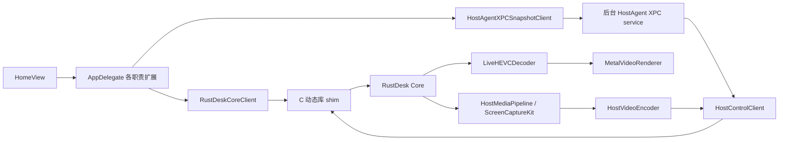

# FarPane 代码地图

FarPane 是一个 macOS App，包含 Viewer 和后台 Host 两条运行路径。
RustDesk Core 固定在 1.4.9 commit `6c578292e8ebbbec708b76986ba8c4bc7c509747`，
负责连接、认证、加密与网络协议。Swift 负责原生 UI、系统权限、硬件媒体管线和产品状态。

## 从哪里开始读

| 目标 | 入口 | 下一层 |
| --- | --- | --- |
| 进程启动、退出、窗口关闭 | `Sources/RustDeskNative/RustDeskNativeApp.swift` | `RustDeskNativeProcessMode`、`HostAgentProcessBootstrap` |
| 首页连接与配置 | `AppDelegate+Home.swift`、`AppDelegate+Connections.swift` | `HomeView`、`ConnectionCatalog` |
| Viewer 建立连接 | `AppDelegate+Viewer.swift`、`AppDelegate+ViewerCallbacks.swift` | `RustDeskCoreClient` |
| Viewer 重连 | `AppDelegate+ViewerRecovery.swift` | `ViewerAutomaticRecoveryOwner` |
| Viewer 文件传输 | `AppDelegate+FileTransfer.swift` | `ViewerFileTransferProductComposition` |
| Host 注册与进程归属 | `AppDelegate+HostRegistration.swift` | `HostAgentBackgroundActivationOwner` |
| Host UI 命令 | `AppDelegate+HostCommands.swift` | `HostAgentHomeCommandRoutingPolicy`、`HostAgentHomeCommandDispatchPolicy` |
| Host 后台进程 | `HostAgentProcess.swift`、`HostAgentProcessRuntime.swift` | `HostAgentOwnedCoreRuntime`、`HostAgentXPCSnapshotService` |
| Host 媒体 | `HostAgentMediaPipelineOwner.swift` | `HostMediaPipeline`、`HostVideoEncoder` |

表中未带目录的 App 文件均位于 `Sources/RustDeskNative/`。
共享连接及 IPC 类型位于 `Sources/CoreBridge/`，媒体实现位于 `Sources/VideoPipeline/`。

## 运行链路


```mermaid
flowchart LR
    Home[HomeView] --> App[AppDelegate 各职责扩展]
    App --> Viewer[RustDeskCoreClient]
    App --> XPC[HostAgentXPCSnapshotClient]
    XPC --> Service[后台 HostAgent XPC service]
    Service --> Host[HostControlClient]
    Viewer --> Shim[C 动态库 shim]
    Host --> Shim
    Shim --> Rust[RustDesk Core]
    Rust --> Decode[LiveHEVCDecoder]
    Decode --> Metal[MetalVideoRenderer]
    Rust --> Capture[HostMediaPipeline / ScreenCaptureKit]
    Capture --> Encode[HostVideoEncoder]
    Encode --> Host
```

AppDelegate 的 stored state 只存在于入口类。职责扩展把 Home、注册、命令、密码、
媒体、Viewer、文件传输和剪贴板分开，仍使用同一会话身份和相同的退出顺序。
不通过动态注册表寻找处理器；每个调用可以直接跳转到具体 Swift 方法。

HomeView 保留控件与当前快照，`HomeView+Layout` 组合页面，
`HomeView+SharingSettings`、`+SessionBanners` 等负责局部构造，
`HomeView+Actions` 负责交互。`StackLayout` 统一常见 StackView 构造。
剪贴板六个方向使用 `HostClipboardPreference`，每次更改只写对应的持久化键。

## 模块边界

### ConnectionCatalog

设备列表、服务器配置、Keychain、Host bootstrap 文档及单写者租约。
密码与非敏感目录数据分开；发布的 bootstrap 是不可变配置快照。
后台的 live build、boot identity 与发布版本必须一致，才可用于 UI 状态和命令。

### CoreBridge

`CoreBridge.swift` 只实现 Viewer client 生命周期与调用；
`CoreConnectionTypes`、`CoreDisplayTypes`、`CoreTransferTypes`、`CoreInputTypes` 定义语义数据。
`CoreCallbackDelivery` 管理排队回调，按视频、剪贴板、文件传输分组的 callback 文件负责 C 数据拷贝。
`ClipboardImageValidation` 是图片字节及尺寸校验的统一入口。

Host 对应 `HostControlClient`、`HostConfiguration`、`HostSnapshot`、`HostEvents`、
`HostMediaEvents` 和 `HostSessionGates`。此模块不导入 AppKit、ScreenCaptureKit 或 VideoToolbox。

XPC 使用 Data-only 信封。`XPCDocument` 统一严格 JSON 数值、布尔值、大小与错误转换，
每一种 wire contract 保留自己的 schema、字段集合、文档上限和关联校验。
`HostAgentXPCSnapshotClient` 持有唯一锁和状态；`+Snapshots`、`+Events`、`+Commands`、
`+Completion` 按协议阶段组织处理。`HostAgentXPCClientTransport` 单独负责 NSXPCConnection。

命令先经过可见目标、激活 epoch、投影 generation 和 peer identity 校验，再送交唯一 owner。
后台操作拒绝或结果未知时不会回退到前台 Host。重试复用原命令 ID。

### VideoPipeline

Viewer：压缩 H265 → VideoToolbox → IOSurface-backed NV12 → Metal。
Host：ScreenCaptureKit → capture cadence/背压 → VideoToolbox H264/HEVC → 编码包回交 Rust。

`HostVideoEncoder` 共用 VT session、回调所有权、关键帧、参数集与硬件状态上报。
H264/HEVC 入口只选择 codec 并保留各自错误类型。只有真实压缩回调后读回的硬件状态才是证据。
压缩后丢包必须进入明确的 IDR 恢复；不能丢掉参考包后继续假装解码链完整。

### ViewerInput

坐标映射、滚轮、按键映射与独占键盘状态机。
AppKit 接收输入，Swift 输出语义事件，RustDesk Core 构造并发送协议消息。
输入法只转发已提交文本，独占键盘模式另有权限与生命周期管理。

### Rust adapter 与补丁

`CoreBridge/RustDeskPatch/rdn_bridge.rs` 和 `rdn_host_bridge.rs` 是 ABI 入口及目录。
相邻同名目录按连接、输入、剪贴板、文件传输、会话、媒体和存储拆分实现与测试。
它们用 `include!` 保留原有 Rust 命名空间、可见性、FFI 符号及测试共享锁；这是一组
同一编译单元内的明确职责文件，不是独立 crate。上游协议修改仍保存在 `.patch` 文件中。

`Scripts/sync-rustdesk-bridge.py` 复制或逐字节校验全部 canonical 文件。
bootstrap 和只读 source verifier 都调用它。`Vendor/rustdesk` 是生成的依赖 checkout，
应修改 canonical 源码，再同步；不要把 Vendor 当作另一份产品实现。

## 必须保持的行为

- C ABI 只跨越编码包、受限字节及语义数据；不传原始整帧 RGBA，不暴露 Rust protobuf。
- Host 可选音频、文件和剪贴板方向默认关闭；本地授权、会话权限和远端权限分别生效。
- `ViewerPasteboardOwner` 是唯一接触 NSPasteboard 的实现，生命周期受会话 epoch 约束。
- 文件传输由 descriptor、manifest、epoch 和 opaque token 约束；路径不会当作裸写入权限。
  私有 staging、no-follow、no-replace、大小与 inode 复核继续有效。
- 排队回调先拷贝 callback-scoped 数据；旧 generation/epoch 不能修改新连接。
- Host agent 由 SMAppService 管理；只支持当前已登录的 Aqua session，不绕过 TCC。
- 保持 `RustDeskNative` executable 与 `io.rustdesknative.viewer` Bundle ID，避免破坏既有系统授权。

## 验证

```sh
swift test
python3 -m unittest discover -s Tests/ScriptTests -p 'test_*.py'
xcrun swift-format lint --strict --recursive Sources Tests
Scripts/verify-rustdesk-core-source.sh
python3 Scripts/measure-code.py --base <base-commit>
```

Swift 测试覆盖真实状态机、严格信封、文件系统、编码器及 HomeView 交互。
Python 测试覆盖证据数据校验、脚本、实际动态库加载及少量模块边界。
旧的逐阶段源码拼写/“开发完成”审计已退役；历史证据保留在 `Evidence/`，不作为当前行为证明。

Rust bridge 测试需要 bootstrap 与 vcpkg 已准备：

```sh
VCPKG_ROOT="$PWD/Build/vcpkg" MACOSX_DEPLOYMENT_TARGET=13.0 \
  cargo test --manifest-path Vendor/rustdesk/Cargo.toml --release --lib \
  --features rdn-native-core,rdn-native-host,screencapturekit rdn_ -- --test-threads=1
```

这些检查不等同于双机 Direct/Relay、TCC、睡眠/网络切换、性能或发布验收。
详细安全设计见 [Host 设计](host-mode-design.md)，实测条件见 [benchmark-results](benchmark-results.md)。
