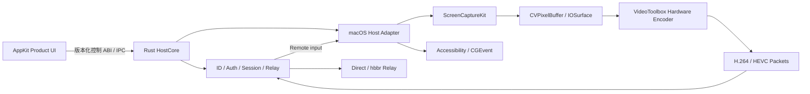
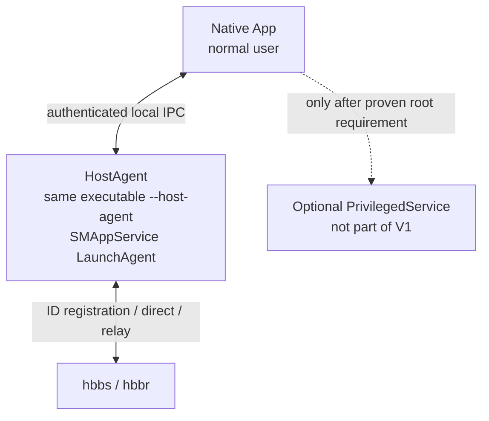
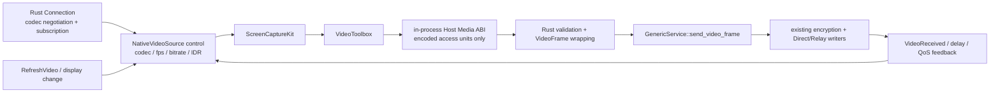
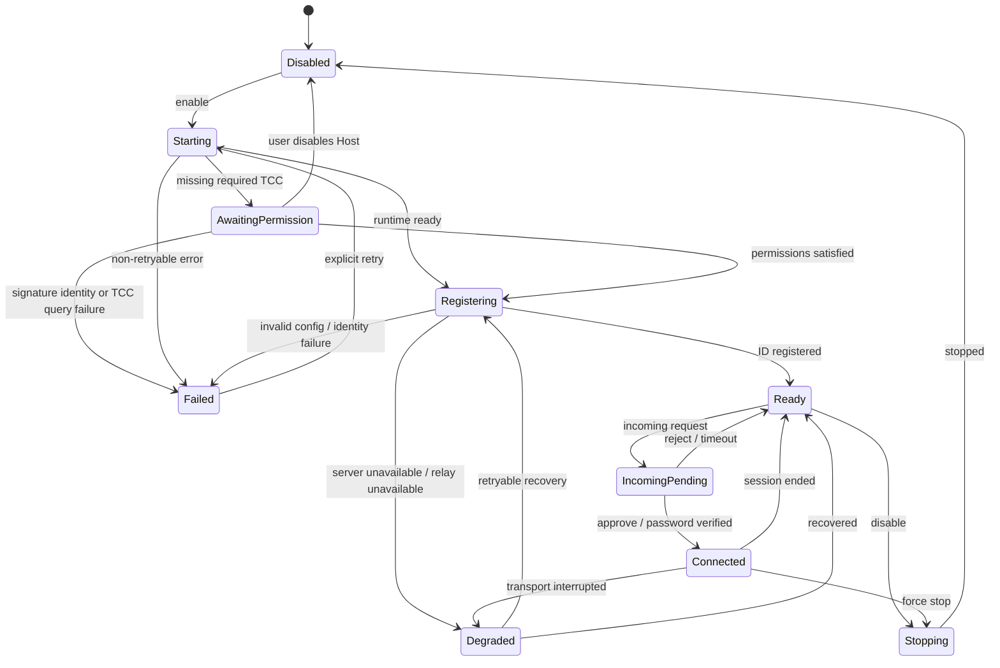
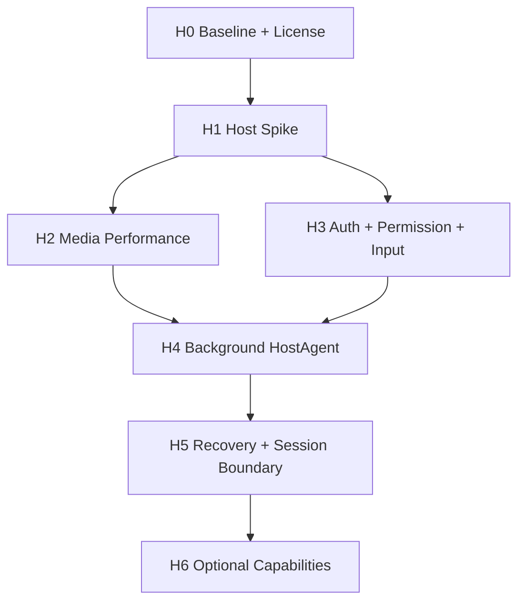

# RustDesk Native “别人连接我”详细设计

> 状态：Draft v0.3
> 日期：2026-08-05
> 范围：macOS 原生被控端（Host Mode）
> 目标读者：产品、macOS、Rust、远程桌面协议与测试开发者

## 1. 摘要

本文设计在现有 RustDesk Native viewer 基础上增加“别人连接我”能力，包括：

- 稳定的本机 ID；
- 临时密码与永久密码；
- macOS 系统权限和远程会话权限；
- 后台 Agent 注册、启动、停止、升级与状态诊断；
- 入站连接审批、会话展示、主动断开；
- 屏幕采集、硬件编码、加密传输和远程输入；
- 可量化的 CPU、内存、时延、丢帧和稳定性门禁。

本设计的核心决策是：

1. **不从零重写 RustDesk 协议、安全和网络控制面。** ID/Rendezvous、认证、加密、直连/Relay、协议协商和会话控制继续保留在 Rust。
2. **不把完整 RustDesk GUI 或内部 API 当作 SDK 嵌入。** 上游源码只作为被控端实现和互操作行为的参考/复用来源，项目对 Swift 暴露自有、稳定、语义化的 Host ABI。
3. **重写并优化 macOS 被控媒体面。** 使用 ScreenCaptureKit、IOSurface/CVPixelBuffer 和 VideoToolbox 建立原生低复制链路；Product UI 不接触原始帧。
4. **先做登录用户场景，再产品化后台运行。** 第一阶段在已登录桌面跑通真实链路；之后用 `SMAppService` 管理用户会话 LaunchAgent。V1 不为尚未证明的 root 需求预置 LaunchDaemon。
5. **Host 媒体接缝是 H1 的首要技术门禁。** VideoToolbox 产物通过独立的进程内 Host Media ABI 注入 Rust `video_service`；codec 协商、订阅、QoS、刷新请求、打包、加密和 Direct/Relay 发送仍由 Rust 权威执行。
6. **性能结论必须来自真实链路。** 固定记录机器、输入画布、drawable/capture dimensions、codec、实际硬件编码状态、FPS、CPU、内存、drops、网络和 runtime。

推荐的产品级链路如下：



## 2. 背景与问题

现有 viewer 已证明 macOS 原生实现可以显著降低远程画面展示侧的 CPU 占用。被控端比 viewer 多出屏幕采集、颜色格式处理、视频编码、变化检测和发送调度，因此同样存在较大的平台原生化收益。

用户曾观察到 Mac mini 上官方/现有被控端 CPU 约为 40–50%，但仓库内现有性能证据是控制端数据，不能用来证实该被控端数字或其归因。正式实现前必须在同一台被控机上重建可重复基线，并补齐：

- Mac mini 型号、CPU 架构和 macOS 版本；
- Activity Monitor 口径及 Host、WindowServer、videotoolboxd 分进程数据；
- 采集尺寸、显示缩放、帧率和画面内容；
- H.264/HEVC/VPx 以及实际选中的硬件或软件编码器；
- 静态桌面、普通操作、滚动/视频四种负载；
- 码率、RTT、丢包、发送队列、帧队列和 runtime。

本设计不预设“重写必然更快”，而是将低 CPU 路径定义为可验证的数据面合同。

## 3. 目标与非目标

### 3.1 产品目标

V1 应让用户在一个原生页面中完成以下操作：

1. 查看并复制稳定的本机 ID；
2. 查看/刷新临时密码，设置或删除永久密码；
3. 看懂屏幕录制、辅助功能、输入监控等 macOS 权限状态，并能跳转到对应系统设置；
4. 注册、启动、停止后台 HostAgent，看到准确的组件级状态；
5. 设置允许的远程能力和连接审批模式；
6. 收到明确的入站请求，查看远端信息并同意或拒绝；
7. 连接期间持续看到可见指示器，随时禁止输入或断开连接；
8. 在 App 退出或重启后仍可按用户选择提供后台 Host；
9. 网络变化、休眠唤醒和 HostAgent 崩溃后能够恢复或给出可诊断的失败状态。

### 3.2 技术目标

- Rust 继续作为协议、认证、加密、Relay、codec/session 的权威状态机；
- Host 数据面不跨 Product UI/Host Control ABI 传输原始视频帧；
- 采集到编码优先走 IOSurface/CVPixelBuffer 零拷贝或单次 GPU 转换路径；
- 明确验证 VideoToolbox 实际使用硬件编码；
- 所有队列有界，过载时降低帧率/分辨率或丢弃未编码旧帧；
- 任何压缩参考帧不得静默乱序或随意丢弃；
- 后台 Agent、权限、注册和会话状态均来自权威组件，不用 UI 推测；
- 上游 RustDesk 变更隔离在 adapter 层，不污染 Swift 产品接口。

### 3.3 V1 非目标

除非后续单独批准，V1 不包含：

- 自研 ID Server 或 Relay Server；
- 重写 RustDesk 密码协议、加密握手或 NAT 穿透协议；
- App Store 沙盒分发；
- Windows/Linux 被控端；
- 多个并发远程控制会话；
- 隐蔽运行、静默授权或绕过 macOS TCC；
- 完整文件管理器、远程终端、远程打印和隐私模式；
- 承诺与所有历史 RustDesk 客户端版本互操作。

音频、剪贴板和文件传输采用独立功能开关和阶段门禁，不能阻塞核心屏幕/输入 MVP。

## 4. 外部约束

### 4.1 RustDesk 不是稳定 Host SDK

RustDesk 开源客户端已经包含 `src/server`、Rendezvous、screen capture、input、clipboard 等被控端实现，但这些是应用内部模块，不是稳定、版本化的第三方 SDK。项目必须：

- 固定上游 tag/commit；
- 建立最小 patch 集；
- 用自有 adapter 和 ABI 隔离上游类型；
- 每次升级执行互操作和性能回归；
- 不把 Flutter bridge 或上游内部事件直接暴露给 Swift。

参考：<https://github.com/rustdesk/rustdesk>

### 4.2 许可证

RustDesk 客户端仓库使用 AGPL-3.0；FarPane 顶层 `LICENSE`、README 和 `docs/architecture.md` 已决定按 AGPL-3.0 分发。因此 Host Mode 不再把“开源还是闭源”作为未决架构门禁，而是执行可验证的 AGPL 合规清单。RustDesk Server Pro 或 Custom Client Generator 不应被默认理解为闭源嵌入 SDK 授权。

发布前清单至少包括：

- 随二进制提供对应源码、构建脚本和许可证/版权通知；
- 记录 pinned RustDesk commit、Host patch inventory 和本项目修改说明；
- 对网络交互场景履行 AGPL 对应源码要求；
- 产物内保留 `LICENSE`、`THIRD_PARTY_NOTICES.md` 和可访问的源码获取方式。

如未来另立闭源商业版，必须当作新产品/许可范围重新评估，不得沿用本文结论。

### 4.3 macOS TCC 与代码签名

屏幕录制、辅助功能和输入监控权限不能由应用静默授予。权限与二进制路径、签名身份和 designated requirement 存在关联，升级、改名、移动路径或签名漂移可能导致授权失效。

HostAgent 从第一版开始就应使用最终计划中的：

- App Bundle ID `io.rustdesknative.viewer`；
- LaunchAgent label / Mach service `io.rustdesknative.viewer.host-agent`；
- Team ID；
- designated requirement；
- 安装路径 `/Applications/FarPane.app`；
- Hardened Runtime 与 entitlements。

已决定 V1 HostAgent 使用同一签名 App executable 的 `--host-agent` 模式，而不是独立 helper 二进制。这使 TCC 和代码签名身份与现有 App 保持一致，同时允许 launchd 在 UI 进程退出后继续运行该 mode。参数分流必须发生在 AppKit 初始化前，HostAgent mode 不创建 Dock 图标、菜单或窗口。

开发签名、正式签名和 adhoc 签名的 TCC 结果必须分开记录。H1 可使用本地开发签名；进入 H4 预览分发前，必须完成 Developer ID notarization、stapling 和带 quarantine 的全新机安装/后台启动验收。未公证构建不得被称为可分发的后台 Host。

参考：

- <https://developer.apple.com/documentation/screencapturekit>
- <https://rustdesk.com/docs/en/client/mac/>

## 5. 建议范围与默认假设

详细设计暂按以下假设推进；任何变化都应更新本文和验收矩阵：

| 项目 | V1 假设 |
|---|---|
| 操作系统 | macOS 13，与当前 `Package.swift` 一致；只使用 13 可用的 Host 主路 API，后续系统能力用 availability gate |
| CPU | Apple Silicon 优先，Intel 做功能兼容和独立性能门禁 |
| Server | 自托管 hbbs/hbbr 优先，配置沿用现有 Rust core |
| 会话 | 同一时刻最多一个控制会话 |
| Codec | H.264 为兼容基线，HEVC 为 Apple 平台优先能力；软件 codec 仅作明确 fallback |
| 显示器 | 首版支持单显示器选择；多显示器切换在后续阶段 |
| 权限 | 查看屏幕、输入、剪贴板三个独立开关 |
| 审批 | 临时密码、永久密码、手动确认及组合模式 |
| 无人值守 | 必须由用户显式启用，默认关闭；V1 仅支持已登录的 active Aqua session，不支持 LoginWindow/重启后登录 |
| 连接可见性 | 永远显示菜单栏/窗口状态与主动断开入口 |

## 6. 总体架构

### 6.1 分层

系统分成四层：

1. **Product UI**：AppKit 页面、菜单栏状态、来访弹窗和系统设置引导；
2. **Host Control API**：稳定、版本化、低频语义 ABI/IPC；
3. **Rust HostCore**：配置、ID、认证、会话、权限、网络和编码包调度；
4. **macOS Host Adapter**：采集、编码、输入、剪贴板、TCC、显示和电源事件。

约束：

- Product UI 不直接调用 RustDesk 上游内部 API；
- Product UI 不持有 CVPixelBuffer、IOSurface、编码器或 socket；
- macOS Adapter 不决定认证结果和远程权限；
- Rust HostCore 不伪造 TCC 状态；
- UI 展示的状态必须能够映射到一个权威组件和时间戳。

### 6.2 进程模型

产品级 V1 默认使用两个。H1 Spike 先在 App 进程合并这两个；H4 再以同 executable 的不同 mode 拆成两个进程：



#### Native App

- 展示本机 ID、密码策略、权限和会话；
- 发出显式用户命令；
- 不承担后台会话存活责任；
- 退出后 HostAgent 是否继续运行取决于“允许后台被控”设置。

#### HostAgent

- 运行在当前 active Aqua session，能访问 WindowServer；
- 持有 Rust HostCore；
- 持有 ScreenCaptureKit、VideoToolbox 和输入 adapter；
- 与 hbbs/hbbr 建立网络连接；
- 产生权威 HostSnapshot 和会话事件；
- 崩溃后由 launchd 按退避策略恢复。

#### PrivilegedService（V1 不实现）

当前 V1 操作清单——注册/取消注册用户 LaunchAgent、启停 HostAgent、读写用户配置、访问用户 Keychain——均不证明需要 root LaunchDaemon。因此：

- H4 先使用 `SMAppService.agent(plistName:)` 管理随 App 签名的 LaunchAgent；
- 设置页报告 launchd 注册、用户审批、运行、崩溃循环和版本 handshake，不把 plist 存在当成安装成功；
- 只有未来出现经原型验证、不能用用户会话 API 完成的具体 root 操作，才新建 PrivilegedService 设计和安全审查；
- 该未来服务仍不得采集屏幕、处理视频、打开任意文件或接受 shell 字符串。

P0 Spike 中可先让 HostCore 跑在 Native App 进程，仅支持“用户已登录且 App 打开”；真实媒体链确认后再拆 HostAgent，避免同时调试性能和 launchd/TCC。

### 6.3 为什么不把采集放进 AppKit UI 进程

- Product UI 退出或重建窗口不应中断后台会话；
- 原始帧跨进程/跨 ABI 会增加复制和生命周期复杂度；
- UI 主线程卡顿不能反压网络和编码；
- TCC、签名与崩溃恢复应绑定稳定的 HostAgent；
- HostAgent 可独立采样 CPU、内存、编码器和队列指标。

### 6.4 Host 媒体与 RustDesk server 会话接缝

这是 H1 前必须冻结的最小 Host patch contract。当前 pinned RustDesk 1.4.9 中，`src/server/video_service.rs` 自行创建 capturer/encoder，经 `GenericService::send_video_frame` 把 protobuf `VideoFrame` 发给订阅连接；`src/server/connection.rs` 负责对端 codec 能力、订阅、`RefreshVideo*` 与 QoS 反馈。Native Host 不另起 socket，不绕开这条链。



Host patch inventory 只允许包含：

1. 新增独立 feature `rdn-native-host` 和 `rdn_host_bridge.rs`，不改变无该 feature 的上游行为；
2. 在 `video_service` 的产生者端增加 `NativeVideoSource`，保留原有 service 订阅、display switch、`VideoReceived`、QoS 和 Connection writer；
3. 将 macOS adapter 实测可用的 H.264/HEVC 能力注入 Rust codec 协商；Rust 仍产生唯一的 `selectedCodec + codecEpoch`，adapter 不能自选 codec；
4. 将 Rust 的 target FPS/bitrate、subscriber demand、display revision 和刷新请求映射为 adapter 控制事件；
5. 把经验证的压缩 access unit 包装成现有 `EncodedVideoFrame`/`VideoFrame`，再调用现有 service send 路径。

Host Media ABI 不属于 UI 控制通道。每个 access unit 必须包含 `hostInstanceId`、`connectionEpoch`、`codecEpoch`、canonical display ID/revision、codec、framing、PTS、keyframe/parameter-set flags 和有上限的 bytes。Rust 在调用返回前拷贝到 Rust-owned compressed buffer，或使用经合同测试的显式 ownership-transfer/free callback；不得保留 Swift 临时指针。迟到 epoch、错 codec、过大包、非单调 PTS 和缺失参数集的 IDR 必须 fail closed 并记稳定错误码。

VideoToolbox 常产生 AVCC/HVCC 长度前缀，现有真实 RustDesk 样本主要是 Annex-B。H1 不凭假设固定 wire framing；必须使用 FarPane 控制端黄金连接确认协商 codec 的 framing、参数集传递和 keyframe 标记，然后在 Media ABI 边界统一规范化。允许压缩包的一次有界拷贝，不得因此引入 raw-frame 拷贝。

刷新有两种语义：远端 `RefreshVideo*`/丢失恢复只触发当前 VT session 的下一帧 IDR；codec、尺寸、display revision 变化才执行 flush→丢弃旧 epoch→重建 encoder→参数集+IDR。不得沿用上游“一律重启 video service”来伪装 keyframe 请求。

## 7. Host 状态模型

### 7.1 顶层状态



### 7.2 后台状态不是一个 Boolean

UI 不得只展示 `serviceRunning=true/false`。权威快照至少包含：

- `applicationIdentity`: invalidLocation / developmentSigned / developerIdSigned / notarized / signatureMismatch；
- `backgroundRegistration`: notRegistered / requiresUserApproval / registered / versionMismatch / unregistering / failed；
- `agent`: unavailable / stopped / starting / running / wrongSession / crashLoop / failed；
- `privilegedService`: notRequired（V1 常态）/ requiredButMissing / running / failed；
- `registration`: offline / resolving / registering / ready / backoff / rejected；
- `permissions`: screenCapture / accessibility / inputMonitoring / microphone；
- `hostAvailability`: disabled / limited / ready / connected / degraded；
- `observedAt` 和组件版本。

`ready` 必须同时满足：

1. HostAgent 在正确会话域运行；
2. 必需权限已满足；
3. identity 可读且有效；
4. 已从权威 Rendezvous 链路获得可用 ID；
5. 入站监听/打洞/Relay 能力已初始化；
6. HostAgent 与 App 的 XPC wire 协议版本兼容；
7. 若当前有 active subscriber，媒体 codec epoch 和 adapter 能力已完成 handshake。

## 8. Host Control ABI / IPC

### 8.1 设计原则

- 本节区分三个不同合同：进程内 Host Control C ABI、进程内 Host Media C ABI、跨进程 App↔HostAgent XPC wire protocol；三者不共用 pointer 或生命周期语义；
- 新增独立 Host 命名空间，不在未实现前修改现有 Viewer ABI 语义；
- Host Control C ABI 只传低频语义控制信息和编码后的诊断快照；
- Host Media C ABI 只在 HostCore 与同进程 macOS adapter 之间传递媒体控制和压缩 access unit，禁止传 raw frame；
- 使用 opaque handle，明确 create/start/stop/destroy 生命周期；
- 每个事件包含 schema version、event ID、host instance ID 和 timestamp；
- 所有字符串明确 UTF-8、长度和释放方；
- 任何 password buffer 在使用后立即清零，不写入日志或 crash metadata；
- 回调不得在 Rust 锁内调用 Swift，也不得要求 AppKit 主线程同步返回；
- approve/reject 使用异步 command + result event，避免重入。

### 8.2 建议接口

以下为语义草案，不是最终头文件：

```c
uint32_t rdn_host_abi_version(void);

RdnHostResult rdn_host_create(
    const RdnHostCreateOptions *options,
    const RdnHostCallbacks *callbacks,
    RdnHostHandle **out_host);

RdnHostResult rdn_host_start(RdnHostHandle *host);
RdnHostResult rdn_host_stop(RdnHostHandle *host, RdnHostStopReason reason);
RdnHostResult rdn_host_command(RdnHostHandle *host, const RdnHostCommand *command);
RdnHostResult rdn_host_copy_snapshot(RdnHostHandle *host, RdnOwnedBytes *out_snapshot);
void rdn_host_free_bytes(RdnOwnedBytes bytes);
void rdn_host_destroy(RdnHostHandle *host);
```

控制事件可以使用版本化 JSON/MessagePack envelope，因为频率低、便于演进；原始帧和编码包禁止通过该控制通道。编码包只能经 §6.4 的 Host Media ABI 进入 Rust。

Host Media ABI 单独版本化，语义草案如下：

```c
uint32_t rdn_host_media_abi_version(void);

RdnHostResult rdn_host_media_set_capabilities(
    RdnHostHandle *host,
    const RdnHostEncoderCapabilities *capabilities);

RdnHostResult rdn_host_media_submit_access_unit(
    RdnHostHandle *host,
    const RdnHostEncodedAccessUnit *access_unit);

RdnHostResult rdn_host_media_report_encoder_state(
    RdnHostHandle *host,
    const RdnHostEncoderState *state);
```

Rust 通过 Host callback 发出 `startCapture`、`stopCapture`、`reconfigure(codecEpoch, codec, dimensions, fps, bitrate)` 和 `requestIdr(display, codecEpoch, reason)`。`submit_access_unit` 的成功只表示 Rust 已拷贝/接管该压缩包并通过 epoch/format 校验，不表示远端已收到；远端收到和 QoS 仍来自现有 Rust 反馈链。

### 8.3 HostSnapshot

建议字段：

```text
schemaVersion
hostInstanceId
hostState
localId
temporaryPasswordPresentation
passwordPolicy
approvalMode
unattendedAccessEnabled
backgroundStatus
systemPermissions[]
capabilityPolicies[]
activeConnectionId?
activeSession?
registrationStatus
transportAvailability
lastError?
observedAt
```

注意：

- `temporaryPasswordPresentation` 是短生命周期敏感值，单独受 UI 隐私策略控制；
- 快照不得包含永久密码明文、identity 私钥、server secret 或 raw authentication payload；
- `lastError` 使用稳定错误码和脱敏说明，不透传底层网络/协议原始错误；
- connection、display、permission 使用 canonical ID，不用数组下标表达身份。

### 8.4 Commands

至少包括：

- enableHost / disableHost；
- registerBackgroundAgent / unregisterBackgroundAgent；
- startHostAgent / stopHostAgent / retryHostAgent；
- regenerateTemporaryPassword；
- setPermanentPassword / clearPermanentPassword；
- setApprovalMode；
- setCapabilityPolicy；
- openSystemPermissionSettings；
- approveIncoming / rejectIncoming；
- disableInputForActiveSession；
- disableClipboardForActiveSession；
- disableAudioForActiveSession；
- disconnectSession；
- selectDisplay；
- setQualityPolicy；
- exportSanitizedDiagnostics。

所有 command 均带 `commandId`；最终结果通过 event 回传，Swift 不以“函数返回成功”推断状态已经完成。

### 8.5 Events

- snapshotChanged；
- backgroundAgentOperationProgress；
- incomingConnectionRequested；
- incomingConnectionExpired；
- sessionStarted；
- sessionCapabilitiesChanged；
- sessionStatsUpdated；
- sessionEnded；
- permissionChanged；
- recoverableError；
- fatalError。

事件队列必须合并高频 stats，不能让 UI 消费速度反压 HostCore。

### 8.6 App↔HostAgent XPC wire 协议

H1 中 AppKit controller 通过 Host Control C ABI 直接调用同进程 HostCore。H4 拆进程后，HostCore handle 只存在 HostAgent；App 的 `HostControlClient` 改用 `io.rustdesknative.viewer.host-agent` Mach service，不尝试跨进程传 C pointer 或回调。

Wire envelope 至少包含 `wireVersion`、`messageType`、`requestId/eventId`、`hostInstanceId`、`agentBootId`、`sentAt`、payload length 与类型化 payload。命令是 request/accepted/result 三段式；`accepted` 只说明已入队，不代表注册、启停、审批或断开已完成。

重连语义：

1. App 连接后先交换支持的 wire version 和组件 build ID；不兼容时只允许导出诊断/触发修复，不发 Host command；
2. handshake 成功后必须先获取全量 HostSnapshot，再从其 `lastEventId` 订阅增量事件；
3. 断线期间事件可丢，但重连后的权威快照必须收敛最终状态；审批请求不依赖 UI 事件队列存活；
4. App 可用相同 `commandId` 重试未知结果命令，HostAgent 在有界 dedupe window 内返回原结果，不重复执行；
5. `agentBootId` 变化表示 Agent 已重启，App 废弃旧 instance 的 pending UI intent，重新以 snapshot 对账。

XPC listener 必须从 audit token 校验 euid、Team ID、`io.rustdesknative.viewer` designated requirement 和安装路径。协议对每类消息设长度/频率上限，不允许任意 selector、任意文件 URL 或类型解档。

## 9. Identity 与密码

### 9.1 本机 ID

- identity key 在首次启用 Host 时生成；
- identity 与 App 窗口生命周期解耦；
- App 重启、HostAgent 重启和小版本升级后保持稳定；
- 用户切换 server 配置时，不隐式重置 identity；
- “重置本机 ID”是单独的高风险操作，需要明确确认和审计；
- 私钥不离开 Rust/安全存储边界，不通过 Swift 或日志暴露。

UI 只有在 Rendezvous 确认注册成功后显示“可连接”。本地存在一个 ID 字符串不等于远端实际可达。

### 9.2 临时密码

- 使用系统 CSPRNG；
- 明确字符集、长度、有效期和轮换条件；
- 默认仅在 Host ready 时生成；
- 禁用 Host、显式刷新或策略到期后失效；
- 只在用户主动展示时短时显示；
- 不写文件、日志、analytics、pasteboard history 或 crash report；
- 是否在成功连接后自动轮换作为可配置策略，默认开启。

### 9.3 永久密码

- 默认未设置；
- 设置永久密码必须由本机用户完成；
- 明文仅存在于输入和导入 Rust 的短生命周期 buffer；
- 优先只持久化协议所需 verifier；若互操作必须保存可恢复 secret，仅允许存入 Keychain，并记录原因；
- 禁止写入普通 TOML、UserDefaults、日志或命令行参数；
- 密码强度、失败次数限制和冷却策略由 Rust HostCore 权威执行；
- UI 只能展示“已设置”和更新时间，不能读回明文。

### 9.4 审批模式

V1 支持：

- manualOnly：每次本机点击同意；
- temporaryPassword；
- permanentPassword；
- passwordAndLocalApproval；
- passwordOrLocalApproval。

无人值守只能选择允许 password 验证的模式，并且必须单独开启。UI 必须解释“允许在你不在电脑旁时被连接”的影响。

## 10. 权限模型

### 10.1 macOS 系统权限

| 权限 | 用途 | 缺失时行为 |
|---|---|---|
| Screen Recording | 捕获显示内容 | Host 不进入 ready；允许仅诊断连接但不建立屏幕会话 |
| Accessibility | 注入键盘鼠标 | 可建立只读会话；输入能力强制关闭 |
| Input Monitoring | 特定输入模式/完整键盘兼容 | 标记 limited；按当前 adapter 能力降级 |
| Microphone/System Audio | 远程音频 | 仅禁用音频，不阻塞屏幕 MVP |

系统权限状态由 platform adapter 实时读取。UI 的“已授权”不得基于用户点击过按钮推测。

### 10.2 远程能力权限

V1 权限：

- viewDisplay；
- controlKeyboardMouse；
- readClipboard；
- writeClipboard；
- hearSystemAudio；
- transferFiles（后续）；
- restartOrLock（后续）。

原则：

- 默认最小权限；
- policy 在认证前参与授权；
- 会话开始时生成 immutable permission snapshot；
- 用户可在会话中立即撤销输入、剪贴板等能力；
- 扩大当前会话权限需要本机显式动作；
- 修改默认 policy 默认只影响新会话，除非用户明确应用到当前会话。

### 10.3 入站连接审批

IncomingConnectionRequest 至少包含：

- canonical `connectionId`；
- 远端 ID；
- 远端声明的设备名和平台（标记为 untrusted display metadata）；
- 请求时间、超时时间；
- 请求的 capabilities；
- 预计 transport：direct / relay / unknown；
- 认证方式；
- 风险提示，如短时间多次失败。

规则：

- 一个 connectionId 只允许一次最终 approve/reject；
- 请求超时后 approve 必须失败；
- UI 重建不能丢失 pending request，应从 HostSnapshot 恢复；
- MVP 同时只允许一个 pending/active 控制会话，其余显式 busy/reject；
- 认证失败不弹出可被远端滥用的无限本机通知；
- 对连续失败做速率限制、指数退避和脱敏审计。

## 11. macOS 采集与编码数据面

### 11.1 零拷贝合同

理想路径：

```text
SCStream callback
  -> CMSampleBuffer
  -> CVPixelBuffer backed by IOSurface
  -> VTCompressionSessionEncodeFrame
  -> encoded CMSampleBuffer
  -> Rust-owned compressed packet descriptor
  -> protocol encryption / transport
```

硬约束：

- Product UI 永远不接收 raw frame；
- 不允许每帧构造全尺寸 `Data`、`Vec<u8>` 或 `CGImage`；
- capture adapter 与 encoder 必须在同一 HostAgent 进程；
- CVPixelBuffer 使用引用计数跨异步编码边界，不复制像素；
- 若输入像素格式不被硬件编码器接受，优先使用 ScreenCaptureKit 输出配置、CVPixelBufferPool 或 GPU/VideoToolbox pixel transfer；
- H1 必须在 macOS 13 真机分别探测 SCK `420v`/`420f` 直出和 BGRA 输出；不预设所有系统/显示组合都能稳定直出 NV12；
- CPU 逐像素 BGRA→NV12/I420 只允许作为带指标的 fallback；
- 每帧记录逻辑 copy count，性能验收要求主路径 copy count 为 0 或 1 次 GPU 转换。

### 11.2 ScreenCaptureKit 配置

配置项由 QualityController 统一管理：

- output width/height；
- pixel format；
- color space/range；
- minimumFrameInterval；
- queueDepth；
- cursor 是否包含在画面；
- display/window filter；
- HDR/SDR 策略。

默认策略：

- queueDepth 从较小值开始，以低时延优先；
- 不使用 `minimumFrameInterval = 0` 作为默认产品策略；
- 远端未请求 HDR 时使用 SDR，避免无必要的色彩和带宽成本；
- 捕获尺寸尽量接近实际发送尺寸，不先处理完整 5K 再在 CPU 缩放；
- display 配置变化使用 `updateConfiguration`/重建流的受控状态机处理。

ScreenCaptureKit 参考：

- <https://developer.apple.com/documentation/screencapturekit/scstreamconfiguration/minimumframeinterval>
- <https://developer.apple.com/documentation/screencapturekit/scstreamframeinfo/dirtyrects>

项目最低版本保持 macOS 13。当前 Xcode SDK 头文件中 `SCStreamFrameInfoDirtyRects` 标记为 macOS 12.3+，`queueDepth`、`pixelFormat`、`colorSpaceName` 也不是 macOS 14 专有 API，因此不因这些属性上调最低版本。但实际 sample attachment 可能缺键或给出空数组，adapter 必须安全解析，不得强转或把“无 attachment”解释为“画面永远静止”。macOS 14+ 新属性只能通过 `#available` 进入增强路径。

### 11.3 变化检测和自适应 FPS

不对完整帧做 CPU hash/diff。优先使用 ScreenCaptureKit `dirtyRects`、frame status 和 display time。当 `dirtyRects` 缺失/不可信时，降级为“有界固定采集 FPS + frame status + encoder/network 背压”；可在 idle 时逐步降 FPS，但每个心跳窗口必须强制一帧或 IDR 验证收敛，不做 CPU 全屏 diff，也不因空 dirty rect 无期停帧。

建议状态：

| 内容状态 | 建议上限 | 行为 |
|---|---:|---|
| idle | 1–5 FPS | 仅心跳/必要刷新，鼠标可走独立消息 |
| lowMotion | 10–15 FPS | 文本输入、少量窗口更新 |
| interactive | 30 FPS | 拖动、滚动、常规操作 |
| highMotion | 60 FPS（能力允许时） | 视频/动画；受网络、热状态和远端能力约束 |

切换应使用滞回和最短驻留时间，防止帧率频繁振荡。QualityController 的输入包括：

- dirty area ratio；
- 最近 N 帧变化频率；
- encoder latency；
- capture/encode queue depth；
- RTT、丢包和 send queue；
- thermal state；
- 远端 viewport、codec 和 FPS 上限。

### 11.4 VideoToolbox

编码器创建必须：

- 优先低时延实时 profile；
- 设置并读回 `kVTCompressionPropertyKey_RealTime=true`；
- 显式允许或要求硬件加速；
- 禁用不必要的帧重排序；
- 设置合理的 keyframe interval、bitrate 和 data-rate limits；
- 记录实际 encoder ID；
- 首个成功 encode callback 后读取并上报 `UsingHardwareAcceleratedVideoEncoder`，不用创建 session 前的默认值作结论；
- 当硬件编码不可用时，明确进入 softwareFallback，不得继续显示“硬件编码”。

参考：

- <https://developer.apple.com/documentation/videotoolbox>
- <https://developer.apple.com/documentation/videotoolbox/kvtvideoencoderspecification_enablehardwareacceleratedvideoencoder>

### 11.5 Codec 策略

建议优先级：

1. H.264 hardware：兼容基线；
2. HEVC hardware：双方支持时优先用于高分辨率；
3. 软件 codec：只在对端互操作必需且性能预算允许时启用；
4. 无共同 codec：连接前失败并给稳定错误码。

Codec negotiation 仍由 Rust 控制面完成。macOS adapter 只创建已被选定的 encoder，不自行改变协议结果。

能力探测按当前机器、codec、profile、像素格式和目标尺寸实测，不用“Intel/Apple Silicon”一个布尔值推断。尤其是 Intel HEVC，只有实际创建、完成首帧编码且读回 hardware=true 后才向 Rust 广告可用；否则不参与 HEVC 协商，不在会话中静默转软编。

### 11.6 背压和丢帧

队列建议：

```text
ScreenCaptureKit callback
  -> rawFrameQueue(capacity: 2, newest-wins)
  -> VideoToolbox inFlight(capacity: bounded)
  -> encodedPacketQueue(capacity: bounded, ordered)
  -> encryptedSendQueue(capacity: bounded)
```

规则：

- 尚未提交编码器的旧 raw frame 可以丢弃，保留最新帧；
- 已提交编码器的帧遵守编码器完成和引用关系；
- 已编码 H.264/HEVC 包不能随意丢弃潜在参考帧；
- 网络堵塞时优先降低采集 FPS、分辨率和码率；
- 确需重置时，显式 flush/reset encoder 并请求 IDR，不能静默跳过；
- 远端主动 `RefreshVideo`/`RefreshVideoDisplay` 必须精确映射为对应 display/codec epoch 的下一帧 IDR，与现有 viewer `rdn_client_request_keyframe` 构成对称恢复链；
- 所有 drops 按原因分类：captureSuperseded、encoderBackpressure、networkBackpressure、reconfigure、invalidFrame、shutdown。

## 12. 远程输入与剪贴板

### 12.1 输入链路

```text
Encrypted protocol event
  -> Rust session authorization
  -> normalized semantic input event
  -> macOS HostInputAdapter
  -> coordinate/layout mapping
  -> CGEvent / Accessibility injection
```

要求：

- 未授权会话的输入事件在 Rust 层拒绝；
- 输入被本机撤销后立即清空按键/鼠标按钮状态，避免 stuck key；
- display 切换和缩放变化使用 revisioned display mapping；
- 事件包含 connectionId，已结束连接的迟到事件必须丢弃；
- exclusive keyboard 等模式沿用已有安全边界，不由 Swift 直接注入；
- Secure Input、登录窗口和系统快捷键能力必须单独测试并如实降级。

### 12.2 剪贴板

- read/write 分权；
- 默认支持小型文本；
- 大对象、图片和文件使用大小上限与独立 transfer channel；
- 剪贴板去重不能无限轮询；优先事件驱动，fallback 轮询必须动态退避；
- 任何来自远端的文件名、UTI 和 payload 均视为不可信输入；
- 会话结束清理临时对象和 promise provider。

## 13. 后台 Agent 注册与生命周期

### 13.1 注册

使用 `SMAppService` 注册 App bundle 内签名 LaunchAgent plist，其 ProgramArguments 指向同一 App executable 的 `--host-agent` mode。V1 不复制 helper 到系统目录，不安装 LaunchDaemon，也不默认请求管理员授权。注册流程必须：

1. 验证 App 位于 `/Applications/FarPane.app`，Bundle ID、Team ID、designated requirement 和 notarization 符合当前 channel 的预期；
2. 验证 LaunchAgent plist label/Mach service/ProgramArguments 与 App build ID 匹配；
3. 显式说明“App 退出后仍可被连接”并由用户触发注册；
4. 处理 `requiresApproval`，引导用户到 Login Items/System Settings，不将“已发起注册”展示为 running；
5. 启动并等待 XPC 版本 handshake、HostSnapshot 和 Rendezvous health；
6. 升级通过新 App bundle 完成，旧 Agent 安全停止后再启动新 build，失败时保留可恢复状态。

### 13.2 启动和停止

- enableHost：允许被控，并按策略启动 HostAgent；
- disableHost：停止接受新连接并断开现有会话，identity 默认保留；
- stopHostAgent：停止当前 Agent 但不改变用户配置或注册状态；
- unregisterBackgroundAgent：停止并取消注册 LaunchAgent，明确说明 identity/config 默认保留；
- App 退出不等于 disableHost；
- 强制停止必须有超时和最终 kill 策略，但不得丢坏配置。

### 13.3 登录窗口和多用户

这是产品化高风险项。V1 明确只支持已登录且当前 active 的 Aqua session：锁屏、LoginWindow、无用户登录和 Fast User Switching 中的非 active session 不允许远程输入，Host 进入 `limited/sessionUnavailable`，暂停采集或只保留有界恢复信令。用户解锁回到同一 session 后可重新检查 TCC 并恢复。“无人值守”在 V1 不意味可跨重启或操作 LoginWindow。

H5 仅评估将来是否可安全扩大边界，不阻塞上述 V1。评估必须覆盖：

- LaunchAgent 在 GUI/Aqua 与 LoginWindow session 的加载行为；
- Fast User Switching 时哪个 session 可被控制；
- 屏幕采集和辅助功能授权在不同 session 的有效性；
- 不能同时启动两个 HostAgent 争用同一 identity/端口；
- 会话切换时 display、input 和 clipboard adapter 的重新绑定；
- 无用户登录时必须继续显示 unsupported/limited，不能因 launchd 进程存在伪装 ready。

参考：<https://github.com/rustdesk/rustdesk/wiki/macOS-Auto%E2%80%90Start-Service-Setup-%28for-Remote---MDM-Deployment%29>

### 13.4 休眠、唤醒与网络变化

- Host ready 但无活动会话时不持有防休眠 assertion；
- 经认证且已批准的屏幕会话期间，持有有界的 user-idle sleep assertion 以避免空闲计时器中断会话；
- assertion 不覆盖用户显式休眠、盒盖、关机或系统低电量/热保护，并在会话结束、认证失效、进入 background-without-session 或 Agent 关闭时立即释放；
- 设置页需明确说明活动连接可使 Mac 保持唤醒，诊断中记录 assertion 类型/持续时间，不记录画面内容；
- sleep 前暂停 capture、flush 或关闭 encoder、发送会话状态；
- wake 后重新枚举 display、检查 TCC、重建 capture/encoder；
- 网络变化触发 Rendezvous/Relay 恢复，不重置 identity；
- 恢复有指数退避和 jitter；
- 旧 connection epoch 的迟到事件不得进入新会话；
- 超过恢复窗口后结束会话并给出明确 reason。

### 13.5 应用防火墙与入站端口

HostCore 开始入站监听时可能触发 macOS Application Firewall 首次提示。产品必须：

- 在启用 Host 前告知用户可能出现系统入站连接提示，不模仿或遮挡系统对话框；
- 固定签名/公证身份和安装路径，避免每次升级被当作新程序；
- 区分 direct listener 不可用、Relay 仍可用与整体 offline，不凭 timeout 猜测用户点了“拒绝”；
- 验收包含干净机首启的 allow/deny 两条路径，以及 deny 时 forced relay 的真实行为。

## 14. 安全设计

### 14.1 本地 IPC

- IPC endpoint 不暴露到网络；
- 使用 audit token 验证 pid/euid；
- 校验调用方 code signing requirement；
- App↔Agent 只授权同 euid、同 Team ID 且满足 designated requirement 的正版 App；
- 未来若新增 privileged service，必须另立 threat model 且只提供枚举式 allowlist command；
- 不接受 shell 字符串、任意文件路径或任意环境变量；
- 所有消息有 schema version、长度上限和 request ID；
- 对异常断开和重放请求安全处理。

### 14.2 网络与认证

- 复用 RustDesk 已有 Rust 协议和加密实现；
- 不在 Swift 重做密码校验或 handshake；
- 对端展示信息标记为不可信，不参与授权决定；
- 对认证失败做速率限制和冷却；
- Relay 不降低端到端认证要求；
- server key/config 变更需要显式 UI 与连接重建；
- 不把 raw Provider/server/protocol 错误直接展示或上传。

### 14.3 产品安全与可见性

- 无人值守默认关闭；
- 每个活动会话始终有可见指示；
- 提供全局“停止共享/断开”入口；
- 本机键鼠可触发紧急停止策略；
- 新安装或权限变化后不自动恢复高权限会话；
- 审计只记录时间、远端 ID、结果、能力和原因码，不记录密码、剪贴板内容或画面；
- 暴力尝试告警必须合并，防止通知轰炸。

## 15. 性能设计与门禁

### 15.1 必须采集的指标

HostAgent 内部：

- process CPU、resident/private memory、threads；
- capture dimensions、pixel format、requested/actual FPS；
- capture callbacks、valid frames、dirty area ratio；
- raw frame queue depth 与 drops；
- encoder name、codec、hardware acceleration confirmed；
- encode latency p50/p95/p99、in-flight frames；
- encoded bytes、bitrate、keyframes；
- encoded/send queue depth 与 drops；
- encryption/send CPU；
- RTT、loss、relay/direct、reconnects；
- end-to-end input-to-photon latency（单独工具测量）；
- thermal state、电源来源、sleep assertion 状态和 runtime。

系统侧：

- HostAgent；
- Native App；
- WindowServer；
- videotoolboxd/相关媒体进程；
- 总系统 CPU、memory pressure 和能耗。

### 15.2 场景矩阵

每轮性能回归至少包含：

1. Host enabled、无人连接，10 分钟；
2. 已连接、静态桌面，10 分钟；
3. 1080p30 普通窗口拖动/文本/滚动，10 分钟；
4. 4K30 普通操作，10 分钟；
5. 4K30 高动态视频，10 分钟；
6. 目标产品场景 30 分钟稳定性；
7. sleep/wake、网络切换、display reconfigure 后重复场景 3；
8. Intel 与 Apple Silicon 分别运行，不互相替代。
9. 电池供电下 Host idle 与 active session 的能耗/热状态，验证无会话时不持有 sleep assertion；
10. HostAgent 后台 ready 时运行 outbound Viewer，以及 Host + Viewer 双 active session 的合并资源预算。

### 15.3 初始工程目标

下列是设计目标，不是未经测量的完成声明：

| 场景 | Host 进程 CPU 初始目标 | 其他门禁 |
|---|---:|---|
| enabled、无人连接 | < 1–2% | 无 busy loop，注册退避正常 |
| connected、静态桌面 | < 5–10% | 自适应到低 FPS，无全屏 CPU diff |
| 1080p30 普通操作 | < 15–25% | hardware encoder=true，队列稳定 |
| 4K30 普通操作 | < 25–40% | 无持续 backlog，内存稳定 |
| 30 分钟稳定性 | 不随时间单调上升 | 无 crash、无未解释 drops、无泄漏趋势 |

CPU 目标必须同时给出 WindowServer 和媒体系统进程；不能通过把工作移到系统进程后只报告 Host CPU 来宣称优化成功。

能耗也是退化门禁：Host idle 不得持有防休眠 assertion 或产生持续 capture callback；active session 的 assertion 持续时间必须与会话时间收敛；热状态达 serious/critical 时 QualityController 必须降 FPS/尺寸，不为保持标称 4K30 持续升温。

### 15.4 Profiling 方法

- Instruments Time Profiler：定位 CPU 热点；
- System Trace：观察 capture、encoder callback、锁和线程调度；
- Allocations/Leaks：验证 CVPixelBuffer、CMSampleBuffer 和 packet 生命周期；
- os_signpost：capture→encode→packet→send 各阶段；
- VideoToolbox session property：确认真实 encoder；
- 受控脚本/画布：保证每次输入一致；
- 同一机器对比上游 RustDesk、Host Spike 和最终实现。

任何优化 PR 必须说明它改变了哪个指标和数据链，不接受仅凭主观流畅度或瞬时 Activity Monitor 截图。

## 16. 可观测性与诊断

### 16.1 结构化日志

日志字段：

- timestamp、level、component；
- hostInstanceId、connectionId（可脱敏）；
- state transition from/to；
- stable error code；
- codec、dimensions、queue/drop reason；
- transport type 和 recovery attempt。

禁止记录：

- 临时/永久密码；
- identity 私钥和 server secret；
- 剪贴板内容、文件内容和屏幕像素；
- raw authentication payload；
- 未经脱敏的远端个人信息。

### 16.2 诊断导出

用户可主动导出脱敏诊断包，包含：

- App/Agent 版本与签名/公证摘要；
- launchd component status；
- TCC 状态（不含系统数据库原始内容）；
- server 地址的脱敏形式和连接结果；
- 最近状态转换和稳定错误码；
- 最近性能统计聚合；
- 不包含密码、密钥、画面和剪贴板。

## 17. 错误模型

错误按可行动作分类：

| 类别 | 示例 | UI 动作 |
|---|---|---|
| permissionRequired | screen capture denied | 打开对应系统设置、重新检测 |
| backgroundAgentOperation | Agent build/wire version mismatch | 更新 App、重新注册后台 Agent |
| configuration | invalid hbbs/key | 打开网络配置 |
| registration | DNS/server rejected | 展示退避和重试，不重置 ID |
| codecUnavailable | no common/hardware codec | 降级或明确失败 |
| captureUnavailable | display/session unavailable | 重新枚举显示器或等待登录 |
| authentication | password rejected/rate limited | 脱敏提示和冷却时间 |
| transport | relay/direct interrupted | 自动恢复或结束会话 |
| internal | invariant/ABI mismatch | 停止 Host 并导出诊断 |

错误包含：stable code、severity、retryability、suggested action、component、observedAt。Swift 不解析底层错误字符串决定业务行为。

## 18. 配置与迁移

- Host 配置有独立 schema version；
- 迁移由 Rust HostCore 执行，Swift 不直接修改 RustDesk/Host 配置文件；
- 写入采用临时文件 + fsync + atomic replace 或等价安全存储；
- 迁移失败保留旧配置并进入 degraded/failed；
- identity、server config、password verifier 和 UI preferences 分开存储；
- 敏感值进 Keychain，普通策略进版本化配置；
- 取消注册后默认保留 ID/配置；删除 identity 是另一个必须二次确认的高风险命令。

上游 `hbb_common::Config`、`APP_NAME` 和部分 codec/session 状态是进程全局的，不允许 App 内 viewer core 与 HostCore 同时对同一 RustDesk 配置目录写入。分阶段规则如下：

1. H1–H3 同进程 Spike 中 Host 与 outbound Viewer 互斥；启动 Host 前关闭 viewer core，并用自动化合同测试证明不存在残留全局状态；
2. H4/V1 通过进程隔离支持“Host 后台 ready + App outbound Viewer”并存：Viewer 保持现有配置命名空间，HostAgent 在任何 `Config` lazy initialization 前切换到专用 Host 命名空间/配置根；
3. Host identity、password verifier、host policy 和 registration state 只由 HostAgent 写；App 通过 XPC command 修改，不触碰 Host 文件；
4. 用户可见的 server 设置只有一份产品级 canonical config，每次修改带 monotonic revision；App 和 Agent 将它作为不可变启动/更新输入，不让两个 Rust core 反向改写同一 `RustDesk.toml`；
5. HostAgent 启动时获取专用单写者文件锁，lock record 包含 boot ID/build ID/config revision；旧新 Agent 升级重叠时新进程 fail closed，不并发迁移；
6. H0 必须先盘点 pinned RustDesk 实际读写文件、Keychain 和进程全局项；若单独 `APP_NAME` 不足以完成隔离，在 Host adapter 增加显式 config-root patch，不用环境变量或运行时切换猜测路径。

V1 并存验收至少包含：Host ready 时发起 outbound Viewer；Viewer 会话中接收入站请求；Host 活动会话中启动/停止 Viewer；两侧同时断线/恢复；重启 App 不改变 Host ID。资源预算分开报 Viewer、HostAgent、WindowServer 和媒体进程，不以 ABI 符号可并存替代真实双会话。

## 19. 上游复用与升级策略

### 19.1 复用范围

优先复用：

- protocol messages；
- encryption/authentication；
- Rendezvous/relay/direct transport；
- session negotiation；
- server/client interoperability tests；
- 必要的 codec packetization。

优先替换或隔离：

- Flutter/Sciter UI；
- 上游 UI event bus；
- macOS 屏幕采集热路径；
- macOS encoder selection 和 frame queue；
- 产品后台状态 projection；
- 产品权限和诊断 UI。

### 19.2 升级流程

1. 固定当前上游基线 commit；
2. 记录复用文件和 patch inventory；
3. 新上游版本先在临时分支执行 compile/focused tests；
4. 跑协议 golden tests；
5. 跑受支持 FarPane 控制端版本的互操作矩阵；
6. 跑性能基线和 30 分钟稳定性；
7. 检查许可证和新增依赖；
8. 全部通过后才更新 pinned revision。

互操作矩阵必须同时固定“Host pinned core 版本”和“FarPane 控制端版本”，至少覆盖当前支持的旧版与最新 FarPane Viewer。控制端升级后若 codec/协议行为漂移，先保存失败证据并评估 patch，不通过过度广告能力或伪造成功绕过。

## 20. 测试策略

### 20.1 单元测试

- Host 状态转换；
- approval/password policy；
- capability snapshot 和撤销；
- QualityController 滞回；
- bounded queue/drop policy；
- codec negotiation；
- error mapping 和脱敏；
- config migration；
- canonical ID/revision handling。

### 20.2 ABI 合同测试

- ABI version negotiation；
- create/start/stop/destroy 幂等和竞态；
- callback 线程与重入；
- 字符串/bytes ownership；
- Swift deinit 和 Rust shutdown；
- password buffer 清理；
- unknown field/event 的向前兼容；
- Host ABI 与 Viewer ABI 并存。

其中“ABI 并存”只证明符号、版本和生命周期合同，不代表 Host + Viewer 真实并发已通过；后者必须走 §20.3/§20.4 的双会话验收。

### 20.3 本地集成测试

- 临时 hbbs/hbbr；
- identity 注册和稳定 ID；
- direct 与 forced relay；
- 临时/永久密码；
- approve/reject/timeout；
- 权限撤销；
- encoder reset/IDR；
- 远端 `RefreshVideo*`→指定 display/codec epoch 的下一帧 IDR；
- AVCC/HVCC↔wire framing、SPS/PPS/VPS 与 keyframe golden vectors；
- 网络断开恢复；
- HostAgent crash/restart；
- App UI 重启时活动 Host 状态恢复；
- App/Agent XPC 断线重连、command dedupe、Agent boot ID 变化和全量 snapshot 对账；
- HostAgent 与 outbound Viewer 配置隔离及双 active session。

Fixture 和离线协议测试只能证明局部逻辑，不能代替真实 RustDesk 控制端和真实 macOS TCC/VideoToolbox 验收。

### 20.4 真机验收

至少覆盖：

- Apple Silicon Mac mini 作为被控端；
- Intel Mac 作为独立兼容门禁；
- 当前支持的旧版 FarPane Viewer 控制端；
- 最新 FarPane Viewer 控制端；
- self-hosted direct；
- self-hosted secure relay；
- 用户已登录、锁屏、登录窗口、休眠唤醒；其中锁屏/LoginWindow 的 V1 通过标准是权威降级为 unsupported/limited 且输入无法注入，不是强行远程操作；
- 单显示器和显示配置变化；
- 正式签名构建的 TCC 延续；
- Developer ID 公证/stapled 且带 quarantine 的全新安装，包括 LaunchAgent 注册、用户审批、首次入站防火墙 allow/deny；
- H.264 与 HEVC 在 Apple Silicon/Intel 上的独立硬编探测，不支持 HEVC 硬编的 Intel 必须在协商前降级。

## 21. 分阶段实施

### H0：基线与许可证门禁

交付：

- 完成 AGPL 对应源码、通知、修改说明和网络交互合规清单；
- 固定上游 commit；
- 产出 host patch inventory：`video_service`、codec 能力/协商、refresh/IDR、display 和 config-root 接缝；
- 盘点 pinned core 的进程全局状态和实际配置/Keychain 读写集；
- 在同一 Mac mini 上测官方 RustDesk host 四场景；
- 用 Instruments 重建并定位用户所述 40–50% 的真实归属；
- 建立性能采集模板。

退出条件：知道 CPU 主要消耗在 capture、conversion、encode、network、polling 还是系统进程；Host patch/config 边界可 review；AGPL 清单对内部 Spike 无阻塞。

### H1：登录用户 Host Spike

交付：

- HostCore 在 App 打开时启动；
- 自托管 hbbs/hbbr 获取稳定 ID；
- 临时密码；
- `rdn-native-host` + `NativeVideoSource` 最小 patch；
- ScreenCaptureKit→VideoToolbox→Host Media ABI→`GenericService::send_video_frame`→现有 Rust transport；
- H.264 AVCC/Annex-B framing、SPS/PPS、PTS 和 keyframe golden vectors；
- 远端 `RefreshVideo*`→VT 下一帧 IDR；
- FarPane 从另一台机器成功连接；
- 单显示器、只看画面、会话协商出的 H.264 或 HEVC hardware。

退出条件：真实连接链成功，硬件编码在首帧后确认，远端刷新能恢复画面，压缩包经现有 Rust service/writer 发送，主路径 raw-frame copy count 为 0 或 1 次 GPU/pixel-transfer 转换且无 CPU 全帧转换。

> 状态（2026-08-07）：**H1 完成**。MacBook Pro 上的旧版 FarPane 经 Hermes 连接 Mac mini Host，真实 HEVC hardware 画面持续显示；Viewer 自动 Refresh 触发 route-matched IDR，Host 确认带参数集的关键帧经 Rust writer 发出，同一会话无需重连继续显示；断开后采集/编码停止并回到 ready。结合本机 H.264/HEVC 硬编、raw-frame copy count 与完整自动化证据，H1 退出条件满足。H.264 控制端真机回归保留为后续双 codec 兼容检查。

### H2：性能媒体面

交付：

- dirty rect 可用路径与 attachment 缺失的 macOS 13 降级路径；
- adaptive FPS/resolution；
- bounded queue/backpressure；
- HEVC negotiation；
- Apple Silicon/Intel 按 codec/尺寸硬编探测；
- 完整指标和 signpost；
- 1080p30、4K30 基线。

退出条件：达到或明确记录初始性能门禁；任何失败保留为证据，不通过降低真实画布规避。

### H3：认证、权限和输入

交付：

- 永久密码安全存储；
- approval modes；
- incoming request UI；
- capability policy；
- 键盘鼠标注入和撤销；
- 会话指示、主动断开、失败速率限制。

退出条件：未授权输入无法到达 platform adapter，连接状态和权限在 App 重建后仍正确。

### H4：后台 HostAgent 产品化

交付：

- 同 executable `--host-agent` mode 与 AppKit 初始化前的 mode dispatch；
- `SMAppService` LaunchAgent 注册/审批/取消注册，不包含 LaunchDaemon/HostService；
- XPC audit-token/签名验证、wire 版本 handshake、snapshot-first 重连和 command dedupe；
- Host/Viewer 配置命名空间隔离、HostAgent 单写者锁与双 active session 验收；
- Developer ID notarization、stapling、quarantine 全新安装和防火墙首启路径；
- App 退出后后台运行；
- 后台组件级状态和诊断。

退出条件：App 重启/退出、Agent 崩溃和版本不匹配后状态真实、可恢复，不以进程存在冒充 ready；带 quarantine 的公证构建能在干净机完成用户审批并后台启动。

### H5：恢复、会话边界与稳定性

交付：

- lock/loginwindow/Fast User Switching 的 V1 安全降级与未来可行性评估，不承诺 V1 可远程操作；
- sleep/wake；
- 网络切换；
- display reconfigure；
- crash recovery；
- sleep assertion 生命周期、电池能耗与 thermal 降级；
- 30 分钟 Apple Silicon 与 Intel 证据。

退出条件：产品目标场景均有明确 pass/fail evidence；锁屏/LoginWindow 不支持边界在 UI 中准确降级且无输入泄漏；无会话时无 sleep assertion 泄漏。

### H6：可选能力

- system audio；
- 剪贴板富类型；
- 文件传输；
- 多显示器并行/切换；
- 多连接观察者；
- 远程锁定/重启等高风险能力。

每项独立做权限、安全、性能和互操作门禁。

## 22. Issue/DAG 建议



建议进一步拆为独立可 review Issue：

- H0.1 upstream pin/AGPL compliance/patch inventory；
- H0.2 Mac mini controlled-side baseline；
- H0.3 Rust config/global-state inventory；
- H1.1 Rust inbound session + NativeVideoSource seam；
- H1.2 ScreenCaptureKit adapter；
- H1.3 VideoToolbox H.264 + Host Media ABI；
- H1.4 framing/keyframe/official-client golden connection；
- H2.1 telemetry/signpost；
- H2.2 dirty rect/adaptive FPS；
- H2.3 backpressure/drop correctness；
- H2.4 HEVC negotiation；
- H3.1 password/identity secure storage；
- H3.2 permission state machine；
- H3.3 input adapter；
- H3.4 incoming UI/session controls；
- H4.1 HostAgent process split；
- H4.2 authenticated XPC + reconnect/dedupe；
- H4.3 SMAppService registration/upgrade/unregister；
- H4.4 Host/Viewer config isolation + concurrent sessions；
- H4.5 notarization/quarantine/firewall acceptance；
- H5.1 sleep/network/display recovery；
- H5.2 lock/loginwindow boundary + TCC/signing；
- H5.3 30-minute acceptance matrix。

共享 Control/Media ABI、XPC wire protocol、identity schema、配置 schema 和 Host patch inventory 由主线 Issue 所有；禁止多个实现 Issue 并行私自修改。

## 23. 主要风险与缓解

| 风险 | 影响 | 缓解 |
|---|---|---|
| AGPL 对应源码/通知不完整 | 无法合规发布 | H0 执行可复查的分发清单 |
| 上游没有稳定 SDK | 升级成本高 | pinned revision + adapter + patch inventory |
| VT 编码产物绕开 Rust server 会话 | 丢失协商/QoS/加密权威 | NativeVideoSource 注入现有 service/writer，H1 golden connection |
| FarPane 控制端协议/codec 漂移 | 新客户端无法连接或花屏 | 固定双向版本矩阵，每次升级跑 framing/keyframe 回归 |
| TCC/签名漂移 | 升级后无法采集或输入 | 早期固定 identifier/signing，正式签名回归 |
| 未公证后台 Agent 被 Gatekeeper 拦截 | 安装后无法稳定启动 | H4 Developer ID notarization/stapling/quarantine 干净机验收 |
| LoginWindow/多用户限制 | 无人值守边界被误解 | V1 只支持 active Aqua session，其余权威降级并拒绝输入 |
| “允许硬编”但实际软编 | CPU 目标失败 | 读取实际 VideoToolbox 属性并作为门禁 |
| 原始帧复制隐藏在桥接层 | CPU/内存高 | raw frame 不过 UI ABI，copy count 指标 |
| 网络堵塞形成帧积压 | 高延迟、高内存 | bounded queues + adaptive controller |
| 错误丢弃参考帧 | 花屏/解码断链 | 丢弃限于未编码帧，reset + IDR 明确化 |
| HostAgent 进程存在但实际不可达 | UI 假 ready | XPC/version/Rendezvous 组合 health + component snapshot |
| Host/Viewer 双 core 争用配置/全局状态 | ID 变化、配置损坏、会话串扰 | H1 互斥，H4 进程/配置根隔离 + 单写者锁 + 双会话验收 |
| 防休眠 assertion 泄漏或高热 | 电池、散热和用户信任受损 | 仅 active session 持有、RAII/崩溃恢复、能耗/thermal 门禁 |
| Application Firewall 拒绝直连 | 远端误判 Host offline | 首启引导、direct/relay 分状态、allow/deny 真机验收 |
| 只优化 Host CPU、转移给系统进程 | 性能结论失真 | 同时报 WindowServer/videotoolboxd/总能耗 |
| 远程输入成为越权通道 | 安全事故 | Rust 权限权威、IPC 校验、默认最小权限 |

## 24. 已冻结决策与剩余待确认项

本版已冻结：

1. V1 最低版本为 macOS 13，`dirtyRects` 缺失时有降级而不做 CPU 全帧 diff；
2. FarPane/Host Mode 按现有 AGPL-3.0 路径分发；
3. H.264 hardware 是 H1 首个强制互操作 codec，HEVC 在 H2 按真实能力开启；
4. V1 仅支持 active logged-in Aqua session，不支持 LoginWindow/锁屏输入；
5. HostAgent 使用同 App executable 的 `--host-agent` mode + `SMAppService` LaunchAgent，V1 无 HostService/LaunchDaemon；
6. V1 不包含 system audio，clipboard 作为独立功能门禁，不阻塞屏幕/输入核心完成；
7. Intel 是功能 release blocker，性能门禁独立记录，不用 Apple Silicon 结果代替。

仍需在对应阶段前确认：

1. V1 是否只支持自托管 hbbs/hbbr（H1 前）；
2. 永久密码为互操作必须保存可恢复 secret 还是可仅保存 verifier，以 pinned core 真实认证链为准（H3 前）；

已确认（2026-08-05）：

4. 性能门禁主基线使用 M4 Pro Mac mini（Mac16,11，Apple Silicon，arm64 优先原则一致）；Intel 仍按 §24 冻结决策 7 作独立功能门禁，性能数据单独记录。

已确认（2026-08-08）：

3. canonical server config 继续只由既有 `~/Library/Application Support/RustDesk Native Viewer/catalog-v1.json` 保存和编辑；App 将其投影为 `HostAgent/bootstrap-v1.json`，Agent 只读且用 monotonic revision 对账。Rust Host identity/policy/config 继续使用 `FarPaneHost`/`io.rustdesknative` 专用命名空间。projection 不是第二个可编辑 server authority，也不包含密码、token 或 server private key。

## 25. 完成定义

“别人连接我”不能仅以“UI 出现 ID”或“某次成功连接”作为完成。V1 完成必须同时满足：

- 稳定 ID 来自真实 Rendezvous 注册；
- 临时/永久密码和审批模式按安全策略工作；
- macOS 权限、HostAgent 后台状态和连接状态来自权威链；
- 受支持的旧版与最新 FarPane Viewer 均完成真实 direct/relay 验收；
- 输入权限可撤销，断开后无残留按键/会话；
- App/Agent 重启、XPC 断线对账和版本不匹配行为可诊断；
- VT 编码包通过经验证的 NativeVideoSource 注入现有 Rust service/writer，codec/framing/keyframe 合同有 golden tests；
- 主路径确认 VideoToolbox 硬件编码；
- 真实尺寸/FPS 下 CPU、内存、drops、latency、runtime 有保存证据；
- 30 分钟门禁无 crash、无泄漏趋势、无未解释 backlog；
- Host/Viewer 配置隔离和双 active session 通过，App 重启不改变 Host ID；
- 锁屏/LoginWindow 权威降级且远端输入无法注入；
- 正式签名升级不破坏既有 TCC 或对破坏有明确迁移方案；公证/stapled/quarantine 安装可启动 HostAgent；
- 无会话时无 sleep assertion 泄漏，active session 能耗/热降级有保存证据；
- AGPL 对应源码、修改说明、通知和分发义务已通过清单。

在上述证据齐全之前，状态只能是 Spike、MVP 或受限预览，不能声明产品级被控能力完成。

## 26. 分阶段执行计划（已对齐，勿重复规划）

> 本节为 2026-08-05 与用户对齐后的执行计划，按 §21 的 H0–H6 组织：H0 为基线前置，H1–H6 为六个开发环节；其中 H1 进一步拆为 H1a/H1b/H1c 三个执行阶段。后续开发严格按本节顺序推进，每阶段结束汇报证据，满足退出条件才进入下一阶段，不需要重新规划。
>
> `[手动]` 表示需要本机用户在真机上操作的任务（TCC 授权、Instruments、官方客户端连接、干净机安装等）；开发侧负责脚本、模板与证据归档。所有任务范围以本文各节为准，不做功能精简。

### 26.1 阶段 0 — H0 基线与许可证门禁（§4.2、§18、§21 H0）

任务：

- H0.1 AGPL 合规清单：核对 `LICENSE`、`THIRD_PARTY_NOTICES.md`、README 许可证节，产出 Host Mode 对应源码、修改说明与网络交互合规清单；
- H0.2 进程全局状态盘点：盘点 pinned RustDesk 1.4.9 的 `hbb_common::Config`、`APP_NAME`、lazy init 全局项、实际配置文件与 Keychain 读写集；
- H0.3 Host patch inventory：沿 `video_service.rs`（capturer/encoder 产生端）、`connection.rs`（codec 协商/订阅/RefreshVideo/QoS）、`service.rs`（`send_video_frame`）确定五个接缝——`NativeVideoSource`、codec 能力注入、refresh/IDR、display、config-root——产出可 review 的 patch 清单（约束见 §6.4）；
- H0.4 `[手动]` 被控端 CPU 基线：开发侧提供采集脚本与 Instruments 模板；用户在 Mac mini 上运行官方 RustDesk host 四场景（静态桌面/普通操作/滚动/视频），归档到 `Evidence/`。

退出条件：知道 CPU 消耗归属（capture/conversion/encode/network/polling/系统进程）；patch/config 边界可 review；AGPL 清单对 Spike 无阻塞。

> 状态（2026-08-05）：**H0 完成**，详见 `docs/host-mode-h0.md`（§1 AGPL 清单、§2 全局状态盘点、§3 patch inventory、§4.4/§4.5 基线数据与归因）。结论：官方客户端 M4 Pro + 4K 已启用 VT 硬编，静态桌面仍 ~36% CPU，消耗归属为 capture 帧缓冲拷贝/转换 + WindowServer 合成；退出条件全部满足，进入阶段 1（H1a）。

### 26.2 阶段 1 — H1a Host Control ABI 与同进程 HostCore（§6.2、§8.1–8.5、§9、§18）

任务：

- H1a.1 Host Control C ABI：新增 `rdn_host_*` 命名空间（`rdn_host_abi_version` / `create` / `start` / `stop` / `command` / `copy_snapshot` / `destroy`），版本化 JSON envelope，password buffer 用后清零，与现有 Viewer ABI v5 并存合同测试（§20.2）；
- H1a.2 同进程 HostCore：App 打开时在 App 进程内启动 HostCore（§6.2 允许的 Spike 形态），Host 与 outbound Viewer 互斥（§18 规则 1），并用合同测试证明无残留全局状态；
- H1a.3 稳定 ID 与临时密码：自托管 hbbs/hbbr 注册获得稳定 ID（§9.1）；CSPRNG 临时密码生成/轮换（§9.2）；HostSnapshot 最小字段集（§8.3）。

退出条件：App 打开 → HostCore 启动 → Rendezvous 注册成功 → snapshot 显示 ready；密码不落文件、日志或 crash metadata。

> 状态（2026-08-07）：**H1a 完成**，详见 `docs/host-mode-h1a.md` 与 `Evidence/HostMode/2026-08-07/h1a-registration.md`。Host ABI v2 已接收并 fail-closed 校验 canonical rendezvous/relay/hbbs 公钥，在隔离配置根中启动可停止、可 join 的真实 Rendezvous runtime；`registrationStatus=ready` 仅由 key confirmed 与 server online state 共同推导。Hermes 实链证明完整 stop/destroy 后再次注册仍使用同一稳定 ID。产品 App 主页已接入 Host 开关、权威状态、稳定 ID 和一次性临时密码显示/轮换；Host 与 outbound Viewer 按 §18 互斥，普通开关复用已隔离的 Host Core，切换 Viewer 或退出 App 才释放动态库。隔离 App 实链验收覆盖首次启动 ready、关闭、重新开启并再次 ready；全量 41/41 与 release build 通过。下一步进入 §26.3 H1b 媒体链路。

### 26.3 阶段 2 — H1b 媒体链路（§6.4、§11.1、§11.2、§11.4）

任务：

- H1b.1 `rdn-native-host` feature + `NativeVideoSource`：上游最小 patch，不改变无该 feature 的上游行为；encoded access unit 经进程内 Host Media ABI 注入 `GenericService::send_video_frame`（§6.4 patch inventory 五条约束）；
- H1b.2 ScreenCaptureKit 采集 adapter：单显示器、仅 macOS 13 API、`420v`/`420f` 直出与 BGRA 双路径探测（§11.1）、每帧记录逻辑 copy count；
- H1b.3 VideoToolbox H.264 编码器：`kVTCompressionPropertyKey_RealTime`、显式硬件加速要求、首个成功 encode callback 后读回 `UsingHardwareAcceleratedVideoEncoder`、softwareFallback 明确化（§11.4）。

退出条件：SCK→VT→Host Media ABI→Rust writer 全链路通；主路径 raw-frame copy 为 0 或 1 次 GPU/pixel-transfer 转换，无 CPU 全帧转换；硬件编码在首帧后确认。

> 状态（2026-08-07）：**H1b.1–H1b.3 与真实订阅闭环完成**，详见 `docs/host-mode-h1b.md`、`Evidence/HostMode/2026-08-07/h1b-media.md` 和 Golden Connection evidence。Host Media ABI v1 已按 instance/connection/codec/display epoch fail closed，并以容量 3 的 Rust-owned 压缩包队列接入 feature-gated `video_service::run_native`；现有 `GenericService::send_video_frame`、subscriber snapshot、`VideoFrameController` ACK、QoS、display/codec switch 与 Refresh→IDR 路径保留。本机测试真实完成 SCK→VT H.264/HEVC 硬编，raw-frame 路径为 0 或 1 次系统 pixel transfer、无 CPU 全帧转换。MacBook Pro 旧版 FarPane 随后建立真实 subscriber，显示 Mac mini 画面，并完成 Refresh→IDR→writer、同会话恢复和 teardown 实链。

### 26.4 阶段 3 — H1c Golden Connection（§6.4、§11.6、§20.3）

> 范围更新（2026-08-07）：产品目标已明确为 FarPane 控制端 → Hermes → FarPane Host，不再把官方 RustDesk 控制端互操作作为 H1 验收门禁。Host 同时保留 H.264 与 HEVC 硬件编码能力，由 Rust 侧会话能力协商选择唯一的 `selectedCodec + codecEpoch`；不能让两个编码器为同一会话同时运行。当前旧版 FarPane Viewer 只消费 HEVC，因此首个 Golden Connection 先走 HEVC，H.264 继续作为可协商兼容能力保留。

任务：

- H1c.1 framing golden vectors：AVCC/HVCC/Annex-B wire framing 规范化、H.264 SPS/PPS 与 HEVC VPS/SPS/PPS 传递、PTS 单调、keyframe 标志的单元测试与 fixture（framing 以 FarPane 控制端黄金连接实测为准，不凭假设）；
- H1c.2 RefreshVideo→IDR：远端 `RefreshVideo*` 精确映射为当前 VT session 下一帧 IDR（不重启 video service），与 viewer 侧 `rdn_client_request_keyframe` 构成对称恢复链；
- H1c.3 双 codec Host 路径：H.264 与 HEVC 独立探测并广告真实能力，按会话协商只启动选中的编码器，codec epoch 切换时 flush 并请求新 IDR；
- H1c.4 `[手动]` FarPane 控制端真机连接：另一台机器先用现有 FarPane Viewer 连接本机 Host，单显示器、只看画面、HEVC hardware；随后补 H.264 会话回归。

退出条件：§21 H1 退出条件全部满足（真实连接链成功、压缩包经现有 Rust service/writer 发送、远端刷新能恢复画面）。

> 状态（2026-08-07）：**H1c.1–H1c.4 完成，Golden Connection 通过**，详见 `docs/host-mode-h1c.md`、`docs/host-mode-h1-golden-connection.md` 与 `Evidence/HostMode/2026-08-07/h1-golden-connection-template.md`。H.264 路径已有严格的 AVCC4/Annex-B parser、真实硬编和 Refresh→IDR 自动化证据；HEVC VideoToolbox 硬件编码器通过真实 VPS/SPS/PPS、startup/requested IDR 与硬件状态读回测试。旧版 FarPane → Mac mini Host 真机 HEVC 会话完成认证、订阅、远端显示、自动 Refresh→IDR→writer、无需重连恢复和 teardown。App 保留 H.264/HEVC 独立能力探测与单 codec/epoch 选择；H.264 控制端真机回归后续补充。

### 26.5 阶段 4 — H2 性能媒体面（§11.3、§11.5、§11.6、§15）

任务：

- H2.1 遥测与 signpost：§15.1 完整指标集 + capture→encode→packet→send 各阶段 os_signpost；
- H2.2 dirty rect 与自适应 FPS：`dirtyRects` 可用路径 + macOS 13 attachment 缺失降级（有界 FPS + frame status + 背压），滞回与最短驻留防振荡（§11.3）；
- H2.3 背压与丢帧正确性：bounded queue（§11.6）、drops 按六类原因分类、已编码参考帧不乱丢、reset 必须显式 flush+IDR；
- H2.4 HEVC 协商与硬编探测：按当前机器/codec/尺寸实测后才向 Rust 广告能力；Intel HEVC 硬编实测通过才参与协商，否则降级（§11.5）；1080p30、4K30 基线归档 `Evidence/`。

退出条件：达到或明确记录 §15.3 初始门禁；任何失败保留为证据，不通过降低真实画布规避。

> 状态（2026-08-08）：**H2 已开始；H2.1.1–H2.1.5 telemetry/signpost/evidence export、H2.1.6a–H2.1.6b production Rust encoded queue current/maximum depth、H2.1.7 route-scoped subscriber fanout/frame-controller wait、H2.1.8 route-scoped RustDesk QoS effective delay/RTT、H2.1.9a–H2.1.9b connection-lifecycle direct/relay authority + route-scoped transport schema v7 evidence、H2.1.10 encryption/send CPU、loss/reconnect authority audit，以及 H2.1.11a–H2.1.11b native Host user-idle assertion policy + typed lifecycle runner 已完成；H2.2.1–H2.2.6 adaptive cadence 与 encode/send、thermal/power、production encoded-queue、current QoS network pressure 已接入；H2.3.1–H2.3.5 encoded queue、encoder reset、六类 drop ledger 与 capacity-2 raw-frame handoff 已接入；H2.3.6a production C ABI queue saturation、H2.3.6b replacement HEVC IDR production-decoder recovery 与 H2.4.1–H2.4.6 codec/size-specific first-frame probe + actual-display conservative advertisement + 本机 4K30 双 codec 首帧证据 + active/static/stability real-session performance runner 已通过自动门禁；H2.4.7a–H2.4.7b app-local runtime-state JSONL 与 strict no-screen-route idle runner 已接入**。媒体阶段继续以归一化 PTS 关联；snapshot 保持线程安全、有界和脱敏，capture cadence 在 3/12/30/60 FPS 内容档与 15/5 FPS pressure ceiling 间按完整窗口、滞回和最短驻留切换。
>
> Rust encoded queue 容量保持 3，满载/关闭不替换已排队参考包；H2.1.6a 在真实 enqueue/dequeue 边界追踪 current/maximum depth，失败提交不改变计数，H2.1.6b 再沿既有 Host event callback 每秒最多一次并在 route stop 最终上报。H2.1.7 同频导出同步 subscriber channel fanout 与既有 frame-controller fetch wait 的累计 wall time；H2.1.8 使用当前 display route 的精确 subscriber 集合关联 RustDesk `TestDelay`/QoS，只导出脱敏 count 与最差有效值，未采样保持 `null` 而非控制缺省值。H2.1.9a 在 connection ID 生命周期保留 direct/relay authority，H2.1.9b 再以相同精确 route subscriber 集合导出 direct/relay/unknown counts。Swift 只接受 route 匹配且内部一致的聚合事件；schema version 7 在 v6 network evidence 上增加独立 transport samples、完整 partition 与 finalized。最终 queue/writer/network/transport sample 均先于 `stopCapture`。Swift 仍仅在 `BACKPRESSURE` 时旋转 encoder generation，新 H.264/HEVC session 的首个对外 access unit 已由真实 SCK→VT 测试确认为带参数集 IDR。C ABI、Rust wire protocol 和 Hermes 均未改变。
>
> H2 尚未完成：H2.1.8 关闭了 route-scoped RustDesk QoS effective delay/RTT evidence 边界，H2.2.6 再把 current sample 作为独立 pressure 输入；缺样本保持 unknown，恢复只看 current 而不看 route maximum。H2.1.9a–H2.1.9b 已在 connection ID 完整生命周期内保留 direct/relay authority，并按当前 route subscriber IDs 导出 direct/relay/unknown counts；unknown 保持显式，性能门禁 fail closed。H2.1.10 又沿 connection writer、TCP/KCP abstraction 和 Host authenticated-session lifecycle 审计 encryption/send CPU、loss、reconnect：mixed async send wall 不是 CPU，当前 transport 没有统一 loss contract，新 connection/session-key reuse 也不是无歧义的媒体 reconnect，因此三项继续 unavailable 而不新增 schema v8 或伪造零值；frame-controller wait 明确不冒充 RTT。H2.1.11a 已让 native Host 只在 authenticated remote screen session 存在时持有 user-idle assertion，且不保持物理显示器点亮；typed assertion contract 从 system/run schema v2 起建立，当前 system sampler v3 与 run summary v4 继续按 Host PID/类型校验 active route，但真实 Host-ready→active→disconnected-ready 生命周期仍需 Mac mini 新构建实测。H2.3.6a 已在不修改生产 ABI/Hermes 的前提下，通过正式 `rdn_host_media_submit_access_unit` 强制 Rust queue saturation，并证明 `BACKPRESSURE` 后 route 状态不前移、replacement IDR 可入队；H2.3.6b 已把真实 HEVC replacement IDR 送入清空状态后的 production `LiveHEVCDecoder`，两代均由硬件 decoder 输出正确尺寸且无 decode error。H2.3.6c 审计确认，同次 Rust saturation→Swift ledger 需要真实 subscriber 慢消费，或新增当前未授权的 test-only route ABI/Cargo feature，故保持 open 而不合成假证据。H2.4.1 已对 1080p30 NV12 H.264/HEVC 实际完成首帧并读回 hardware=true；H2.4.2 已让 App 按实际 display envelope 和精确共同 FPS 档动态广告，删除旧的 16×16 boolean/`16384×16384@60` 路径并隔离迟到 probe；H2.4.3 已取得本机 4K30 双 codec 首帧硬编证据；H2.4.4–H2.4.6 已将 production route-stop telemetry、系统 sampler 与 active/static/stability 场景 gate 绑定为拒绝覆盖的本地 runner。1080p30/4K30 真实持续性能、30 分钟稳定性、其他 network 指标、正式 Instruments trace 仍待后续。短时 synthetic JSON/sampler、runner 本身与单帧 probe 只证明 schema、控制逻辑和能力，不构成性能数据。详见 `docs/host-mode-h2.md`、`Evidence/HostMode/2026-08-07/h2-rust-encoded-queue-depth.md`、`Evidence/HostMode/2026-08-07/h2-rust-encoded-queue-export.md`、`Evidence/HostMode/2026-08-07/h2-rust-writer-wall.md`、`Evidence/HostMode/2026-08-07/h2-rust-network-qos.md`、`Evidence/HostMode/2026-08-07/h2-network-authority-audit.md`、`Evidence/HostMode/2026-08-07/h2-transport-authority-registry.md`、`Evidence/HostMode/2026-08-07/h2-transport-telemetry.md`、`Evidence/HostMode/2026-08-07/h2-encryption-loss-reconnect-authority-audit.md`、`Evidence/HostMode/2026-08-07/h2-sleep-assertion-policy.md`、`Evidence/HostMode/2026-08-07/h2-encoded-queue-pressure.md`、`Evidence/HostMode/2026-08-07/h2-network-pressure.md`、`Evidence/HostMode/2026-08-07/h2-rust-c-abi-saturation.md`、`Evidence/HostMode/2026-08-07/h2-decoder-recovery.md`、`Evidence/HostMode/2026-08-07/h2-cross-language-ledger-boundary.md`、`Evidence/HostMode/2026-08-07/h2-hardware-encoder-probe.md`、`Evidence/HostMode/2026-08-07/h2-hardware-capability-advertisement.md`、`Evidence/HostMode/2026-08-07/h2-performance-scenario-runner.md`、`Evidence/HostMode/2026-08-08/h2-connected-static-performance-contract.md` 与 `Evidence/HostMode/2026-08-08/h2-stability-performance-contract.md`。
>
> 更新（2026-08-08）：H2.1.11b 已把上述 sleep assertion 真机缺口固化为 ready-before→active→ready-after 三阶段 runner；每阶段按精确 Host PID/类型留样，并要求同 prefix schema-v7 production route 证明实际媒体会话。自动 pass/leak/missing-route/no-viewer fixtures 已验证合同与 fail-preserve，Mac mini 实际数据仍待用户回来执行，不据脚本就绪宣称门禁完成。详见 `Evidence/HostMode/2026-08-08/h2-sleep-assertion-lifecycle-runner.md`。
>
> 更新（2026-08-08）：H2.4.5 已在同一 real-session runner 增加精确 1080p/4K connected-static profile；除原 route/system 门禁外，要求 Host 平均 CPU `<10%`、trusted idle 3 FPS、route 平均 capture FPS `>0 && <=5`、cadence update 成功且收敛。pass/fail/兼容/no-route/no-replace fixtures 已验证合同；真实 Mac mini 600 秒数据仍待人工保持静态桌面，不据 synthetic fixture 宣称 §15.3 通过。详见 `Evidence/HostMode/2026-08-08/h2-connected-static-performance-contract.md`。
>
> 更新（2026-08-08）：H2.4.6 已增加精确 1080p/4K 30 分钟 stability profile；1800 秒 system samples 按六个 5 分钟窗口计算 CPU/RSS/thread 中位趋势，route 侧要求六类 drop ledger 完整、queue/writer/network/cadence/process 最终收敛。自动 pass/趋势增长/ledger 缺失/short-run/no-route/no-replace fixtures 已验证合同；真实 Mac mini/Intel 数据与 Instruments 仍待人工，不据算法就绪宣称稳定性通过。详见 `Evidence/HostMode/2026-08-08/h2-stability-performance-contract.md`。
>
> 更新（2026-08-08）：H2.4.7a 已增加 default-off、拒绝覆盖、1 Hz 有界追加的 app-local Host runtime-state JSONL，并在 Host poll、Host stop、media route/pipeline start/stop 与 capture-start failure 留存脱敏状态；4/4 定向测试、全量 104 项测试（4 项按条件跳过）和 release App 编译链接通过。该证据不修改 Rust HostSnapshot/C ABI，能证明 ready + no screen route/pipeline；所有认证连接 aggregate count 仍只在 Rust `AUTHED_CONNS`，因此 §15.2“无人连接”完整语义与 600 秒真实 idle 数据继续 open。详见 `Evidence/HostMode/2026-08-08/h2-host-runtime-state-evidence.md`。
>
> 更新（2026-08-08）：H2.4.7b 已把上述 app-local JSONL 与 system schema-v3 sampler 绑定为拒绝覆盖的 600 秒 `host-ready-no-screen-route` runner；门禁要求整段 ready、无 route/pipeline、状态连续且 snapshot 新鲜、Host 平均 CPU `<2%`、所有 Host sleep assertion 为 0，并如实报告 WindowServer/媒体服务 CPU。6/6 validator tests、3 秒真实 system-sampler smoke、短 acceptance 与 no-replace guard 已通过；ScriptTests 13/13、Swift 104 项（4 项按条件跳过）0 failure 且 release App 构建通过。真实 Mac mini 数据仍待人工。summary 固定 `allAuthenticatedConnectionsProvenAbsent=false`，因此缺少 Rust `AUTHED_CONNS` count 时仍不宣称 §15.2 完整“无人连接”。详见 `Evidence/HostMode/2026-08-08/h2-host-idle-performance-contract.md`。

### 26.6 阶段 5 — H3 认证、权限与输入（§9.3、§9.4、§10、§12）

任务：

- H3.1 永久密码安全存储：Keychain、verifier 优先（以 pinned core 真实认证链为准）、强度/失败限流/冷却由 Rust HostCore 权威执行；
- H3.2 审批模式与入站 UI：五种 approval mode（§9.4）、IncomingConnectionRequest 弹窗（§10.3）、一个 connectionId 只允许一次最终决定、超时后 approve 必须失败、认证失败速率限制；
- H3.3 capability policy 与撤销：会话开始 immutable permission snapshot、会话中撤销输入并清空按键状态防 stuck key（§10.2、§12.1）；
- H3.4 键盘鼠标注入：Rust 会话授权 → 语义事件 → HostInputAdapter → CGEvent 注入；未授权事件在 Rust 层拒绝，迟到 epoch 事件丢弃。

退出条件：未授权输入无法到达 platform adapter；连接状态和权限在 App 重建后仍正确。

> 状态（2026-08-08）：**H3 已开始；H3.1a permanent-password authority audit 与 generic JSON secret firewall 已完成**。pinned core 已有 salt-bound H1 verifier、随机 nonce secretbox storage、challenge authentication、constant-time comparison、trusted-device invalidation 和 IP/IPv6-prefix failure gate，因此 FarPane 不另建 Viewer Keychain 明文旁路。`HostControlClient.command` 现拒绝 `setPermanentPassword`、递归敏感字段、opaque binary 与顶层保留字段覆盖；全量 Swift 105 项 0 failure（4 项 built-core 条件跳过）且 release App 构建通过。H3.1 仍未完成：dedicated mutable-byte ABI、双端 wipe、Rust 强度 policy、snapshot/result schema 与累计 hard-block cooldown 属于下一共享架构检查点，本步未擅自修改。详见 `docs/host-mode-h3.md` 与 `Evidence/HostMode/2026-08-08/h3-permanent-password-authority-audit.md`。
>
> 更新（2026-08-08）：**H3.2a canonical approval policy 与 pinned upstream compatibility audit 已完成**。五种产品模式、四态 local-approval path、独立 unattended 开关及 exact `approve-mode`/`verification-method` config projection 已固化；`passwordAndLocalApproval` 无 upstream 三态映射并 fail closed。审计确认 native Host 为阻止旧 CM 多开而关闭 Connection Manager 后，所有 local-click 分支当前没有 pending-request receiver；一般 upstream password mode 的空密码也可能尝试 legacy CM，因此后续 broker 必须按 product local-approval path 权威路由。H3.2b 需要在 Rust authorization lifecycle 与 Host event/command/snapshot 共同建立 native approval broker，不能仅写 config 或先做 Swift 假弹窗。定向 policy tests 4/4、全量 Swift 109 项 0 failure（4 项 built-core 条件跳过）及 release App 构建通过；H3.2 尚未完成。详见 `Evidence/HostMode/2026-08-08/h3-approval-policy-authority.md`。

> 更新（2026-08-08）：**H3.3a permission revoke/session close 的 ordered input cleanup 已完成**。Rust connection 先关闭 keyboard permission gate，再在同一 input queue 排入 connection-scoped release marker；连接结束也走相同 marker。cleanup 强制释放远端按键、清除 relative-mouse 状态，并追踪/释放未配对的五类 mouse button，macOS 上继续通过同一串行 platform queue 保序。Rust 定向 tests 2/2、release core、built-core Host lifecycle/ABI smoke、全量 Swift 109 项和 release App build 均通过，canonical patch clean replay 后 13 文件逐一一致。H3.3 尚未完成：global key state 依赖 single-active-session、native revoke command、immutable permission snapshot/epoch 与真机 CGEvent 验收仍待后续。详见 `Evidence/HostMode/2026-08-08/h3-input-revocation-cleanup.md`。

> 更新（2026-08-08）：**H3.3b connection-scoped immutable input permission epoch 已完成**。每个可注入 mouse/pointer/key queue item 入队时捕获 enabled generation，worker 在 platform input service 前复核；local revoke 与 connection teardown 先原子轮换 epoch，再执行 H3.3a release，故撤销前积压但尚未被 worker 接受的旧事件会被丢弃，re-enable 也不会复活旧 snapshot。cursor-only non-injecting message不受 keyboard gate 误伤。Rust epoch tests 2/2、cleanup tests 2/2、release core、built-core lifecycle/ABI、Swift 109 项与 Release App 均通过，canonical patch clean replay 后 13 文件一致。H3.3 仍未完成：single-active-session、native revoke/snapshot contract、App rebuild 恢复及 adapter/CGEvent epoch 复核仍待后续。详见 `Evidence/HostMode/2026-08-08/h3-input-permission-epoch.md`。

> 更新（2026-08-08）：**H3.3c native single active remote-control lease 已完成**。native Host 的第二个 `ConnType::Remote` 必须在提交 authorized 前取得 connection-scoped lease；availability check 与 reservation 在 `AUTHED_CONNS` 同一临界区完成，避免并发双通过。lease 由既有 `AuthedConnID` RAII 在连接完成输入撤销/清理后释放，故旧连接真正退出前不会接受新 controller。策略覆盖完整 native Host instance lifetime，只限制 remote control，不改变 file transfer/view camera/terminal 等 scope 或非 native upstream 行为。Rust slot/concurrency tests 2/2、epoch 2/2、cleanup 2/2、release core、built-core lifecycle/ABI、Swift 109 项与 Release App 均通过，canonical patch clean replay 后 13 文件一致。H3.3 仍未完成：native HostSnapshot/event/command 的 active-session/current-permission/revoke contract、App rebuild 恢复与真机双 controller 验收仍待后续。详见 `Evidence/HostMode/2026-08-08/h3-single-active-control-session.md`。

> 更新（2026-08-08）：**H3.3d authorization-bound effective input permission 已完成**。connection input epoch 现在默认 disabled，只有已认证、Remote-control scope、display service ready、本机 keyboard policy 允许且 Viewer 未设置 `disable_keyboard` 时才 enabled；预认证、非 Remote scope 或显示服务失败时 permission authority 本身 fail closed。本机 `SwitchPermission` 与 Viewer `disable_keyboard` 共用同一同步点，enabled→disabled 原子旋转 epoch 并在同一 input queue 排入 connection-scoped release，故撤销前已排队但未到 adapter 的事件不能越过。effective policy/epoch/adapter/release/session-scope Rust 回归 10/10、release core、built-core lifecycle/ABI、Swift 109 项、Release App 与 canonical patch clean replay 均通过。H3.3 整体仍未完成：HostSnapshot/event/command 的 active-session permission/revoke 与 App rebuild 恢复尚未落地，真实 CGEvent backlog 撤销需 Mini 权限会话验收。详见 `Evidence/HostMode/2026-08-08/h3-effective-input-permission.md`。

> 更新（2026-08-08）：**H3.3e disconnect-safe local block-input cleanup 已完成**。pinned input worker 原本对 500ms timeout 与 sender disconnect 都在 `block_input_mode=true` 时重申 `platform::block_input(true)`，故 disconnect 分支会在再次锁住本机输入后立即退出，没有后续 owner 恢复。receiver error 现在转为 typed action：active Timeout 保留 `Some(true)+continue`，active Disconnected 改为 `Some(false)+exit`，并由实际 handler 在 break 前执行。RED 精确复现 `Some(true)+exit`，GREEN 与 permission/adapter/release 回归合计 7/7，release core、built-core lifecycle/ABI、Swift 109 项、Release App 和 canonical patch clean replay 均通过。进一步审计确认 pinned macOS `platform::block_input` 当前为 success-returning no-op，因此该清理是跨平台生命周期防线，不能冒充 macOS 已具备 block-input 功能；HostSnapshot/revoke/App rebuild 共享合同未改动。详见 `Evidence/HostMode/2026-08-08/h3-block-input-disconnect-cleanup.md`。

> 更新（2026-08-08）：**H3.3f local block-input permission revoke cleanup 已完成**。本机 `SwitchPermission(block_input=false)` 原本只更新 capability 并通知 Viewer，持有 active block 状态的 input worker 不会收到解除命令。现在仅在 capability `true→false` 时向同一个 connection input queue 排入 `BlockOff`；FIFO 保证先前已接受的 `BlockOn` 后必有本机权威 unblock，撤权后的新 `BlockOn` 继续被既有 permission gate 拒绝，重复设置与重新授权不产生 runtime action。RED 精确得到 `None`，GREEN 与 disconnect/permission/adapter/release 回归合计 8/8，release core、built-core lifecycle/ABI、Swift 109 项、Release App 与 canonical patch clean replay 均通过。pinned macOS block-input 仍是 no-op，本步不宣称 macOS 功能可用；Host ABI、snapshot/schema、Hermes 均未改变。详见 `Evidence/HostMode/2026-08-08/h3-block-input-permission-revoke.md`。

> 更新（2026-08-08）：**H3.3g Native Host block-input capability fail-closed 已完成**。pinned macOS/Linux `platform::block_input` 都是 success-returning no-op，之前 configured permission 会让 macOS Native Host 向 Viewer 广告并“成功”执行一个无行为的 capability。现在 connection 初始化与内部 `SwitchPermission` 共用 `(configured && (!nativeHost || platformSupported))` gate：Native Host 仅在真实调用系统 API 的 Windows 保留该能力，macOS/Linux 强制 false；登录时会发送 `PermissionInfo(false)`，Viewer 后续请求走既有 no-permission 失败路径，未来内部重新开启也会被拒绝。非 Native Host 的 pinned upstream 行为保持不变。RED 精确得到 unsupported Native Host=true，GREEN 与相关权限/会话回归 15/15，release core、built-core lifecycle/ABI、Swift 109 项、Release App 与 canonical patch clean replay 均通过；Host ABI、snapshot/schema、Hermes 未改变。详见 `Evidence/HostMode/2026-08-08/h3-native-block-input-capability.md`。

> 更新（2026-08-08）：**H3.4a macOS input-adapter epoch gate 已完成**。H3.3b worker check 后仍会异步进入 macOS main dispatch queue 的 mouse/pointer/key task，现在携带同一 immutable permission snapshot，并在 `handle_*_`/Enigo/rdev 执行前再次复核 connection epoch；revoke 后的 platform backlog 与 re-enable 前的旧 generation 均 fail closed，non-injecting cursor task 保持可用。最终 key/button state snapshot 与 release 也移入同一串行 main queue，避免 cleanup 在旧 task 落地前提前读取空状态。Rust adapter 1/1、epoch 2/2、cleanup 2/2、single-session 2/2、release core、built-core lifecycle/ABI、Swift 109 项与 Release App 均通过，canonical patch clean replay 后 13 文件一致。H3.4 仍未完成：独立 semantic event、revisioned display/coordinate mapping、Secure Input/登录窗口/快捷键/TCC 降级与真机 CGEvent 验收仍待后续；HostSnapshot/revoke/App rebuild 仍是共享 schema 检查点。详见 `Evidence/HostMode/2026-08-08/h3-input-adapter-epoch.md`。

> 更新（2026-08-08）：**H3.4b connection-scoped input display-mapping epoch 已完成**。macOS mouse、pointer/touch 与 cursor-only task 入队时捕获当前 mapping generation；display list/scale、selected display 或 connection lifetime 变化会单调推进 generation，worker 与异步 main-queue adapter 均拒绝旧 task。absolute mouse 在缺 display、非有限/非正 scale 时 fail closed，relative/wheel/trackpad 保持 delta 语义；相同 display list 不旋转 epoch。该内部 generation 不复用 media `displayRevision`，也未修改 protobuf/Host ABI/Hermes。Rust mapping 2/2、Retina 1/1、adapter 1/1、permission 2/2、cleanup 2/2、single-session 2/2、release core、built-core lifecycle/ABI、Swift 109 项与 Release App 均通过，canonical patch clean replay 后 13 文件一致。H3.4 仍未完成：wire event 无 display id/revision，absolute bounds/button sentinel 与独立 typed semantic event 尚待收敛，多显示器/scale、Secure Input、登录窗口、快捷键、键盘布局和 TCC 降级需真机验收；HostSnapshot/revoke/App rebuild 仍是共享 schema 检查点。详见 `Evidence/HostMode/2026-08-08/h3-input-display-mapping-epoch.md`。

> 更新（2026-08-08）：**H3.4c typed mouse semantic normalization 已完成**。desktop Host 在 connection queue 前把 protobuf mouse 转成 absolute/relative move、single-button down/up、discrete/precise scroll 的 `NormalizedMouseInput`；unknown type、非法或多按钮 transition、异常 button bits、unknown/duplicate modifier fail closed，relative/scroll delta 按 FarPane Viewer 既有合同有界化。typed value 连同 connection/permission/mapping authority 穿过 input queue，并由 macOS main-queue adapter 消费后才投影给 Enigo/rdev。absolute move 与非 sentinel button coordinate 还必须落在当前有效 display rectangle；legacy `(0,0)` button sentinel 保留兼容。Rust semantic 1/1、Retina 1/1、mapping 2/2、adapter 1/1、permission 2/2、cleanup 2/2、single-session 2/2、release core、built-core lifecycle/ABI、Swift 109 项与 Release App 均通过，canonical patch clean replay 后 13 文件一致。H3.4 仍未完成：pointer/touch 与 Host key semantic normalization、wire display revision/无歧义 sentinel，以及 Secure Input/登录窗口/快捷键/布局/TCC 真机边界仍待后续；共享 HostSnapshot/revoke/App rebuild 合同不在本步修改。详见 `Evidence/HostMode/2026-08-08/h3-mouse-semantic-normalization.md`。

> 更新（2026-08-08）：**H3.4d typed pointer/touch semantic normalization 已完成**。desktop Host 在 connection queue 前把 protobuf `PointerDeviceEvent` 转为 scale update（含明确 ended）、pan start/update/end 的 `NormalizedPointerInput`；缺失/未来未知 union、unknown/duplicate modifier fail closed，scale 千分比增量与 pan delta 在 semantic boundary 有界化。typed value 携带 permission/mapping authority 到达 platform adapter。pinned macOS adapter 仍对 touch gesture no-op，本步不把 normalization 冒充 macOS 触控注入；Windows 既有 scale behavior 保持兼容。Rust pointer semantic 1/1 与既有回归 11/11、release core、built-core lifecycle/ABI、Swift 109 项与 Release App 均通过，canonical patch clean replay 后 13 文件一致。H3.4 仍未完成：Host key semantic normalization、macOS touch capability 决策、wire display revision，以及 Secure Input/登录窗口/快捷键/布局/TCC 真机边界仍待后续；共享 HostSnapshot/revoke/App rebuild 合同未修改。详见 `Evidence/HostMode/2026-08-08/h3-pointer-semantic-normalization.md`。

> 更新（2026-08-08）：**H3.4e typed key semantic normalization 已完成**。desktop Host 在 connection queue 前把 protobuf `KeyEvent` 转为 Legacy/Map/Translate semantic kind 与 Down/Up/Press/Text action 的 `NormalizedKeyInput`；Auto 保留 pinned Legacy 兼容，缺失/未知 union 或 mode、错误 mode-union 配对、无效 Unicode、歧义 down+press、unknown/duplicate modifier、NUL/空/超过 4096-byte sequence 与越界 macOS physical keycode 均 fail closed。typed key 携带 permission authority 到达 platform adapter，Press 的有序 down/up 每次都在 macOS main queue 最终执行前复核 epoch。Rust key/Viewer producer 3/3 与输入回归 12/12、release core、built-core lifecycle/ABI、Swift 109 项与 Release App 均通过，canonical patch clean replay 后 13 文件一致。H3.4 的 mouse/pointer/key typed semantic boundary 已齐备；真实布局/dead key/IME/AltGr/系统快捷键、Secure Input/TCC/LoginWindow、macOS touch 与多显示器仍需真机或平台决策，共享 HostSnapshot/revoke/App rebuild 合同未修改。详见 `Evidence/HostMode/2026-08-08/h3-key-semantic-normalization.md`。

> 更新（2026-08-08）：**H3.4f Native Host pointer/touch capability fail-closed 已完成**。最终 consumer 审计确认 pinned `handle_pointer_` 只有 Windows scale update 有实际实现，macOS/Linux 全部 pointer kind 与 Windows pan kind 都会 no-op。desktop Native Host 现在先完成 `NormalizedPointerInput` 转换，再按 Native Host instance lifetime、compile-time platform support 与 normalized semantic kind gate；unsupported event 在 mapping snapshot、input queue 和 auto-disconnect timer 前被拒绝。非 Native Host upstream 行为不变，macOS touch 没有被冒充为已实现。Rust capability/semantic/mapping/permission/adapter/release/session 回归 15/15、release core、built-core lifecycle/ABI、Swift 109 项、Release App 与 canonical patch clean replay 均通过；protobuf、Host ABI/snapshot、Hermes 均未改变。H3.4 仍有 Secure Input/TCC/LoginWindow、布局/IME/系统快捷键、多显示器与真实输入验收边界；显式 pointer capability feedback 需要共享 contract 决策。详见 `Evidence/HostMode/2026-08-08/h3-native-pointer-capability.md`。

> 更新（2026-08-08）：**H3.4g Native Host Accessibility TCC fail-closed 已完成**。pinned macOS 的 `AXIsProcessTrustedWithOptions(false)` 原本只供 UI 查询，Host connection 的 keyboard capability 与最终 Enigo/rdev adapter 都未消费。现在 Native Host connection 创建和本机 keyboard permission switch 以实时 Accessibility trust 计算 capability；macOS main queue 的 simulated mouse、pointer、key 在最终注入前再次无提示查询，排队后撤权会 fail closed，cursor-only non-injecting 路径与非 Native upstream 行为保持。Rust TCC policy/permission/adapter/mapping/semantic/release/session 回归 17/17、release core、built-core lifecycle/ABI、Swift 109 项、Release App 与 canonical patch clean replay 均通过；未请求弹窗，Input Monitoring policy、TCC 数据库、protobuf、Host ABI/snapshot、Hermes 均未修改。运行中 TCC 状态主动同步到 shared snapshot/UI、撤权清理、Secure Input、LoginWindow/锁屏、Fast User Switching、布局/IME/快捷键、多显示器与真机 CGEvent 仍待共享 contract 决策或验收。详见 `Evidence/HostMode/2026-08-08/h3-native-accessibility-gate.md`。

> 更新（2026-08-08）：**H3.4h Native Host active Aqua session fail-closed 已完成**。pinned macOS `is_prelogin()`/`is_locked()` 的 `ls`/`ioreg` 子进程查询在错误时 fail open，也不适合逐 input event。Native Host 现在用已链接 CoreGraphics 的 `CGSessionCopyCurrentDictionary` 建立无子进程 authority：on-console=true、login-done=true、locked=false 才允许输入，required key 缺失、非 CFBoolean 或 dictionary failure 全部拒绝；Apple unlocked session 缺省 lock key 按 false 处理。connection capability、本机 permission switch 和 macOS main queue 最终 simulated mouse/pointer/key 共用 active Aqua + Accessibility gate，cursor-only 与 non-Native upstream 不变。Rust session/TCC/permission/adapter/mapping/semantic/release/scope 回归 18/18、release core、built-core lifecycle/ABI、Swift 109 项、Release App 与 canonical patch clean replay 14/14 均通过；未增加依赖或修改 protobuf、Host ABI/snapshot、Hermes。shared snapshot/UI 的 limited 状态同步、transition cleanup、Secure Input、布局/IME/快捷键、多显示器、真机锁屏/FUS/CGEvent 与高频 query 性能仍待后续。详见 `Evidence/HostMode/2026-08-08/h3-native-active-aqua-session-gate.md`。

> 更新（2026-08-08）：**H3.4h Mini 真机 on-console key hotfix 已完成，复测待用户**。首轮已授权 Mini 仍被 Viewer 报告为不可控制；运行态只读探针确认 `CGSessionCopyCurrentDictionary` 提供的是 `kCGSSessionOnConsoleKey=true`，实现误用了少一个 `S` 的键名，导致 active Aqua authority 永远 fail-closed。canonical patch/vendor 已修正，并补精确键名回归门禁；Rust 定向 session 1/1、patch reverse-check、Swift 110/110、release core、包内 Host ABI 3/3、Viewer ABI 1/1、arm64 稳定签名 App 与 ZIP 解压复验均通过。未修改 Host ABI、protobuf、Hermes 或 TCC；真实点击/拖拽/滚动仍等待修复包在同一 Mini 上验收。详见 `Evidence/HostMode/2026-08-08/h3-active-aqua-console-key-hotfix.md`。

> 更新（2026-08-08）：**H3.4i macOS Secure Input authority audit 已完成，runtime 策略待决策**。Xcode SDK 的 Carbon `IsSecureEventInputEnabled()` 可权威查询任意进程是否启用 Secure Event Input，并明确 not thread safe；pinned Enigo 已链接 Carbon，macOS main key queue 是唯一安全接入点。CGSession 的 secure-input PID key 在当前会话缺失且无公开 header contract，不能猜测使用。设计尚未选择 Secure Input active 时 key-only temporary limited、继续由系统决定或暂停全部 control；静默 hard gate 会破坏普通密码框远程输入且 UI 状态失真，connection capability 又无法表达 keyboard-only transient 状态。实现需要 shared HostSnapshot/event/cleanup 或真机安全决策，故本步未修改 runtime、patch、依赖、protobuf、Host ABI 或 Hermes。详见 `Evidence/HostMode/2026-08-08/h3-secure-input-authority-audit.md`。

> 更新（2026-08-08）：**H3.4j pointer semantic activity side-effect gate 已完成**。pinned connection 之前会在 pointer typed normalization/platform capability gate 前写 `MOUSE_MOVE_TIME`，导致 malformed 或 macOS Native Host 最终拒绝的 no-op touch event 仍污染 peer-input activity authority。现将 normalization 与 capability 合成单一 acceptance gate，只有 supported typed input 才更新时间、取得 display mapping 并入队；non-Native upstream 与 Windows scale 保持，protobuf/Host ABI/Hermes 未改。相关 Rust 19/19、release core、built-core ABI、Swift 109 项、Release App 与 16 文件 clean replay 均通过。详见 `Evidence/HostMode/2026-08-08/h3-pointer-activity-side-effect-gate.md`。

> 更新（2026-08-08）：**H3.4k Native Host pointer queue-admission activity commit 已完成**。H3.4j 后仍存在 peer keyboard disabled 时无条件重置 auto-disconnect，以及 platform-supported pointer 因 effective permission epoch disabled 未取得 snapshot/未入队却提前写 activity 的窗口。`input_pointer` 现返回 queue admission 结果；Native Host 仅在 authorized snapshot + channel send 成功后提交 `MOUSE_MOVE_TIME` 与 auto-disconnect。non-Native desktop 与 Android/iOS 行为保持，protobuf/Host ABI/Hermes 未改。Rust 19/19、release core、built-core ABI、Swift 109 项、Release App 与 16 文件 clean replay 均通过。详见 `Evidence/HostMode/2026-08-08/h3-pointer-queue-admission-activity.md`。

> 更新（2026-08-08）：**H3.4l Native Host key queue-admission activity commit 已完成**。typed key 之前会在 effective permission snapshot/channel admission 前写 Enter `CLICK_TIME`、`MOUSE_MOVE_TIME`，且 peer keyboard disabled/未入队仍重置 auto-disconnect。`input_key` 现返回 admission 结果；Native Host 仅 queued=true 提交 activity，non-Native compatibility 保持。pressed-modifier tracking 独立留待下一小步；protobuf/Host ABI/Hermes 未改。Rust 20/20、release core、built-core ABI、Swift 109 项、Release App 与 16 文件 clean replay 均通过。详见 `Evidence/HostMode/2026-08-08/h3-key-queue-admission-activity.md`。

> 更新（2026-08-08）：**H3.4m Native Host key modifier admission tracking 已完成**。desktop physical-modifier cleanup 集合此前在 `input_key` admission 前更新；rejected press 会导致 `Connection::drop` 注入无对应 down 的 key-up，rejected release 会让先前已接受状态失去 teardown release。Native Host 现只在 queued=true 后 insert/remove，non-Native compatibility 保持；wire semantics、protobuf/Host ABI/Hermes 未改。Rust 21/21、release core、built-core ABI、Swift 109 项、Release App 与 16 文件 clean replay 均通过。详见 `Evidence/HostMode/2026-08-08/h3-key-modifier-admission-tracking.md`。

> 更新（2026-08-08）：**H3.4n Native Host mouse queue-admission activity commit 已完成**。simulated mouse 之前在 Retina mapping、effective permission snapshot/channel send 前写 click/peer time，且无 simulated/cursor queue item 也重置 auto-disconnect。`input_mouse` 现返回 admission 结果；Native Host simulated mouse 仅 queued=true 提交 click/peer/auto-disconnect，cursor-only non-injecting item 成功入队仍更新 auto-disconnect。non-Native desktop 与 Android/iOS compatibility 保持，protobuf/Host ABI/Hermes 未改。Rust 21/21、release core、built-core ABI、Swift 109 项、Release App 与 16 文件 clean replay 均通过。详见 `Evidence/HostMode/2026-08-08/h3-mouse-queue-admission-activity.md`。

> 更新（2026-08-08）：**H3.4o Native Host typed modifier action state 已完成**。H3.4m 已把 physical-modifier cleanup tracking 延后到 authorized queue admission，但状态仍复用 pinned upstream `is_press`：typed `Down` 会被当作 released，typed `Press` 则会在 worker 完成有序 down+up 后错误保持 tracked。Native Host 现于 promotion 前捕获 typed action，并在成功入队后按 Down 保持、Up/Press 清除、Text 不跟踪；non-Native `is_press` compatibility 保持。wire semantics、protobuf、Host ABI/snapshot、Hermes 未改。Rust 22/22、release core、built-core ABI、Swift 109 项、Release App 与 16 文件 clean replay 均通过。详见 `Evidence/HostMode/2026-08-08/h3-key-modifier-action-state.md`。

> 更新（2026-08-08）：**H3.4p Native Host ordered modifier Drop cleanup 已完成**。H3.3a 已在 revoke/connection-loop teardown 时将 `Release` marker 排入 connection input queue，并在 macOS serial main queue 执行最终 cleanup；但 `Connection::drop` 仍从连接线程直接 `rdev::simulate(KeyRelease)`，可能重复 release 或越过尚在队列中的 accepted event。Native Host 的 Drop 现只清空 connection-side modifier bookkeeping，实际释放统一保留给 ordered `Release`；Host instance live authority 覆盖 stop/drain，non-Native direct cleanup compatibility 保持。protobuf、Host ABI/snapshot、Hermes 未改。完整 Rust lib 121/121、release core、built-core ABI、Swift 109 项、Release App 与 16 文件 clean replay 均通过。详见 `Evidence/HostMode/2026-08-08/h3-ordered-modifier-drop-cleanup.md`。

> 更新（2026-08-08）：**H3.4q Native Host cleanup-completion Remote lease 已完成**。single-active Remote lease 原先随 `Connection` drop 释放，而 ordered `Release` 在 macOS 只会把 cleanup 异步排入 serial main queue；新 Remote 可能先取得 lease并注入 key，随后被旧 cleanup 的 process-global pressed-key drain 释放。Native Host Remote teardown 现将 `AuthedConnID` guard 随 cleanup marker 传入 input worker，并只在 platform cleanup 真正完成后 drop；permission revoke、非 Remote 与 non-Native 生命周期保持。protobuf、Host ABI/snapshot、Hermes 未改。完整 Rust lib 122/122、release core、built-core ABI、Swift 109 项、Release App 与 16 文件 clean replay 均通过。详见 `Evidence/HostMode/2026-08-08/h3-cleanup-completion-remote-lease.md`。

> 更新（2026-08-08）：**H3.4r typed absolute-drag held buttons 已完成**。FarPane Viewer 在 drag move 中携带当前 `heldButtons`，viewer bridge 也生成 `MOUSE_TYPE_MOVE | buttons`；H3.4c Host normalization 却只接受 buttons=0，使真实 drag move 在 button-down 后被静默丢弃。typed mouse 现允许 absolute move 保留 left/right/middle/back/forward 的已知组合，button down/up 仍限定单 button，relative/scroll button mask 与未知位仍 fail closed。wire/protobuf、Host ABI/snapshot、Hermes 未改。targeted normalization、完整 Rust lib 122/122、release core、built-core ABI、Swift 109 项、Release App 与 16 文件 clean replay 均通过。详见 `Evidence/HostMode/2026-08-08/h3-absolute-drag-held-buttons.md`。

> 更新（2026-08-08）：**H3.4s Viewer pointer producer semantic parity 已完成**。Rust Viewer bridge 此前允许 Scroll/PreciseScroll 携带合法 button 位并返回 success，但 H3.4c Host normalization 随后会拒绝，形成 caller success/remote no-op。`pointer_mask` 现与 typed Host contract 对齐：Move 保留已知 held-button drag，Down/Up 限定单 button，Scroll/PreciseScroll 限定 buttons=0，未知位继续 fail closed。ABI shape、wire/protobuf、Host ABI/snapshot、Hermes 未改。producer/Host targeted tests、完整 Rust lib 122/122、release core、built-core ABI、Swift 109 项、Release App 与 16 文件 clean replay 均通过。详见 `Evidence/HostMode/2026-08-08/h3-viewer-pointer-semantic-parity.md`。

> 更新（2026-08-08）：**H3.4t Viewer character NUL semantic parity 已完成**。Rust Viewer bridge 此前会把 `Character` scalar 0 转为 NUL 字符串并返回 success，但 Host typed key normalization 与 text API 都会拒绝，形成 caller success/remote no-op。Viewer producer 现只接受非 NUL 的有效 Unicode scalar，无效输入在 wire event 前 fail closed；普通 Unicode 语义保持。ABI shape、wire/protobuf、Host ABI/snapshot、Hermes 未改。定向 producer test、完整 Rust lib 122/122、release core、built-core ABI、Swift 109 项、Release App、bridge mirror 与 16 文件 clean replay 均通过。详见 `Evidence/HostMode/2026-08-08/h3-viewer-character-nul-parity.md`。

> 更新（2026-08-08）：**H3.4u zero-delta scroll semantic no-op gate 已完成**。Viewer bridge 此前会为 `(0,0)` Scroll/PreciseScroll 返回 success 并发送，Host typed mouse normalization 也会接受和入队；最终 adapter 无动作，但 Native Host 可能已刷新 peer-input activity 与 auto-disconnect。Viewer producer 与 Host normalizer 现都在 admission 前拒绝 clamp 后仍为零的 wheel/trackpad delta，非零滚动与 Swift 既有量化保持。ABI shape、wire/protobuf、Host ABI/snapshot、Hermes 未改。producer/Host 定向 tests、完整 Rust lib 122/122、release core、built-core ABI、Swift 109 项、Release App、bridge mirror 与 16 文件 clean replay 均通过。详见 `Evidence/HostMode/2026-08-08/h3-zero-delta-scroll-gate.md`。

> 更新（2026-08-08）：**H3.4v zero-delta relative-mouse semantic gate 已完成**。Host typed mouse normalization 此前接受 `(0,0)` relative move；adapter 会切换 relative-mouse active、刷新 cursor tracking，connection 也会提交 peer-input activity/auto-disconnect reset，尽管没有位移。`NormalizedMouseInput` 现于既有限幅后拒绝双轴为零的 relative event，任一非零轴与其他 mouse kind 保持。Viewer ABI、wire/protobuf、Host ABI/snapshot、Hermes 未改。定向 Host test、完整 Rust lib 122/122、release core、built-core ABI、Swift 109 项、Release App 与 16 文件 clean replay 均通过。详见 `Evidence/HostMode/2026-08-08/h3-zero-delta-relative-mouse-gate.md`。

> 更新（2026-08-08）：**H3.4w privileged pseudo-key canonical action gate 已完成**。`LockScreen`/`CtrlAltDel` consumer 不区分 key action，旧 normalizer 因而允许 Up 触发系统动作，Press 还会由 worker 展开为两次执行；modifiers 也被接受但 consumer 忽略。pinned producer 的 canonical 形式是 Legacy、无 modifiers 的单次 Down。Host typed key normalization 现只接受该形式，其余 action/modifier 组合在 admission 前 fail closed。protobuf enum、Viewer/Host ABI、Hermes 未改。定向 key test、完整 Rust lib 122/122、release core、built-core ABI、Swift 109 项、Release App 与 16 文件 clean replay 均通过；自动测试未真实锁屏。详见 `Evidence/HostMode/2026-08-08/h3-privileged-pseudo-key-action-gate.md`。

> 更新（2026-08-08）：**H3.4x Native Host privileged-key platform capability 已完成**。`CtrlAltDel` consumer 只有 Windows 编译 SAS 实现，macOS/Linux 虽返回 handled 却无系统动作；Native Host 过去仍会入队并提交 activity。typed key 现于 normalization 后按 Native Host/platform gate：Windows-capable build 允许 CtrlAltDel，macOS/Linux Native Host fail closed；LockScreen 与 non-Native upstream 保持。protobuf、Viewer/Host ABI、Hermes 未改，未触发真实系统动作。定向 capability 1/1、完整 Rust lib 123/123、release core、built-core ABI、Swift 109 项、Release App 与 16 文件 clean replay 均通过。详见 `Evidence/HostMode/2026-08-08/h3-privileged-key-platform-capability.md`。

> 更新（2026-08-08）：**H3.4y desktop control-key consumer coverage 已完成**。desktop typed normalizer 过去接受除 Unknown 外所有 protobuf ControlKey，但最终 `process_control_key` 仅消费 `KEY_MAP`；VolumeMute/Up/Down/Power 因无映射而 no-op，却仍可能提交 activity。Legacy/Auto control key 现以 desktop `KEY_MAP` 为普通键 authority，并显式保留 LockScreen/CtrlAltDel pseudo-key；无 consumer 的四种媒体/电源键在 admission 前拒绝。protobuf、Viewer/Host ABI、Hermes 与移动端路径未改。定向 key test、完整 Rust lib 123/123、release core、built-core ABI、Swift 109 项、Release App 与 16 文件 clean replay 均通过。详见 `Evidence/HostMode/2026-08-08/h3-desktop-control-key-consumer-coverage.md`。

> 更新（2026-08-08）：**H3.4z Viewer pointer payload-field canonicality 已完成**。`RDNPointerEvent` 同时暴露 position 与 scroll 字段，但每种 kind 只消费一组；旧 bridge 会静默忽略另一组非零值并返回 success。Viewer ABI 现要求 Move/Down/Up 的 scroll 字段为零、Scroll/PreciseScroll 的 position 字段为零，混用 payload 在 wire event 前以 `-4` fail closed；Swift 现有 producer 已是 canonical 形式。ABI shape、wire/protobuf、Host ABI/snapshot、Hermes 未改。producer 定向 1/1、完整 Rust lib 123/123、release core、built-core lifecycle/ABI、Swift 109 项、Release App 与 16 tracked + 2 bridge clean replay 均通过。详见 `Evidence/HostMode/2026-08-08/h3-viewer-pointer-payload-field-canonicality.md`。

> 更新（2026-08-08）：**H3.4aa Viewer key payload-field canonicality 已完成**。`RDNKeyEvent` 同时暴露 Unicode scalar 与 hardware keycode，但 Character、special、Physical 各自只消费规定字段；旧 bridge 会静默忽略无关字段中的非零值并返回 success。Viewer ABI 现要求 Character 的 hardware keycode 为零、Physical 的 Unicode scalar 为零、special key 的两者都为零，混用 payload 在 session/wire 前以 `-4` fail closed；Swift producer 已是 canonical 形式。ABI shape、wire/protobuf、Host ABI/snapshot、Hermes 未改。producer 定向 1/1、完整 Rust fresh rerun 123/123、release core、built-core lifecycle/ABI、Swift 109 项、Release App 与 16 tracked + 2 bridge clean replay 均通过。详见 `Evidence/HostMode/2026-08-08/h3-viewer-key-payload-field-canonicality.md`。

> 更新（2026-08-08）：**H3.1c bounded cumulative login cooldown 已完成**。pinned HostCore 保留按 IP/IPv6 prefix 的一分钟 burst gate 和既有累计阈值，并把超阈值后原本只能由成功登录或进程重启解除的 hard block 收敛为从最后失败分钟起 30 分钟自动到期；blocked attempt 不滚动计时，到期 bucket 在同一 map lock 内移除，下次失败从 1 开始。错误回应给出剩余 1–30 分钟，成功登录无条件清除 direct/prefix bucket，计数使用 saturating add；OS credential 独立 backoff、audit type、Host ABI、password verifier、wire protocol 与 Hermes 保持不变。Rust 定向 2/2 与 OS credential 回归 3/3、release core、built-core lifecycle/ABI、Swift 109 项、Release App 与 canonical patch clean replay 均通过。H3.1 整体仍未完成：dedicated mutable-byte password ABI、双端 wipe、Rust 强度 policy、异步结果与 snapshot 状态字段尚未落地。详见 `Evidence/HostMode/2026-08-08/h3-bounded-login-cooldown.md`。

> 审计（2026-08-08）：**H3 自动工作完成度已按要求逐条复核，阶段仍未完成**。H3.3/H3.4 的内部 permission epoch、ordered cleanup、single-active lease、typed semantic input 与 final adapter gates 已有自动证据，但 Host Control ABI/snapshot 仍不含 permanent-password dedicated entrypoint、approval/pending request、active session/capability/revoke/disconnect contract；Rust generic command handler 仅实现 enable/disable 与临时密码操作，App 因此无法在重建后恢复连接和权限状态。H3.4 的真实 CGEvent drag/scroll/modifier、布局/IME、TCC/session transition 与多显示器证据也仍缺失，Secure Input 策略未冻结。下一代码边界必须是显式授权的共享 Host Control ABI/snapshot/event 扩展，不能继续用内部微门禁替代 H3.1–H3.3 产品交付。详见 `Evidence/HostMode/2026-08-08/h3-automatic-completion-audit.md`。

> 审计（2026-08-08）：**H3.1b permanent-password secret-buffer implementation contract 已准备完成，ABI 仍未修改**。pinned `Config::set_permanent_password` 会生成 salt-bound H1、写入随机 nonce secretbox 保护的 verifier storage，并在真实变更后清除 trusted devices；空输入只清 local password，preset 可能继续成为 effective password。现有 setter 无 Rust strength gate，旧 UI 的 6 字符限制不是 authority。正式 dedicated ABI 应接收 caller-owned mutable UTF-8 bytes、绕过 IPC/JSON String 链，并用现有 libsodium memzero + Swift mutable Data 双端清零；setter 内部 H1 临时数组也需清零。snapshot/result 必须区分 local/effective/preset/changeAllowed，且不需要 Keychain 明文副本。`hbb_common` permanent-password tests 30/30 通过；共享 ABI/schema 仍等待用户明确授权。详见 `Evidence/HostMode/2026-08-08/h3-permanent-password-secret-buffer-readiness.md`。

> 更新（2026-08-08）：**H3.1b permanent-password secret-buffer ABI 已完成**。经用户明确授权，Host ABI 升至 v3 并新增 caller-owned mutable UTF-8 set 入口；Swift/Rust 双端 wipe、setter H1 临时数组 memzero、Rust versioned strength policy、独立稳定 reject codes、无秘密 clear command、脱敏 result 与 HostSnapshot schema v2 的 local/effective/preset/changeAllowed truth 均已落地。永久密码不进入 JSON、命令行、日志、UserDefaults 或 Viewer Keychain；preset 仍有效时 clear 不会谎报为未设置。hbb_common 31/31、release arm64 core、新 ABI built-core lifecycle 3/3 与 Swift 111 项均通过；本机设置密码 UI 尚未接入，H3 整体仍未完成。详见 `Evidence/HostMode/2026-08-08/h3-permanent-password-secret-buffer.md`。

> 更新（2026-08-08）：**H3.1b 本机 permanent-password secure-field UI 已完成自动实现**。Host 卡片现在从 HostSnapshot schema v2 显示 local/effective/preset/changeAllowed 权威状态，支持 secure-field 设置/更换与无秘密 clear；显式 transfer buffer 在 UI owner、CoreBridge 与 Rust 三层清零，stable ABI error 在 CoreBridge 分类后映射为脱敏用户提示。clear 的 change-disabled/storage failure 已同步传播，避免 UI 假成功。fresh Swift 112/112（含 built-core lifecycle 3/3）、Rust fail-closed 定向 1/1、release arm64 core 与 Release App 构建均通过；视觉、真实设置/更换/清除及 preset fallback 仍待安装包真机验收，H3 整体仍未完成。详见 `Evidence/HostMode/2026-08-08/h3-permanent-password-ui.md`。

> 修复（2026-08-08）：**Host event/snapshot schema authority 已重新解耦**。H3.1b 将 HostSnapshot 升至 schema v2 后，Rust event envelope 曾错误复用 snapshot 常量，而 Swift event decoder 仍按独立合同只接受 v1，导致新核心的 Host 事件在 Swift 入口 fail closed。现新增独立 `EVENT_SCHEMA_VERSION=1`，snapshot 保持 v2，并加入源码合同与 built-core C callback 逐事件断言。普通及 built-core Swift 各 113 项、Host lifecycle 3/3、release arm64 core、Release App 与 patch/mirror checks 均通过。该修复恢复 H3.2 pending-request broker 所依赖的事件通道，但不代表 broker、snapshot pending state、approve/reject command 或入站 UI 已完成。详见 `Evidence/HostMode/2026-08-08/h3-host-event-schema-regression.md`。

> 更新（2026-08-08）：**H3.2b1 native pending-request broker 已完成**。pinned Rust 登录链的 Remote + click/both 本机确认分支现进入 connection-scoped single-pending broker，以单调 30 秒 deadline 保证 approve/reject/expire/disconnect/Host-stop 单终态；第二请求、迟到决定、Host 解绑竞态、non-Remote/password-only 与密码失败通知均 fail closed。入站事件仅暴露有界且标记 untrusted 的显示元数据与固定 capability 名称，不含秘密或原始地址。Rust 定向 4/4、release arm64 core、built-core Swift 113/113 与 Release App 均通过。H3.2 仍缺 snapshot pending recovery、approve/reject command、Swift 入站 UI 和 AND mode runtime mapping，不能开始真机批准验收。详见 `Evidence/HostMode/2026-08-08/h3-native-pending-approval-broker.md`。

> 更新（2026-08-08）：**H3.2b2 recoverable pending approval contract 已完成**。经既有 Host ABI 修改授权，Host Control ABI 升至 v4、HostSnapshot 升至 schema v3：`pendingApproval` 从同一 Rust broker 恢复脱敏 connection ID、untrusted display metadata、deadline、固定 capabilities/transport/auth 与当前必须为空的 risk array，过期项在 snapshot copy 前按单调 deadline 淘汰。精确 `approveConnection`/`rejectConnection` command 现进入 broker；不存在、已终结、已过期分别稳定失败，额外字段与迟到批准 fail closed。Swift 提供严格 pending decoder、typed decision API/error，event schema 独立保持 v1 并在 begin/final transition 通知 snapshot change。没有修改 protobuf、Hermes、根依赖或认证秘密链。H3.2 仍缺 Swift 入站弹窗和 AND mode runtime mapping；真机批准流程须等 UI 小步。详见 `Evidence/HostMode/2026-08-08/h3-recoverable-pending-approval-contract.md`。

> 更新（2026-08-08）：**H3.2b3 snapshot-authoritative incoming approval UI 已完成自动边界**。Host 卡片从 `HostSnapshot.pendingApproval` 恢复本机确认提示，明确标注远端名称/ID/平台为未经验证的对方声明，并显示 allowlist capability、transport 与剩余时间；event 只触发快照刷新，不持有第二套请求状态。每个新 connection ID 只请求一次系统注意，允许/拒绝只提交当前精确 ID；App gate 拒绝陈旧 ID、重复点击和处理中重复操作，不乐观结束 UI，最终状态继续由 Rust broker/快照收敛。带实际 arm64 Host Core 的 Swift 128/128、ScriptTests 20/20、release App 与 patch/mirror checks 均通过，未修改 Host ABI/schema、protobuf、Hermes 或认证秘密链。真机 approve/reject/timeout/UI rebuild 与 H.265 4 分钟回归仍待 Mini/MBP；AND mode 继续 fail closed，故 H3.2 尚未整体关闭。详见 `Evidence/HostMode/2026-08-08/h3-incoming-approval-ui.md`。

> 验收（2026-08-08）：**H3 普通单显示器 native input Mini 矩阵已通过**。用户在 Mac mini 的当前 arm64 Host build 与 MacBook Pro FarPane Viewer 之间确认点击、拖拽、滚动、键盘/输入法、修饰键清理、连接保持、断开后恢复 ready 和重连均无异常。该结果不覆盖 Secure Input、TCC 撤权/恢复、锁屏/LoginWindow、off-console 或多显示器。同期观察编码/呈现约 9–12 FPS、随后约 8.3 FPS；因缺少持续运动期间的 cadence/encode/queue/renderer telemetry，该数值只记录为 H2 性能待定位项，不据此判定自适应降档正常或异常。详见 `Evidence/HostMode/2026-08-08/h3-mini-input-acceptance.md`。

> 更新（2026-08-08）：**H2.2.7 本机 live cadence diagnostic 已完成**。针对上述 8.3–12 FPS 无法归因的问题，Host 卡片现随既有 0.5 秒 poll 显示进程内 telemetry 的采集全程均值、target/applied FPS、content state、pressure level 与调档中状态；由此可在下一次 Mini 验收中先判断主动 low-motion 降档，还是 Host 目标仍高而下游吞吐不足。该投影不新增网络/磁盘 schema、Host ABI 或秘密字段，也不宣称修复性能。built-core Swift 113/113 与 Release App 通过；真实持续运动读数仍待新构建。详见 `Evidence/HostMode/2026-08-08/h2-live-cadence-diagnostic.md`。

> 更新（2026-08-08）：**H2.2.8 bounded recent capture FPS diagnostic 已完成**。为避免全程均值掩盖当前 5 秒行为，Host telemetry 现以最多 1,202 个单调时间戳计算有界近期 capture FPS，停止产帧超过窗口后归零；Host 卡片并列显示近期/全程采集、target/applied、content state 与 pressure，可直接区分 capture 端低帧率和 capture 后 downstream 损失。该指标不新增 Host ABI、wire、磁盘 schema、依赖或 Hermes 改动，也不宣称已修复 8.3–12 FPS。确定性 30 FPS/窗口过期测试、built-core 全量 Swift 测试与 Release App 构建通过；真实 Mini 读数仍待新构建验收。详见 `Evidence/HostMode/2026-08-08/h2-recent-capture-fps.md`。

> 更新（2026-08-08）：**H2.2.9 bounded recent pipeline-stage FPS diagnostic 已完成**。Host 卡片的同一 5 秒窗口现进一步并列 capture complete、VideoToolbox encoded access unit 与 Rust C ABI queue accepted 三段 FPS，并明确不把 Rust enqueue 当作 writer/网络/远端确认；三段分别以最多 1,202 个单调时间戳有界记录，过期归零。由此可把 8.3–12 FPS 分层到 capture、encode、Swift→Rust admission 或更下游。未新增 Host ABI、wire、磁盘 schema、依赖或 Hermes 改动，也不宣称性能已修复。确定性 30/25/20 FPS 与窗口过期测试、built-core Swift 全量测试、Release App 和 arm64 包复验通过；真实 Mini 读数仍待验收。详见 `Evidence/HostMode/2026-08-08/h2-recent-pipeline-stage-fps.md`。

> 真机观察（2026-08-08）：Mini 在 H2.2.8 build 上静止时采集近期/均值 `4.9/19.6 FPS`、target/applied `5/5`、high-motion + severe pressure；拖动时 `23.4/19.6 FPS`、target/applied `15/30`、moderate pressure + update in-flight；Viewer encoded/presented 均为 `19.7 FPS`。这证明当前低帧率由 pressure ceiling 而不是 low-motion 内容档主导，且 Viewer 呈现未相对 encoded 再明显丢失；具体 severe source 仍需 H2.2.9 三段读数与后续 pressure component visibility，不能从聚合等级猜测。详见 `Evidence/HostMode/2026-08-08/h2-recent-capture-fps.md`。

> 更新（2026-08-08）：**H2.2.10 pressure component visibility 已完成**。控制策略的同一 `HostCaptureBackpressure` assessment 现同时产出 current observed level 与稳定 cause 集合，覆盖 thermal/low-power、encode in-flight/latency、send drops、Rust queue、network delay/RTT 和 response-delayed subscriber；原 level authority 直接复用 assessment，避免诊断与控制漂移。本机 Host 卡片以已有脱敏值显示原因，并在 applied pressure 因滞回仍高于 current observed 时明确标记恢复中。未调整阈值、滞回、queue/cadence policy，也未新增 Host ABI、wire、磁盘 schema、依赖或 Hermes 改动。fresh tests、built-core Swift 全量、Release App 与 arm64 包复验通过；真实 Mini pressure source 待读取新构建。详见 `Evidence/HostMode/2026-08-08/h2-pressure-component-visibility.md`。

> 真机观察（2026-08-08）：H2.2.9 build 在 Mini 静止时 capture/encode/Rust admission 为 `23.3/23.4/22.6 FPS`，持续拖动为 `20.8/20.9/20.9 FPS`，两者都是 target/applied `15/15`、high-motion、moderate pressure；Viewer encoded/presented 均为 `20.4 FPS`。三段及 Viewer 没有显著吞吐断层，当前低帧率已收敛到 pressure ceiling；5 秒窗口可能包含调档前样本，不能仅以 recent 大于 applied 判定 pacing 失效。具体 moderate cause 待读取 H2.2.10 build。详见 `Evidence/HostMode/2026-08-08/h2-recent-pipeline-stage-fps.md`。

> 更新（2026-08-08）：**H2.2.11 automatic local live telemetry log 已完成自动实现**。为避免手工复制读数中断拖动/滚动并污染采样，Host App 现按媒体 route 在 `~/Library/Logs/FarPane/HostMedia/` 自动创建独立 JSONL：生命周期记录强制落盘，活动期间至多每秒一条且每 route 最多 3,600 个周期样本，达到上限仍保留最终 lifecycle 记录。versioned allowlist 覆盖三段近期 FPS、cadence/content/dirty metadata、applied/current pressure 与 cause、encoder/send/queue/network 和本进程资源 aggregate；明确排除身份、服务器、公钥/密码/凭据、路径、画面、坐标、payload 与原始错误。该本地日志不修改 Host ABI、wire、Hermes、pressure policy、根依赖或原 route-stop evidence schema；fresh writer tests 与 Release App 编译通过，真实 Mini 连续日志仍待新包采集。详见 `Evidence/HostMode/2026-08-08/h2-automatic-live-telemetry-log.md`。

> 更新（2026-08-08）：**H2.2.12 strict live-log analyzer 已完成**。新增的 repository-local Python 工具对 H2.2.11 JSONL 执行 schema/allowlist、连续 sequence、时间顺序、唯一生命周期、3,600 周期样本上限、枚举/数值/queue/pressure 一致性与 no-replace 输出校验；可信日志再汇总三段 FPS、阶段 gap、cadence/content/pressure/cause 分布及连续 regime。输出固定标记 `diagnostic-only`，不把十几秒定位日志冒充正式性能验收。该工具不进入 App、不修改 Host ABI/wire/Hermes/依赖；4 项定向测试与全部 ScriptTests 通过，真实输入仍等待 Mini H2.2.11 日志。详见 `Evidence/HostMode/2026-08-08/h2-live-log-analyzer.md`。

> 修复（2026-08-08）：**H2.2.13 sustained near-full queue pressure 已完成自动实现**。Mini 的 98.4 秒/97 周期首份 live log 通过严格校验，capture/encode/Rust admission 中位数 `20.646/20.649/20.509 FPS`、阶段 gap `0.122/0.000 FPS`；队列只出现 19 个离散 `2/3`、从未采到 `3/3`，但原单样本 near-full 门禁造成 40 个 applied-moderate 样本和反复 `30↔15` 调档。现只有连续三个一秒 `capacity-1` sample 才触发 moderate；full 仍立即 severe，send-drop/encode/network/environment 门禁不变。未改 queue capacity、Host ABI/wire/Hermes/依赖。日志同时证明 dirty metadata 97/97 untrusted、content 全程 high-motion，该独立效率缺口留给下一步。详见 `Evidence/HostMode/2026-08-08/h2-sustained-near-full-queue-pressure.md`。

> 修复（2026-08-08）：**H2.2.14 ScreenCaptureKit idle-status fallback 已完成自动实现**。H2.2.13 Mini 真机会话追加了 359.6 秒/352 周期样本，仍为 dirty metadata 0/352 trusted、content 352/352 high-motion；源码审计进一步发现 adapter 丢弃了 SDK 明确定义为“显示未变化且未生成新帧”的 `SCFrameStatusIdle`，因此 §11.3 的 frame-status fallback 未真正接入。现只有连续完整窗口的 idle status 且满足既有 dwell 才允许降至 idle/3 FPS，并保持 dirty-metadata untrusted；任一缺 dirtyRects 的 complete frame 仍立即 fail-safe 回 high-motion/协商上限，blank/suspended/started/stopped 不参与降档。未读取像素、未做 CPU diff，Host ABI/wire/live-log schema/Hermes/依赖均未改；真实 idle status 可用性和静止→运动恢复仍待新包日志。详见 `Evidence/HostMode/2026-08-08/h2-screencapturekit-idle-status-fallback.md`。

> 真机结果（2026-08-08）：H2.2.14 build `20260808033459` 的安装 executable 与交付 ZIP hash 一致；158.45 秒/156 周期日志通过严格校验，但仍为 content 156/156 high-motion、dirty metadata 0/156 trusted、idle cadence 0。该 route 未连续提供可用 `SCFrameStatusIdle`，所以自动 fallback 没有改善静止判定，H2.2 仍未完成。下一小步先增加脱敏的 frame-status/dirty-attachment availability 分布，禁止用固定降帧或 CPU 全屏 diff 猜测修复。详见同一 H2.2.14 evidence。

> 更新（2026-08-08）：**H2.2.15 ScreenCaptureKit metadata availability diagnostic 已完成自动实现**。capture callback 现原子累计脱敏 frame-status 分类，以及仅针对 complete frame 的 dirtyRects absent/unrecognized/recognized-empty/recognized-nonempty 分类；不保存原始 status、attachment 值、矩形、像素、身份或 payload。live JSONL 以 additive schema v2 输出累计计数，严格分析器仍兼容 v1，并对 v2 的精确 allowlist、计数守恒、非负与单调性 fail closed。cadence/pressure policy、Host ABI/wire/Hermes/route-stop schema 均未改变。真实 Mini 分布仍待新包静止→运动→静止日志，不能在此之前选择下一种 activity authority。详见 `Evidence/HostMode/2026-08-08/h2-sck-metadata-availability-diagnostic.md`。

> 真机失败与修复（2026-08-08）：H2.2.15 build `20260808120005` 的 schema-v2 日志运行 162.30 秒后没有 final lifecycle，Mini 同时生成 `EXC_BAD_ACCESS/SIGSEGV` crash report；它与当天 build `20260808092002` 的既有 crash 同构，均落在 H.265 `HostHEVCEncoder.encode(...)` 的 retained frame-context 释放。根因是 VideoToolbox 接受帧并可能同步 callback/消费 context 后，调用方又在 `infoFlagsOut.FrameDropped` 分支释放同一对象。H.264/H.265 现统一为 submission 非 `noErr` 才由调用方释放；接受后的 completion/drop/context 只由 output callback 负责。2,000 帧 H.265 硬编在 malloc scribble 下通过；仍需新包超过 162 秒并正常 route final 的真机回归。该次日志另证明 3,745 个 complete frame 的 dirtyRects 全为 unrecognized，下一 activity-authority 小步应分类其脱敏运行时表示。详见 `Evidence/HostMode/2026-08-08/h2-videotoolbox-frame-context-ownership.md`。

> 真机生命周期修复（2026-08-08）：build `20260808124438` 在 Mini 上的“自行关闭”不是 crash。系统日志显示唯一窗口先关闭，AppKit 随后正常 terminate，LaunchServices 记录 exit status 0；根因是产品 App 无条件把 last-window close 当作进程退出，而 `applicationWillTerminate` 会按设计停止当前 in-process Host。现在 Host runtime active 时关闭最后窗口不再终止进程，Dock reopen 会恢复窗口；非 Host 会话与显式 Quit 保持原语义。策略测试 2/2、Swift 130 项、ScriptTests 20/20 和 Release executable build 通过，真机 close/reopen 仍待下一包。详见 `Evidence/HostMode/2026-08-08/h3-active-host-window-lifecycle.md`。

> 更新（2026-08-08）：**H3.3h1 Rust internal active-session authority 已完成**。已授权 Remote connection 现在在既有单会话 lease 内登记唯一 broker snapshot，使用 canonical connection ID、有界且标记 untrusted 的显示元数据、immutable initial capabilities 与当前 active capabilities；本机/远端 permission transition、cleanup-completion end 与 Host reset/Close 共用该 authority，重复/冲突/无 binding 均 fail closed。Rust 定向 2/2、完整 129/129、release core、built-core Swift 130/130、ScriptTests 20/20、Release App 与 20 文件 clean pinned replay 均通过。本步未改 Host ABI/schema、protobuf 或 Hermes，也未部署到 Mini；shared active-session snapshot、精确 revoke/disconnect、App rebuild 恢复与 TCC/session transition 同步仍待下一步，不能据此宣称 H3.3 完成。详见 `Evidence/HostMode/2026-08-08/h3-active-session-authority.md`。

> 更新（2026-08-08）：**H3.3h2 recoverable active-session snapshot contract 已完成**。经既有 ABI 授权，Host Control ABI 升至 v5、HostSnapshot 升至 schema v4，新增 nullable `activeSession`，直接从唯一 Rust broker 恢复 canonical connection ID、untrusted bounded metadata、startedAt、immutable initial capabilities 与 active capabilities；event schema 独立保持 v1。Swift strict decoder 要求精确字段、当前 Host instance binding、固定 capability allowlist/clipboard pairing、active subset initial，并拒绝未知字段/能力、伪 trust、越权 active 与旧 schema。完整 Rust 129/129、release core、built-core Swift 130/130、ScriptTests 20/20、Release App 与 20 文件 clean replay 通过。新 core 未部署；精确 revoke/disconnect、活动会话 UI、TCC/session transition 同步与真机重建验收仍未完成，H3.3 保持进行中。详见 `Evidence/HostMode/2026-08-08/h3-active-session-snapshot.md`。

> 更新（2026-08-08）：**H3.3h3 scoped active-session revoke/disconnect commands 已完成**。Host Control ABI 升至 v6，snapshot/event/media schema 保持 v4/v1/v1；固定命令只接受 command ID、name 与 canonical connection ID，分别通过当前 connection queue 撤销 keyboard/mouse、clipboard、system audio 或发送 `Close`。foreign host、stale ID、无会话与 channel unavailable 有稳定 fail-closed 错误；already-disabled 与重复 disconnect 幂等。connection 继续作为 permission epoch、ordered cleanup、capability snapshot 与 teardown lease 的唯一执行权威，Swift 不乐观更新。完整 Rust 130/130、release core、built-core Swift 131/131、ScriptTests 20/20、Release App 与 20 文件 clean pinned replay 通过。新 core 未部署；active-session UI、TCC/Aqua transition 与真机撤权/断开/rebuild 验收仍未完成，H3.3 保持进行中。详见 `Evidence/HostMode/2026-08-08/h3-active-session-commands.md`。

> 更新（2026-08-08）：**H3.3h4 snapshot-authoritative active-session UI 已完成自动实现**。Home Host card 只从 recoverable snapshot 呈现 untrusted remote metadata、开始时间与 current capabilities，并按 exact canonical connection ID 提供 keyboard/mouse、clipboard、system-audio revoke 和 disconnect。单会话 gate 禁止 stale/duplicate action；command enqueue 不算完成，能力按钮等 snapshot capability 消失、disconnect 等 active session 消失，typed error 才显式释放重试。未改 ABI/Rust/Hermes。gate RED/GREEN 1/1、加载 ABI v6 core 的 Swift 132/132、ScriptTests 20/20 与 Release App build 通过；新包未部署。窗口关闭后的全局活动指示/断开入口、真机卡片/撤权/断开/rebuild 与 TCC/Aqua transition 仍未完成，H3.3 保持进行中。详见 `Evidence/HostMode/2026-08-08/h3-active-session-ui.md`。

> 更新（2026-08-08）：**H3.3h5 global active-session indicator 已完成自动实现**。活动会话现在由成功解码的 recoverable snapshot 创建菜单栏可见指示；无会话、Host reset/stop 或 snapshot 不可用时立即移除。菜单提供“打开 FarPane”和 snapshot-scoped“断开连接”，canonical connection ID 仅作内部 action routing，执行前仍由现有 command gate 与当前 snapshot 双重核对；断开处理中禁用重复操作。未改 ABI/Rust/Hermes。策略 RED/GREEN、加载 ABI v6 core 的 Swift 133/133、ScriptTests 20/20 与 arm64 Release build 通过；未部署。真实菜单栏可见性、关窗后打开/断开，以及 TCC/Aqua transition 仍待真机验收，H3.3 保持进行中。详见 `Evidence/HostMode/2026-08-08/h3-active-session-indicator.md`。

> 更新（2026-08-08）：**H3.4ad Native Host platform-authority transition revoke 已完成自动实现**。最终 adapter 已能即时拒绝 Accessibility/active Aqua 失效后的输入，但旧 connection permission、ordered cleanup 与 active capabilities 不会主动收敛；现在已认证 Remote 会话在既有一秒 timer 上复查同一 platform authority，失效时单向撤销 keyboard/mouse、旋转 epoch、排入 ordered Release，并同步 Viewer 与 recoverable active capabilities。disabled→platform recovered 不自动升权。未改 ABI/snapshot/protobuf/Hermes。定向 1/1、完整 Rust 131/131、release core、built-core Swift 133/133、ScriptTests 20/20、arm64 Release build 与 16 文件 clean replay 通过；未部署。`limited/sessionUnavailable` 原因、active Aqua 与 TCC 分离恢复、系统级 cleanup 和锁屏/FUS 真机证据仍待后续，H3 保持进行中。详见 `Evidence/HostMode/2026-08-08/h3-platform-authority-transition-revoke.md`。

> 更新（2026-08-08）：**H3.4ae Native Host platform-authority recovery state 已完成自动实现**。平台 observation 现拆分 Accessibility trusted 与 active Aqua；connection-local state 只为“先前有效、随后 Aqua 暂时不可用”的会话 arm 同会话恢复，恢复时创建新的 permission generation 并同步 Viewer/active capabilities。Accessibility 任意时刻撤权都会清除 restore arm、锁存拒绝，系统重新 trusted 不会在旧会话自动升权；初始 locked/off-console 连接也不会因 unlock 自动新增控制能力。最终 adapter 的逐事件 gate 与 ordered Release 保持。未改 ABI/snapshot/protobuf/Hermes。状态矩阵 1/1、完整 Rust 131/131、release core、全新 inode 加载的 built-core Swift 133/133、ScriptTests 20/20、arm64 Release build 与 16 文件 clean replay 通过；未部署。`limited/sessionUnavailable` 原因、Secure Input、锁屏/FUS/TCC 真机 transition 仍待后续，H3 保持进行中。详见 `Evidence/HostMode/2026-08-08/h3-platform-authority-recovery-state.md`。

> 交付门禁修复（2026-08-08）：**release Host Core atomic publication 已完成**。H3.4ae 验证中的 built-core `Code Signature Invalid` 并非 ABI 回归，而是旧构建脚本原地覆盖公开 dylib inode 后触发 macOS linker-signature cache 竞态。脚本现先在最终目录内 staging、完成既有 Mach-O/symbol checks，再以同目录 rename 发布新 inode；失败保持旧 core 不变。ScriptTest RED/GREEN、真实 inode 变化与零 staging 残留、签名/字节/mode 校验、直接公开路径 built-core loader、Swift 133/133、ScriptTests 21/21 和 arm64 Release build 均通过。未改 Host ABI/core 行为/Hermes/CI/依赖，也未部署。详见 `Evidence/HostMode/2026-08-08/host-core-atomic-publication.md`。

> 更新（2026-08-08）：**H3.4af active-session input availability authority 已完成自动实现**。Host Control ABI 升至 v7、snapshot schema 升至 v5；active session 现从唯一 connection/session broker 权威投影 `available|disabled|limited` 与 `localPolicyDisabled|remoteDisabled|accessibilityDenied|sessionUnavailable`，并严格绑定 `controlKeyboardMouse` capability。原因改变即使 capability 不变也会发布新 snapshot/event；Swift decoder 与 Home/菜单栏 presentation 对未知或矛盾组合 fail closed，锁屏/LoginWindow/off-console 与 TCC 不再只显示模糊的“无键鼠权限”。完整 Rust 131/131、release core、实际加载新 core 的 Swift 134/134、ScriptTests 21/21、arm64 Release build与 clean pinned replay 通过。未安装/部署/push；这不是完整 H5.2：媒体 pause/bounded recovery、后台顶层 `hostAvailability`、Secure Input 决策与锁屏/FUS/TCC 真机 transition 仍待后续。详见 `Evidence/HostMode/2026-08-08/h3-active-session-input-availability.md`。

> 更新（2026-08-08）：**H5.2a active Aqua media suspension 已完成自动实现**。in-process Host 的 SCK/VideoToolbox pipeline 现在直接消费严格 `CGSession` authority：仅 logged-in、on-console、unlocked Aqua session 允许采集，缺失/非布尔 flag、snapshot 不可用、锁屏/LoginWindow/off-console 均 fail closed；该门禁独立于键鼠 capability，因此 view-only/TCC denied/local-disabled 会话也覆盖。暂停同步取消编码提交并异步停止 SCK，但保留 Rust media route；同一 session 恢复后使用 exact route 自动重建 pipeline，无需控制端重连。脱敏 live log 升至 schema v3 并以 `captureSuspended` 记录本段终态，strict analyzer 对 v1/v2 保持兼容且只在 v3 接受新事件。Swift 136 项（4 项条件跳过）0 failure、ScriptTests 与 arm64 Release build 通过。未安装/部署/push；锁屏/FUS 真机、后台顶层 `hostAvailability` 与所有 UI session availability 仍待后续，不能据此宣称 H5.2 完成。详见 `Evidence/HostMode/2026-08-08/h5-active-aqua-media-suspension.md`。

> 更新（2026-08-08）：**H5.2b active Aqua session presentation 已完成自动实现**。App 现在在每次 authoritative snapshot refresh 只读取一次严格 `CGSession` authority，同一结果同时驱动媒体 lifecycle、主状态、Home 活动会话卡与菜单栏。组合 presentation 先验证 Rust input availability/reason tuple，再由 Aqua unavailable 覆盖为 `远程会话受限：当前 Mac 会话不可用`，并明确画面采集已暂停；因此 view-only、local/remote-disabled 与 TCC denied 会话锁屏时不再继续声称正在共享屏幕，矛盾 tuple 仍 fail closed。未改 Host ABI/snapshot、Rust、Hermes 或远端协议。定向策略 7/7 通过；完整 Swift/ScriptTests/arm64 Release build 以本步 evidence 为准。未安装/部署/push；后台顶层 `hostAvailability`、LoginWindow readiness 和锁屏/FUS 真机 UI 仍待后续，不能据此宣称 H5.2 完成。详见 `Evidence/HostMode/2026-08-08/h5-active-aqua-session-presentation.md`。

> 更新（2026-08-08）：**H4.1a HostAgent pre-AppKit mode dispatch 已完成自动实现**。同一 executable 现以纯参数策略识别 exact `--host-agent`，并在首次 `NSApplication.shared`/`AppDelegate()` 之前分流；普通参数与相似 flag 保持 App 模式。由于 H4 专用配置所有权、单写者锁与 authenticated XPC 尚未建立，Agent 分支当前固定输出脱敏 unavailable 诊断并以 sysexits 69 fail closed，不创建 Dock/菜单/窗口、不启动第二个 HostCore，也不伪装后台 ready。定向 mode/source-order 2/2 与 debug executable exit-69 smoke 通过。未改 Host ABI/Rust/Hermes/配置/依赖，未注册 SMAppService、安装、部署或 push；H4.1 尚未完成，下一步是 Agent bootstrap configuration contract。详见 `Evidence/HostMode/2026-08-08/h4-host-agent-mode-dispatch.md`。

> 更新（2026-08-08）：**H4.1b HostAgent immutable bootstrap configuration contract 已完成自动实现**。新增严格 versioned JSON decoder，只接受正整数 monotonic `configRevision`、有界 build ID，以及唯一 canonical server address/public key；顶层和 server 对象均使用 exact key allowlist，未知 credential 字段、布尔/零/非整数 revision、未来 schema、控制字符、空白污染和超限输入全部 fail closed。Host Rust config namespace 固定为产品常量 `FarPaneHost`/`io.rustdesknative`，不得由磁盘字段或环境变量覆盖。本步仅建立非秘密不可变输入合同，尚未读取/发布配置文件、获取单写者锁、切换 Rust config root、启动 HostCore 或接入 XPC，所以 `--host-agent` 仍以 69 unavailable 退出。定向 3/3 与完整验证以 evidence 为准；未改 Host ABI/Rust/Hermes/依赖，未安装、部署或 push。详见 `Evidence/HostMode/2026-08-08/h4-host-agent-bootstrap-configuration.md`。

> 更新（2026-08-08）：**H4.1c HostAgent secure bootstrap reader 已完成自动实现**。Reader 只从上层产品 authority 选定目录中的固定 `bootstrap-v1.json` 读取，目录 URL 不进入 wire；读取使用 `open/openat + O_NOFOLLOW + fstat`，在同一文件描述符上要求当前 euid owner、目录 `0700`、regular file `0600`、单硬链接和 64 KiB 上限。缺失、目录/文件 symlink、非 regular file、过宽权限、错误 owner/类型、硬链接及读取异常均稳定 fail closed，成功后仍须通过 H4.1b strict decoder。本步刻意未冻结 §24 待确认的产品存储根，也未实现临时文件、fsync、atomic replace、revision compare 或单写者 lease；`--host-agent` 仍以 69 unavailable 退出。定向 3/3 与完整验证以 evidence 为准；未读取用户配置、未改 Host ABI/Rust/Hermes/依赖，未安装、部署或 push。详见 `Evidence/HostMode/2026-08-08/h4-host-agent-bootstrap-reader.md`。

> 更新（2026-08-08）：**H4.1d HostAgent atomic bootstrap publication 已完成自动实现**。§24 的存储所有权现已冻结：既有 Viewer catalog 保持唯一可编辑 canonical server config；Agent projection 固定在相邻私有 `HostAgent/bootstrap-v1.json`，Rust Host identity/config 仍位于独立 `FarPaneHost` namespace。Publisher 先执行 H4.1b strict decode，再以私有 fixed lock + nonblocking `flock` 串行化 existing revision 对账；完全相同 revision/bytes 幂等返回 unchanged，回退或同 revision mutation fail closed。新文档写入同目录 `0600` O_EXCL 临时文件，完整 write + file fsync 后 `renameat` 原子替换并 fsync directory；失败保留旧文档且不留本轮临时文件。定向 5/5 与完整验证以 evidence 为准。本步未创建真实产品目录/配置、未接 HostCore/XPC/SMAppService，`--host-agent` 仍以 69 unavailable 退出；未改 Host ABI/Rust/Hermes/依赖，未安装、部署或 push。详见 `Evidence/HostMode/2026-08-08/h4-host-agent-bootstrap-publication.md`。

> 更新（2026-08-08）：**H4.1e HostAgent product directory + catalog projection preparation 已完成自动实现**。固定布局的创建现从系统 user Application Support descriptor 开始，逐层使用 `mkdirat/openat(O_DIRECTORY|O_NOFOLLOW)`；Application Support 与兼容 catalog parent 必须为当前 euid directory 且不可 group/world writable，新建目录强制 `0700` 并同步 parent。既有 `HostAgent` 必须已经精确 `0700`，symlink、错误 owner/type 或宽权限一律拒绝，不静默 chmod。纯 projection builder 只从当前 schema catalog 取 rendezvous/public key，并加入调用方提供的 revision/build ID；device、display name、forceRelay、密码/token/private key 均不编码，sorted JSON 生成后再次经 H4.1b strict decoder 自校验。定向 5/5 与完整验证以 evidence 为准。本步只操作 UUID 测试目录，没有读取/创建用户产品配置；尚未定义 App build/revision authority 或调用 publication，`--host-agent` 仍以 69 unavailable 退出。未改 Host ABI/Rust/Hermes/依赖，未安装、部署或 push。详见 `Evidence/HostMode/2026-08-08/h4-host-agent-bootstrap-preparation.md`。

> 更新（2026-08-08）：**H4.1f App-owned bootstrap publication coordinator 已完成自动实现**。Coordinator 以现有 projection 为唯一 durable revision authority：缺失从 1 开始；server address/public key 或 Agent build ID 改变时严格 `+1`；仅 catalog device/display name/forceRelay 改变不推进 revision。即使 desired 与现有语义相同也仍进入 H4.1d publication lock，再由 exact bytes/revision 判定 unchanged，避免锁外 stale success。损坏/不安全 projection 不覆盖，revision 达安全整数上限稳定失败，并发 lock busy 保留旧文档；catalog 保存与 build ID 解析仍由 App 调用方负责，Coordinator 不反写 catalog、不启动 HostCore。定向 3/3 与完整验证以 evidence 为准。本步只操作 UUID 测试目录，没有接入产品 App 生命周期或读取用户配置；`--host-agent` 仍以 69 unavailable 退出。未改 Host ABI/Rust/Hermes/依赖，未安装、部署或 push。详见 `Evidence/HostMode/2026-08-08/h4-host-agent-bootstrap-coordinator.md`。

> 更新（2026-08-08）：**H4.1g product App bootstrap reconciliation 已完成自动实现**。产品 App 只接受 packaged `CFBundleVersion` 作为有界 Agent build ID；启动成功读取 canonical catalog 后，以及每个 catalog save 成功更新内存 authority 后，集成层都会重新从磁盘读取 canonical document，再调用 H4.1f，因而未保存的内存 server mutation 不能进入 Agent projection。server 尚未完整时保持 waiting；build metadata、catalog reread 或安全发布失败时只把后台 Host 组件标为 degraded，Viewer catalog 的成功保存不回滚，旧 projection 原子保留并可在后续成功 save/load 后重试。Host 卡片显示独立后台配置错误，既有 Viewer 与当前进程内 Host 状态不被伪造成 Agent ready。本步仍不注册/启动 Agent，不读取 projection 启动 HostCore，`--host-agent` 继续以 69 unavailable 退出；未改 Host ABI/Rust/Hermes/依赖，未安装、部署或 push。详见 `Evidence/HostMode/2026-08-08/h4-product-app-bootstrap-reconciliation.md`。

> 更新（2026-08-08）：**H4.1h HostAgent immutable launch preflight 已完成自动实现**。新增的只读启动门禁在固定 user Application Support 产品布局上复用 H4.1c secure reader，并要求 projection 的 `agentBuildID` 与当前 packaged `CFBundleVersion` 精确相等；产品 API 不接受磁盘路径、环境变量或调用方 build 字符串。无效/缺失 build metadata 在接触文件系统前稳定失败，build mismatch、缺失/不安全/损坏 projection 均 fail closed，返回的 configuration 已包含 strict 正 revision 与固定 `FarPaneHost`/`io.rustdesknative` namespace，原文档不被修改。本步仅提供下一启动阶段可消费的 preflight，尚未从 `--host-agent` 调用、获取单写者锁、切换 Rust config root 或创建 HostCore，故 exit 69 保持不变；未改 ABI/Rust/Hermes/依赖，未读取真实产品配置，未安装、部署或 push。详见 `Evidence/HostMode/2026-08-08/h4-host-agent-launch-preflight.md`。

> 更新（2026-08-08）：**H4.1i HostAgent single-writer lease 已完成自动实现**。固定私有 `.host-agent-runtime-v1.lock` 以同 inode nonblocking exclusive `flock` 作为活跃所有权权威；`0600` regular file 必须归当前 euid、单硬链接，所在目录必须精确 `0700`，symlink、宽权限、hard link 或错误类型均不改写并 fail closed。versioned strict record 只含 canonical Agent boot UUID、build ID 与正 config revision，不含 server/key/密码/token；获取锁后在同一 descriptor 上 truncate/write/fsync/readback，并同步目录。第二实例返回 `alreadyHeld` 且 live record 原字节保持；显式 release/deinit 幂等释放，锁空闲后新 boot 可覆盖 crash 遗留 record，避免以文件存在冒充 live owner。本步尚未由 `--host-agent` 持有 lease，也未切换 Rust config root/创建 HostCore，exit 69 不变；未改 ABI/Rust/Hermes/依赖，未读取真实配置，未安装、部署或 push。详见 `Evidence/HostMode/2026-08-08/h4-host-agent-single-writer-lease.md`。

> 更新（2026-08-08）：**H4.1j owned HostAgent bootstrap context 已完成自动实现**。无参数产品入口现在严格按 `secure preflight → one process boot UUID → single-writer lease` 建立同一 process-lifetime context，并同时持有 validated configuration、boot identity 与 lease record；调用方必须在 Host runtime 整个生命周期保留该 owner，context 析构即释放 lease。preflight 失败不会创建/改写 lease；live context 存在时第二 context 返回 `alreadyHeld` 且 record 不变；首 context 析构后下一 boot 可接管。产品 API 不接受路径/build/UUID 注入，测试注入保持 module-internal。本步仍未从 `--host-agent` 调用 context、切换 config root 或创建 HostCore，exit 69 不变；未改 ABI/Rust/Hermes/依赖，未读取真实配置，未安装、部署或 push。详见 `Evidence/HostMode/2026-08-08/h4-host-agent-bootstrap-context.md`。

> 更新（2026-08-08）：**H4.1k config-root-first Host Core runtime gate 已完成自动实现**。新增 runtime owner 只接受最小 control surface，并严格执行 `setConfigRoot → start`：root 失败绝不调用 start/stop，start 失败不构造 runtime 且要求 concrete client 在抛错前清理 partial create（现有 `HostControlClient` 已在 start failure 分支 destroy handle）。只有成功 start 才建立 owner；显式 stop 与 deinit app-exit stop 至多一次，即使底层 stop 抛错也不重复 teardown，因为现有 client 在返回错误前已清空并 destroy handle。本步不冻结重复 namespace authority，固定 `FarPaneHost`/`io.rustdesknative` 与 server 必须由下一步同一 H4.1j context 传入；尚未接 `--host-agent` 或加载真实 Core，exit 69 不变。未改 C ABI/Rust/Hermes/依赖，未安装、部署或 push。详见 `Evidence/HostMode/2026-08-08/h4-config-root-first-core-runtime.md`。

> 更新（2026-08-08）：**H4.1l owned HostAgent process runtime composition 已完成自动实现**。新的通用 owner 把一个成功启动的 `HostAgentCoreRuntime` 与同一 bootstrap authority 绑定：Core 整个运行期强持有 context/单写者 lease，显式 stop、析构和 stop 抛错均先完成一次 Core teardown attempt，再按 `Core runtime → bootstrap context/lease` 顺序释放；runtime factory 失败则不返回半初始化 owner。executable 装配层严格先执行无参数产品 `HostAgentBootstrapContext.prepare()`，随后才创建 `HostControlClient`，并只从该 context 的 validated configuration 传入固定 namespace、rendezvous server 与 public key，杜绝第二配置来源。本步刻意只编译装配层而不从 `--host-agent` 分支调用，故 pre-AppKit exit 69 门禁保持；未加载真实 Core、联网或读取真实配置，未改 ABI/Rust/Hermes/依赖，未安装、部署或 push。详见 `Evidence/HostMode/2026-08-08/h4-owned-host-agent-process-runtime.md`。

> 更新（2026-08-08）：**H4.1m bundled Host Core immutable locator 已完成自动实现**。HostAgent 产品装配 API 不再接受 dylib URL；唯一产品 authority 固定为 `Bundle.main.privateFrameworksURL/liblibrustdesk.dylib`，没有环境变量、当前目录、开发 Build 目录或相邻路径 fallback。locator 在加载前要求 Frameworks 为 root/当前 euid 所有且不可 group/world writable 的真实目录，Core 为同 owner、非空、单硬链接、不可 group/world writable的 regular file；目录/文件 symlink、hard link、空/缺失/宽权限和任意替代文件名均 fail closed。取得固定 URL 后仍由现有 `HostControlClient` 验证 Host ABI v7、Host Media ABI v1、viewer/host pinned upstream commit 后才允许 H4.1k config-root/start；任一失败经 H4.1l 自动释放 context/lease。本步不等同于 H4.5 Developer ID/notarization/Library Validation，也未启用 `--host-agent`，exit 69 保持；未联网、未读取真实配置/密钥，未改 ABI/Rust/Hermes/依赖，未安装、部署或 push。详见 `Evidence/HostMode/2026-08-08/h4-bundled-host-core-locator.md`。

> 更新（2026-08-08）：**H4.1n sanitized structured Agent startup result 已完成自动实现**。通用 startup runner 现把 throwing runtime factory 收敛为 `Result<Runtime, HostAgentStartupFailure>`；failure 只持有固定枚举 kind，不保留 underlying Error、路径、server/key/build ID 或自由文本。六类稳定结果映射为 sysexits：configuration `78`、ownership/already-running `75`、Core unavailable/incompatible `69`、runtime/internal `70`，诊断均为无控制字符的固定英文句子。executable classifier 将 bootstrap/config、single-writer lease、bundled Core locator、HostControl load/ABI/commit 与 config-root/create/start 错误分别归类，未知错误 fail closed 为 internal；成功路径不调用 classifier。该 prepare 层接受未来 Agent event consumer，但本步不输出原始错误、不调用 `exit`，也不从 `RustDeskNativeApp.swift` 启用，故当前 `--host-agent` 仍固定 exit 69；未联网、未读真实配置/密钥，未改 ABI/Rust/Hermes/依赖，未安装、部署或 push。详见 `Evidence/HostMode/2026-08-08/h4-structured-agent-startup-result.md`。

> 更新（2026-08-08）：**H4.1o single-stop Agent lifetime gate 已完成自动实现**。通用 lifetime gate 以 condition-backed `running → stopping → terminated` 三态强持有成功 runtime；首个 termination reason 原子生效并同步执行唯一 stop attempt，stopping/terminated 期间的并发、重复或 stop 回调重入请求立即返回 false，不等待、不改变 reason、不重复 stop。等待者在 sanitized `stopped|stopFailed` outcome 发布前阻塞，底层 stop Error 不进入结果；gate 析构时若仍 running，以 `appExit` 走同一路径。H4.1n 的成功值现改为产品 `HostAgentProcessLifetime`，而非裸 runtime，因此未来入口若保留 success owner，不会因局部变量离开而提前释放 Core/context/lease。本步刻意未安装 POSIX handler/DispatchSource signal、未输出诊断、未进入 wait/run loop，也未从 App 入口启用，故 `--host-agent` 仍固定 exit 69；未联网、未读真实配置/密钥，未改 ABI/Rust/Hermes/依赖，未安装、部署或 push。详见 `Evidence/HostMode/2026-08-08/h4-agent-lifetime-gate.md`。

> 更新（2026-08-08）：**H4.1p latched DispatchSource signal ingress 已完成自动实现**。一次性 termination latch 允许 SIGTERM/SIGINT 在 runtime bind 前到达并锁存，或在 bind 后即时交付；first request/bind wins，delivery 在锁外执行、可安全重入，交付后 handler 立即释放。executable controller 只管理固定 SIGTERM/SIGINT：先以 `sigaction(SIG_IGN)` 保存/替换原 disposition，再激活两个 `DispatchSourceSignal`，Swift/锁只在 dispatch event handler 运行，不在 POSIX signal handler 中执行；bind 将请求映射为 H4.1o lifetime 的一次 `.appExit` termination。cancel/deinit 幂等 cancel source 并逆序恢复原 dispositions；首次信号不提前恢复默认 disposition，避免 Core stop 期间第二信号直接终止进程。本步已动态验证 latch，真实 controller 经 debug/release 编译和 source contract，但因入口仍禁用，未发送真实进程信号或声称 signal smoke；`--host-agent` 继续 exit 69。未联网、未读真实配置/密钥，未改 ABI/Rust/Hermes/依赖，未安装、部署或 push。详见 `Evidence/HostMode/2026-08-08/h4-dispatch-signal-ingress.md`。

> 更新（2026-08-08）：**H4.1q disabled HostAgent process runner composition 已完成自动实现**。通用 runner 固定 `install termination ingress → start runtime → bind lifetime → blocking wait → cancel ingress` 的进程顺序；ingress 安装失败不接触 runtime，startup failure 在撤销 ingress 前只返回既有脱敏 failure，bind 异常会以 `.error` 发起一次有序 stop，terminal stop failure 固定映射为 sysexits 70 与无控制字符诊断，正常 stop 为 exit 0 且无诊断。产品组合层接入 H4.1n–p 的真实 startup/lifetime/signal 组件，并强制调用方提供 authoritative Host event consumer，不内置丢弃事件占位。它不打印、不调用 `exit`，且 `RustDeskNativeApp.swift` 仍不调用该 runner，因此 `--host-agent` 继续固定 exit 69，未加载真实 Core、联网或发送真实信号。本步未改 ABI/Rust/Hermes/依赖，未读真实配置/密钥，未安装、部署或 push。详见 `Evidence/HostMode/2026-08-08/h4-process-runner-composition.md`。

> 更新（2026-08-08）：**H4.1r bounded Agent-owned Host event state 已完成自动实现**。新增的 boot-lifetime 内存 journal 以锁保护并按实际 callback 到达顺序分配连续 local sequence，不错误假设 Rust 多线程 eventId 按数值顺序到达；第一条 accepted event 固定 hostInstance，后续零 eventId、跨 instance、当前保留窗口内重复、超过 16 KiB 的 envelope 和 sequence exhaustion 全部 fail closed。产品上限固定 256 条/单条 16 KiB（最多约 4 MiB raw envelope），越界配置拒绝，满窗只淘汰最旧记录并累计 saturating eviction/rejection 计数；snapshot 明确 first-available/latest sequence，供后续 snapshot-first XPC 判断 catch-up gap。事件先成功 journal，才在锁外交给显式 downstream consumer，rejected event 不下发；journal 不写磁盘/日志、不定义或修改 XPC wire/Host ABI。产品 runner 现强制接收该 state，但入口仍未创建 state 或调用 runner，`--host-agent` 继续 exit 69。本步未联网、未读真实配置/密钥，未改 Rust/Hermes/依赖，未安装、部署或 push。详见 `Evidence/HostMode/2026-08-08/h4-agent-event-state.md`。

### 26.7 阶段 6 — H4 后台 HostAgent 产品化（§6.2、§8.6、§13、§18）

任务：

- H4.1 `--host-agent` mode：AppKit 初始化前参数分流，无 Dock 图标/菜单/窗口（§4.3）；
- H4.2 SMAppService LaunchAgent：注册/审批/取消注册、`requiresApproval` 引导、组件级状态报告，不以进程存在或 plist 存在冒充 ready（§7.2、§13.1）；
- H4.3 XPC wire 协议：audit token/Team ID/designated requirement 校验、wire 版本 handshake、snapshot-first 重连、command dedupe、agentBootId 对账（§8.6、§14.1）；
- H4.4 配置隔离与双会话：Host 专用 config-root、单写者文件锁（boot ID/build ID/config revision）、Host ready + outbound Viewer 及双 active session 验收（§18、§20.3）；
- H4.5 `[手动]` 公证与干净机验收：Developer ID notarization/stapling、带 quarantine 全新安装、LaunchAgent 用户审批、防火墙首启 allow/deny 两条路径（§4.3、§13.5、§20.4）。

退出条件：App 退出后后台仍可被连接；崩溃/版本不匹配状态真实、可恢复；公证构建在干净机完成审批并后台启动。

### 26.8 阶段 7 — H5 恢复、会话边界与稳定性（§13.3、§13.4、§15.2）

任务：

- H5.1 sleep/wake、网络切换、display reconfigure：恢复指数退避与 jitter、旧 epoch 事件隔离、sleep assertion 生命周期（无会话不持有、会话结束立即释放）（§13.4）；
- H5.2 锁屏/LoginWindow 边界：权威降级为 limited/sessionUnavailable，拒绝输入注入，UI 如实显示 unsupported，不因 launchd 进程存在伪装 ready（§13.3）；
- H5.3 `[手动]` 30 分钟稳定性：Apple Silicon 与 Intel 分别运行 §15.2 场景矩阵（含电池能耗与 thermal 降级），证据归档 `Evidence/`。

退出条件：各产品目标场景 pass/fail 证据齐全；无 sleep assertion 泄漏、无输入泄漏、无未解释 backlog。

### 26.9 阶段 8 — H6 可选能力（§3.3、§12.2、§21 H6）

任务（每项独立做权限/安全/性能/互操作门禁，逐项验收）：

- H6.1 音频：麦克风采集为原生主路；系统音频 loopback 无官方 API，按既有决策走第三方虚拟设备（如 BlackHole）可选路径；
- H6.2 剪贴板富类型：read/write 分权、大小上限、事件驱动优先、轮询动态退避（§12.2）；
- H6.3 文件传输：复用上游 file 服务，独立权限开关，远端文件名/UTI/payload 视为不可信输入；
- H6.4 多显示器切换：`selectDisplay` 命令与 revisioned display mapping（§12.1）。

### 26.10 共同约定

- 严格按本文档全量范围执行，不做功能裁剪；
- 服务器沿用现有 Rust core 的自托管 hbbs/hbbr 配置；macOS 13 最低版本不变；
- 上游修改仅限 §6.4 允许的 patch inventory，全部经 `rdn-native-host` feature 隔离，不污染无 feature 的上游行为；
- 每阶段证据归档 `Evidence/`，阶段完成后更新本文状态与对应验收记录；
- §24 已冻结决策与待确认项继续有效，待确认项须在对应阶段开始前确认。
