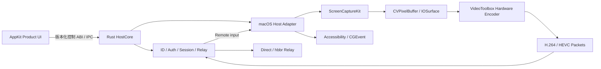
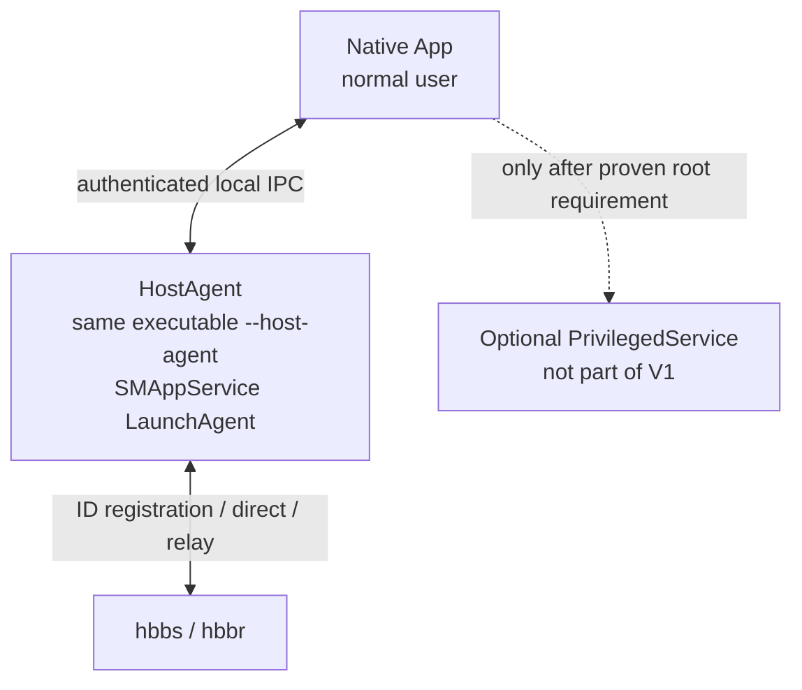
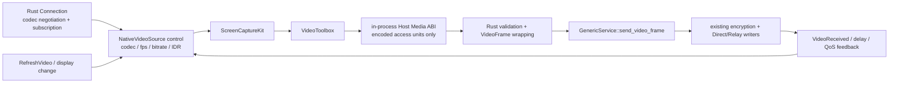
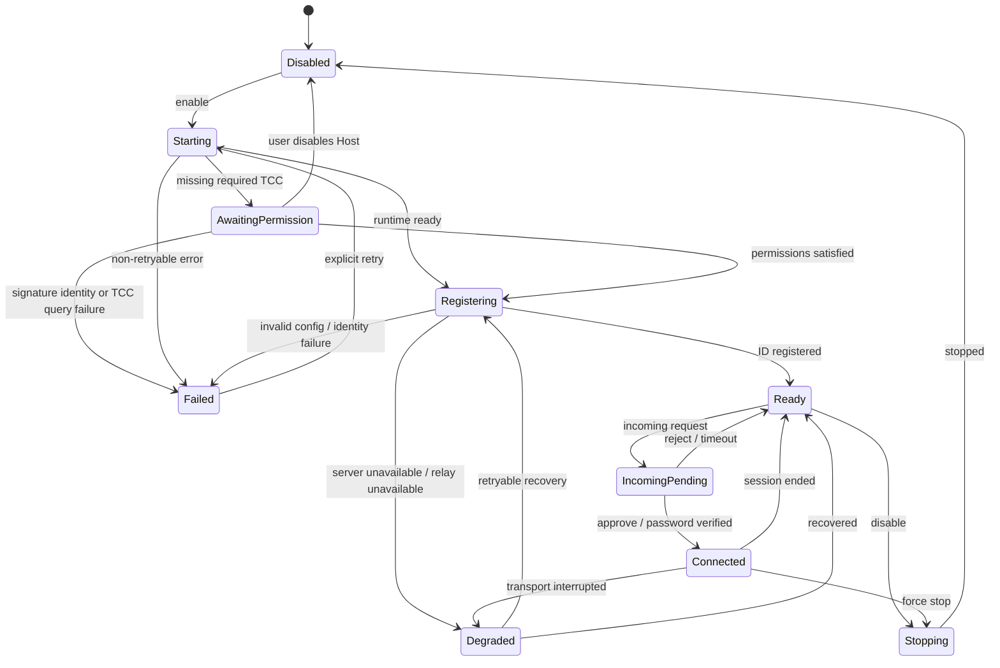
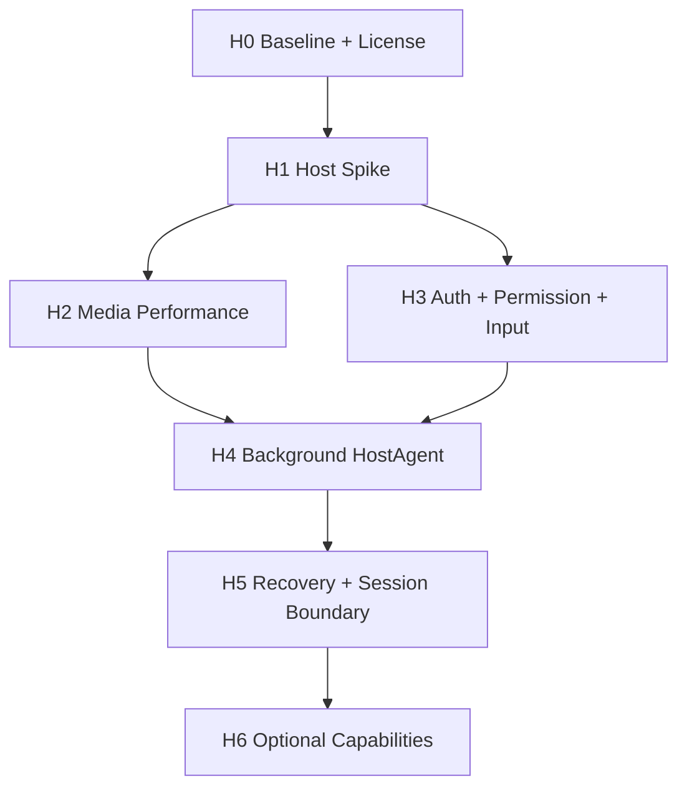

# RustDesk Native “别人连接我”详细设计

> 状态：Draft v0.3
> 日期：2026-08-05
> 范围：macOS 原生被控端（Host Mode）
> 目标读者：产品、macOS、Rust、远程桌面协议与测试开发者

## 1. 摘要

本文设计在现有 RustDesk Native viewer 基础上增加“别人连接我”能力，包括：

- 稳定的本机 ID；
- 临时密码与永久密码；
- macOS 系统权限和远程会话权限；
- 后台 Agent 注册、启动、停止、升级与状态诊断；
- 入站连接审批、会话展示、主动断开；
- 屏幕采集、硬件编码、加密传输和远程输入；
- 可量化的 CPU、内存、时延、丢帧和稳定性门禁。

本设计的核心决策是：

1. **不从零重写 RustDesk 协议、安全和网络控制面。** ID/Rendezvous、认证、加密、直连/Relay、协议协商和会话控制继续保留在 Rust。
2. **不把完整 RustDesk GUI 或内部 API 当作 SDK 嵌入。** 上游源码只作为被控端实现和互操作行为的参考/复用来源，项目对 Swift 暴露自有、稳定、语义化的 Host ABI。
3. **重写并优化 macOS 被控媒体面。** 使用 ScreenCaptureKit、IOSurface/CVPixelBuffer 和 VideoToolbox 建立原生低复制链路；Product UI 不接触原始帧。
4. **先做登录用户场景，再产品化后台运行。** 第一阶段在已登录桌面跑通真实链路；之后用 `SMAppService` 管理用户会话 LaunchAgent。V1 不为尚未证明的 root 需求预置 LaunchDaemon。
5. **Host 媒体接缝是 H1 的首要技术门禁。** VideoToolbox 产物通过独立的进程内 Host Media ABI 注入 Rust `video_service`；codec 协商、订阅、QoS、刷新请求、打包、加密和 Direct/Relay 发送仍由 Rust 权威执行。
6. **性能结论必须来自真实链路。** 固定记录机器、输入画布、drawable/capture dimensions、codec、实际硬件编码状态、FPS、CPU、内存、drops、网络和 runtime。

推荐的产品级链路如下：



## 2. 背景与问题

现有 viewer 已证明 macOS 原生实现可以显著降低远程画面展示侧的 CPU 占用。被控端比 viewer 多出屏幕采集、颜色格式处理、视频编码、变化检测和发送调度，因此同样存在较大的平台原生化收益。

用户曾观察到 Mac mini 上官方/现有被控端 CPU 约为 40–50%，但仓库内现有性能证据是控制端数据，不能用来证实该被控端数字或其归因。正式实现前必须在同一台被控机上重建可重复基线，并补齐：

- Mac mini 型号、CPU 架构和 macOS 版本；
- Activity Monitor 口径及 Host、WindowServer、videotoolboxd 分进程数据；
- 采集尺寸、显示缩放、帧率和画面内容；
- H.264/HEVC/VPx 以及实际选中的硬件或软件编码器；
- 静态桌面、普通操作、滚动/视频四种负载；
- 码率、RTT、丢包、发送队列、帧队列和 runtime。

本设计不预设“重写必然更快”，而是将低 CPU 路径定义为可验证的数据面合同。

## 3. 目标与非目标

### 3.1 产品目标

V1 应让用户在一个原生页面中完成以下操作：

1. 查看并复制稳定的本机 ID；
2. 查看/刷新临时密码，设置或删除永久密码；
3. 看懂屏幕录制、辅助功能、输入监控等 macOS 权限状态，并能跳转到对应系统设置；
4. 注册、启动、停止后台 HostAgent，看到准确的组件级状态；
5. 设置允许的远程能力和连接审批模式；
6. 收到明确的入站请求，查看远端信息并同意或拒绝；
7. 连接期间持续看到可见指示器，随时禁止输入或断开连接；
8. 在 App 退出或重启后仍可按用户选择提供后台 Host；
9. 网络变化、休眠唤醒和 HostAgent 崩溃后能够恢复或给出可诊断的失败状态。

### 3.2 技术目标

- Rust 继续作为协议、认证、加密、Relay、codec/session 的权威状态机；
- Host 数据面不跨 Product UI/Host Control ABI 传输原始视频帧；
- 采集到编码优先走 IOSurface/CVPixelBuffer 零拷贝或单次 GPU 转换路径；
- 明确验证 VideoToolbox 实际使用硬件编码；
- 所有队列有界，过载时降低帧率/分辨率或丢弃未编码旧帧；
- 任何压缩参考帧不得静默乱序或随意丢弃；
- 后台 Agent、权限、注册和会话状态均来自权威组件，不用 UI 推测；
- 上游 RustDesk 变更隔离在 adapter 层，不污染 Swift 产品接口。

### 3.3 V1 非目标

除非后续单独批准，V1 不包含：

- 自研 ID Server 或 Relay Server；
- 重写 RustDesk 密码协议、加密握手或 NAT 穿透协议；
- App Store 沙盒分发；
- Windows/Linux 被控端；
- 多个并发远程控制会话；
- 隐蔽运行、静默授权或绕过 macOS TCC；
- 完整文件管理器、远程终端、远程打印和隐私模式；
- 承诺与所有历史 RustDesk 客户端版本互操作。

音频、剪贴板和文件传输采用独立功能开关和阶段门禁，不能阻塞核心屏幕/输入 MVP。

## 4. 外部约束

### 4.1 RustDesk 不是稳定 Host SDK

RustDesk 开源客户端已经包含 `src/server`、Rendezvous、screen capture、input、clipboard 等被控端实现，但这些是应用内部模块，不是稳定、版本化的第三方 SDK。项目必须：

- 固定上游 tag/commit；
- 建立最小 patch 集；
- 用自有 adapter 和 ABI 隔离上游类型；
- 每次升级执行互操作和性能回归；
- 不把 Flutter bridge 或上游内部事件直接暴露给 Swift。

参考：<https://github.com/rustdesk/rustdesk>

### 4.2 许可证

RustDesk 客户端仓库使用 AGPL-3.0；FarPane 顶层 `LICENSE`、README 和 `docs/architecture.md` 已决定按 AGPL-3.0 分发。因此 Host Mode 不再把“开源还是闭源”作为未决架构门禁，而是执行可验证的 AGPL 合规清单。RustDesk Server Pro 或 Custom Client Generator 不应被默认理解为闭源嵌入 SDK 授权。

发布前清单至少包括：

- 随二进制提供对应源码、构建脚本和许可证/版权通知；
- 记录 pinned RustDesk commit、Host patch inventory 和本项目修改说明；
- 对网络交互场景履行 AGPL 对应源码要求；
- 产物内保留 `LICENSE`、`THIRD_PARTY_NOTICES.md` 和可访问的源码获取方式。

如未来另立闭源商业版，必须当作新产品/许可范围重新评估，不得沿用本文结论。

### 4.3 macOS TCC 与代码签名

屏幕录制、辅助功能和输入监控权限不能由应用静默授予。权限与二进制路径、签名身份和 designated requirement 存在关联，升级、改名、移动路径或签名漂移可能导致授权失效。

HostAgent 从第一版开始就应使用最终计划中的：

- App Bundle ID `io.rustdesknative.viewer`；
- LaunchAgent label / Mach service `io.rustdesknative.viewer.host-agent`；
- Team ID；
- designated requirement；
- 安装路径 `/Applications/FarPane.app`；
- Hardened Runtime 与 entitlements。

已决定 V1 HostAgent 使用同一签名 App executable 的 `--host-agent` 模式，而不是独立 helper 二进制。这使 TCC 和代码签名身份与现有 App 保持一致，同时允许 launchd 在 UI 进程退出后继续运行该 mode。参数分流必须发生在 AppKit 初始化前，HostAgent mode 不创建 Dock 图标、菜单或窗口。

开发签名、正式签名和 adhoc 签名的 TCC 结果必须分开记录。H1 可使用本地开发签名；进入 H4 预览分发前，必须完成 Developer ID notarization、stapling 和带 quarantine 的全新机安装/后台启动验收。未公证构建不得被称为可分发的后台 Host。

参考：

- <https://developer.apple.com/documentation/screencapturekit>
- <https://rustdesk.com/docs/en/client/mac/>

## 5. 建议范围与默认假设

详细设计暂按以下假设推进；任何变化都应更新本文和验收矩阵：

| 项目 | V1 假设 |
|---|---|
| 操作系统 | macOS 13，与当前 `Package.swift` 一致；只使用 13 可用的 Host 主路 API，后续系统能力用 availability gate |
| CPU | Apple Silicon 优先，Intel 做功能兼容和独立性能门禁 |
| Server | 自托管 hbbs/hbbr 优先，配置沿用现有 Rust core |
| 会话 | 同一时刻最多一个控制会话 |
| Codec | H.264 为兼容基线，HEVC 为 Apple 平台优先能力；软件 codec 仅作明确 fallback |
| 显示器 | 首版支持单显示器选择；多显示器切换在后续阶段 |
| 权限 | 查看屏幕、输入、剪贴板三个独立开关 |
| 审批 | 临时密码、永久密码、手动确认及组合模式 |
| 无人值守 | 必须由用户显式启用，默认关闭；V1 仅支持已登录的 active Aqua session，不支持 LoginWindow/重启后登录 |
| 连接可见性 | 永远显示菜单栏/窗口状态与主动断开入口 |

## 6. 总体架构

### 6.1 分层

系统分成四层：

1. **Product UI**：AppKit 页面、菜单栏状态、来访弹窗和系统设置引导；
2. **Host Control API**：稳定、版本化、低频语义 ABI/IPC；
3. **Rust HostCore**：配置、ID、认证、会话、权限、网络和编码包调度；
4. **macOS Host Adapter**：采集、编码、输入、剪贴板、TCC、显示和电源事件。

约束：

- Product UI 不直接调用 RustDesk 上游内部 API；
- Product UI 不持有 CVPixelBuffer、IOSurface、编码器或 socket；
- macOS Adapter 不决定认证结果和远程权限；
- Rust HostCore 不伪造 TCC 状态；
- UI 展示的状态必须能够映射到一个权威组件和时间戳。

### 6.2 进程模型

产品级 V1 默认使用两个。H1 Spike 先在 App 进程合并这两个；H4 再以同 executable 的不同 mode 拆成两个进程：



#### Native App

- 展示本机 ID、密码策略、权限和会话；
- 发出显式用户命令；
- 不承担后台会话存活责任；
- 退出后 HostAgent 是否继续运行取决于“允许后台被控”设置。

#### HostAgent

- 运行在当前 active Aqua session，能访问 WindowServer；
- 持有 Rust HostCore；
- 持有 ScreenCaptureKit、VideoToolbox 和输入 adapter；
- 与 hbbs/hbbr 建立网络连接；
- 产生权威 HostSnapshot 和会话事件；
- 崩溃后由 launchd 按退避策略恢复。

#### PrivilegedService（V1 不实现）

当前 V1 操作清单——注册/取消注册用户 LaunchAgent、启停 HostAgent、读写用户配置、访问用户 Keychain——均不证明需要 root LaunchDaemon。因此：

- H4 先使用 `SMAppService.agent(plistName:)` 管理随 App 签名的 LaunchAgent；
- 设置页报告 launchd 注册、用户审批、运行、崩溃循环和版本 handshake，不把 plist 存在当成安装成功；
- 只有未来出现经原型验证、不能用用户会话 API 完成的具体 root 操作，才新建 PrivilegedService 设计和安全审查；
- 该未来服务仍不得采集屏幕、处理视频、打开任意文件或接受 shell 字符串。

P0 Spike 中可先让 HostCore 跑在 Native App 进程，仅支持“用户已登录且 App 打开”；真实媒体链确认后再拆 HostAgent，避免同时调试性能和 launchd/TCC。

### 6.3 为什么不把采集放进 AppKit UI 进程

- Product UI 退出或重建窗口不应中断后台会话；
- 原始帧跨进程/跨 ABI 会增加复制和生命周期复杂度；
- UI 主线程卡顿不能反压网络和编码；
- TCC、签名与崩溃恢复应绑定稳定的 HostAgent；
- HostAgent 可独立采样 CPU、内存、编码器和队列指标。

### 6.4 Host 媒体与 RustDesk server 会话接缝

这是 H1 前必须冻结的最小 Host patch contract。当前 pinned RustDesk 1.4.9 中，`src/server/video_service.rs` 自行创建 capturer/encoder，经 `GenericService::send_video_frame` 把 protobuf `VideoFrame` 发给订阅连接；`src/server/connection.rs` 负责对端 codec 能力、订阅、`RefreshVideo*` 与 QoS 反馈。Native Host 不另起 socket，不绕开这条链。



Host patch inventory 只允许包含：

1. 新增独立 feature `rdn-native-host` 和 `rdn_host_bridge.rs`，不改变无该 feature 的上游行为；
2. 在 `video_service` 的产生者端增加 `NativeVideoSource`，保留原有 service 订阅、display switch、`VideoReceived`、QoS 和 Connection writer；
3. 将 macOS adapter 实测可用的 H.264/HEVC 能力注入 Rust codec 协商；Rust 仍产生唯一的 `selectedCodec + codecEpoch`，adapter 不能自选 codec；
4. 将 Rust 的 target FPS/bitrate、subscriber demand、display revision 和刷新请求映射为 adapter 控制事件；
5. 把经验证的压缩 access unit 包装成现有 `EncodedVideoFrame`/`VideoFrame`，再调用现有 service send 路径。

Host Media ABI 不属于 UI 控制通道。每个 access unit 必须包含 `hostInstanceId`、`connectionEpoch`、`codecEpoch`、canonical display ID/revision、codec、framing、PTS、keyframe/parameter-set flags 和有上限的 bytes。Rust 在调用返回前拷贝到 Rust-owned compressed buffer，或使用经合同测试的显式 ownership-transfer/free callback；不得保留 Swift 临时指针。迟到 epoch、错 codec、过大包、非单调 PTS 和缺失参数集的 IDR 必须 fail closed 并记稳定错误码。

VideoToolbox 常产生 AVCC/HVCC 长度前缀，现有真实 RustDesk 样本主要是 Annex-B。H1 不凭假设固定 wire framing；必须使用 FarPane 控制端黄金连接确认协商 codec 的 framing、参数集传递和 keyframe 标记，然后在 Media ABI 边界统一规范化。允许压缩包的一次有界拷贝，不得因此引入 raw-frame 拷贝。

刷新有两种语义：远端 `RefreshVideo*`/丢失恢复只触发当前 VT session 的下一帧 IDR；codec、尺寸、display revision 变化才执行 flush→丢弃旧 epoch→重建 encoder→参数集+IDR。不得沿用上游“一律重启 video service”来伪装 keyframe 请求。

## 7. Host 状态模型

### 7.1 顶层状态



### 7.2 后台状态不是一个 Boolean

UI 不得只展示 `serviceRunning=true/false`。权威快照至少包含：

- `applicationIdentity`: invalidLocation / developmentSigned / developerIdSigned / notarized / signatureMismatch；
- `backgroundRegistration`: notRegistered / requiresUserApproval / registered / versionMismatch / unregistering / failed；
- `agent`: unavailable / stopped / starting / running / wrongSession / crashLoop / failed；
- `privilegedService`: notRequired（V1 常态）/ requiredButMissing / running / failed；
- `registration`: offline / resolving / registering / ready / backoff / rejected；
- `permissions`: screenCapture / accessibility / inputMonitoring / microphone；
- `hostAvailability`: disabled / limited / ready / connected / degraded；
- `observedAt` 和组件版本。

`ready` 必须同时满足：

1. HostAgent 在正确会话域运行；
2. 必需权限已满足；
3. identity 可读且有效；
4. 已从权威 Rendezvous 链路获得可用 ID；
5. 入站监听/打洞/Relay 能力已初始化；
6. HostAgent 与 App 的 XPC wire 协议版本兼容；
7. 若当前有 active subscriber，媒体 codec epoch 和 adapter 能力已完成 handshake。

## 8. Host Control ABI / IPC

### 8.1 设计原则

- 本节区分三个不同合同：进程内 Host Control C ABI、进程内 Host Media C ABI、跨进程 App↔HostAgent XPC wire protocol；三者不共用 pointer 或生命周期语义；
- 新增独立 Host 命名空间，不在未实现前修改现有 Viewer ABI 语义；
- Host Control C ABI 只传低频语义控制信息和编码后的诊断快照；
- Host Media C ABI 只在 HostCore 与同进程 macOS adapter 之间传递媒体控制和压缩 access unit，禁止传 raw frame；
- 使用 opaque handle，明确 create/start/stop/destroy 生命周期；
- 每个事件包含 schema version、event ID、host instance ID 和 timestamp；
- 所有字符串明确 UTF-8、长度和释放方；
- 任何 password buffer 在使用后立即清零，不写入日志或 crash metadata；
- 回调不得在 Rust 锁内调用 Swift，也不得要求 AppKit 主线程同步返回；
- approve/reject 使用异步 command + result event，避免重入。

### 8.2 建议接口

以下为语义草案，不是最终头文件：

```c
uint32_t rdn_host_abi_version(void);

RdnHostResult rdn_host_create(
    const RdnHostCreateOptions *options,
    const RdnHostCallbacks *callbacks,
    RdnHostHandle **out_host);

RdnHostResult rdn_host_start(RdnHostHandle *host);
RdnHostResult rdn_host_stop(RdnHostHandle *host, RdnHostStopReason reason);
RdnHostResult rdn_host_command(RdnHostHandle *host, const RdnHostCommand *command);
RdnHostResult rdn_host_copy_snapshot(RdnHostHandle *host, RdnOwnedBytes *out_snapshot);
void rdn_host_free_bytes(RdnOwnedBytes bytes);
void rdn_host_destroy(RdnHostHandle *host);
```

控制事件可以使用版本化 JSON/MessagePack envelope，因为频率低、便于演进；原始帧和编码包禁止通过该控制通道。编码包只能经 §6.4 的 Host Media ABI 进入 Rust。

Host Media ABI 单独版本化，语义草案如下：

```c
uint32_t rdn_host_media_abi_version(void);

RdnHostResult rdn_host_media_set_capabilities(
    RdnHostHandle *host,
    const RdnHostEncoderCapabilities *capabilities);

RdnHostResult rdn_host_media_submit_access_unit(
    RdnHostHandle *host,
    const RdnHostEncodedAccessUnit *access_unit);

RdnHostResult rdn_host_media_report_encoder_state(
    RdnHostHandle *host,
    const RdnHostEncoderState *state);
```

Rust 通过 Host callback 发出 `startCapture`、`stopCapture`、`reconfigure(codecEpoch, codec, dimensions, fps, bitrate)` 和 `requestIdr(display, codecEpoch, reason)`。`submit_access_unit` 的成功只表示 Rust 已拷贝/接管该压缩包并通过 epoch/format 校验，不表示远端已收到；远端收到和 QoS 仍来自现有 Rust 反馈链。

### 8.3 HostSnapshot

建议字段：

```text
schemaVersion
hostInstanceId
hostState
localId
temporaryPasswordPresentation
passwordPolicy
approvalMode
unattendedAccessEnabled
backgroundStatus
systemPermissions[]
capabilityPolicies[]
activeConnectionId?
activeSession?
registrationStatus
transportAvailability
lastError?
observedAt
```

注意：

- `temporaryPasswordPresentation` 是短生命周期敏感值，单独受 UI 隐私策略控制；
- 快照不得包含永久密码明文、identity 私钥、server secret 或 raw authentication payload；
- `lastError` 使用稳定错误码和脱敏说明，不透传底层网络/协议原始错误；
- connection、display、permission 使用 canonical ID，不用数组下标表达身份。

### 8.4 Commands

至少包括：

- enableHost / disableHost；
- registerBackgroundAgent / unregisterBackgroundAgent；
- startHostAgent / stopHostAgent / retryHostAgent；
- regenerateTemporaryPassword；
- setPermanentPassword / clearPermanentPassword；
- setApprovalMode；
- setCapabilityPolicy；
- openSystemPermissionSettings；
- approveIncoming / rejectIncoming；
- disableInputForActiveSession；
- disableClipboardForActiveSession；
- disableAudioForActiveSession；
- disconnectSession；
- selectDisplay；
- setQualityPolicy；
- exportSanitizedDiagnostics。

所有 command 均带 `commandId`；最终结果通过 event 回传，Swift 不以“函数返回成功”推断状态已经完成。

### 8.5 Events

- snapshotChanged；
- backgroundAgentOperationProgress；
- incomingConnectionRequested；
- incomingConnectionExpired；
- sessionStarted；
- sessionCapabilitiesChanged；
- sessionStatsUpdated；
- sessionEnded；
- permissionChanged；
- recoverableError；
- fatalError。

事件队列必须合并高频 stats，不能让 UI 消费速度反压 HostCore。

### 8.6 App↔HostAgent XPC wire 协议

H1 中 AppKit controller 通过 Host Control C ABI 直接调用同进程 HostCore。H4 拆进程后，HostCore handle 只存在 HostAgent；App 的 `HostControlClient` 改用 `io.rustdesknative.viewer.host-agent` Mach service，不尝试跨进程传 C pointer 或回调。

Wire envelope 至少包含 `wireVersion`、`messageType`、`requestId/eventId`、`hostInstanceId`、`agentBootId`、`sentAt`、payload length 与类型化 payload。命令是 request/accepted/result 三段式；`accepted` 只说明已入队，不代表注册、启停、审批或断开已完成。

重连语义：

1. App 连接后先交换支持的 wire version 和组件 build ID；不兼容时只允许导出诊断/触发修复，不发 Host command；
2. handshake 成功后必须先获取全量 HostSnapshot，再从其 `lastEventId` 订阅增量事件；
3. 断线期间事件可丢，但重连后的权威快照必须收敛最终状态；审批请求不依赖 UI 事件队列存活；
4. App 可用相同 `commandId` 重试未知结果命令，HostAgent 在有界 dedupe window 内返回原结果，不重复执行；
5. `agentBootId` 变化表示 Agent 已重启，App 废弃旧 instance 的 pending UI intent，重新以 snapshot 对账。

XPC listener 必须从 audit token 校验 euid、Team ID、`io.rustdesknative.viewer` designated requirement 和安装路径。协议对每类消息设长度/频率上限，不允许任意 selector、任意文件 URL 或类型解档。

## 9. Identity 与密码

### 9.1 本机 ID

- identity key 在首次启用 Host 时生成；
- identity 与 App 窗口生命周期解耦；
- App 重启、HostAgent 重启和小版本升级后保持稳定；
- 用户切换 server 配置时，不隐式重置 identity；
- “重置本机 ID”是单独的高风险操作，需要明确确认和审计；
- 私钥不离开 Rust/安全存储边界，不通过 Swift 或日志暴露。

UI 只有在 Rendezvous 确认注册成功后显示“可连接”。本地存在一个 ID 字符串不等于远端实际可达。

### 9.2 临时密码

- 使用系统 CSPRNG；
- 明确字符集、长度、有效期和轮换条件；
- 默认仅在 Host ready 时生成；
- 禁用 Host、显式刷新或策略到期后失效；
- 只在用户主动展示时短时显示；
- 不写文件、日志、analytics、pasteboard history 或 crash report；
- 是否在成功连接后自动轮换作为可配置策略，默认开启。

### 9.3 永久密码

- 默认未设置；
- 设置永久密码必须由本机用户完成；
- 明文仅存在于输入和导入 Rust 的短生命周期 buffer；
- 优先只持久化协议所需 verifier；若互操作必须保存可恢复 secret，仅允许存入 Keychain，并记录原因；
- 禁止写入普通 TOML、UserDefaults、日志或命令行参数；
- 密码强度、失败次数限制和冷却策略由 Rust HostCore 权威执行；
- UI 只能展示“已设置”和更新时间，不能读回明文。

### 9.4 审批模式

V1 支持：

- manualOnly：每次本机点击同意；
- temporaryPassword；
- permanentPassword；
- passwordAndLocalApproval；
- passwordOrLocalApproval。

无人值守只能选择允许 password 验证的模式，并且必须单独开启。UI 必须解释“允许在你不在电脑旁时被连接”的影响。

## 10. 权限模型

### 10.1 macOS 系统权限

| 权限 | 用途 | 缺失时行为 |
|---|---|---|
| Screen Recording | 捕获显示内容 | Host 不进入 ready；允许仅诊断连接但不建立屏幕会话 |
| Accessibility | 注入键盘鼠标 | 可建立只读会话；输入能力强制关闭 |
| Input Monitoring | 特定输入模式/完整键盘兼容 | 标记 limited；按当前 adapter 能力降级 |
| Microphone/System Audio | 远程音频 | 仅禁用音频，不阻塞屏幕 MVP |

系统权限状态由 platform adapter 实时读取。UI 的“已授权”不得基于用户点击过按钮推测。

### 10.2 远程能力权限

V1 权限：

- viewDisplay；
- controlKeyboardMouse；
- readClipboard；
- writeClipboard；
- hearSystemAudio；
- transferFiles（后续）；
- restartOrLock（后续）。

原则：

- 默认最小权限；
- policy 在认证前参与授权；
- 会话开始时生成 immutable permission snapshot；
- 用户可在会话中立即撤销输入、剪贴板等能力；
- 扩大当前会话权限需要本机显式动作；
- 修改默认 policy 默认只影响新会话，除非用户明确应用到当前会话。

### 10.3 入站连接审批

IncomingConnectionRequest 至少包含：

- canonical `connectionId`；
- 远端 ID；
- 远端声明的设备名和平台（标记为 untrusted display metadata）；
- 请求时间、超时时间；
- 请求的 capabilities；
- 预计 transport：direct / relay / unknown；
- 认证方式；
- 风险提示，如短时间多次失败。

规则：

- 一个 connectionId 只允许一次最终 approve/reject；
- 请求超时后 approve 必须失败；
- UI 重建不能丢失 pending request，应从 HostSnapshot 恢复；
- MVP 同时只允许一个 pending/active 控制会话，其余显式 busy/reject；
- 认证失败不弹出可被远端滥用的无限本机通知；
- 对连续失败做速率限制、指数退避和脱敏审计。

## 11. macOS 采集与编码数据面

### 11.1 零拷贝合同

理想路径：

```text
SCStream callback
  -> CMSampleBuffer
  -> CVPixelBuffer backed by IOSurface
  -> VTCompressionSessionEncodeFrame
  -> encoded CMSampleBuffer
  -> Rust-owned compressed packet descriptor
  -> protocol encryption / transport
```

硬约束：

- Product UI 永远不接收 raw frame；
- 不允许每帧构造全尺寸 `Data`、`Vec<u8>` 或 `CGImage`；
- capture adapter 与 encoder 必须在同一 HostAgent 进程；
- CVPixelBuffer 使用引用计数跨异步编码边界，不复制像素；
- 若输入像素格式不被硬件编码器接受，优先使用 ScreenCaptureKit 输出配置、CVPixelBufferPool 或 GPU/VideoToolbox pixel transfer；
- H1 必须在 macOS 13 真机分别探测 SCK `420v`/`420f` 直出和 BGRA 输出；不预设所有系统/显示组合都能稳定直出 NV12；
- CPU 逐像素 BGRA→NV12/I420 只允许作为带指标的 fallback；
- 每帧记录逻辑 copy count，性能验收要求主路径 copy count 为 0 或 1 次 GPU 转换。

### 11.2 ScreenCaptureKit 配置

配置项由 QualityController 统一管理：

- output width/height；
- pixel format；
- color space/range；
- minimumFrameInterval；
- queueDepth；
- cursor 是否包含在画面；
- display/window filter；
- HDR/SDR 策略。

默认策略：

- queueDepth 从较小值开始，以低时延优先；
- 不使用 `minimumFrameInterval = 0` 作为默认产品策略；
- 远端未请求 HDR 时使用 SDR，避免无必要的色彩和带宽成本；
- 捕获尺寸尽量接近实际发送尺寸，不先处理完整 5K 再在 CPU 缩放；
- display 配置变化使用 `updateConfiguration`/重建流的受控状态机处理。

ScreenCaptureKit 参考：

- <https://developer.apple.com/documentation/screencapturekit/scstreamconfiguration/minimumframeinterval>
- <https://developer.apple.com/documentation/screencapturekit/scstreamframeinfo/dirtyrects>

项目最低版本保持 macOS 13。当前 Xcode SDK 头文件中 `SCStreamFrameInfoDirtyRects` 标记为 macOS 12.3+，`queueDepth`、`pixelFormat`、`colorSpaceName` 也不是 macOS 14 专有 API，因此不因这些属性上调最低版本。但实际 sample attachment 可能缺键或给出空数组，adapter 必须安全解析，不得强转或把“无 attachment”解释为“画面永远静止”。macOS 14+ 新属性只能通过 `#available` 进入增强路径。

### 11.3 变化检测和自适应 FPS

不对完整帧做 CPU hash/diff。优先使用 ScreenCaptureKit `dirtyRects`、frame status 和 display time。当 `dirtyRects` 缺失/不可信时，降级为“有界固定采集 FPS + frame status + encoder/network 背压”；可在 idle 时逐步降 FPS，但每个心跳窗口必须强制一帧或 IDR 验证收敛，不做 CPU 全屏 diff，也不因空 dirty rect 无期停帧。

建议状态：

| 内容状态 | 建议上限 | 行为 |
|---|---:|---|
| idle | 1–5 FPS | 仅心跳/必要刷新，鼠标可走独立消息 |
| lowMotion | 10–15 FPS | 文本输入、少量窗口更新 |
| interactive | 30 FPS | 拖动、滚动、常规操作 |
| highMotion | 60 FPS（能力允许时） | 视频/动画；受网络、热状态和远端能力约束 |

切换应使用滞回和最短驻留时间，防止帧率频繁振荡。QualityController 的输入包括：

- dirty area ratio；
- 最近 N 帧变化频率；
- encoder latency；
- capture/encode queue depth；
- RTT、丢包和 send queue；
- thermal state；
- 远端 viewport、codec 和 FPS 上限。

### 11.4 VideoToolbox

编码器创建必须：

- 优先低时延实时 profile；
- 设置并读回 `kVTCompressionPropertyKey_RealTime=true`；
- 显式允许或要求硬件加速；
- 禁用不必要的帧重排序；
- 设置合理的 keyframe interval、bitrate 和 data-rate limits；
- 记录实际 encoder ID；
- 首个成功 encode callback 后读取并上报 `UsingHardwareAcceleratedVideoEncoder`，不用创建 session 前的默认值作结论；
- 当硬件编码不可用时，明确进入 softwareFallback，不得继续显示“硬件编码”。

参考：

- <https://developer.apple.com/documentation/videotoolbox>
- <https://developer.apple.com/documentation/videotoolbox/kvtvideoencoderspecification_enablehardwareacceleratedvideoencoder>

### 11.5 Codec 策略

建议优先级：

1. H.264 hardware：兼容基线；
2. HEVC hardware：双方支持时优先用于高分辨率；
3. 软件 codec：只在对端互操作必需且性能预算允许时启用；
4. 无共同 codec：连接前失败并给稳定错误码。

Codec negotiation 仍由 Rust 控制面完成。macOS adapter 只创建已被选定的 encoder，不自行改变协议结果。

能力探测按当前机器、codec、profile、像素格式和目标尺寸实测，不用“Intel/Apple Silicon”一个布尔值推断。尤其是 Intel HEVC，只有实际创建、完成首帧编码且读回 hardware=true 后才向 Rust 广告可用；否则不参与 HEVC 协商，不在会话中静默转软编。

### 11.6 背压和丢帧

队列建议：

```text
ScreenCaptureKit callback
  -> rawFrameQueue(capacity: 2, newest-wins)
  -> VideoToolbox inFlight(capacity: bounded)
  -> encodedPacketQueue(capacity: bounded, ordered)
  -> encryptedSendQueue(capacity: bounded)
```

规则：

- 尚未提交编码器的旧 raw frame 可以丢弃，保留最新帧；
- 已提交编码器的帧遵守编码器完成和引用关系；
- 已编码 H.264/HEVC 包不能随意丢弃潜在参考帧；
- 网络堵塞时优先降低采集 FPS、分辨率和码率；
- 确需重置时，显式 flush/reset encoder 并请求 IDR，不能静默跳过；
- 远端主动 `RefreshVideo`/`RefreshVideoDisplay` 必须精确映射为对应 display/codec epoch 的下一帧 IDR，与现有 viewer `rdn_client_request_keyframe` 构成对称恢复链；
- 所有 drops 按原因分类：captureSuperseded、encoderBackpressure、networkBackpressure、reconfigure、invalidFrame、shutdown。

## 12. 远程输入与剪贴板

### 12.1 输入链路

```text
Encrypted protocol event
  -> Rust session authorization
  -> normalized semantic input event
  -> macOS HostInputAdapter
  -> coordinate/layout mapping
  -> CGEvent / Accessibility injection
```

要求：

- 未授权会话的输入事件在 Rust 层拒绝；
- 输入被本机撤销后立即清空按键/鼠标按钮状态，避免 stuck key；
- display 切换和缩放变化使用 revisioned display mapping；
- 事件包含 connectionId，已结束连接的迟到事件必须丢弃；
- exclusive keyboard 等模式沿用已有安全边界，不由 Swift 直接注入；
- Secure Input、登录窗口和系统快捷键能力必须单独测试并如实降级。

### 12.2 剪贴板

- read/write 分权；
- 默认支持小型文本；
- 大对象、图片和文件使用大小上限与独立 transfer channel；
- 剪贴板去重不能无限轮询；优先事件驱动，fallback 轮询必须动态退避；
- 任何来自远端的文件名、UTI 和 payload 均视为不可信输入；
- 会话结束清理临时对象和 promise provider。

## 13. 后台 Agent 注册与生命周期

### 13.1 注册

使用 `SMAppService` 注册 App bundle 内签名 LaunchAgent plist，其 ProgramArguments 指向同一 App executable 的 `--host-agent` mode。V1 不复制 helper 到系统目录，不安装 LaunchDaemon，也不默认请求管理员授权。注册流程必须：

1. 验证 App 位于 `/Applications/FarPane.app`，Bundle ID、Team ID、designated requirement 和 notarization 符合当前 channel 的预期；
2. 验证 LaunchAgent plist label/Mach service/ProgramArguments 与 App build ID 匹配；
3. 显式说明“App 退出后仍可被连接”并由用户触发注册；
4. 处理 `requiresApproval`，引导用户到 Login Items/System Settings，不将“已发起注册”展示为 running；
5. 启动并等待 XPC 版本 handshake、HostSnapshot 和 Rendezvous health；
6. 升级通过新 App bundle 完成，旧 Agent 安全停止后再启动新 build，失败时保留可恢复状态。

### 13.2 启动和停止

- enableHost：允许被控，并按策略启动 HostAgent；
- disableHost：停止接受新连接并断开现有会话，identity 默认保留；
- stopHostAgent：停止当前 Agent 但不改变用户配置或注册状态；
- unregisterBackgroundAgent：停止并取消注册 LaunchAgent，明确说明 identity/config 默认保留；
- App 退出不等于 disableHost；
- 强制停止必须有超时和最终 kill 策略，但不得丢坏配置。

### 13.3 登录窗口和多用户

这是产品化高风险项。V1 明确只支持已登录且当前 active 的 Aqua session：锁屏、LoginWindow、无用户登录和 Fast User Switching 中的非 active session 不允许远程输入，Host 进入 `limited/sessionUnavailable`，暂停采集或只保留有界恢复信令。用户解锁回到同一 session 后可重新检查 TCC 并恢复。“无人值守”在 V1 不意味可跨重启或操作 LoginWindow。

H5 仅评估将来是否可安全扩大边界，不阻塞上述 V1。评估必须覆盖：

- LaunchAgent 在 GUI/Aqua 与 LoginWindow session 的加载行为；
- Fast User Switching 时哪个 session 可被控制；
- 屏幕采集和辅助功能授权在不同 session 的有效性；
- 不能同时启动两个 HostAgent 争用同一 identity/端口；
- 会话切换时 display、input 和 clipboard adapter 的重新绑定；
- 无用户登录时必须继续显示 unsupported/limited，不能因 launchd 进程存在伪装 ready。

参考：<https://github.com/rustdesk/rustdesk/wiki/macOS-Auto%E2%80%90Start-Service-Setup-%28for-Remote---MDM-Deployment%29>

### 13.4 休眠、唤醒与网络变化

- Host ready 但无活动会话时不持有防休眠 assertion；
- 经认证且已批准的屏幕会话期间，持有有界的 user-idle sleep assertion 以避免空闲计时器中断会话；
- assertion 不覆盖用户显式休眠、盒盖、关机或系统低电量/热保护，并在会话结束、认证失效、进入 background-without-session 或 Agent 关闭时立即释放；
- 设置页需明确说明活动连接可使 Mac 保持唤醒，诊断中记录 assertion 类型/持续时间，不记录画面内容；
- sleep 前暂停 capture、flush 或关闭 encoder、发送会话状态；
- wake 后重新枚举 display、检查 TCC、重建 capture/encoder；
- 网络变化触发 Rendezvous/Relay 恢复，不重置 identity；
- 恢复有指数退避和 jitter；
- 旧 connection epoch 的迟到事件不得进入新会话；
- 超过恢复窗口后结束会话并给出明确 reason。

### 13.5 应用防火墙与入站端口

HostCore 开始入站监听时可能触发 macOS Application Firewall 首次提示。产品必须：

- 在启用 Host 前告知用户可能出现系统入站连接提示，不模仿或遮挡系统对话框；
- 固定签名/公证身份和安装路径，避免每次升级被当作新程序；
- 区分 direct listener 不可用、Relay 仍可用与整体 offline，不凭 timeout 猜测用户点了“拒绝”；
- 验收包含干净机首启的 allow/deny 两条路径，以及 deny 时 forced relay 的真实行为。

## 14. 安全设计

### 14.1 本地 IPC

- IPC endpoint 不暴露到网络；
- 使用 audit token 验证 pid/euid；
- 校验调用方 code signing requirement；
- App↔Agent 只授权同 euid、同 Team ID 且满足 designated requirement 的正版 App；
- 未来若新增 privileged service，必须另立 threat model 且只提供枚举式 allowlist command；
- 不接受 shell 字符串、任意文件路径或任意环境变量；
- 所有消息有 schema version、长度上限和 request ID；
- 对异常断开和重放请求安全处理。

### 14.2 网络与认证

- 复用 RustDesk 已有 Rust 协议和加密实现；
- 不在 Swift 重做密码校验或 handshake；
- 对端展示信息标记为不可信，不参与授权决定；
- 对认证失败做速率限制和冷却；
- Relay 不降低端到端认证要求；
- server key/config 变更需要显式 UI 与连接重建；
- 不把 raw Provider/server/protocol 错误直接展示或上传。

### 14.3 产品安全与可见性

- 无人值守默认关闭；
- 每个活动会话始终有可见指示；
- 提供全局“停止共享/断开”入口；
- 本机键鼠可触发紧急停止策略；
- 新安装或权限变化后不自动恢复高权限会话；
- 审计只记录时间、远端 ID、结果、能力和原因码，不记录密码、剪贴板内容或画面；
- 暴力尝试告警必须合并，防止通知轰炸。

## 15. 性能设计与门禁

### 15.1 必须采集的指标

HostAgent 内部：

- process CPU、resident/private memory、threads；
- capture dimensions、pixel format、requested/actual FPS；
- capture callbacks、valid frames、dirty area ratio；
- raw frame queue depth 与 drops；
- encoder name、codec、hardware acceleration confirmed；
- encode latency p50/p95/p99、in-flight frames；
- encoded bytes、bitrate、keyframes；
- encoded/send queue depth 与 drops；
- encryption/send CPU；
- RTT、loss、relay/direct、reconnects；
- end-to-end input-to-photon latency（单独工具测量）；
- thermal state、电源来源、sleep assertion 状态和 runtime。

系统侧：

- HostAgent；
- Native App；
- WindowServer；
- videotoolboxd/相关媒体进程；
- 总系统 CPU、memory pressure 和能耗。

### 15.2 场景矩阵

每轮性能回归至少包含：

1. Host enabled、无人连接，10 分钟；
2. 已连接、静态桌面，10 分钟；
3. 1080p30 普通窗口拖动/文本/滚动，10 分钟；
4. 4K30 普通操作，10 分钟；
5. 4K30 高动态视频，10 分钟；
6. 目标产品场景 30 分钟稳定性；
7. sleep/wake、网络切换、display reconfigure 后重复场景 3；
8. Intel 与 Apple Silicon 分别运行，不互相替代。
9. 电池供电下 Host idle 与 active session 的能耗/热状态，验证无会话时不持有 sleep assertion；
10. HostAgent 后台 ready 时运行 outbound Viewer，以及 Host + Viewer 双 active session 的合并资源预算。

### 15.3 初始工程目标

下列是设计目标，不是未经测量的完成声明：

| 场景 | Host 进程 CPU 初始目标 | 其他门禁 |
|---|---:|---|
| enabled、无人连接 | < 1–2% | 无 busy loop，注册退避正常 |
| connected、静态桌面 | < 5–10% | 自适应到低 FPS，无全屏 CPU diff |
| 1080p30 普通操作 | < 15–25% | hardware encoder=true，队列稳定 |
| 4K30 普通操作 | < 25–40% | 无持续 backlog，内存稳定 |
| 30 分钟稳定性 | 不随时间单调上升 | 无 crash、无未解释 drops、无泄漏趋势 |

CPU 目标必须同时给出 WindowServer 和媒体系统进程；不能通过把工作移到系统进程后只报告 Host CPU 来宣称优化成功。

能耗也是退化门禁：Host idle 不得持有防休眠 assertion 或产生持续 capture callback；active session 的 assertion 持续时间必须与会话时间收敛；热状态达 serious/critical 时 QualityController 必须降 FPS/尺寸，不为保持标称 4K30 持续升温。

### 15.4 Profiling 方法

- Instruments Time Profiler：定位 CPU 热点；
- System Trace：观察 capture、encoder callback、锁和线程调度；
- Allocations/Leaks：验证 CVPixelBuffer、CMSampleBuffer 和 packet 生命周期；
- os_signpost：capture→encode→packet→send 各阶段；
- VideoToolbox session property：确认真实 encoder；
- 受控脚本/画布：保证每次输入一致；
- 同一机器对比上游 RustDesk、Host Spike 和最终实现。

任何优化 PR 必须说明它改变了哪个指标和数据链，不接受仅凭主观流畅度或瞬时 Activity Monitor 截图。

## 16. 可观测性与诊断

### 16.1 结构化日志

日志字段：

- timestamp、level、component；
- hostInstanceId、connectionId（可脱敏）；
- state transition from/to；
- stable error code；
- codec、dimensions、queue/drop reason；
- transport type 和 recovery attempt。

禁止记录：

- 临时/永久密码；
- identity 私钥和 server secret；
- 剪贴板内容、文件内容和屏幕像素；
- raw authentication payload；
- 未经脱敏的远端个人信息。

### 16.2 诊断导出

用户可主动导出脱敏诊断包，包含：

- App/Agent 版本与签名/公证摘要；
- launchd component status；
- TCC 状态（不含系统数据库原始内容）；
- server 地址的脱敏形式和连接结果；
- 最近状态转换和稳定错误码；
- 最近性能统计聚合；
- 不包含密码、密钥、画面和剪贴板。

## 17. 错误模型

错误按可行动作分类：

| 类别 | 示例 | UI 动作 |
|---|---|---|
| permissionRequired | screen capture denied | 打开对应系统设置、重新检测 |
| backgroundAgentOperation | Agent build/wire version mismatch | 更新 App、重新注册后台 Agent |
| configuration | invalid hbbs/key | 打开网络配置 |
| registration | DNS/server rejected | 展示退避和重试，不重置 ID |
| codecUnavailable | no common/hardware codec | 降级或明确失败 |
| captureUnavailable | display/session unavailable | 重新枚举显示器或等待登录 |
| authentication | password rejected/rate limited | 脱敏提示和冷却时间 |
| transport | relay/direct interrupted | 自动恢复或结束会话 |
| internal | invariant/ABI mismatch | 停止 Host 并导出诊断 |

错误包含：stable code、severity、retryability、suggested action、component、observedAt。Swift 不解析底层错误字符串决定业务行为。

## 18. 配置与迁移

- Host 配置有独立 schema version；
- 迁移由 Rust HostCore 执行，Swift 不直接修改 RustDesk/Host 配置文件；
- 写入采用临时文件 + fsync + atomic replace 或等价安全存储；
- 迁移失败保留旧配置并进入 degraded/failed；
- identity、server config、password verifier 和 UI preferences 分开存储；
- 敏感值进 Keychain，普通策略进版本化配置；
- 取消注册后默认保留 ID/配置；删除 identity 是另一个必须二次确认的高风险命令。

上游 `hbb_common::Config`、`APP_NAME` 和部分 codec/session 状态是进程全局的，不允许 App 内 viewer core 与 HostCore 同时对同一 RustDesk 配置目录写入。分阶段规则如下：

1. H1–H3 同进程 Spike 中 Host 与 outbound Viewer 互斥；启动 Host 前关闭 viewer core，并用自动化合同测试证明不存在残留全局状态；
2. H4/V1 通过进程隔离支持“Host 后台 ready + App outbound Viewer”并存：Viewer 保持现有配置命名空间，HostAgent 在任何 `Config` lazy initialization 前切换到专用 Host 命名空间/配置根；
3. Host identity、password verifier、host policy 和 registration state 只由 HostAgent 写；App 通过 XPC command 修改，不触碰 Host 文件；
4. 用户可见的 server 设置只有一份产品级 canonical config，每次修改带 monotonic revision；App 和 Agent 将它作为不可变启动/更新输入，不让两个 Rust core 反向改写同一 `RustDesk.toml`；
5. HostAgent 启动时获取专用单写者文件锁，lock record 包含 boot ID/build ID/config revision；旧新 Agent 升级重叠时新进程 fail closed，不并发迁移；
6. H0 必须先盘点 pinned RustDesk 实际读写文件、Keychain 和进程全局项；若单独 `APP_NAME` 不足以完成隔离，在 Host adapter 增加显式 config-root patch，不用环境变量或运行时切换猜测路径。

V1 并存验收至少包含：Host ready 时发起 outbound Viewer；Viewer 会话中接收入站请求；Host 活动会话中启动/停止 Viewer；两侧同时断线/恢复；重启 App 不改变 Host ID。资源预算分开报 Viewer、HostAgent、WindowServer 和媒体进程，不以 ABI 符号可并存替代真实双会话。

## 19. 上游复用与升级策略

### 19.1 复用范围

优先复用：

- protocol messages；
- encryption/authentication；
- Rendezvous/relay/direct transport；
- session negotiation；
- server/client interoperability tests；
- 必要的 codec packetization。

优先替换或隔离：

- Flutter/Sciter UI；
- 上游 UI event bus；
- macOS 屏幕采集热路径；
- macOS encoder selection 和 frame queue；
- 产品后台状态 projection；
- 产品权限和诊断 UI。

### 19.2 升级流程

1. 固定当前上游基线 commit；
2. 记录复用文件和 patch inventory；
3. 新上游版本先在临时分支执行 compile/focused tests；
4. 跑协议 golden tests；
5. 跑受支持 FarPane 控制端版本的互操作矩阵；
6. 跑性能基线和 30 分钟稳定性；
7. 检查许可证和新增依赖；
8. 全部通过后才更新 pinned revision。

互操作矩阵必须同时固定“Host pinned core 版本”和“FarPane 控制端版本”，至少覆盖当前支持的旧版与最新 FarPane Viewer。控制端升级后若 codec/协议行为漂移，先保存失败证据并评估 patch，不通过过度广告能力或伪造成功绕过。

## 20. 测试策略

### 20.1 单元测试

- Host 状态转换；
- approval/password policy；
- capability snapshot 和撤销；
- QualityController 滞回；
- bounded queue/drop policy；
- codec negotiation；
- error mapping 和脱敏；
- config migration；
- canonical ID/revision handling。

### 20.2 ABI 合同测试

- ABI version negotiation；
- create/start/stop/destroy 幂等和竞态；
- callback 线程与重入；
- 字符串/bytes ownership；
- Swift deinit 和 Rust shutdown；
- password buffer 清理；
- unknown field/event 的向前兼容；
- Host ABI 与 Viewer ABI 并存。

其中“ABI 并存”只证明符号、版本和生命周期合同，不代表 Host + Viewer 真实并发已通过；后者必须走 §20.3/§20.4 的双会话验收。

### 20.3 本地集成测试

- 临时 hbbs/hbbr；
- identity 注册和稳定 ID；
- direct 与 forced relay；
- 临时/永久密码；
- approve/reject/timeout；
- 权限撤销；
- encoder reset/IDR；
- 远端 `RefreshVideo*`→指定 display/codec epoch 的下一帧 IDR；
- AVCC/HVCC↔wire framing、SPS/PPS/VPS 与 keyframe golden vectors；
- 网络断开恢复；
- HostAgent crash/restart；
- App UI 重启时活动 Host 状态恢复；
- App/Agent XPC 断线重连、command dedupe、Agent boot ID 变化和全量 snapshot 对账；
- HostAgent 与 outbound Viewer 配置隔离及双 active session。

Fixture 和离线协议测试只能证明局部逻辑，不能代替真实 RustDesk 控制端和真实 macOS TCC/VideoToolbox 验收。

### 20.4 真机验收

至少覆盖：

- Apple Silicon Mac mini 作为被控端；
- Intel Mac 作为独立兼容门禁；
- 当前支持的旧版 FarPane Viewer 控制端；
- 最新 FarPane Viewer 控制端；
- self-hosted direct；
- self-hosted secure relay；
- 用户已登录、锁屏、登录窗口、休眠唤醒；其中锁屏/LoginWindow 的 V1 通过标准是权威降级为 unsupported/limited 且输入无法注入，不是强行远程操作；
- 单显示器和显示配置变化；
- 正式签名构建的 TCC 延续；
- Developer ID 公证/stapled 且带 quarantine 的全新安装，包括 LaunchAgent 注册、用户审批、首次入站防火墙 allow/deny；
- H.264 与 HEVC 在 Apple Silicon/Intel 上的独立硬编探测，不支持 HEVC 硬编的 Intel 必须在协商前降级。

## 21. 分阶段实施

### H0：基线与许可证门禁

交付：

- 完成 AGPL 对应源码、通知、修改说明和网络交互合规清单；
- 固定上游 commit；
- 产出 host patch inventory：`video_service`、codec 能力/协商、refresh/IDR、display 和 config-root 接缝；
- 盘点 pinned core 的进程全局状态和实际配置/Keychain 读写集；
- 在同一 Mac mini 上测官方 RustDesk host 四场景；
- 用 Instruments 重建并定位用户所述 40–50% 的真实归属；
- 建立性能采集模板。

退出条件：知道 CPU 主要消耗在 capture、conversion、encode、network、polling 还是系统进程；Host patch/config 边界可 review；AGPL 清单对内部 Spike 无阻塞。

### H1：登录用户 Host Spike

交付：

- HostCore 在 App 打开时启动；
- 自托管 hbbs/hbbr 获取稳定 ID；
- 临时密码；
- `rdn-native-host` + `NativeVideoSource` 最小 patch；
- ScreenCaptureKit→VideoToolbox→Host Media ABI→`GenericService::send_video_frame`→现有 Rust transport；
- H.264 AVCC/Annex-B framing、SPS/PPS、PTS 和 keyframe golden vectors；
- 远端 `RefreshVideo*`→VT 下一帧 IDR；
- FarPane 从另一台机器成功连接；
- 单显示器、只看画面、会话协商出的 H.264 或 HEVC hardware。

退出条件：真实连接链成功，硬件编码在首帧后确认，远端刷新能恢复画面，压缩包经现有 Rust service/writer 发送，主路径 raw-frame copy count 为 0 或 1 次 GPU/pixel-transfer 转换且无 CPU 全帧转换。

> 状态（2026-08-07）：**H1 完成**。MacBook Pro 上的旧版 FarPane 经 Hermes 连接 Mac mini Host，真实 HEVC hardware 画面持续显示；Viewer 自动 Refresh 触发 route-matched IDR，Host 确认带参数集的关键帧经 Rust writer 发出，同一会话无需重连继续显示；断开后采集/编码停止并回到 ready。结合本机 H.264/HEVC 硬编、raw-frame copy count 与完整自动化证据，H1 退出条件满足。H.264 控制端真机回归保留为后续双 codec 兼容检查。

### H2：性能媒体面

交付：

- dirty rect 可用路径与 attachment 缺失的 macOS 13 降级路径；
- adaptive FPS/resolution；
- bounded queue/backpressure；
- HEVC negotiation；
- Apple Silicon/Intel 按 codec/尺寸硬编探测；
- 完整指标和 signpost；
- 1080p30、4K30 基线。

退出条件：达到或明确记录初始性能门禁；任何失败保留为证据，不通过降低真实画布规避。

### H3：认证、权限和输入

交付：

- 永久密码安全存储；
- approval modes；
- incoming request UI；
- capability policy；
- 键盘鼠标注入和撤销；
- 会话指示、主动断开、失败速率限制。

退出条件：未授权输入无法到达 platform adapter，连接状态和权限在 App 重建后仍正确。

### H4：后台 HostAgent 产品化

交付：

- 同 executable `--host-agent` mode 与 AppKit 初始化前的 mode dispatch；
- `SMAppService` LaunchAgent 注册/审批/取消注册，不包含 LaunchDaemon/HostService；
- XPC audit-token/签名验证、wire 版本 handshake、snapshot-first 重连和 command dedupe；
- Host/Viewer 配置命名空间隔离、HostAgent 单写者锁与双 active session 验收；
- Developer ID notarization、stapling、quarantine 全新安装和防火墙首启路径；
- App 退出后后台运行；
- 后台组件级状态和诊断。

退出条件：App 重启/退出、Agent 崩溃和版本不匹配后状态真实、可恢复，不以进程存在冒充 ready；带 quarantine 的公证构建能在干净机完成用户审批并后台启动。

### H5：恢复、会话边界与稳定性

交付：

- lock/loginwindow/Fast User Switching 的 V1 安全降级与未来可行性评估，不承诺 V1 可远程操作；
- sleep/wake；
- 网络切换；
- display reconfigure；
- crash recovery；
- sleep assertion 生命周期、电池能耗与 thermal 降级；
- 30 分钟 Apple Silicon 与 Intel 证据。

退出条件：产品目标场景均有明确 pass/fail evidence；锁屏/LoginWindow 不支持边界在 UI 中准确降级且无输入泄漏；无会话时无 sleep assertion 泄漏。

### H6：可选能力

- system audio；
- 剪贴板富类型；
- 文件传输；
- 多显示器并行/切换；
- 多连接观察者；
- 远程锁定/重启等高风险能力。

每项独立做权限、安全、性能和互操作门禁。

## 22. Issue/DAG 建议



建议进一步拆为独立可 review Issue：

- H0.1 upstream pin/AGPL compliance/patch inventory；
- H0.2 Mac mini controlled-side baseline；
- H0.3 Rust config/global-state inventory；
- H1.1 Rust inbound session + NativeVideoSource seam；
- H1.2 ScreenCaptureKit adapter；
- H1.3 VideoToolbox H.264 + Host Media ABI；
- H1.4 framing/keyframe/official-client golden connection；
- H2.1 telemetry/signpost；
- H2.2 dirty rect/adaptive FPS；
- H2.3 backpressure/drop correctness；
- H2.4 HEVC negotiation；
- H3.1 password/identity secure storage；
- H3.2 permission state machine；
- H3.3 input adapter；
- H3.4 incoming UI/session controls；
- H4.1 HostAgent process split；
- H4.2 authenticated XPC + reconnect/dedupe；
- H4.3 SMAppService registration/upgrade/unregister；
- H4.4 Host/Viewer config isolation + concurrent sessions；
- H4.5 notarization/quarantine/firewall acceptance；
- H5.1 sleep/network/display recovery；
- H5.2 lock/loginwindow boundary + TCC/signing；
- H5.3 30-minute acceptance matrix。

共享 Control/Media ABI、XPC wire protocol、identity schema、配置 schema 和 Host patch inventory 由主线 Issue 所有；禁止多个实现 Issue 并行私自修改。

## 23. 主要风险与缓解

| 风险 | 影响 | 缓解 |
|---|---|---|
| AGPL 对应源码/通知不完整 | 无法合规发布 | H0 执行可复查的分发清单 |
| 上游没有稳定 SDK | 升级成本高 | pinned revision + adapter + patch inventory |
| VT 编码产物绕开 Rust server 会话 | 丢失协商/QoS/加密权威 | NativeVideoSource 注入现有 service/writer，H1 golden connection |
| FarPane 控制端协议/codec 漂移 | 新客户端无法连接或花屏 | 固定双向版本矩阵，每次升级跑 framing/keyframe 回归 |
| TCC/签名漂移 | 升级后无法采集或输入 | 早期固定 identifier/signing，正式签名回归 |
| 未公证后台 Agent 被 Gatekeeper 拦截 | 安装后无法稳定启动 | H4 Developer ID notarization/stapling/quarantine 干净机验收 |
| LoginWindow/多用户限制 | 无人值守边界被误解 | V1 只支持 active Aqua session，其余权威降级并拒绝输入 |
| “允许硬编”但实际软编 | CPU 目标失败 | 读取实际 VideoToolbox 属性并作为门禁 |
| 原始帧复制隐藏在桥接层 | CPU/内存高 | raw frame 不过 UI ABI，copy count 指标 |
| 网络堵塞形成帧积压 | 高延迟、高内存 | bounded queues + adaptive controller |
| 错误丢弃参考帧 | 花屏/解码断链 | 丢弃限于未编码帧，reset + IDR 明确化 |
| HostAgent 进程存在但实际不可达 | UI 假 ready | XPC/version/Rendezvous 组合 health + component snapshot |
| Host/Viewer 双 core 争用配置/全局状态 | ID 变化、配置损坏、会话串扰 | H1 互斥，H4 进程/配置根隔离 + 单写者锁 + 双会话验收 |
| 防休眠 assertion 泄漏或高热 | 电池、散热和用户信任受损 | 仅 active session 持有、RAII/崩溃恢复、能耗/thermal 门禁 |
| Application Firewall 拒绝直连 | 远端误判 Host offline | 首启引导、direct/relay 分状态、allow/deny 真机验收 |
| 只优化 Host CPU、转移给系统进程 | 性能结论失真 | 同时报 WindowServer/videotoolboxd/总能耗 |
| 远程输入成为越权通道 | 安全事故 | Rust 权限权威、IPC 校验、默认最小权限 |

## 24. 已冻结决策与剩余待确认项

本版已冻结：

1. V1 最低版本为 macOS 13，`dirtyRects` 缺失时有降级而不做 CPU 全帧 diff；
2. FarPane/Host Mode 按现有 AGPL-3.0 路径分发；
3. H.264 hardware 是 H1 首个强制互操作 codec，HEVC 在 H2 按真实能力开启；
4. V1 仅支持 active logged-in Aqua session，不支持 LoginWindow/锁屏输入；
5. HostAgent 使用同 App executable 的 `--host-agent` mode + `SMAppService` LaunchAgent，V1 无 HostService/LaunchDaemon；
6. V1 不包含 system audio，clipboard 作为独立功能门禁，不阻塞屏幕/输入核心完成；
7. Intel 是功能 release blocker，性能门禁独立记录，不用 Apple Silicon 结果代替。

仍需在对应阶段前确认：

1. V1 是否只支持自托管 hbbs/hbbr（H1 前）；
2. 永久密码为互操作必须保存可恢复 secret 还是可仅保存 verifier，以 pinned core 真实认证链为准（H3 前）；

已确认（2026-08-05）：

4. 性能门禁主基线使用 M4 Pro Mac mini（Mac16,11，Apple Silicon，arm64 优先原则一致）；Intel 仍按 §24 冻结决策 7 作独立功能门禁，性能数据单独记录。

已确认（2026-08-08）：

3. canonical server config 继续只由既有 `~/Library/Application Support/RustDesk Native Viewer/catalog-v1.json` 保存和编辑；App 将其投影为 `HostAgent/bootstrap-v1.json`，Agent 只读且用 monotonic revision 对账。Rust Host identity/policy/config 继续使用 `FarPaneHost`/`io.rustdesknative` 专用命名空间。projection 不是第二个可编辑 server authority，也不包含密码、token 或 server private key。

## 25. 完成定义

“别人连接我”不能仅以“UI 出现 ID”或“某次成功连接”作为完成。V1 完成必须同时满足：

- 稳定 ID 来自真实 Rendezvous 注册；
- 临时/永久密码和审批模式按安全策略工作；
- macOS 权限、HostAgent 后台状态和连接状态来自权威链；
- 受支持的旧版与最新 FarPane Viewer 均完成真实 direct/relay 验收；
- 输入权限可撤销，断开后无残留按键/会话；
- App/Agent 重启、XPC 断线对账和版本不匹配行为可诊断；
- VT 编码包通过经验证的 NativeVideoSource 注入现有 Rust service/writer，codec/framing/keyframe 合同有 golden tests；
- 主路径确认 VideoToolbox 硬件编码；
- 真实尺寸/FPS 下 CPU、内存、drops、latency、runtime 有保存证据；
- 30 分钟门禁无 crash、无泄漏趋势、无未解释 backlog；
- Host/Viewer 配置隔离和双 active session 通过，App 重启不改变 Host ID；
- 锁屏/LoginWindow 权威降级且远端输入无法注入；
- 正式签名升级不破坏既有 TCC 或对破坏有明确迁移方案；公证/stapled/quarantine 安装可启动 HostAgent；
- 无会话时无 sleep assertion 泄漏，active session 能耗/热降级有保存证据；
- AGPL 对应源码、修改说明、通知和分发义务已通过清单。

在上述证据齐全之前，状态只能是 Spike、MVP 或受限预览，不能声明产品级被控能力完成。

## 26. 分阶段执行计划（已对齐，勿重复规划）

> 本节为 2026-08-05 与用户对齐后的执行计划，按 §21 的 H0–H6 组织：H0 为基线前置，H1–H6 为六个开发环节；其中 H1 进一步拆为 H1a/H1b/H1c 三个执行阶段。后续开发严格按本节顺序推进，每阶段结束汇报证据，满足退出条件才进入下一阶段，不需要重新规划。
>
> `[手动]` 表示需要本机用户在真机上操作的任务（TCC 授权、Instruments、官方客户端连接、干净机安装等）；开发侧负责脚本、模板与证据归档。所有任务范围以本文各节为准，不做功能精简。

### 26.1 阶段 0 — H0 基线与许可证门禁（§4.2、§18、§21 H0）

任务：

- H0.1 AGPL 合规清单：核对 `LICENSE`、`THIRD_PARTY_NOTICES.md`、README 许可证节，产出 Host Mode 对应源码、修改说明与网络交互合规清单；
- H0.2 进程全局状态盘点：盘点 pinned RustDesk 1.4.9 的 `hbb_common::Config`、`APP_NAME`、lazy init 全局项、实际配置文件与 Keychain 读写集；
- H0.3 Host patch inventory：沿 `video_service.rs`（capturer/encoder 产生端）、`connection.rs`（codec 协商/订阅/RefreshVideo/QoS）、`service.rs`（`send_video_frame`）确定五个接缝——`NativeVideoSource`、codec 能力注入、refresh/IDR、display、config-root——产出可 review 的 patch 清单（约束见 §6.4）；
- H0.4 `[手动]` 被控端 CPU 基线：开发侧提供采集脚本与 Instruments 模板；用户在 Mac mini 上运行官方 RustDesk host 四场景（静态桌面/普通操作/滚动/视频），归档到 `Evidence/`。

退出条件：知道 CPU 消耗归属（capture/conversion/encode/network/polling/系统进程）；patch/config 边界可 review；AGPL 清单对 Spike 无阻塞。

> 状态（2026-08-05）：**H0 完成**，详见 `docs/host-mode-h0.md`（§1 AGPL 清单、§2 全局状态盘点、§3 patch inventory、§4.4/§4.5 基线数据与归因）。结论：官方客户端 M4 Pro + 4K 已启用 VT 硬编，静态桌面仍 ~36% CPU，消耗归属为 capture 帧缓冲拷贝/转换 + WindowServer 合成；退出条件全部满足，进入阶段 1（H1a）。

### 26.2 阶段 1 — H1a Host Control ABI 与同进程 HostCore（§6.2、§8.1–8.5、§9、§18）

任务：

- H1a.1 Host Control C ABI：新增 `rdn_host_*` 命名空间（`rdn_host_abi_version` / `create` / `start` / `stop` / `command` / `copy_snapshot` / `destroy`），版本化 JSON envelope，password buffer 用后清零，与现有 Viewer ABI v5 并存合同测试（§20.2）；
- H1a.2 同进程 HostCore：App 打开时在 App 进程内启动 HostCore（§6.2 允许的 Spike 形态），Host 与 outbound Viewer 互斥（§18 规则 1），并用合同测试证明无残留全局状态；
- H1a.3 稳定 ID 与临时密码：自托管 hbbs/hbbr 注册获得稳定 ID（§9.1）；CSPRNG 临时密码生成/轮换（§9.2）；HostSnapshot 最小字段集（§8.3）。

退出条件：App 打开 → HostCore 启动 → Rendezvous 注册成功 → snapshot 显示 ready；密码不落文件、日志或 crash metadata。

> 状态（2026-08-07）：**H1a 完成**，详见 `docs/host-mode-h1a.md` 与 `Evidence/HostMode/2026-08-07/h1a-registration.md`。Host ABI v2 已接收并 fail-closed 校验 canonical rendezvous/relay/hbbs 公钥，在隔离配置根中启动可停止、可 join 的真实 Rendezvous runtime；`registrationStatus=ready` 仅由 key confirmed 与 server online state 共同推导。Hermes 实链证明完整 stop/destroy 后再次注册仍使用同一稳定 ID。产品 App 主页已接入 Host 开关、权威状态、稳定 ID 和一次性临时密码显示/轮换；Host 与 outbound Viewer 按 §18 互斥，普通开关复用已隔离的 Host Core，切换 Viewer 或退出 App 才释放动态库。隔离 App 实链验收覆盖首次启动 ready、关闭、重新开启并再次 ready；全量 41/41 与 release build 通过。下一步进入 §26.3 H1b 媒体链路。

### 26.3 阶段 2 — H1b 媒体链路（§6.4、§11.1、§11.2、§11.4）

任务：

- H1b.1 `rdn-native-host` feature + `NativeVideoSource`：上游最小 patch，不改变无该 feature 的上游行为；encoded access unit 经进程内 Host Media ABI 注入 `GenericService::send_video_frame`（§6.4 patch inventory 五条约束）；
- H1b.2 ScreenCaptureKit 采集 adapter：单显示器、仅 macOS 13 API、`420v`/`420f` 直出与 BGRA 双路径探测（§11.1）、每帧记录逻辑 copy count；
- H1b.3 VideoToolbox H.264 编码器：`kVTCompressionPropertyKey_RealTime`、显式硬件加速要求、首个成功 encode callback 后读回 `UsingHardwareAcceleratedVideoEncoder`、softwareFallback 明确化（§11.4）。

退出条件：SCK→VT→Host Media ABI→Rust writer 全链路通；主路径 raw-frame copy 为 0 或 1 次 GPU/pixel-transfer 转换，无 CPU 全帧转换；硬件编码在首帧后确认。

> 状态（2026-08-07）：**H1b.1–H1b.3 与真实订阅闭环完成**，详见 `docs/host-mode-h1b.md`、`Evidence/HostMode/2026-08-07/h1b-media.md` 和 Golden Connection evidence。Host Media ABI v1 已按 instance/connection/codec/display epoch fail closed，并以容量 3 的 Rust-owned 压缩包队列接入 feature-gated `video_service::run_native`；现有 `GenericService::send_video_frame`、subscriber snapshot、`VideoFrameController` ACK、QoS、display/codec switch 与 Refresh→IDR 路径保留。本机测试真实完成 SCK→VT H.264/HEVC 硬编，raw-frame 路径为 0 或 1 次系统 pixel transfer、无 CPU 全帧转换。MacBook Pro 旧版 FarPane 随后建立真实 subscriber，显示 Mac mini 画面，并完成 Refresh→IDR→writer、同会话恢复和 teardown 实链。

### 26.4 阶段 3 — H1c Golden Connection（§6.4、§11.6、§20.3）

> 范围更新（2026-08-07）：产品目标已明确为 FarPane 控制端 → Hermes → FarPane Host，不再把官方 RustDesk 控制端互操作作为 H1 验收门禁。Host 同时保留 H.264 与 HEVC 硬件编码能力，由 Rust 侧会话能力协商选择唯一的 `selectedCodec + codecEpoch`；不能让两个编码器为同一会话同时运行。当前旧版 FarPane Viewer 只消费 HEVC，因此首个 Golden Connection 先走 HEVC，H.264 继续作为可协商兼容能力保留。

任务：

- H1c.1 framing golden vectors：AVCC/HVCC/Annex-B wire framing 规范化、H.264 SPS/PPS 与 HEVC VPS/SPS/PPS 传递、PTS 单调、keyframe 标志的单元测试与 fixture（framing 以 FarPane 控制端黄金连接实测为准，不凭假设）；
- H1c.2 RefreshVideo→IDR：远端 `RefreshVideo*` 精确映射为当前 VT session 下一帧 IDR（不重启 video service），与 viewer 侧 `rdn_client_request_keyframe` 构成对称恢复链；
- H1c.3 双 codec Host 路径：H.264 与 HEVC 独立探测并广告真实能力，按会话协商只启动选中的编码器，codec epoch 切换时 flush 并请求新 IDR；
- H1c.4 `[手动]` FarPane 控制端真机连接：另一台机器先用现有 FarPane Viewer 连接本机 Host，单显示器、只看画面、HEVC hardware；随后补 H.264 会话回归。

退出条件：§21 H1 退出条件全部满足（真实连接链成功、压缩包经现有 Rust service/writer 发送、远端刷新能恢复画面）。

> 状态（2026-08-07）：**H1c.1–H1c.4 完成，Golden Connection 通过**，详见 `docs/host-mode-h1c.md`、`docs/host-mode-h1-golden-connection.md` 与 `Evidence/HostMode/2026-08-07/h1-golden-connection-template.md`。H.264 路径已有严格的 AVCC4/Annex-B parser、真实硬编和 Refresh→IDR 自动化证据；HEVC VideoToolbox 硬件编码器通过真实 VPS/SPS/PPS、startup/requested IDR 与硬件状态读回测试。旧版 FarPane → Mac mini Host 真机 HEVC 会话完成认证、订阅、远端显示、自动 Refresh→IDR→writer、无需重连恢复和 teardown。App 保留 H.264/HEVC 独立能力探测与单 codec/epoch 选择；H.264 控制端真机回归后续补充。

### 26.5 阶段 4 — H2 性能媒体面（§11.3、§11.5、§11.6、§15）

任务：

- H2.1 遥测与 signpost：§15.1 完整指标集 + capture→encode→packet→send 各阶段 os_signpost；
- H2.2 dirty rect 与自适应 FPS：`dirtyRects` 可用路径 + macOS 13 attachment 缺失降级（有界 FPS + frame status + 背压），滞回与最短驻留防振荡（§11.3）；
- H2.3 背压与丢帧正确性：bounded queue（§11.6）、drops 按六类原因分类、已编码参考帧不乱丢、reset 必须显式 flush+IDR；
- H2.4 HEVC 协商与硬编探测：按当前机器/codec/尺寸实测后才向 Rust 广告能力；Intel HEVC 硬编实测通过才参与协商，否则降级（§11.5）；1080p30、4K30 基线归档 `Evidence/`。

退出条件：达到或明确记录 §15.3 初始门禁；任何失败保留为证据，不通过降低真实画布规避。

> 状态（2026-08-08）：**H2 已开始；H2.1.1–H2.1.5 telemetry/signpost/evidence export、H2.1.6a–H2.1.6b production Rust encoded queue current/maximum depth、H2.1.7 route-scoped subscriber fanout/frame-controller wait、H2.1.8 route-scoped RustDesk QoS effective delay/RTT、H2.1.9a–H2.1.9b connection-lifecycle direct/relay authority + route-scoped transport schema v7 evidence、H2.1.10 encryption/send CPU、loss/reconnect authority audit，以及 H2.1.11a–H2.1.11b native Host user-idle assertion policy + typed lifecycle runner 已完成；H2.2.1–H2.2.6 adaptive cadence 与 encode/send、thermal/power、production encoded-queue、current QoS network pressure 已接入；H2.3.1–H2.3.5 encoded queue、encoder reset、六类 drop ledger 与 capacity-2 raw-frame handoff 已接入；H2.3.6a production C ABI queue saturation、H2.3.6b replacement HEVC IDR production-decoder recovery 与 H2.4.1–H2.4.6 codec/size-specific first-frame probe + actual-display conservative advertisement + 本机 4K30 双 codec 首帧证据 + active/static/stability real-session performance runner 已通过自动门禁；H2.4.7a–H2.4.7b app-local runtime-state JSONL 与 strict no-screen-route idle runner 已接入**。媒体阶段继续以归一化 PTS 关联；snapshot 保持线程安全、有界和脱敏，capture cadence 在 3/12/30/60 FPS 内容档与 15/5 FPS pressure ceiling 间按完整窗口、滞回和最短驻留切换。
>
> Rust encoded queue 容量保持 3，满载/关闭不替换已排队参考包；H2.1.6a 在真实 enqueue/dequeue 边界追踪 current/maximum depth，失败提交不改变计数，H2.1.6b 再沿既有 Host event callback 每秒最多一次并在 route stop 最终上报。H2.1.7 同频导出同步 subscriber channel fanout 与既有 frame-controller fetch wait 的累计 wall time；H2.1.8 使用当前 display route 的精确 subscriber 集合关联 RustDesk `TestDelay`/QoS，只导出脱敏 count 与最差有效值，未采样保持 `null` 而非控制缺省值。H2.1.9a 在 connection ID 生命周期保留 direct/relay authority，H2.1.9b 再以相同精确 route subscriber 集合导出 direct/relay/unknown counts。Swift 只接受 route 匹配且内部一致的聚合事件；schema version 7 在 v6 network evidence 上增加独立 transport samples、完整 partition 与 finalized。最终 queue/writer/network/transport sample 均先于 `stopCapture`。Swift 仍仅在 `BACKPRESSURE` 时旋转 encoder generation，新 H.264/HEVC session 的首个对外 access unit 已由真实 SCK→VT 测试确认为带参数集 IDR。C ABI、Rust wire protocol 和 Hermes 均未改变。
>
> H2 尚未完成：H2.1.8 关闭了 route-scoped RustDesk QoS effective delay/RTT evidence 边界，H2.2.6 再把 current sample 作为独立 pressure 输入；缺样本保持 unknown，恢复只看 current 而不看 route maximum。H2.1.9a–H2.1.9b 已在 connection ID 完整生命周期内保留 direct/relay authority，并按当前 route subscriber IDs 导出 direct/relay/unknown counts；unknown 保持显式，性能门禁 fail closed。H2.1.10 又沿 connection writer、TCP/KCP abstraction 和 Host authenticated-session lifecycle 审计 encryption/send CPU、loss、reconnect：mixed async send wall 不是 CPU，当前 transport 没有统一 loss contract，新 connection/session-key reuse 也不是无歧义的媒体 reconnect，因此三项继续 unavailable 而不新增 schema v8 或伪造零值；frame-controller wait 明确不冒充 RTT。H2.1.11a 已让 native Host 只在 authenticated remote screen session 存在时持有 user-idle assertion，且不保持物理显示器点亮；typed assertion contract 从 system/run schema v2 起建立，当前 system sampler v3 与 run summary v4 继续按 Host PID/类型校验 active route，但真实 Host-ready→active→disconnected-ready 生命周期仍需 Mac mini 新构建实测。H2.3.6a 已在不修改生产 ABI/Hermes 的前提下，通过正式 `rdn_host_media_submit_access_unit` 强制 Rust queue saturation，并证明 `BACKPRESSURE` 后 route 状态不前移、replacement IDR 可入队；H2.3.6b 已把真实 HEVC replacement IDR 送入清空状态后的 production `LiveHEVCDecoder`，两代均由硬件 decoder 输出正确尺寸且无 decode error。H2.3.6c 审计确认，同次 Rust saturation→Swift ledger 需要真实 subscriber 慢消费，或新增当前未授权的 test-only route ABI/Cargo feature，故保持 open 而不合成假证据。H2.4.1 已对 1080p30 NV12 H.264/HEVC 实际完成首帧并读回 hardware=true；H2.4.2 已让 App 按实际 display envelope 和精确共同 FPS 档动态广告，删除旧的 16×16 boolean/`16384×16384@60` 路径并隔离迟到 probe；H2.4.3 已取得本机 4K30 双 codec 首帧硬编证据；H2.4.4–H2.4.6 已将 production route-stop telemetry、系统 sampler 与 active/static/stability 场景 gate 绑定为拒绝覆盖的本地 runner。1080p30/4K30 真实持续性能、30 分钟稳定性、其他 network 指标、正式 Instruments trace 仍待后续。短时 synthetic JSON/sampler、runner 本身与单帧 probe 只证明 schema、控制逻辑和能力，不构成性能数据。详见 `docs/host-mode-h2.md`、`Evidence/HostMode/2026-08-07/h2-rust-encoded-queue-depth.md`、`Evidence/HostMode/2026-08-07/h2-rust-encoded-queue-export.md`、`Evidence/HostMode/2026-08-07/h2-rust-writer-wall.md`、`Evidence/HostMode/2026-08-07/h2-rust-network-qos.md`、`Evidence/HostMode/2026-08-07/h2-network-authority-audit.md`、`Evidence/HostMode/2026-08-07/h2-transport-authority-registry.md`、`Evidence/HostMode/2026-08-07/h2-transport-telemetry.md`、`Evidence/HostMode/2026-08-07/h2-encryption-loss-reconnect-authority-audit.md`、`Evidence/HostMode/2026-08-07/h2-sleep-assertion-policy.md`、`Evidence/HostMode/2026-08-07/h2-encoded-queue-pressure.md`、`Evidence/HostMode/2026-08-07/h2-network-pressure.md`、`Evidence/HostMode/2026-08-07/h2-rust-c-abi-saturation.md`、`Evidence/HostMode/2026-08-07/h2-decoder-recovery.md`、`Evidence/HostMode/2026-08-07/h2-cross-language-ledger-boundary.md`、`Evidence/HostMode/2026-08-07/h2-hardware-encoder-probe.md`、`Evidence/HostMode/2026-08-07/h2-hardware-capability-advertisement.md`、`Evidence/HostMode/2026-08-07/h2-performance-scenario-runner.md`、`Evidence/HostMode/2026-08-08/h2-connected-static-performance-contract.md` 与 `Evidence/HostMode/2026-08-08/h2-stability-performance-contract.md`。
>
> 更新（2026-08-08）：H2.1.11b 已把上述 sleep assertion 真机缺口固化为 ready-before→active→ready-after 三阶段 runner；每阶段按精确 Host PID/类型留样，并要求同 prefix schema-v7 production route 证明实际媒体会话。自动 pass/leak/missing-route/no-viewer fixtures 已验证合同与 fail-preserve，Mac mini 实际数据仍待用户回来执行，不据脚本就绪宣称门禁完成。详见 `Evidence/HostMode/2026-08-08/h2-sleep-assertion-lifecycle-runner.md`。
>
> 更新（2026-08-08）：H2.4.5 已在同一 real-session runner 增加精确 1080p/4K connected-static profile；除原 route/system 门禁外，要求 Host 平均 CPU `<10%`、trusted idle 3 FPS、route 平均 capture FPS `>0 && <=5`、cadence update 成功且收敛。pass/fail/兼容/no-route/no-replace fixtures 已验证合同；真实 Mac mini 600 秒数据仍待人工保持静态桌面，不据 synthetic fixture 宣称 §15.3 通过。详见 `Evidence/HostMode/2026-08-08/h2-connected-static-performance-contract.md`。
>
> 更新（2026-08-08）：H2.4.6 已增加精确 1080p/4K 30 分钟 stability profile；1800 秒 system samples 按六个 5 分钟窗口计算 CPU/RSS/thread 中位趋势，route 侧要求六类 drop ledger 完整、queue/writer/network/cadence/process 最终收敛。自动 pass/趋势增长/ledger 缺失/short-run/no-route/no-replace fixtures 已验证合同；真实 Mac mini/Intel 数据与 Instruments 仍待人工，不据算法就绪宣称稳定性通过。详见 `Evidence/HostMode/2026-08-08/h2-stability-performance-contract.md`。
>
> 更新（2026-08-08）：H2.4.7a 已增加 default-off、拒绝覆盖、1 Hz 有界追加的 app-local Host runtime-state JSONL，并在 Host poll、Host stop、media route/pipeline start/stop 与 capture-start failure 留存脱敏状态；4/4 定向测试、全量 104 项测试（4 项按条件跳过）和 release App 编译链接通过。该证据不修改 Rust HostSnapshot/C ABI，能证明 ready + no screen route/pipeline；所有认证连接 aggregate count 仍只在 Rust `AUTHED_CONNS`，因此 §15.2“无人连接”完整语义与 600 秒真实 idle 数据继续 open。详见 `Evidence/HostMode/2026-08-08/h2-host-runtime-state-evidence.md`。
>
> 更新（2026-08-08）：H2.4.7b 已把上述 app-local JSONL 与 system schema-v3 sampler 绑定为拒绝覆盖的 600 秒 `host-ready-no-screen-route` runner；门禁要求整段 ready、无 route/pipeline、状态连续且 snapshot 新鲜、Host 平均 CPU `<2%`、所有 Host sleep assertion 为 0，并如实报告 WindowServer/媒体服务 CPU。6/6 validator tests、3 秒真实 system-sampler smoke、短 acceptance 与 no-replace guard 已通过；ScriptTests 13/13、Swift 104 项（4 项按条件跳过）0 failure 且 release App 构建通过。真实 Mac mini 数据仍待人工。summary 固定 `allAuthenticatedConnectionsProvenAbsent=false`，因此缺少 Rust `AUTHED_CONNS` count 时仍不宣称 §15.2 完整“无人连接”。详见 `Evidence/HostMode/2026-08-08/h2-host-idle-performance-contract.md`。

### 26.6 阶段 5 — H3 认证、权限与输入（§9.3、§9.4、§10、§12）

任务：

- H3.1 永久密码安全存储：Keychain、verifier 优先（以 pinned core 真实认证链为准）、强度/失败限流/冷却由 Rust HostCore 权威执行；
- H3.2 审批模式与入站 UI：五种 approval mode（§9.4）、IncomingConnectionRequest 弹窗（§10.3）、一个 connectionId 只允许一次最终决定、超时后 approve 必须失败、认证失败速率限制；
- H3.3 capability policy 与撤销：会话开始 immutable permission snapshot、会话中撤销输入并清空按键状态防 stuck key（§10.2、§12.1）；
- H3.4 键盘鼠标注入：Rust 会话授权 → 语义事件 → HostInputAdapter → CGEvent 注入；未授权事件在 Rust 层拒绝，迟到 epoch 事件丢弃。

退出条件：未授权输入无法到达 platform adapter；连接状态和权限在 App 重建后仍正确。

> 状态（2026-08-08）：**H3 已开始；H3.1a permanent-password authority audit 与 generic JSON secret firewall 已完成**。pinned core 已有 salt-bound H1 verifier、随机 nonce secretbox storage、challenge authentication、constant-time comparison、trusted-device invalidation 和 IP/IPv6-prefix failure gate，因此 FarPane 不另建 Viewer Keychain 明文旁路。`HostControlClient.command` 现拒绝 `setPermanentPassword`、递归敏感字段、opaque binary 与顶层保留字段覆盖；全量 Swift 105 项 0 failure（4 项 built-core 条件跳过）且 release App 构建通过。H3.1 仍未完成：dedicated mutable-byte ABI、双端 wipe、Rust 强度 policy、snapshot/result schema 与累计 hard-block cooldown 属于下一共享架构检查点，本步未擅自修改。详见 `docs/host-mode-h3.md` 与 `Evidence/HostMode/2026-08-08/h3-permanent-password-authority-audit.md`。
>
> 更新（2026-08-08）：**H3.2a canonical approval policy 与 pinned upstream compatibility audit 已完成**。五种产品模式、四态 local-approval path、独立 unattended 开关及 exact `approve-mode`/`verification-method` config projection 已固化；`passwordAndLocalApproval` 无 upstream 三态映射并 fail closed。审计确认 native Host 为阻止旧 CM 多开而关闭 Connection Manager 后，所有 local-click 分支当前没有 pending-request receiver；一般 upstream password mode 的空密码也可能尝试 legacy CM，因此后续 broker 必须按 product local-approval path 权威路由。H3.2b 需要在 Rust authorization lifecycle 与 Host event/command/snapshot 共同建立 native approval broker，不能仅写 config 或先做 Swift 假弹窗。定向 policy tests 4/4、全量 Swift 109 项 0 failure（4 项 built-core 条件跳过）及 release App 构建通过；H3.2 尚未完成。详见 `Evidence/HostMode/2026-08-08/h3-approval-policy-authority.md`。

> 更新（2026-08-08）：**H3.3a permission revoke/session close 的 ordered input cleanup 已完成**。Rust connection 先关闭 keyboard permission gate，再在同一 input queue 排入 connection-scoped release marker；连接结束也走相同 marker。cleanup 强制释放远端按键、清除 relative-mouse 状态，并追踪/释放未配对的五类 mouse button，macOS 上继续通过同一串行 platform queue 保序。Rust 定向 tests 2/2、release core、built-core Host lifecycle/ABI smoke、全量 Swift 109 项和 release App build 均通过，canonical patch clean replay 后 13 文件逐一一致。H3.3 尚未完成：global key state 依赖 single-active-session、native revoke command、immutable permission snapshot/epoch 与真机 CGEvent 验收仍待后续。详见 `Evidence/HostMode/2026-08-08/h3-input-revocation-cleanup.md`。

> 更新（2026-08-08）：**H3.3b connection-scoped immutable input permission epoch 已完成**。每个可注入 mouse/pointer/key queue item 入队时捕获 enabled generation，worker 在 platform input service 前复核；local revoke 与 connection teardown 先原子轮换 epoch，再执行 H3.3a release，故撤销前积压但尚未被 worker 接受的旧事件会被丢弃，re-enable 也不会复活旧 snapshot。cursor-only non-injecting message不受 keyboard gate 误伤。Rust epoch tests 2/2、cleanup tests 2/2、release core、built-core lifecycle/ABI、Swift 109 项与 Release App 均通过，canonical patch clean replay 后 13 文件一致。H3.3 仍未完成：single-active-session、native revoke/snapshot contract、App rebuild 恢复及 adapter/CGEvent epoch 复核仍待后续。详见 `Evidence/HostMode/2026-08-08/h3-input-permission-epoch.md`。

> 更新（2026-08-08）：**H3.3c native single active remote-control lease 已完成**。native Host 的第二个 `ConnType::Remote` 必须在提交 authorized 前取得 connection-scoped lease；availability check 与 reservation 在 `AUTHED_CONNS` 同一临界区完成，避免并发双通过。lease 由既有 `AuthedConnID` RAII 在连接完成输入撤销/清理后释放，故旧连接真正退出前不会接受新 controller。策略覆盖完整 native Host instance lifetime，只限制 remote control，不改变 file transfer/view camera/terminal 等 scope 或非 native upstream 行为。Rust slot/concurrency tests 2/2、epoch 2/2、cleanup 2/2、release core、built-core lifecycle/ABI、Swift 109 项与 Release App 均通过，canonical patch clean replay 后 13 文件一致。H3.3 仍未完成：native HostSnapshot/event/command 的 active-session/current-permission/revoke contract、App rebuild 恢复与真机双 controller 验收仍待后续。详见 `Evidence/HostMode/2026-08-08/h3-single-active-control-session.md`。

> 更新（2026-08-08）：**H3.3d authorization-bound effective input permission 已完成**。connection input epoch 现在默认 disabled，只有已认证、Remote-control scope、display service ready、本机 keyboard policy 允许且 Viewer 未设置 `disable_keyboard` 时才 enabled；预认证、非 Remote scope 或显示服务失败时 permission authority 本身 fail closed。本机 `SwitchPermission` 与 Viewer `disable_keyboard` 共用同一同步点，enabled→disabled 原子旋转 epoch 并在同一 input queue 排入 connection-scoped release，故撤销前已排队但未到 adapter 的事件不能越过。effective policy/epoch/adapter/release/session-scope Rust 回归 10/10、release core、built-core lifecycle/ABI、Swift 109 项、Release App 与 canonical patch clean replay 均通过。H3.3 整体仍未完成：HostSnapshot/event/command 的 active-session permission/revoke 与 App rebuild 恢复尚未落地，真实 CGEvent backlog 撤销需 Mini 权限会话验收。详见 `Evidence/HostMode/2026-08-08/h3-effective-input-permission.md`。

> 更新（2026-08-08）：**H3.3e disconnect-safe local block-input cleanup 已完成**。pinned input worker 原本对 500ms timeout 与 sender disconnect 都在 `block_input_mode=true` 时重申 `platform::block_input(true)`，故 disconnect 分支会在再次锁住本机输入后立即退出，没有后续 owner 恢复。receiver error 现在转为 typed action：active Timeout 保留 `Some(true)+continue`，active Disconnected 改为 `Some(false)+exit`，并由实际 handler 在 break 前执行。RED 精确复现 `Some(true)+exit`，GREEN 与 permission/adapter/release 回归合计 7/7，release core、built-core lifecycle/ABI、Swift 109 项、Release App 和 canonical patch clean replay 均通过。进一步审计确认 pinned macOS `platform::block_input` 当前为 success-returning no-op，因此该清理是跨平台生命周期防线，不能冒充 macOS 已具备 block-input 功能；HostSnapshot/revoke/App rebuild 共享合同未改动。详见 `Evidence/HostMode/2026-08-08/h3-block-input-disconnect-cleanup.md`。

> 更新（2026-08-08）：**H3.3f local block-input permission revoke cleanup 已完成**。本机 `SwitchPermission(block_input=false)` 原本只更新 capability 并通知 Viewer，持有 active block 状态的 input worker 不会收到解除命令。现在仅在 capability `true→false` 时向同一个 connection input queue 排入 `BlockOff`；FIFO 保证先前已接受的 `BlockOn` 后必有本机权威 unblock，撤权后的新 `BlockOn` 继续被既有 permission gate 拒绝，重复设置与重新授权不产生 runtime action。RED 精确得到 `None`，GREEN 与 disconnect/permission/adapter/release 回归合计 8/8，release core、built-core lifecycle/ABI、Swift 109 项、Release App 与 canonical patch clean replay 均通过。pinned macOS block-input 仍是 no-op，本步不宣称 macOS 功能可用；Host ABI、snapshot/schema、Hermes 均未改变。详见 `Evidence/HostMode/2026-08-08/h3-block-input-permission-revoke.md`。

> 更新（2026-08-08）：**H3.3g Native Host block-input capability fail-closed 已完成**。pinned macOS/Linux `platform::block_input` 都是 success-returning no-op，之前 configured permission 会让 macOS Native Host 向 Viewer 广告并“成功”执行一个无行为的 capability。现在 connection 初始化与内部 `SwitchPermission` 共用 `(configured && (!nativeHost || platformSupported))` gate：Native Host 仅在真实调用系统 API 的 Windows 保留该能力，macOS/Linux 强制 false；登录时会发送 `PermissionInfo(false)`，Viewer 后续请求走既有 no-permission 失败路径，未来内部重新开启也会被拒绝。非 Native Host 的 pinned upstream 行为保持不变。RED 精确得到 unsupported Native Host=true，GREEN 与相关权限/会话回归 15/15，release core、built-core lifecycle/ABI、Swift 109 项、Release App 与 canonical patch clean replay 均通过；Host ABI、snapshot/schema、Hermes 未改变。详见 `Evidence/HostMode/2026-08-08/h3-native-block-input-capability.md`。

> 更新（2026-08-08）：**H3.4a macOS input-adapter epoch gate 已完成**。H3.3b worker check 后仍会异步进入 macOS main dispatch queue 的 mouse/pointer/key task，现在携带同一 immutable permission snapshot，并在 `handle_*_`/Enigo/rdev 执行前再次复核 connection epoch；revoke 后的 platform backlog 与 re-enable 前的旧 generation 均 fail closed，non-injecting cursor task 保持可用。最终 key/button state snapshot 与 release 也移入同一串行 main queue，避免 cleanup 在旧 task 落地前提前读取空状态。Rust adapter 1/1、epoch 2/2、cleanup 2/2、single-session 2/2、release core、built-core lifecycle/ABI、Swift 109 项与 Release App 均通过，canonical patch clean replay 后 13 文件一致。H3.4 仍未完成：独立 semantic event、revisioned display/coordinate mapping、Secure Input/登录窗口/快捷键/TCC 降级与真机 CGEvent 验收仍待后续；HostSnapshot/revoke/App rebuild 仍是共享 schema 检查点。详见 `Evidence/HostMode/2026-08-08/h3-input-adapter-epoch.md`。

> 更新（2026-08-08）：**H3.4b connection-scoped input display-mapping epoch 已完成**。macOS mouse、pointer/touch 与 cursor-only task 入队时捕获当前 mapping generation；display list/scale、selected display 或 connection lifetime 变化会单调推进 generation，worker 与异步 main-queue adapter 均拒绝旧 task。absolute mouse 在缺 display、非有限/非正 scale 时 fail closed，relative/wheel/trackpad 保持 delta 语义；相同 display list 不旋转 epoch。该内部 generation 不复用 media `displayRevision`，也未修改 protobuf/Host ABI/Hermes。Rust mapping 2/2、Retina 1/1、adapter 1/1、permission 2/2、cleanup 2/2、single-session 2/2、release core、built-core lifecycle/ABI、Swift 109 项与 Release App 均通过，canonical patch clean replay 后 13 文件一致。H3.4 仍未完成：wire event 无 display id/revision，absolute bounds/button sentinel 与独立 typed semantic event 尚待收敛，多显示器/scale、Secure Input、登录窗口、快捷键、键盘布局和 TCC 降级需真机验收；HostSnapshot/revoke/App rebuild 仍是共享 schema 检查点。详见 `Evidence/HostMode/2026-08-08/h3-input-display-mapping-epoch.md`。

> 更新（2026-08-08）：**H3.4c typed mouse semantic normalization 已完成**。desktop Host 在 connection queue 前把 protobuf mouse 转成 absolute/relative move、single-button down/up、discrete/precise scroll 的 `NormalizedMouseInput`；unknown type、非法或多按钮 transition、异常 button bits、unknown/duplicate modifier fail closed，relative/scroll delta 按 FarPane Viewer 既有合同有界化。typed value 连同 connection/permission/mapping authority 穿过 input queue，并由 macOS main-queue adapter 消费后才投影给 Enigo/rdev。absolute move 与非 sentinel button coordinate 还必须落在当前有效 display rectangle；legacy `(0,0)` button sentinel 保留兼容。Rust semantic 1/1、Retina 1/1、mapping 2/2、adapter 1/1、permission 2/2、cleanup 2/2、single-session 2/2、release core、built-core lifecycle/ABI、Swift 109 项与 Release App 均通过，canonical patch clean replay 后 13 文件一致。H3.4 仍未完成：pointer/touch 与 Host key semantic normalization、wire display revision/无歧义 sentinel，以及 Secure Input/登录窗口/快捷键/布局/TCC 真机边界仍待后续；共享 HostSnapshot/revoke/App rebuild 合同不在本步修改。详见 `Evidence/HostMode/2026-08-08/h3-mouse-semantic-normalization.md`。

> 更新（2026-08-08）：**H3.4d typed pointer/touch semantic normalization 已完成**。desktop Host 在 connection queue 前把 protobuf `PointerDeviceEvent` 转为 scale update（含明确 ended）、pan start/update/end 的 `NormalizedPointerInput`；缺失/未来未知 union、unknown/duplicate modifier fail closed，scale 千分比增量与 pan delta 在 semantic boundary 有界化。typed value 携带 permission/mapping authority 到达 platform adapter。pinned macOS adapter 仍对 touch gesture no-op，本步不把 normalization 冒充 macOS 触控注入；Windows 既有 scale behavior 保持兼容。Rust pointer semantic 1/1 与既有回归 11/11、release core、built-core lifecycle/ABI、Swift 109 项与 Release App 均通过，canonical patch clean replay 后 13 文件一致。H3.4 仍未完成：Host key semantic normalization、macOS touch capability 决策、wire display revision，以及 Secure Input/登录窗口/快捷键/布局/TCC 真机边界仍待后续；共享 HostSnapshot/revoke/App rebuild 合同未修改。详见 `Evidence/HostMode/2026-08-08/h3-pointer-semantic-normalization.md`。

> 更新（2026-08-08）：**H3.4e typed key semantic normalization 已完成**。desktop Host 在 connection queue 前把 protobuf `KeyEvent` 转为 Legacy/Map/Translate semantic kind 与 Down/Up/Press/Text action 的 `NormalizedKeyInput`；Auto 保留 pinned Legacy 兼容，缺失/未知 union 或 mode、错误 mode-union 配对、无效 Unicode、歧义 down+press、unknown/duplicate modifier、NUL/空/超过 4096-byte sequence 与越界 macOS physical keycode 均 fail closed。typed key 携带 permission authority 到达 platform adapter，Press 的有序 down/up 每次都在 macOS main queue 最终执行前复核 epoch。Rust key/Viewer producer 3/3 与输入回归 12/12、release core、built-core lifecycle/ABI、Swift 109 项与 Release App 均通过，canonical patch clean replay 后 13 文件一致。H3.4 的 mouse/pointer/key typed semantic boundary 已齐备；真实布局/dead key/IME/AltGr/系统快捷键、Secure Input/TCC/LoginWindow、macOS touch 与多显示器仍需真机或平台决策，共享 HostSnapshot/revoke/App rebuild 合同未修改。详见 `Evidence/HostMode/2026-08-08/h3-key-semantic-normalization.md`。

> 更新（2026-08-08）：**H3.4f Native Host pointer/touch capability fail-closed 已完成**。最终 consumer 审计确认 pinned `handle_pointer_` 只有 Windows scale update 有实际实现，macOS/Linux 全部 pointer kind 与 Windows pan kind 都会 no-op。desktop Native Host 现在先完成 `NormalizedPointerInput` 转换，再按 Native Host instance lifetime、compile-time platform support 与 normalized semantic kind gate；unsupported event 在 mapping snapshot、input queue 和 auto-disconnect timer 前被拒绝。非 Native Host upstream 行为不变，macOS touch 没有被冒充为已实现。Rust capability/semantic/mapping/permission/adapter/release/session 回归 15/15、release core、built-core lifecycle/ABI、Swift 109 项、Release App 与 canonical patch clean replay 均通过；protobuf、Host ABI/snapshot、Hermes 均未改变。H3.4 仍有 Secure Input/TCC/LoginWindow、布局/IME/系统快捷键、多显示器与真实输入验收边界；显式 pointer capability feedback 需要共享 contract 决策。详见 `Evidence/HostMode/2026-08-08/h3-native-pointer-capability.md`。

> 更新（2026-08-08）：**H3.4g Native Host Accessibility TCC fail-closed 已完成**。pinned macOS 的 `AXIsProcessTrustedWithOptions(false)` 原本只供 UI 查询，Host connection 的 keyboard capability 与最终 Enigo/rdev adapter 都未消费。现在 Native Host connection 创建和本机 keyboard permission switch 以实时 Accessibility trust 计算 capability；macOS main queue 的 simulated mouse、pointer、key 在最终注入前再次无提示查询，排队后撤权会 fail closed，cursor-only non-injecting 路径与非 Native upstream 行为保持。Rust TCC policy/permission/adapter/mapping/semantic/release/session 回归 17/17、release core、built-core lifecycle/ABI、Swift 109 项、Release App 与 canonical patch clean replay 均通过；未请求弹窗，Input Monitoring policy、TCC 数据库、protobuf、Host ABI/snapshot、Hermes 均未修改。运行中 TCC 状态主动同步到 shared snapshot/UI、撤权清理、Secure Input、LoginWindow/锁屏、Fast User Switching、布局/IME/快捷键、多显示器与真机 CGEvent 仍待共享 contract 决策或验收。详见 `Evidence/HostMode/2026-08-08/h3-native-accessibility-gate.md`。

> 更新（2026-08-08）：**H3.4h Native Host active Aqua session fail-closed 已完成**。pinned macOS `is_prelogin()`/`is_locked()` 的 `ls`/`ioreg` 子进程查询在错误时 fail open，也不适合逐 input event。Native Host 现在用已链接 CoreGraphics 的 `CGSessionCopyCurrentDictionary` 建立无子进程 authority：on-console=true、login-done=true、locked=false 才允许输入，required key 缺失、非 CFBoolean 或 dictionary failure 全部拒绝；Apple unlocked session 缺省 lock key 按 false 处理。connection capability、本机 permission switch 和 macOS main queue 最终 simulated mouse/pointer/key 共用 active Aqua + Accessibility gate，cursor-only 与 non-Native upstream 不变。Rust session/TCC/permission/adapter/mapping/semantic/release/scope 回归 18/18、release core、built-core lifecycle/ABI、Swift 109 项、Release App 与 canonical patch clean replay 14/14 均通过；未增加依赖或修改 protobuf、Host ABI/snapshot、Hermes。shared snapshot/UI 的 limited 状态同步、transition cleanup、Secure Input、布局/IME/快捷键、多显示器、真机锁屏/FUS/CGEvent 与高频 query 性能仍待后续。详见 `Evidence/HostMode/2026-08-08/h3-native-active-aqua-session-gate.md`。

> 更新（2026-08-08）：**H3.4h Mini 真机 on-console key hotfix 已完成，复测待用户**。首轮已授权 Mini 仍被 Viewer 报告为不可控制；运行态只读探针确认 `CGSessionCopyCurrentDictionary` 提供的是 `kCGSSessionOnConsoleKey=true`，实现误用了少一个 `S` 的键名，导致 active Aqua authority 永远 fail-closed。canonical patch/vendor 已修正，并补精确键名回归门禁；Rust 定向 session 1/1、patch reverse-check、Swift 110/110、release core、包内 Host ABI 3/3、Viewer ABI 1/1、arm64 稳定签名 App 与 ZIP 解压复验均通过。未修改 Host ABI、protobuf、Hermes 或 TCC；真实点击/拖拽/滚动仍等待修复包在同一 Mini 上验收。详见 `Evidence/HostMode/2026-08-08/h3-active-aqua-console-key-hotfix.md`。

> 更新（2026-08-08）：**H3.4i macOS Secure Input authority audit 已完成，runtime 策略待决策**。Xcode SDK 的 Carbon `IsSecureEventInputEnabled()` 可权威查询任意进程是否启用 Secure Event Input，并明确 not thread safe；pinned Enigo 已链接 Carbon，macOS main key queue 是唯一安全接入点。CGSession 的 secure-input PID key 在当前会话缺失且无公开 header contract，不能猜测使用。设计尚未选择 Secure Input active 时 key-only temporary limited、继续由系统决定或暂停全部 control；静默 hard gate 会破坏普通密码框远程输入且 UI 状态失真，connection capability 又无法表达 keyboard-only transient 状态。实现需要 shared HostSnapshot/event/cleanup 或真机安全决策，故本步未修改 runtime、patch、依赖、protobuf、Host ABI 或 Hermes。详见 `Evidence/HostMode/2026-08-08/h3-secure-input-authority-audit.md`。

> 更新（2026-08-08）：**H3.4j pointer semantic activity side-effect gate 已完成**。pinned connection 之前会在 pointer typed normalization/platform capability gate 前写 `MOUSE_MOVE_TIME`，导致 malformed 或 macOS Native Host 最终拒绝的 no-op touch event 仍污染 peer-input activity authority。现将 normalization 与 capability 合成单一 acceptance gate，只有 supported typed input 才更新时间、取得 display mapping 并入队；non-Native upstream 与 Windows scale 保持，protobuf/Host ABI/Hermes 未改。相关 Rust 19/19、release core、built-core ABI、Swift 109 项、Release App 与 16 文件 clean replay 均通过。详见 `Evidence/HostMode/2026-08-08/h3-pointer-activity-side-effect-gate.md`。

> 更新（2026-08-08）：**H3.4k Native Host pointer queue-admission activity commit 已完成**。H3.4j 后仍存在 peer keyboard disabled 时无条件重置 auto-disconnect，以及 platform-supported pointer 因 effective permission epoch disabled 未取得 snapshot/未入队却提前写 activity 的窗口。`input_pointer` 现返回 queue admission 结果；Native Host 仅在 authorized snapshot + channel send 成功后提交 `MOUSE_MOVE_TIME` 与 auto-disconnect。non-Native desktop 与 Android/iOS 行为保持，protobuf/Host ABI/Hermes 未改。Rust 19/19、release core、built-core ABI、Swift 109 项、Release App 与 16 文件 clean replay 均通过。详见 `Evidence/HostMode/2026-08-08/h3-pointer-queue-admission-activity.md`。

> 更新（2026-08-08）：**H3.4l Native Host key queue-admission activity commit 已完成**。typed key 之前会在 effective permission snapshot/channel admission 前写 Enter `CLICK_TIME`、`MOUSE_MOVE_TIME`，且 peer keyboard disabled/未入队仍重置 auto-disconnect。`input_key` 现返回 admission 结果；Native Host 仅 queued=true 提交 activity，non-Native compatibility 保持。pressed-modifier tracking 独立留待下一小步；protobuf/Host ABI/Hermes 未改。Rust 20/20、release core、built-core ABI、Swift 109 项、Release App 与 16 文件 clean replay 均通过。详见 `Evidence/HostMode/2026-08-08/h3-key-queue-admission-activity.md`。

> 更新（2026-08-08）：**H3.4m Native Host key modifier admission tracking 已完成**。desktop physical-modifier cleanup 集合此前在 `input_key` admission 前更新；rejected press 会导致 `Connection::drop` 注入无对应 down 的 key-up，rejected release 会让先前已接受状态失去 teardown release。Native Host 现只在 queued=true 后 insert/remove，non-Native compatibility 保持；wire semantics、protobuf/Host ABI/Hermes 未改。Rust 21/21、release core、built-core ABI、Swift 109 项、Release App 与 16 文件 clean replay 均通过。详见 `Evidence/HostMode/2026-08-08/h3-key-modifier-admission-tracking.md`。

> 更新（2026-08-08）：**H3.4n Native Host mouse queue-admission activity commit 已完成**。simulated mouse 之前在 Retina mapping、effective permission snapshot/channel send 前写 click/peer time，且无 simulated/cursor queue item 也重置 auto-disconnect。`input_mouse` 现返回 admission 结果；Native Host simulated mouse 仅 queued=true 提交 click/peer/auto-disconnect，cursor-only non-injecting item 成功入队仍更新 auto-disconnect。non-Native desktop 与 Android/iOS compatibility 保持，protobuf/Host ABI/Hermes 未改。Rust 21/21、release core、built-core ABI、Swift 109 项、Release App 与 16 文件 clean replay 均通过。详见 `Evidence/HostMode/2026-08-08/h3-mouse-queue-admission-activity.md`。

> 更新（2026-08-08）：**H3.4o Native Host typed modifier action state 已完成**。H3.4m 已把 physical-modifier cleanup tracking 延后到 authorized queue admission，但状态仍复用 pinned upstream `is_press`：typed `Down` 会被当作 released，typed `Press` 则会在 worker 完成有序 down+up 后错误保持 tracked。Native Host 现于 promotion 前捕获 typed action，并在成功入队后按 Down 保持、Up/Press 清除、Text 不跟踪；non-Native `is_press` compatibility 保持。wire semantics、protobuf、Host ABI/snapshot、Hermes 未改。Rust 22/22、release core、built-core ABI、Swift 109 项、Release App 与 16 文件 clean replay 均通过。详见 `Evidence/HostMode/2026-08-08/h3-key-modifier-action-state.md`。

> 更新（2026-08-08）：**H3.4p Native Host ordered modifier Drop cleanup 已完成**。H3.3a 已在 revoke/connection-loop teardown 时将 `Release` marker 排入 connection input queue，并在 macOS serial main queue 执行最终 cleanup；但 `Connection::drop` 仍从连接线程直接 `rdev::simulate(KeyRelease)`，可能重复 release 或越过尚在队列中的 accepted event。Native Host 的 Drop 现只清空 connection-side modifier bookkeeping，实际释放统一保留给 ordered `Release`；Host instance live authority 覆盖 stop/drain，non-Native direct cleanup compatibility 保持。protobuf、Host ABI/snapshot、Hermes 未改。完整 Rust lib 121/121、release core、built-core ABI、Swift 109 项、Release App 与 16 文件 clean replay 均通过。详见 `Evidence/HostMode/2026-08-08/h3-ordered-modifier-drop-cleanup.md`。

> 更新（2026-08-08）：**H3.4q Native Host cleanup-completion Remote lease 已完成**。single-active Remote lease 原先随 `Connection` drop 释放，而 ordered `Release` 在 macOS 只会把 cleanup 异步排入 serial main queue；新 Remote 可能先取得 lease并注入 key，随后被旧 cleanup 的 process-global pressed-key drain 释放。Native Host Remote teardown 现将 `AuthedConnID` guard 随 cleanup marker 传入 input worker，并只在 platform cleanup 真正完成后 drop；permission revoke、非 Remote 与 non-Native 生命周期保持。protobuf、Host ABI/snapshot、Hermes 未改。完整 Rust lib 122/122、release core、built-core ABI、Swift 109 项、Release App 与 16 文件 clean replay 均通过。详见 `Evidence/HostMode/2026-08-08/h3-cleanup-completion-remote-lease.md`。

> 更新（2026-08-08）：**H3.4r typed absolute-drag held buttons 已完成**。FarPane Viewer 在 drag move 中携带当前 `heldButtons`，viewer bridge 也生成 `MOUSE_TYPE_MOVE | buttons`；H3.4c Host normalization 却只接受 buttons=0，使真实 drag move 在 button-down 后被静默丢弃。typed mouse 现允许 absolute move 保留 left/right/middle/back/forward 的已知组合，button down/up 仍限定单 button，relative/scroll button mask 与未知位仍 fail closed。wire/protobuf、Host ABI/snapshot、Hermes 未改。targeted normalization、完整 Rust lib 122/122、release core、built-core ABI、Swift 109 项、Release App 与 16 文件 clean replay 均通过。详见 `Evidence/HostMode/2026-08-08/h3-absolute-drag-held-buttons.md`。

> 更新（2026-08-08）：**H3.4s Viewer pointer producer semantic parity 已完成**。Rust Viewer bridge 此前允许 Scroll/PreciseScroll 携带合法 button 位并返回 success，但 H3.4c Host normalization 随后会拒绝，形成 caller success/remote no-op。`pointer_mask` 现与 typed Host contract 对齐：Move 保留已知 held-button drag，Down/Up 限定单 button，Scroll/PreciseScroll 限定 buttons=0，未知位继续 fail closed。ABI shape、wire/protobuf、Host ABI/snapshot、Hermes 未改。producer/Host targeted tests、完整 Rust lib 122/122、release core、built-core ABI、Swift 109 项、Release App 与 16 文件 clean replay 均通过。详见 `Evidence/HostMode/2026-08-08/h3-viewer-pointer-semantic-parity.md`。

> 更新（2026-08-08）：**H3.4t Viewer character NUL semantic parity 已完成**。Rust Viewer bridge 此前会把 `Character` scalar 0 转为 NUL 字符串并返回 success，但 Host typed key normalization 与 text API 都会拒绝，形成 caller success/remote no-op。Viewer producer 现只接受非 NUL 的有效 Unicode scalar，无效输入在 wire event 前 fail closed；普通 Unicode 语义保持。ABI shape、wire/protobuf、Host ABI/snapshot、Hermes 未改。定向 producer test、完整 Rust lib 122/122、release core、built-core ABI、Swift 109 项、Release App、bridge mirror 与 16 文件 clean replay 均通过。详见 `Evidence/HostMode/2026-08-08/h3-viewer-character-nul-parity.md`。

> 更新（2026-08-08）：**H3.4u zero-delta scroll semantic no-op gate 已完成**。Viewer bridge 此前会为 `(0,0)` Scroll/PreciseScroll 返回 success 并发送，Host typed mouse normalization 也会接受和入队；最终 adapter 无动作，但 Native Host 可能已刷新 peer-input activity 与 auto-disconnect。Viewer producer 与 Host normalizer 现都在 admission 前拒绝 clamp 后仍为零的 wheel/trackpad delta，非零滚动与 Swift 既有量化保持。ABI shape、wire/protobuf、Host ABI/snapshot、Hermes 未改。producer/Host 定向 tests、完整 Rust lib 122/122、release core、built-core ABI、Swift 109 项、Release App、bridge mirror 与 16 文件 clean replay 均通过。详见 `Evidence/HostMode/2026-08-08/h3-zero-delta-scroll-gate.md`。

> 更新（2026-08-08）：**H3.4v zero-delta relative-mouse semantic gate 已完成**。Host typed mouse normalization 此前接受 `(0,0)` relative move；adapter 会切换 relative-mouse active、刷新 cursor tracking，connection 也会提交 peer-input activity/auto-disconnect reset，尽管没有位移。`NormalizedMouseInput` 现于既有限幅后拒绝双轴为零的 relative event，任一非零轴与其他 mouse kind 保持。Viewer ABI、wire/protobuf、Host ABI/snapshot、Hermes 未改。定向 Host test、完整 Rust lib 122/122、release core、built-core ABI、Swift 109 项、Release App 与 16 文件 clean replay 均通过。详见 `Evidence/HostMode/2026-08-08/h3-zero-delta-relative-mouse-gate.md`。

> 更新（2026-08-08）：**H3.4w privileged pseudo-key canonical action gate 已完成**。`LockScreen`/`CtrlAltDel` consumer 不区分 key action，旧 normalizer 因而允许 Up 触发系统动作，Press 还会由 worker 展开为两次执行；modifiers 也被接受但 consumer 忽略。pinned producer 的 canonical 形式是 Legacy、无 modifiers 的单次 Down。Host typed key normalization 现只接受该形式，其余 action/modifier 组合在 admission 前 fail closed。protobuf enum、Viewer/Host ABI、Hermes 未改。定向 key test、完整 Rust lib 122/122、release core、built-core ABI、Swift 109 项、Release App 与 16 文件 clean replay 均通过；自动测试未真实锁屏。详见 `Evidence/HostMode/2026-08-08/h3-privileged-pseudo-key-action-gate.md`。

> 更新（2026-08-08）：**H3.4x Native Host privileged-key platform capability 已完成**。`CtrlAltDel` consumer 只有 Windows 编译 SAS 实现，macOS/Linux 虽返回 handled 却无系统动作；Native Host 过去仍会入队并提交 activity。typed key 现于 normalization 后按 Native Host/platform gate：Windows-capable build 允许 CtrlAltDel，macOS/Linux Native Host fail closed；LockScreen 与 non-Native upstream 保持。protobuf、Viewer/Host ABI、Hermes 未改，未触发真实系统动作。定向 capability 1/1、完整 Rust lib 123/123、release core、built-core ABI、Swift 109 项、Release App 与 16 文件 clean replay 均通过。详见 `Evidence/HostMode/2026-08-08/h3-privileged-key-platform-capability.md`。

> 更新（2026-08-08）：**H3.4y desktop control-key consumer coverage 已完成**。desktop typed normalizer 过去接受除 Unknown 外所有 protobuf ControlKey，但最终 `process_control_key` 仅消费 `KEY_MAP`；VolumeMute/Up/Down/Power 因无映射而 no-op，却仍可能提交 activity。Legacy/Auto control key 现以 desktop `KEY_MAP` 为普通键 authority，并显式保留 LockScreen/CtrlAltDel pseudo-key；无 consumer 的四种媒体/电源键在 admission 前拒绝。protobuf、Viewer/Host ABI、Hermes 与移动端路径未改。定向 key test、完整 Rust lib 123/123、release core、built-core ABI、Swift 109 项、Release App 与 16 文件 clean replay 均通过。详见 `Evidence/HostMode/2026-08-08/h3-desktop-control-key-consumer-coverage.md`。

> 更新（2026-08-08）：**H3.4z Viewer pointer payload-field canonicality 已完成**。`RDNPointerEvent` 同时暴露 position 与 scroll 字段，但每种 kind 只消费一组；旧 bridge 会静默忽略另一组非零值并返回 success。Viewer ABI 现要求 Move/Down/Up 的 scroll 字段为零、Scroll/PreciseScroll 的 position 字段为零，混用 payload 在 wire event 前以 `-4` fail closed；Swift 现有 producer 已是 canonical 形式。ABI shape、wire/protobuf、Host ABI/snapshot、Hermes 未改。producer 定向 1/1、完整 Rust lib 123/123、release core、built-core lifecycle/ABI、Swift 109 项、Release App 与 16 tracked + 2 bridge clean replay 均通过。详见 `Evidence/HostMode/2026-08-08/h3-viewer-pointer-payload-field-canonicality.md`。

> 更新（2026-08-08）：**H3.4aa Viewer key payload-field canonicality 已完成**。`RDNKeyEvent` 同时暴露 Unicode scalar 与 hardware keycode，但 Character、special、Physical 各自只消费规定字段；旧 bridge 会静默忽略无关字段中的非零值并返回 success。Viewer ABI 现要求 Character 的 hardware keycode 为零、Physical 的 Unicode scalar 为零、special key 的两者都为零，混用 payload 在 session/wire 前以 `-4` fail closed；Swift producer 已是 canonical 形式。ABI shape、wire/protobuf、Host ABI/snapshot、Hermes 未改。producer 定向 1/1、完整 Rust fresh rerun 123/123、release core、built-core lifecycle/ABI、Swift 109 项、Release App 与 16 tracked + 2 bridge clean replay 均通过。详见 `Evidence/HostMode/2026-08-08/h3-viewer-key-payload-field-canonicality.md`。

> 更新（2026-08-08）：**H3.1c bounded cumulative login cooldown 已完成**。pinned HostCore 保留按 IP/IPv6 prefix 的一分钟 burst gate 和既有累计阈值，并把超阈值后原本只能由成功登录或进程重启解除的 hard block 收敛为从最后失败分钟起 30 分钟自动到期；blocked attempt 不滚动计时，到期 bucket 在同一 map lock 内移除，下次失败从 1 开始。错误回应给出剩余 1–30 分钟，成功登录无条件清除 direct/prefix bucket，计数使用 saturating add；OS credential 独立 backoff、audit type、Host ABI、password verifier、wire protocol 与 Hermes 保持不变。Rust 定向 2/2 与 OS credential 回归 3/3、release core、built-core lifecycle/ABI、Swift 109 项、Release App 与 canonical patch clean replay 均通过。H3.1 整体仍未完成：dedicated mutable-byte password ABI、双端 wipe、Rust 强度 policy、异步结果与 snapshot 状态字段尚未落地。详见 `Evidence/HostMode/2026-08-08/h3-bounded-login-cooldown.md`。

> 审计（2026-08-08）：**H3 自动工作完成度已按要求逐条复核，阶段仍未完成**。H3.3/H3.4 的内部 permission epoch、ordered cleanup、single-active lease、typed semantic input 与 final adapter gates 已有自动证据，但 Host Control ABI/snapshot 仍不含 permanent-password dedicated entrypoint、approval/pending request、active session/capability/revoke/disconnect contract；Rust generic command handler 仅实现 enable/disable 与临时密码操作，App 因此无法在重建后恢复连接和权限状态。H3.4 的真实 CGEvent drag/scroll/modifier、布局/IME、TCC/session transition 与多显示器证据也仍缺失，Secure Input 策略未冻结。下一代码边界必须是显式授权的共享 Host Control ABI/snapshot/event 扩展，不能继续用内部微门禁替代 H3.1–H3.3 产品交付。详见 `Evidence/HostMode/2026-08-08/h3-automatic-completion-audit.md`。

> 审计（2026-08-08）：**H3.1b permanent-password secret-buffer implementation contract 已准备完成，ABI 仍未修改**。pinned `Config::set_permanent_password` 会生成 salt-bound H1、写入随机 nonce secretbox 保护的 verifier storage，并在真实变更后清除 trusted devices；空输入只清 local password，preset 可能继续成为 effective password。现有 setter 无 Rust strength gate，旧 UI 的 6 字符限制不是 authority。正式 dedicated ABI 应接收 caller-owned mutable UTF-8 bytes、绕过 IPC/JSON String 链，并用现有 libsodium memzero + Swift mutable Data 双端清零；setter 内部 H1 临时数组也需清零。snapshot/result 必须区分 local/effective/preset/changeAllowed，且不需要 Keychain 明文副本。`hbb_common` permanent-password tests 30/30 通过；共享 ABI/schema 仍等待用户明确授权。详见 `Evidence/HostMode/2026-08-08/h3-permanent-password-secret-buffer-readiness.md`。

> 更新（2026-08-08）：**H3.1b permanent-password secret-buffer ABI 已完成**。经用户明确授权，Host ABI 升至 v3 并新增 caller-owned mutable UTF-8 set 入口；Swift/Rust 双端 wipe、setter H1 临时数组 memzero、Rust versioned strength policy、独立稳定 reject codes、无秘密 clear command、脱敏 result 与 HostSnapshot schema v2 的 local/effective/preset/changeAllowed truth 均已落地。永久密码不进入 JSON、命令行、日志、UserDefaults 或 Viewer Keychain；preset 仍有效时 clear 不会谎报为未设置。hbb_common 31/31、release arm64 core、新 ABI built-core lifecycle 3/3 与 Swift 111 项均通过；本机设置密码 UI 尚未接入，H3 整体仍未完成。详见 `Evidence/HostMode/2026-08-08/h3-permanent-password-secret-buffer.md`。

> 更新（2026-08-08）：**H3.1b 本机 permanent-password secure-field UI 已完成自动实现**。Host 卡片现在从 HostSnapshot schema v2 显示 local/effective/preset/changeAllowed 权威状态，支持 secure-field 设置/更换与无秘密 clear；显式 transfer buffer 在 UI owner、CoreBridge 与 Rust 三层清零，stable ABI error 在 CoreBridge 分类后映射为脱敏用户提示。clear 的 change-disabled/storage failure 已同步传播，避免 UI 假成功。fresh Swift 112/112（含 built-core lifecycle 3/3）、Rust fail-closed 定向 1/1、release arm64 core 与 Release App 构建均通过；视觉、真实设置/更换/清除及 preset fallback 仍待安装包真机验收，H3 整体仍未完成。详见 `Evidence/HostMode/2026-08-08/h3-permanent-password-ui.md`。

> 修复（2026-08-08）：**Host event/snapshot schema authority 已重新解耦**。H3.1b 将 HostSnapshot 升至 schema v2 后，Rust event envelope 曾错误复用 snapshot 常量，而 Swift event decoder 仍按独立合同只接受 v1，导致新核心的 Host 事件在 Swift 入口 fail closed。现新增独立 `EVENT_SCHEMA_VERSION=1`，snapshot 保持 v2，并加入源码合同与 built-core C callback 逐事件断言。普通及 built-core Swift 各 113 项、Host lifecycle 3/3、release arm64 core、Release App 与 patch/mirror checks 均通过。该修复恢复 H3.2 pending-request broker 所依赖的事件通道，但不代表 broker、snapshot pending state、approve/reject command 或入站 UI 已完成。详见 `Evidence/HostMode/2026-08-08/h3-host-event-schema-regression.md`。

> 更新（2026-08-08）：**H3.2b1 native pending-request broker 已完成**。pinned Rust 登录链的 Remote + click/both 本机确认分支现进入 connection-scoped single-pending broker，以单调 30 秒 deadline 保证 approve/reject/expire/disconnect/Host-stop 单终态；第二请求、迟到决定、Host 解绑竞态、non-Remote/password-only 与密码失败通知均 fail closed。入站事件仅暴露有界且标记 untrusted 的显示元数据与固定 capability 名称，不含秘密或原始地址。Rust 定向 4/4、release arm64 core、built-core Swift 113/113 与 Release App 均通过。H3.2 仍缺 snapshot pending recovery、approve/reject command、Swift 入站 UI 和 AND mode runtime mapping，不能开始真机批准验收。详见 `Evidence/HostMode/2026-08-08/h3-native-pending-approval-broker.md`。

> 更新（2026-08-08）：**H3.2b2 recoverable pending approval contract 已完成**。经既有 Host ABI 修改授权，Host Control ABI 升至 v4、HostSnapshot 升至 schema v3：`pendingApproval` 从同一 Rust broker 恢复脱敏 connection ID、untrusted display metadata、deadline、固定 capabilities/transport/auth 与当前必须为空的 risk array，过期项在 snapshot copy 前按单调 deadline 淘汰。精确 `approveConnection`/`rejectConnection` command 现进入 broker；不存在、已终结、已过期分别稳定失败，额外字段与迟到批准 fail closed。Swift 提供严格 pending decoder、typed decision API/error，event schema 独立保持 v1 并在 begin/final transition 通知 snapshot change。没有修改 protobuf、Hermes、根依赖或认证秘密链。H3.2 仍缺 Swift 入站弹窗和 AND mode runtime mapping；真机批准流程须等 UI 小步。详见 `Evidence/HostMode/2026-08-08/h3-recoverable-pending-approval-contract.md`。

> 更新（2026-08-08）：**H3.2b3 snapshot-authoritative incoming approval UI 已完成自动边界**。Host 卡片从 `HostSnapshot.pendingApproval` 恢复本机确认提示，明确标注远端名称/ID/平台为未经验证的对方声明，并显示 allowlist capability、transport 与剩余时间；event 只触发快照刷新，不持有第二套请求状态。每个新 connection ID 只请求一次系统注意，允许/拒绝只提交当前精确 ID；App gate 拒绝陈旧 ID、重复点击和处理中重复操作，不乐观结束 UI，最终状态继续由 Rust broker/快照收敛。带实际 arm64 Host Core 的 Swift 128/128、ScriptTests 20/20、release App 与 patch/mirror checks 均通过，未修改 Host ABI/schema、protobuf、Hermes 或认证秘密链。真机 approve/reject/timeout/UI rebuild 与 H.265 4 分钟回归仍待 Mini/MBP；AND mode 继续 fail closed，故 H3.2 尚未整体关闭。详见 `Evidence/HostMode/2026-08-08/h3-incoming-approval-ui.md`。

> 验收（2026-08-08）：**H3 普通单显示器 native input Mini 矩阵已通过**。用户在 Mac mini 的当前 arm64 Host build 与 MacBook Pro FarPane Viewer 之间确认点击、拖拽、滚动、键盘/输入法、修饰键清理、连接保持、断开后恢复 ready 和重连均无异常。该结果不覆盖 Secure Input、TCC 撤权/恢复、锁屏/LoginWindow、off-console 或多显示器。同期观察编码/呈现约 9–12 FPS、随后约 8.3 FPS；因缺少持续运动期间的 cadence/encode/queue/renderer telemetry，该数值只记录为 H2 性能待定位项，不据此判定自适应降档正常或异常。详见 `Evidence/HostMode/2026-08-08/h3-mini-input-acceptance.md`。

> 更新（2026-08-08）：**H2.2.7 本机 live cadence diagnostic 已完成**。针对上述 8.3–12 FPS 无法归因的问题，Host 卡片现随既有 0.5 秒 poll 显示进程内 telemetry 的采集全程均值、target/applied FPS、content state、pressure level 与调档中状态；由此可在下一次 Mini 验收中先判断主动 low-motion 降档，还是 Host 目标仍高而下游吞吐不足。该投影不新增网络/磁盘 schema、Host ABI 或秘密字段，也不宣称修复性能。built-core Swift 113/113 与 Release App 通过；真实持续运动读数仍待新构建。详见 `Evidence/HostMode/2026-08-08/h2-live-cadence-diagnostic.md`。

> 更新（2026-08-08）：**H2.2.8 bounded recent capture FPS diagnostic 已完成**。为避免全程均值掩盖当前 5 秒行为，Host telemetry 现以最多 1,202 个单调时间戳计算有界近期 capture FPS，停止产帧超过窗口后归零；Host 卡片并列显示近期/全程采集、target/applied、content state 与 pressure，可直接区分 capture 端低帧率和 capture 后 downstream 损失。该指标不新增 Host ABI、wire、磁盘 schema、依赖或 Hermes 改动，也不宣称已修复 8.3–12 FPS。确定性 30 FPS/窗口过期测试、built-core 全量 Swift 测试与 Release App 构建通过；真实 Mini 读数仍待新构建验收。详见 `Evidence/HostMode/2026-08-08/h2-recent-capture-fps.md`。

> 更新（2026-08-08）：**H2.2.9 bounded recent pipeline-stage FPS diagnostic 已完成**。Host 卡片的同一 5 秒窗口现进一步并列 capture complete、VideoToolbox encoded access unit 与 Rust C ABI queue accepted 三段 FPS，并明确不把 Rust enqueue 当作 writer/网络/远端确认；三段分别以最多 1,202 个单调时间戳有界记录，过期归零。由此可把 8.3–12 FPS 分层到 capture、encode、Swift→Rust admission 或更下游。未新增 Host ABI、wire、磁盘 schema、依赖或 Hermes 改动，也不宣称性能已修复。确定性 30/25/20 FPS 与窗口过期测试、built-core Swift 全量测试、Release App 和 arm64 包复验通过；真实 Mini 读数仍待验收。详见 `Evidence/HostMode/2026-08-08/h2-recent-pipeline-stage-fps.md`。

> 真机观察（2026-08-08）：Mini 在 H2.2.8 build 上静止时采集近期/均值 `4.9/19.6 FPS`、target/applied `5/5`、high-motion + severe pressure；拖动时 `23.4/19.6 FPS`、target/applied `15/30`、moderate pressure + update in-flight；Viewer encoded/presented 均为 `19.7 FPS`。这证明当前低帧率由 pressure ceiling 而不是 low-motion 内容档主导，且 Viewer 呈现未相对 encoded 再明显丢失；具体 severe source 仍需 H2.2.9 三段读数与后续 pressure component visibility，不能从聚合等级猜测。详见 `Evidence/HostMode/2026-08-08/h2-recent-capture-fps.md`。

> 更新（2026-08-08）：**H2.2.10 pressure component visibility 已完成**。控制策略的同一 `HostCaptureBackpressure` assessment 现同时产出 current observed level 与稳定 cause 集合，覆盖 thermal/low-power、encode in-flight/latency、send drops、Rust queue、network delay/RTT 和 response-delayed subscriber；原 level authority 直接复用 assessment，避免诊断与控制漂移。本机 Host 卡片以已有脱敏值显示原因，并在 applied pressure 因滞回仍高于 current observed 时明确标记恢复中。未调整阈值、滞回、queue/cadence policy，也未新增 Host ABI、wire、磁盘 schema、依赖或 Hermes 改动。fresh tests、built-core Swift 全量、Release App 与 arm64 包复验通过；真实 Mini pressure source 待读取新构建。详见 `Evidence/HostMode/2026-08-08/h2-pressure-component-visibility.md`。

> 真机观察（2026-08-08）：H2.2.9 build 在 Mini 静止时 capture/encode/Rust admission 为 `23.3/23.4/22.6 FPS`，持续拖动为 `20.8/20.9/20.9 FPS`，两者都是 target/applied `15/15`、high-motion、moderate pressure；Viewer encoded/presented 均为 `20.4 FPS`。三段及 Viewer 没有显著吞吐断层，当前低帧率已收敛到 pressure ceiling；5 秒窗口可能包含调档前样本，不能仅以 recent 大于 applied 判定 pacing 失效。具体 moderate cause 待读取 H2.2.10 build。详见 `Evidence/HostMode/2026-08-08/h2-recent-pipeline-stage-fps.md`。

> 更新（2026-08-08）：**H2.2.11 automatic local live telemetry log 已完成自动实现**。为避免手工复制读数中断拖动/滚动并污染采样，Host App 现按媒体 route 在 `~/Library/Logs/FarPane/HostMedia/` 自动创建独立 JSONL：生命周期记录强制落盘，活动期间至多每秒一条且每 route 最多 3,600 个周期样本，达到上限仍保留最终 lifecycle 记录。versioned allowlist 覆盖三段近期 FPS、cadence/content/dirty metadata、applied/current pressure 与 cause、encoder/send/queue/network 和本进程资源 aggregate；明确排除身份、服务器、公钥/密码/凭据、路径、画面、坐标、payload 与原始错误。该本地日志不修改 Host ABI、wire、Hermes、pressure policy、根依赖或原 route-stop evidence schema；fresh writer tests 与 Release App 编译通过，真实 Mini 连续日志仍待新包采集。详见 `Evidence/HostMode/2026-08-08/h2-automatic-live-telemetry-log.md`。

> 更新（2026-08-08）：**H2.2.12 strict live-log analyzer 已完成**。新增的 repository-local Python 工具对 H2.2.11 JSONL 执行 schema/allowlist、连续 sequence、时间顺序、唯一生命周期、3,600 周期样本上限、枚举/数值/queue/pressure 一致性与 no-replace 输出校验；可信日志再汇总三段 FPS、阶段 gap、cadence/content/pressure/cause 分布及连续 regime。输出固定标记 `diagnostic-only`，不把十几秒定位日志冒充正式性能验收。该工具不进入 App、不修改 Host ABI/wire/Hermes/依赖；4 项定向测试与全部 ScriptTests 通过，真实输入仍等待 Mini H2.2.11 日志。详见 `Evidence/HostMode/2026-08-08/h2-live-log-analyzer.md`。

> 修复（2026-08-08）：**H2.2.13 sustained near-full queue pressure 已完成自动实现**。Mini 的 98.4 秒/97 周期首份 live log 通过严格校验，capture/encode/Rust admission 中位数 `20.646/20.649/20.509 FPS`、阶段 gap `0.122/0.000 FPS`；队列只出现 19 个离散 `2/3`、从未采到 `3/3`，但原单样本 near-full 门禁造成 40 个 applied-moderate 样本和反复 `30↔15` 调档。现只有连续三个一秒 `capacity-1` sample 才触发 moderate；full 仍立即 severe，send-drop/encode/network/environment 门禁不变。未改 queue capacity、Host ABI/wire/Hermes/依赖。日志同时证明 dirty metadata 97/97 untrusted、content 全程 high-motion，该独立效率缺口留给下一步。详见 `Evidence/HostMode/2026-08-08/h2-sustained-near-full-queue-pressure.md`。

> 修复（2026-08-08）：**H2.2.14 ScreenCaptureKit idle-status fallback 已完成自动实现**。H2.2.13 Mini 真机会话追加了 359.6 秒/352 周期样本，仍为 dirty metadata 0/352 trusted、content 352/352 high-motion；源码审计进一步发现 adapter 丢弃了 SDK 明确定义为“显示未变化且未生成新帧”的 `SCFrameStatusIdle`，因此 §11.3 的 frame-status fallback 未真正接入。现只有连续完整窗口的 idle status 且满足既有 dwell 才允许降至 idle/3 FPS，并保持 dirty-metadata untrusted；任一缺 dirtyRects 的 complete frame 仍立即 fail-safe 回 high-motion/协商上限，blank/suspended/started/stopped 不参与降档。未读取像素、未做 CPU diff，Host ABI/wire/live-log schema/Hermes/依赖均未改；真实 idle status 可用性和静止→运动恢复仍待新包日志。详见 `Evidence/HostMode/2026-08-08/h2-screencapturekit-idle-status-fallback.md`。

> 真机结果（2026-08-08）：H2.2.14 build `20260808033459` 的安装 executable 与交付 ZIP hash 一致；158.45 秒/156 周期日志通过严格校验，但仍为 content 156/156 high-motion、dirty metadata 0/156 trusted、idle cadence 0。该 route 未连续提供可用 `SCFrameStatusIdle`，所以自动 fallback 没有改善静止判定，H2.2 仍未完成。下一小步先增加脱敏的 frame-status/dirty-attachment availability 分布，禁止用固定降帧或 CPU 全屏 diff 猜测修复。详见同一 H2.2.14 evidence。

> 更新（2026-08-08）：**H2.2.15 ScreenCaptureKit metadata availability diagnostic 已完成自动实现**。capture callback 现原子累计脱敏 frame-status 分类，以及仅针对 complete frame 的 dirtyRects absent/unrecognized/recognized-empty/recognized-nonempty 分类；不保存原始 status、attachment 值、矩形、像素、身份或 payload。live JSONL 以 additive schema v2 输出累计计数，严格分析器仍兼容 v1，并对 v2 的精确 allowlist、计数守恒、非负与单调性 fail closed。cadence/pressure policy、Host ABI/wire/Hermes/route-stop schema 均未改变。真实 Mini 分布仍待新包静止→运动→静止日志，不能在此之前选择下一种 activity authority。详见 `Evidence/HostMode/2026-08-08/h2-sck-metadata-availability-diagnostic.md`。

> 真机失败与修复（2026-08-08）：H2.2.15 build `20260808120005` 的 schema-v2 日志运行 162.30 秒后没有 final lifecycle，Mini 同时生成 `EXC_BAD_ACCESS/SIGSEGV` crash report；它与当天 build `20260808092002` 的既有 crash 同构，均落在 H.265 `HostHEVCEncoder.encode(...)` 的 retained frame-context 释放。根因是 VideoToolbox 接受帧并可能同步 callback/消费 context 后，调用方又在 `infoFlagsOut.FrameDropped` 分支释放同一对象。H.264/H.265 现统一为 submission 非 `noErr` 才由调用方释放；接受后的 completion/drop/context 只由 output callback 负责。2,000 帧 H.265 硬编在 malloc scribble 下通过；仍需新包超过 162 秒并正常 route final 的真机回归。该次日志另证明 3,745 个 complete frame 的 dirtyRects 全为 unrecognized，下一 activity-authority 小步应分类其脱敏运行时表示。详见 `Evidence/HostMode/2026-08-08/h2-videotoolbox-frame-context-ownership.md`。

> 真机生命周期修复（2026-08-08）：build `20260808124438` 在 Mini 上的“自行关闭”不是 crash。系统日志显示唯一窗口先关闭，AppKit 随后正常 terminate，LaunchServices 记录 exit status 0；根因是产品 App 无条件把 last-window close 当作进程退出，而 `applicationWillTerminate` 会按设计停止当前 in-process Host。现在 Host runtime active 时关闭最后窗口不再终止进程，Dock reopen 会恢复窗口；非 Host 会话与显式 Quit 保持原语义。策略测试 2/2、Swift 130 项、ScriptTests 20/20 和 Release executable build 通过，真机 close/reopen 仍待下一包。详见 `Evidence/HostMode/2026-08-08/h3-active-host-window-lifecycle.md`。

> 更新（2026-08-08）：**H3.3h1 Rust internal active-session authority 已完成**。已授权 Remote connection 现在在既有单会话 lease 内登记唯一 broker snapshot，使用 canonical connection ID、有界且标记 untrusted 的显示元数据、immutable initial capabilities 与当前 active capabilities；本机/远端 permission transition、cleanup-completion end 与 Host reset/Close 共用该 authority，重复/冲突/无 binding 均 fail closed。Rust 定向 2/2、完整 129/129、release core、built-core Swift 130/130、ScriptTests 20/20、Release App 与 20 文件 clean pinned replay 均通过。本步未改 Host ABI/schema、protobuf 或 Hermes，也未部署到 Mini；shared active-session snapshot、精确 revoke/disconnect、App rebuild 恢复与 TCC/session transition 同步仍待下一步，不能据此宣称 H3.3 完成。详见 `Evidence/HostMode/2026-08-08/h3-active-session-authority.md`。

> 更新（2026-08-08）：**H3.3h2 recoverable active-session snapshot contract 已完成**。经既有 ABI 授权，Host Control ABI 升至 v5、HostSnapshot 升至 schema v4，新增 nullable `activeSession`，直接从唯一 Rust broker 恢复 canonical connection ID、untrusted bounded metadata、startedAt、immutable initial capabilities 与 active capabilities；event schema 独立保持 v1。Swift strict decoder 要求精确字段、当前 Host instance binding、固定 capability allowlist/clipboard pairing、active subset initial，并拒绝未知字段/能力、伪 trust、越权 active 与旧 schema。完整 Rust 129/129、release core、built-core Swift 130/130、ScriptTests 20/20、Release App 与 20 文件 clean replay 通过。新 core 未部署；精确 revoke/disconnect、活动会话 UI、TCC/session transition 同步与真机重建验收仍未完成，H3.3 保持进行中。详见 `Evidence/HostMode/2026-08-08/h3-active-session-snapshot.md`。

> 更新（2026-08-08）：**H3.3h3 scoped active-session revoke/disconnect commands 已完成**。Host Control ABI 升至 v6，snapshot/event/media schema 保持 v4/v1/v1；固定命令只接受 command ID、name 与 canonical connection ID，分别通过当前 connection queue 撤销 keyboard/mouse、clipboard、system audio 或发送 `Close`。foreign host、stale ID、无会话与 channel unavailable 有稳定 fail-closed 错误；already-disabled 与重复 disconnect 幂等。connection 继续作为 permission epoch、ordered cleanup、capability snapshot 与 teardown lease 的唯一执行权威，Swift 不乐观更新。完整 Rust 130/130、release core、built-core Swift 131/131、ScriptTests 20/20、Release App 与 20 文件 clean pinned replay 通过。新 core 未部署；active-session UI、TCC/Aqua transition 与真机撤权/断开/rebuild 验收仍未完成，H3.3 保持进行中。详见 `Evidence/HostMode/2026-08-08/h3-active-session-commands.md`。

> 更新（2026-08-08）：**H3.3h4 snapshot-authoritative active-session UI 已完成自动实现**。Home Host card 只从 recoverable snapshot 呈现 untrusted remote metadata、开始时间与 current capabilities，并按 exact canonical connection ID 提供 keyboard/mouse、clipboard、system-audio revoke 和 disconnect。单会话 gate 禁止 stale/duplicate action；command enqueue 不算完成，能力按钮等 snapshot capability 消失、disconnect 等 active session 消失，typed error 才显式释放重试。未改 ABI/Rust/Hermes。gate RED/GREEN 1/1、加载 ABI v6 core 的 Swift 132/132、ScriptTests 20/20 与 Release App build 通过；新包未部署。窗口关闭后的全局活动指示/断开入口、真机卡片/撤权/断开/rebuild 与 TCC/Aqua transition 仍未完成，H3.3 保持进行中。详见 `Evidence/HostMode/2026-08-08/h3-active-session-ui.md`。

> 更新（2026-08-08）：**H3.3h5 global active-session indicator 已完成自动实现**。活动会话现在由成功解码的 recoverable snapshot 创建菜单栏可见指示；无会话、Host reset/stop 或 snapshot 不可用时立即移除。菜单提供“打开 FarPane”和 snapshot-scoped“断开连接”，canonical connection ID 仅作内部 action routing，执行前仍由现有 command gate 与当前 snapshot 双重核对；断开处理中禁用重复操作。未改 ABI/Rust/Hermes。策略 RED/GREEN、加载 ABI v6 core 的 Swift 133/133、ScriptTests 20/20 与 arm64 Release build 通过；未部署。真实菜单栏可见性、关窗后打开/断开，以及 TCC/Aqua transition 仍待真机验收，H3.3 保持进行中。详见 `Evidence/HostMode/2026-08-08/h3-active-session-indicator.md`。

> 更新（2026-08-08）：**H3.4ad Native Host platform-authority transition revoke 已完成自动实现**。最终 adapter 已能即时拒绝 Accessibility/active Aqua 失效后的输入，但旧 connection permission、ordered cleanup 与 active capabilities 不会主动收敛；现在已认证 Remote 会话在既有一秒 timer 上复查同一 platform authority，失效时单向撤销 keyboard/mouse、旋转 epoch、排入 ordered Release，并同步 Viewer 与 recoverable active capabilities。disabled→platform recovered 不自动升权。未改 ABI/snapshot/protobuf/Hermes。定向 1/1、完整 Rust 131/131、release core、built-core Swift 133/133、ScriptTests 20/20、arm64 Release build 与 16 文件 clean replay 通过；未部署。`limited/sessionUnavailable` 原因、active Aqua 与 TCC 分离恢复、系统级 cleanup 和锁屏/FUS 真机证据仍待后续，H3 保持进行中。详见 `Evidence/HostMode/2026-08-08/h3-platform-authority-transition-revoke.md`。

> 更新（2026-08-08）：**H3.4ae Native Host platform-authority recovery state 已完成自动实现**。平台 observation 现拆分 Accessibility trusted 与 active Aqua；connection-local state 只为“先前有效、随后 Aqua 暂时不可用”的会话 arm 同会话恢复，恢复时创建新的 permission generation 并同步 Viewer/active capabilities。Accessibility 任意时刻撤权都会清除 restore arm、锁存拒绝，系统重新 trusted 不会在旧会话自动升权；初始 locked/off-console 连接也不会因 unlock 自动新增控制能力。最终 adapter 的逐事件 gate 与 ordered Release 保持。未改 ABI/snapshot/protobuf/Hermes。状态矩阵 1/1、完整 Rust 131/131、release core、全新 inode 加载的 built-core Swift 133/133、ScriptTests 20/20、arm64 Release build 与 16 文件 clean replay 通过；未部署。`limited/sessionUnavailable` 原因、Secure Input、锁屏/FUS/TCC 真机 transition 仍待后续，H3 保持进行中。详见 `Evidence/HostMode/2026-08-08/h3-platform-authority-recovery-state.md`。

> 交付门禁修复（2026-08-08）：**release Host Core atomic publication 已完成**。H3.4ae 验证中的 built-core `Code Signature Invalid` 并非 ABI 回归，而是旧构建脚本原地覆盖公开 dylib inode 后触发 macOS linker-signature cache 竞态。脚本现先在最终目录内 staging、完成既有 Mach-O/symbol checks，再以同目录 rename 发布新 inode；失败保持旧 core 不变。ScriptTest RED/GREEN、真实 inode 变化与零 staging 残留、签名/字节/mode 校验、直接公开路径 built-core loader、Swift 133/133、ScriptTests 21/21 和 arm64 Release build 均通过。未改 Host ABI/core 行为/Hermes/CI/依赖，也未部署。详见 `Evidence/HostMode/2026-08-08/host-core-atomic-publication.md`。

> 更新（2026-08-08）：**H3.4af active-session input availability authority 已完成自动实现**。Host Control ABI 升至 v7、snapshot schema 升至 v5；active session 现从唯一 connection/session broker 权威投影 `available|disabled|limited` 与 `localPolicyDisabled|remoteDisabled|accessibilityDenied|sessionUnavailable`，并严格绑定 `controlKeyboardMouse` capability。原因改变即使 capability 不变也会发布新 snapshot/event；Swift decoder 与 Home/菜单栏 presentation 对未知或矛盾组合 fail closed，锁屏/LoginWindow/off-console 与 TCC 不再只显示模糊的“无键鼠权限”。完整 Rust 131/131、release core、实际加载新 core 的 Swift 134/134、ScriptTests 21/21、arm64 Release build与 clean pinned replay 通过。未安装/部署/push；这不是完整 H5.2：媒体 pause/bounded recovery、后台顶层 `hostAvailability`、Secure Input 决策与锁屏/FUS/TCC 真机 transition 仍待后续。详见 `Evidence/HostMode/2026-08-08/h3-active-session-input-availability.md`。

> 更新（2026-08-08）：**H5.2a active Aqua media suspension 已完成自动实现**。in-process Host 的 SCK/VideoToolbox pipeline 现在直接消费严格 `CGSession` authority：仅 logged-in、on-console、unlocked Aqua session 允许采集，缺失/非布尔 flag、snapshot 不可用、锁屏/LoginWindow/off-console 均 fail closed；该门禁独立于键鼠 capability，因此 view-only/TCC denied/local-disabled 会话也覆盖。暂停同步取消编码提交并异步停止 SCK，但保留 Rust media route；同一 session 恢复后使用 exact route 自动重建 pipeline，无需控制端重连。脱敏 live log 升至 schema v3 并以 `captureSuspended` 记录本段终态，strict analyzer 对 v1/v2 保持兼容且只在 v3 接受新事件。Swift 136 项（4 项条件跳过）0 failure、ScriptTests 与 arm64 Release build 通过。未安装/部署/push；锁屏/FUS 真机、后台顶层 `hostAvailability` 与所有 UI session availability 仍待后续，不能据此宣称 H5.2 完成。详见 `Evidence/HostMode/2026-08-08/h5-active-aqua-media-suspension.md`。

> 更新（2026-08-08）：**H5.2b active Aqua session presentation 已完成自动实现**。App 现在在每次 authoritative snapshot refresh 只读取一次严格 `CGSession` authority，同一结果同时驱动媒体 lifecycle、主状态、Home 活动会话卡与菜单栏。组合 presentation 先验证 Rust input availability/reason tuple，再由 Aqua unavailable 覆盖为 `远程会话受限：当前 Mac 会话不可用`，并明确画面采集已暂停；因此 view-only、local/remote-disabled 与 TCC denied 会话锁屏时不再继续声称正在共享屏幕，矛盾 tuple 仍 fail closed。未改 Host ABI/snapshot、Rust、Hermes 或远端协议。定向策略 7/7 通过；完整 Swift/ScriptTests/arm64 Release build 以本步 evidence 为准。未安装/部署/push；后台顶层 `hostAvailability`、LoginWindow readiness 和锁屏/FUS 真机 UI 仍待后续，不能据此宣称 H5.2 完成。详见 `Evidence/HostMode/2026-08-08/h5-active-aqua-session-presentation.md`。

> 更新（2026-08-08）：**H4.1a HostAgent pre-AppKit mode dispatch 已完成自动实现**。同一 executable 现以纯参数策略识别 exact `--host-agent`，并在首次 `NSApplication.shared`/`AppDelegate()` 之前分流；普通参数与相似 flag 保持 App 模式。由于 H4 专用配置所有权、单写者锁与 authenticated XPC 尚未建立，Agent 分支当前固定输出脱敏 unavailable 诊断并以 sysexits 69 fail closed，不创建 Dock/菜单/窗口、不启动第二个 HostCore，也不伪装后台 ready。定向 mode/source-order 2/2 与 debug executable exit-69 smoke 通过。未改 Host ABI/Rust/Hermes/配置/依赖，未注册 SMAppService、安装、部署或 push；H4.1 尚未完成，下一步是 Agent bootstrap configuration contract。详见 `Evidence/HostMode/2026-08-08/h4-host-agent-mode-dispatch.md`。

> 更新（2026-08-08）：**H4.1b HostAgent immutable bootstrap configuration contract 已完成自动实现**。新增严格 versioned JSON decoder，只接受正整数 monotonic `configRevision`、有界 build ID，以及唯一 canonical server address/public key；顶层和 server 对象均使用 exact key allowlist，未知 credential 字段、布尔/零/非整数 revision、未来 schema、控制字符、空白污染和超限输入全部 fail closed。Host Rust config namespace 固定为产品常量 `FarPaneHost`/`io.rustdesknative`，不得由磁盘字段或环境变量覆盖。本步仅建立非秘密不可变输入合同，尚未读取/发布配置文件、获取单写者锁、切换 Rust config root、启动 HostCore 或接入 XPC，所以 `--host-agent` 仍以 69 unavailable 退出。定向 3/3 与完整验证以 evidence 为准；未改 Host ABI/Rust/Hermes/依赖，未安装、部署或 push。详见 `Evidence/HostMode/2026-08-08/h4-host-agent-bootstrap-configuration.md`。

> 更新（2026-08-08）：**H4.1c HostAgent secure bootstrap reader 已完成自动实现**。Reader 只从上层产品 authority 选定目录中的固定 `bootstrap-v1.json` 读取，目录 URL 不进入 wire；读取使用 `open/openat + O_NOFOLLOW + fstat`，在同一文件描述符上要求当前 euid owner、目录 `0700`、regular file `0600`、单硬链接和 64 KiB 上限。缺失、目录/文件 symlink、非 regular file、过宽权限、错误 owner/类型、硬链接及读取异常均稳定 fail closed，成功后仍须通过 H4.1b strict decoder。本步刻意未冻结 §24 待确认的产品存储根，也未实现临时文件、fsync、atomic replace、revision compare 或单写者 lease；`--host-agent` 仍以 69 unavailable 退出。定向 3/3 与完整验证以 evidence 为准；未读取用户配置、未改 Host ABI/Rust/Hermes/依赖，未安装、部署或 push。详见 `Evidence/HostMode/2026-08-08/h4-host-agent-bootstrap-reader.md`。

> 更新（2026-08-08）：**H4.1d HostAgent atomic bootstrap publication 已完成自动实现**。§24 的存储所有权现已冻结：既有 Viewer catalog 保持唯一可编辑 canonical server config；Agent projection 固定在相邻私有 `HostAgent/bootstrap-v1.json`，Rust Host identity/config 仍位于独立 `FarPaneHost` namespace。Publisher 先执行 H4.1b strict decode，再以私有 fixed lock + nonblocking `flock` 串行化 existing revision 对账；完全相同 revision/bytes 幂等返回 unchanged，回退或同 revision mutation fail closed。新文档写入同目录 `0600` O_EXCL 临时文件，完整 write + file fsync 后 `renameat` 原子替换并 fsync directory；失败保留旧文档且不留本轮临时文件。定向 5/5 与完整验证以 evidence 为准。本步未创建真实产品目录/配置、未接 HostCore/XPC/SMAppService，`--host-agent` 仍以 69 unavailable 退出；未改 Host ABI/Rust/Hermes/依赖，未安装、部署或 push。详见 `Evidence/HostMode/2026-08-08/h4-host-agent-bootstrap-publication.md`。

> 更新（2026-08-08）：**H4.1e HostAgent product directory + catalog projection preparation 已完成自动实现**。固定布局的创建现从系统 user Application Support descriptor 开始，逐层使用 `mkdirat/openat(O_DIRECTORY|O_NOFOLLOW)`；Application Support 与兼容 catalog parent 必须为当前 euid directory 且不可 group/world writable，新建目录强制 `0700` 并同步 parent。既有 `HostAgent` 必须已经精确 `0700`，symlink、错误 owner/type 或宽权限一律拒绝，不静默 chmod。纯 projection builder 只从当前 schema catalog 取 rendezvous/public key，并加入调用方提供的 revision/build ID；device、display name、forceRelay、密码/token/private key 均不编码，sorted JSON 生成后再次经 H4.1b strict decoder 自校验。定向 5/5 与完整验证以 evidence 为准。本步只操作 UUID 测试目录，没有读取/创建用户产品配置；尚未定义 App build/revision authority 或调用 publication，`--host-agent` 仍以 69 unavailable 退出。未改 Host ABI/Rust/Hermes/依赖，未安装、部署或 push。详见 `Evidence/HostMode/2026-08-08/h4-host-agent-bootstrap-preparation.md`。

> 更新（2026-08-08）：**H4.1f App-owned bootstrap publication coordinator 已完成自动实现**。Coordinator 以现有 projection 为唯一 durable revision authority：缺失从 1 开始；server address/public key 或 Agent build ID 改变时严格 `+1`；仅 catalog device/display name/forceRelay 改变不推进 revision。即使 desired 与现有语义相同也仍进入 H4.1d publication lock，再由 exact bytes/revision 判定 unchanged，避免锁外 stale success。损坏/不安全 projection 不覆盖，revision 达安全整数上限稳定失败，并发 lock busy 保留旧文档；catalog 保存与 build ID 解析仍由 App 调用方负责，Coordinator 不反写 catalog、不启动 HostCore。定向 3/3 与完整验证以 evidence 为准。本步只操作 UUID 测试目录，没有接入产品 App 生命周期或读取用户配置；`--host-agent` 仍以 69 unavailable 退出。未改 Host ABI/Rust/Hermes/依赖，未安装、部署或 push。详见 `Evidence/HostMode/2026-08-08/h4-host-agent-bootstrap-coordinator.md`。

> 更新（2026-08-08）：**H4.1g product App bootstrap reconciliation 已完成自动实现**。产品 App 只接受 packaged `CFBundleVersion` 作为有界 Agent build ID；启动成功读取 canonical catalog 后，以及每个 catalog save 成功更新内存 authority 后，集成层都会重新从磁盘读取 canonical document，再调用 H4.1f，因而未保存的内存 server mutation 不能进入 Agent projection。server 尚未完整时保持 waiting；build metadata、catalog reread 或安全发布失败时只把后台 Host 组件标为 degraded，Viewer catalog 的成功保存不回滚，旧 projection 原子保留并可在后续成功 save/load 后重试。Host 卡片显示独立后台配置错误，既有 Viewer 与当前进程内 Host 状态不被伪造成 Agent ready。本步仍不注册/启动 Agent，不读取 projection 启动 HostCore，`--host-agent` 继续以 69 unavailable 退出；未改 Host ABI/Rust/Hermes/依赖，未安装、部署或 push。详见 `Evidence/HostMode/2026-08-08/h4-product-app-bootstrap-reconciliation.md`。

> 更新（2026-08-08）：**H4.1h HostAgent immutable launch preflight 已完成自动实现**。新增的只读启动门禁在固定 user Application Support 产品布局上复用 H4.1c secure reader，并要求 projection 的 `agentBuildID` 与当前 packaged `CFBundleVersion` 精确相等；产品 API 不接受磁盘路径、环境变量或调用方 build 字符串。无效/缺失 build metadata 在接触文件系统前稳定失败，build mismatch、缺失/不安全/损坏 projection 均 fail closed，返回的 configuration 已包含 strict 正 revision 与固定 `FarPaneHost`/`io.rustdesknative` namespace，原文档不被修改。本步仅提供下一启动阶段可消费的 preflight，尚未从 `--host-agent` 调用、获取单写者锁、切换 Rust config root 或创建 HostCore，故 exit 69 保持不变；未改 ABI/Rust/Hermes/依赖，未读取真实产品配置，未安装、部署或 push。详见 `Evidence/HostMode/2026-08-08/h4-host-agent-launch-preflight.md`。

> 更新（2026-08-08）：**H4.1i HostAgent single-writer lease 已完成自动实现**。固定私有 `.host-agent-runtime-v1.lock` 以同 inode nonblocking exclusive `flock` 作为活跃所有权权威；`0600` regular file 必须归当前 euid、单硬链接，所在目录必须精确 `0700`，symlink、宽权限、hard link 或错误类型均不改写并 fail closed。versioned strict record 只含 canonical Agent boot UUID、build ID 与正 config revision，不含 server/key/密码/token；获取锁后在同一 descriptor 上 truncate/write/fsync/readback，并同步目录。第二实例返回 `alreadyHeld` 且 live record 原字节保持；显式 release/deinit 幂等释放，锁空闲后新 boot 可覆盖 crash 遗留 record，避免以文件存在冒充 live owner。本步尚未由 `--host-agent` 持有 lease，也未切换 Rust config root/创建 HostCore，exit 69 不变；未改 ABI/Rust/Hermes/依赖，未读取真实配置，未安装、部署或 push。详见 `Evidence/HostMode/2026-08-08/h4-host-agent-single-writer-lease.md`。

> 更新（2026-08-08）：**H4.1j owned HostAgent bootstrap context 已完成自动实现**。无参数产品入口现在严格按 `secure preflight → one process boot UUID → single-writer lease` 建立同一 process-lifetime context，并同时持有 validated configuration、boot identity 与 lease record；调用方必须在 Host runtime 整个生命周期保留该 owner，context 析构即释放 lease。preflight 失败不会创建/改写 lease；live context 存在时第二 context 返回 `alreadyHeld` 且 record 不变；首 context 析构后下一 boot 可接管。产品 API 不接受路径/build/UUID 注入，测试注入保持 module-internal。本步仍未从 `--host-agent` 调用 context、切换 config root 或创建 HostCore，exit 69 不变；未改 ABI/Rust/Hermes/依赖，未读取真实配置，未安装、部署或 push。详见 `Evidence/HostMode/2026-08-08/h4-host-agent-bootstrap-context.md`。

> 更新（2026-08-08）：**H4.1k config-root-first Host Core runtime gate 已完成自动实现**。新增 runtime owner 只接受最小 control surface，并严格执行 `setConfigRoot → start`：root 失败绝不调用 start/stop，start 失败不构造 runtime 且要求 concrete client 在抛错前清理 partial create（现有 `HostControlClient` 已在 start failure 分支 destroy handle）。只有成功 start 才建立 owner；显式 stop 与 deinit app-exit stop 至多一次，即使底层 stop 抛错也不重复 teardown，因为现有 client 在返回错误前已清空并 destroy handle。本步不冻结重复 namespace authority，固定 `FarPaneHost`/`io.rustdesknative` 与 server 必须由下一步同一 H4.1j context 传入；尚未接 `--host-agent` 或加载真实 Core，exit 69 不变。未改 C ABI/Rust/Hermes/依赖，未安装、部署或 push。详见 `Evidence/HostMode/2026-08-08/h4-config-root-first-core-runtime.md`。

> 更新（2026-08-08）：**H4.1l owned HostAgent process runtime composition 已完成自动实现**。新的通用 owner 把一个成功启动的 `HostAgentCoreRuntime` 与同一 bootstrap authority 绑定：Core 整个运行期强持有 context/单写者 lease，显式 stop、析构和 stop 抛错均先完成一次 Core teardown attempt，再按 `Core runtime → bootstrap context/lease` 顺序释放；runtime factory 失败则不返回半初始化 owner。executable 装配层严格先执行无参数产品 `HostAgentBootstrapContext.prepare()`，随后才创建 `HostControlClient`，并只从该 context 的 validated configuration 传入固定 namespace、rendezvous server 与 public key，杜绝第二配置来源。本步刻意只编译装配层而不从 `--host-agent` 分支调用，故 pre-AppKit exit 69 门禁保持；未加载真实 Core、联网或读取真实配置，未改 ABI/Rust/Hermes/依赖，未安装、部署或 push。详见 `Evidence/HostMode/2026-08-08/h4-owned-host-agent-process-runtime.md`。

> 更新（2026-08-08）：**H4.1m bundled Host Core immutable locator 已完成自动实现**。HostAgent 产品装配 API 不再接受 dylib URL；唯一产品 authority 固定为 `Bundle.main.privateFrameworksURL/liblibrustdesk.dylib`，没有环境变量、当前目录、开发 Build 目录或相邻路径 fallback。locator 在加载前要求 Frameworks 为 root/当前 euid 所有且不可 group/world writable 的真实目录，Core 为同 owner、非空、单硬链接、不可 group/world writable的 regular file；目录/文件 symlink、hard link、空/缺失/宽权限和任意替代文件名均 fail closed。取得固定 URL 后仍由现有 `HostControlClient` 验证 Host ABI v7、Host Media ABI v1、viewer/host pinned upstream commit 后才允许 H4.1k config-root/start；任一失败经 H4.1l 自动释放 context/lease。本步不等同于 H4.5 Developer ID/notarization/Library Validation，也未启用 `--host-agent`，exit 69 保持；未联网、未读取真实配置/密钥，未改 ABI/Rust/Hermes/依赖，未安装、部署或 push。详见 `Evidence/HostMode/2026-08-08/h4-bundled-host-core-locator.md`。

> 更新（2026-08-08）：**H4.1n sanitized structured Agent startup result 已完成自动实现**。通用 startup runner 现把 throwing runtime factory 收敛为 `Result<Runtime, HostAgentStartupFailure>`；failure 只持有固定枚举 kind，不保留 underlying Error、路径、server/key/build ID 或自由文本。六类稳定结果映射为 sysexits：configuration `78`、ownership/already-running `75`、Core unavailable/incompatible `69`、runtime/internal `70`，诊断均为无控制字符的固定英文句子。executable classifier 将 bootstrap/config、single-writer lease、bundled Core locator、HostControl load/ABI/commit 与 config-root/create/start 错误分别归类，未知错误 fail closed 为 internal；成功路径不调用 classifier。该 prepare 层接受未来 Agent event consumer，但本步不输出原始错误、不调用 `exit`，也不从 `RustDeskNativeApp.swift` 启用，故当前 `--host-agent` 仍固定 exit 69；未联网、未读真实配置/密钥，未改 ABI/Rust/Hermes/依赖，未安装、部署或 push。详见 `Evidence/HostMode/2026-08-08/h4-structured-agent-startup-result.md`。

> 更新（2026-08-08）：**H4.1o single-stop Agent lifetime gate 已完成自动实现**。通用 lifetime gate 以 condition-backed `running → stopping → terminated` 三态强持有成功 runtime；首个 termination reason 原子生效并同步执行唯一 stop attempt，stopping/terminated 期间的并发、重复或 stop 回调重入请求立即返回 false，不等待、不改变 reason、不重复 stop。等待者在 sanitized `stopped|stopFailed` outcome 发布前阻塞，底层 stop Error 不进入结果；gate 析构时若仍 running，以 `appExit` 走同一路径。H4.1n 的成功值现改为产品 `HostAgentProcessLifetime`，而非裸 runtime，因此未来入口若保留 success owner，不会因局部变量离开而提前释放 Core/context/lease。本步刻意未安装 POSIX handler/DispatchSource signal、未输出诊断、未进入 wait/run loop，也未从 App 入口启用，故 `--host-agent` 仍固定 exit 69；未联网、未读真实配置/密钥，未改 ABI/Rust/Hermes/依赖，未安装、部署或 push。详见 `Evidence/HostMode/2026-08-08/h4-agent-lifetime-gate.md`。

> 更新（2026-08-08）：**H4.1p latched DispatchSource signal ingress 已完成自动实现**。一次性 termination latch 允许 SIGTERM/SIGINT 在 runtime bind 前到达并锁存，或在 bind 后即时交付；first request/bind wins，delivery 在锁外执行、可安全重入，交付后 handler 立即释放。executable controller 只管理固定 SIGTERM/SIGINT：先以 `sigaction(SIG_IGN)` 保存/替换原 disposition，再激活两个 `DispatchSourceSignal`，Swift/锁只在 dispatch event handler 运行，不在 POSIX signal handler 中执行；bind 将请求映射为 H4.1o lifetime 的一次 `.appExit` termination。cancel/deinit 幂等 cancel source 并逆序恢复原 dispositions；首次信号不提前恢复默认 disposition，避免 Core stop 期间第二信号直接终止进程。本步已动态验证 latch，真实 controller 经 debug/release 编译和 source contract，但因入口仍禁用，未发送真实进程信号或声称 signal smoke；`--host-agent` 继续 exit 69。未联网、未读真实配置/密钥，未改 ABI/Rust/Hermes/依赖，未安装、部署或 push。详见 `Evidence/HostMode/2026-08-08/h4-dispatch-signal-ingress.md`。

> 更新（2026-08-08）：**H4.1q disabled HostAgent process runner composition 已完成自动实现**。通用 runner 固定 `install termination ingress → start runtime → bind lifetime → blocking wait → cancel ingress` 的进程顺序；ingress 安装失败不接触 runtime，startup failure 在撤销 ingress 前只返回既有脱敏 failure，bind 异常会以 `.error` 发起一次有序 stop，terminal stop failure 固定映射为 sysexits 70 与无控制字符诊断，正常 stop 为 exit 0 且无诊断。产品组合层接入 H4.1n–p 的真实 startup/lifetime/signal 组件，并强制调用方提供 authoritative Host event consumer，不内置丢弃事件占位。它不打印、不调用 `exit`，且 `RustDeskNativeApp.swift` 仍不调用该 runner，因此 `--host-agent` 继续固定 exit 69，未加载真实 Core、联网或发送真实信号。本步未改 ABI/Rust/Hermes/依赖，未读真实配置/密钥，未安装、部署或 push。详见 `Evidence/HostMode/2026-08-08/h4-process-runner-composition.md`。

> 更新（2026-08-08）：**H4.1r bounded Agent-owned Host event state 已完成自动实现**。新增的 boot-lifetime 内存 journal 以锁保护并按实际 callback 到达顺序分配连续 local sequence，不错误假设 Rust 多线程 eventId 按数值顺序到达；第一条 accepted event 固定 hostInstance，后续零 eventId、跨 instance、当前保留窗口内重复、超过 16 KiB 的 envelope 和 sequence exhaustion 全部 fail closed。产品上限固定 256 条/单条 16 KiB（最多约 4 MiB raw envelope），越界配置拒绝，满窗只淘汰最旧记录并累计 saturating eviction/rejection 计数；snapshot 明确 first-available/latest sequence，供后续 snapshot-first XPC 判断 catch-up gap。事件先成功 journal，才在锁外交给显式 downstream consumer，rejected event 不下发；journal 不写磁盘/日志、不定义或修改 XPC wire/Host ABI。产品 runner 现强制接收该 state，但入口仍未创建 state 或调用 runner，`--host-agent` 继续 exit 69。本步未联网、未读真实配置/密钥，未改 Rust/Hermes/依赖，未安装、部署或 push。详见 `Evidence/HostMode/2026-08-08/h4-agent-event-state.md`。

> 更新（2026-08-08）：**H4.1s Agent-owned sanitized snapshot authority 已完成自动实现**。新的原子 state 只从同一 running Core copy 构建 package-scoped projection，明确排除 `HostCoreSnapshot.rawJSON` 与 one-shot `revealedTemporaryPassword`，并把 temporary-password presentation 固定为 `redacted`；保留 Host 状态、ID、registration、approval/session、password policy 与 observedAt 供后续 snapshot-first IPC 使用。每次 refresh 以 local event sequence 和 saturating generation 标识；copy failure、hostInstance mismatch、较旧 observedAt 清空当前 projection 并发布脱敏 degraded status，较旧 event sequence 则拒绝且不覆盖/降级已经更新的 authority。refresh coordinator 会合并 runtime bind 前请求、串行 drain 刷新中到达的最新 sequence、拒绝第二 copier；startup 成功后从 lifetime gate 以 weak capture 绑定同 owner snapshot copy，避免 client 旁路与 retain cycle，初始 copy 失败不伪装 ready但允许后续 accepted event 恢复。Core Swift owner 只在 running 状态允许 copy，并与 stop 串行；事件完成 journal 后先同步刷新 snapshot，再交 downstream consumer。本步不定义 XPC wire、定时 poll 或媒体 owner，不修改 C Host ABI/Rust/Hermes；入口仍不创建 state/runner，`--host-agent` 继续 exit 69，未联网、未读真实配置/密钥、未安装/部署/push。详见 `Evidence/HostMode/2026-08-08/h4-agent-snapshot-authority.md`。

> 更新（2026-08-08）：**H4.1t process-owned bounded snapshot polling 已完成自动实现**。HostAgent 产品组合现持有唯一 500 ms registration poll timer（50 ms leeway）；独立 gate 只允许一次 start、拒绝 callback 重入，并在 cancel 时先停止接收新 tick、同步等待在途 tick。poll 使用当前 local event sequence，不伪造新事件；refresh 进行中到达的多个 tick 最多合并为一次追加 copy。refresh coordinator 新增 terminal cancel-and-drain，取消后拒绝 bind/event/poll，等待当前 copy 退出并丢弃 pending work。lifetime gate 在 condition lock 外、唯一 Core stop attempt 前执行 termination preparation；产品 wiring 在此阶段同步 cancel timer、drain gate/coordinator，避免 stop 后 snapshot copy。并发 cancel 调用等待同一个结果，未启动 owner 的 cancel 也安全释放 suspended DispatchSource。本步只编译 timer owner 且入口仍禁用，不宣称真实进程轮询；不定义 XPC/media wire，不修改 C Host ABI/Rust/Hermes，`--host-agent` 继续 exit 69，未联网、未读真实配置/密钥、未安装/部署/push。详见 `Evidence/HostMode/2026-08-08/h4-agent-snapshot-polling.md`。

> 更新（2026-08-08）：**H4.1u Agent-owned ordered media-control ingress 已完成自动实现**。新的 boot-lifetime state 只消费已经通过 bounded event journal 的 `mediaControl`，按 local event sequence 串行允许单路由 `startCapture → reconfigure → requestIdr/stopCapture`；start 必须同时推进 Rust connection/codec epoch，reconfigure 必须匹配 pending route，IDR/stop 必须匹配 active/pending route，停止后旧 epoch 不能重放。缺字段、布尔/小数伪装整数、未先 start、错 display/revision、并发 action 和取消后控制全部 fail closed，仅保留 typed route/counters，不复制 raw envelope。产品组合在 snapshot refresh 后、通用 event forward 前调用显式 `onMediaControl`，且 termination preparation 先 terminal cancel media state、等待在途 control callback，再取消 snapshot poll 和停止 Core。本步尚未把 App 内 ScreenCaptureKit/VideoToolbox pipeline、能力探测和 telemetry writer 迁入 Agent，故不宣称后台媒体已工作；入口仍禁用，不修改 C Host/Media ABI、Rust/Hermes/XPC wire，`--host-agent` 继续 exit 69，未安装/部署/push。详见 `Evidence/HostMode/2026-08-08/h4-agent-media-control-ingress.md`。

> 更新（2026-08-08）：**H4.1v process-owned real media pipeline 已完成自动实现**。无 AppDelegate/UI 依赖的 Agent owner 现在从当前 active displays 做 exact hardware capability probe，经同一 running Host Core lifetime 发布 H.264/H.265 能力；accepted reconfigure 串行持有唯一 `HostMediaPipeline`，把 SCK→VideoToolbox 产生的 AVCC access unit 与 encoder state 经同一 owner 回送 Rust。route replacement/stop 会先失效旧 generation，再 cancel 并 drain capture/encoder；旧 callback、codec 不符/空 access unit、越界尺寸/FPS/bitrate 均 fail closed，Rust backpressure drop 仍触发当前 generation 的 IDR recovery。ScreenCaptureKit adapter 新增 terminal cancellation，使 start 尚在 shareable-content/startCapture await 时也不会在终止后重新激活；进程 termination 固定先 drain media control，再 drain pipeline，然后 snapshot polling，最后才 stop Core。能力/管线失败仅记有界脱敏内存计数，不输出 key、server、屏幕内容或底层 Error。现有 UI 进程媒体实现尚未删除，live telemetry writer 尚未迁入 Agent；Agent 入口仍禁用，因此本步只证明产品组合与动态组件合同，不宣称后台真机媒体已运行，也不修改 C Host/Media ABI、Rust/Hermes/XPC wire，未安装/部署/push。详见 `Evidence/HostMode/2026-08-08/h4-agent-media-pipeline-owner.md`。

> 更新（2026-08-08）：**H4.1w Agent-owned route telemetry diagnostics 已完成自动实现**。HostAgent 产品事件链现在在通用 downstream forward 前消费 Rust 已有的 `mediaDiagnostic`、queue、writer、network 和 transport 五类 typed diagnostics，并只允许 exact connection/codec epoch、display/revision（media ACK 另要求 codec 与 AVCC）命中当前、正在 drain 或最近一条已停止 route；final refresh diagnostic 还必须同时是 keyframe 且带参数集。queue/writer/network/transport 聚合直接更新同一个 `HostMediaTelemetry`，stop drain 期间到达的 routeStopped 样本仍可完成 finalization；历史只强持有一条 completed telemetry，错 route、回退/不一致样本和更旧 late event 均计数拒绝。组件 snapshot 明确 lifecycle/capability、start/runtime failure、控制/诊断计数、active/final route telemetry 和 pending operation；普通 control/diagnostic lookup 使用不采样 telemetry 的轻量 route 列表，避免在 Core event queue 排序 latency 样本。diagnostic numeric decoder 统一拒绝 JSON boolean 与非有限数；termination 先阻止新诊断并等待在途消费，再 drain SCK/VT。另修复 queued replacement 尚未启动即 stop 时旧 active route 未停止的竞态。snapshot 仍为 Agent 内部 typed 状态，未定义 XPC wire、未启用入口或迁移 live log writer；不修改 C Host/Media ABI、Rust/Hermes，未安装/部署/push。详见 `Evidence/HostMode/2026-08-08/h4-agent-media-telemetry-diagnostics.md`。

> 更新（2026-08-08）：**H4.1x Agent-owned sanitized media live log 已完成自动实现**。HostAgent media owner 现在按真实 route lifecycle 创建自己的 schema v3 脱敏 JSONL：成功启动写 `routeStarted`，唯一 1 秒 non-reentrant timer 写 periodic，SCK/VT 完成 drain 后写 `routeStopped`，pipeline factory/start failure 单独写 `routeStartFailed`。每条 route 的 periodic 上限继续固定为 3,600；完整 route identity 只用于内存 exact correlation，不传给 writer，旧 route terminal event 不能封口新日志，文件/path/Error、server/key、peer/display ID、屏幕内容及 encoded payload 均不进入 snapshot 或日志。termination 先停止并排空 periodic tick，再 drain pipeline 取得最终 telemetry，最后 terminal seal coordinator；writer 创建/写入失败只累计有界脱敏计数，不影响 Core/media teardown。测试 writer 完全注入且未访问真实用户日志目录；Agent 入口仍禁用，故本步不宣称后台真实落盘或修复了已观察到的 GUI 自退，也不修改 ABI/Rust/Hermes/XPC wire，未安装/部署/push。详见 `Evidence/HostMode/2026-08-08/h4-agent-media-live-log.md`。

> 更新（2026-08-08）：**H4.1y Agent media log retention 已完成自动实现**。产品默认 live-log 路径现在在每条 route 创建前执行固定 retention：只识别 `host-media-live-...-<UUID>.jsonl`、当前 effective user 所有、link count 为 1 的普通文件，先淘汰修改时间超过 7 天的旧文件，再按 modification date/filename 删除最旧项，使新文件创建后最多保留 24 条 route 日志；其他 JSONL、目录、symbolic link 和 hard link 一律不碰。淘汰使用只删除单个目录项、不会递归目录的 POSIX `unlink`；无效策略、目录枚举/metadata 或任一删除失败均 fail closed，不创建新日志也不暴露底层路径/Error；显式 output URL writer 保持无自动删除语义。动态测试只在 UUID 临时目录真实验证清理和非目标保护，未读取或改动用户日志。该策略依赖既有 H4 单写者 lease，不新增跨进程 authority；Agent 入口仍禁用，不修改 ABI/Rust/Hermes/XPC wire，未安装/部署/push。详见 `Evidence/HostMode/2026-08-08/h4-agent-media-log-retention.md`。

> 更新（2026-08-08）：**H4.1z Agent startup media-control delivery 已完成自动实现**。新的有界 delivery gate 覆盖 Core event callback 已安装但 process-owned media pipeline 尚未激活的启动窗口：只保留已完成 typed/bounded journal 校验的 `HostMediaControl`，最多 16 条并在 runtime binding 后、capability probe 前同步 FIFO drain；active 阶段继续由同一 gate 串行交付，避免 accepted route state 已前进但 `startCapture/reconfigure` 被 idle owner 静默丢失。第 17 条会清空 pending queue、terminal overflow 并使 startup fail closed；termination 先停止新控制、丢弃 queued control 并等待在途 delivery，再 drain log/route/runtime。snapshot 仅包含 lifecycle、数量和 in-flight bit，不包含 raw control/route/key/server/屏幕内容。本步只修复未来真实 Agent 入口所需的竞态，入口仍 exit 69，不宣称已定位或修复 Mini GUI 自退；不修改 ABI/Rust/Hermes/XPC wire/SMAppService，未安装/部署/push。详见 `Evidence/HostMode/2026-08-08/h4-agent-startup-media-control-delivery.md`。

> 更新（2026-08-08）：**H4.1aa Agent terminal result reporting 已完成自动实现**。唯一 terminal reporter 现在把 structured process result 映射为至多一条固定脱敏 stderr 行与稳定 sysexits；成功 stop 不输出，stderr 关闭/写失败不改变退出码，也不保留底层 Error。当前 pre-AppKit fail-closed 分支已通过 `.unavailable` result 使用同一路径，移除了 App 入口重复的诊断与 69 常量，debug/release 的可观察行为保持不变。入口审计同时确认现有 DispatchSource signal + lifetime condition wait 已提供无 AppKit、无 busy loop 的等待机制，不需要额外 RunLoop。由于 authenticated XPC consumer 尚未建立，本步仍不调用真实 process runner、不加载 Core/读取配置/联网，不伪装后台 ready；不修改 ABI/XPC wire/Rust/Hermes/SMAppService，未安装/部署/push。详见 `Evidence/HostMode/2026-08-08/h4-agent-terminal-reporting.md`。

> 更新（2026-08-08）：**H4.2a Background component readiness policy 已完成自动实现**。App 侧 package-scoped 纯 policy 现在把 ServiceManagement registration、authenticated handshake、权威 snapshot 和 Rendezvous registration 作为四份独立证据；registration 明确区分 notRegistered/requiresApproval/enabled/serviceUnavailable，enabled 之后仍须 handshake compatible、snapshot available、Rendezvous registered 才能 ready。因而“已调用 register”、等待用户审批、launchd enabled、PID/进程存在、XPC 可达或本地已有 ID 均不能单独冒充可连接；version mismatch、snapshot 未同步和 Rendezvous checking/offline 保留为稳定非 ready 状态。本步不定义 XPC message/schema，不 import/use ServiceManagement、不创建 plist/注册服务、不启动 Core；不修改 ABI/Rust/Hermes/根配置，未安装/部署/push。详见 `Evidence/HostMode/2026-08-08/h4-background-component-readiness.md`。

> 更新（2026-08-08）：**H4.2b SMAppService status adapter 已完成自动实现**。package-scoped 只读 adapter 按本机 macOS SDK 的 macOS 13 合同精确映射 notRegistered/enabled/requiresApproval/notFound，用户拒绝或撤销 consent 保持 requiresApproval，notFound 与未来 `@unknown default` 都 fail closed 为 serviceUnavailable。adapter 只接收已取得的 status，不接受 plist/path/service 注入，也不调用 agent/register/unregister/open settings；enabled 仍只是 H4.2a 的一份证据，不能单独 ready。本步不读取真实 service、不创建 plist/修改 bundle、不定义 XPC schema、不启动 Core；不修改 ABI/Rust/Hermes/根配置，未安装/部署/push。详见 `Evidence/HostMode/2026-08-08/h4-smappservice-status-adapter.md`。

> 更新（2026-08-08）：**H4.2c SMAppService read-only observer 已完成自动实现**。package-scoped 产品 observer 以唯一固定 `io.rustdesknative.viewer.host-agent.plist` 定位调用 App 的 `Contents/Library/LaunchAgents` service，只执行 `SMAppService.agent(plistName:).status` 并交给 H4.2b；它不接受参数/环境/URL/Bundle path override，也不具备 register/unregister/open settings 能力。动态测试对不含该 plist 的 SwiftPM test bundle 做真实只读 observation，结果 fail closed 为 serviceUnavailable，未创建文件或系统注册项。固定名称本步只冻结定位，尚未创建/打包 plist 或定义 launchd keys/升级语义；registration 仍不能越过 handshake/snapshot/Rendezvous readiness。本步不定义 XPC schema、不启动 Core；不修改 ABI/Rust/Hermes/根配置，未安装/部署/push。详见 `Evidence/HostMode/2026-08-08/h4-smappservice-readonly-observer.md`。

> 更新（2026-08-08）：**H4.2d LaunchAgent plist identity preflight 已完成自动实现**。package-scoped 纯数据 preflight 在任何 ServiceManagement mutation 前固定并验证 `io.rustdesknative.viewer.host-agent` label/唯一 enabled Mach service、bundle-relative `Contents/MacOS/RustDeskNative` 与完整 `["RustDeskNative", "--host-agent"]` argv；64 KiB 上限、语法/类型错误、绝对 `Program`、特权 system-domain `UserName`/`GroupName`、附加 service/argument 全部 fail closed。依据本机 SDK/`launchd.plist` 合同，`BundleProgram` 负责同 App executable 路径而 `ProgramArguments` 保留完整 argv。本步刻意不冻结 `RunAtLoad`/`KeepAlive` 等 lifecycle/restart policy，不创建/打包真实 plist，不调用 register/unregister，不定义 XPC schema；不修改 ABI/Rust/Hermes/根配置，未安装/部署/push。详见 `Evidence/HostMode/2026-08-08/h4-launch-agent-plist-preflight.md`。

> 更新（2026-08-08）：**H4.2e registration bundle identity preflight 已完成自动实现**。package-scoped 产品 preflight 只从 `Bundle.main` 读取并同时校验原始/解析后 URL，要求本地 bundle 精确位于 `/Applications/FarPane.app`，Info.plist 的 Bundle ID/package type/executable 固定为 `io.rustdesknative.viewer`/`APPL`/`RustDeskNative`，`CFBundleVersion` 与 H4.1 bootstrap 的 128-byte token 合同一致；用户目录副本、network URL、symlink 漂移、类型或 metadata 错误全部 fail closed。它只关闭 §13.1 非签名 identity 边界，Team ID/designated requirement/channel notarization 仍需独立证据。Apple 公共 `SMAppService` 没有保持注册的独立 stop API，而 unregister 会改变注册状态，故 crash recovery 与 `stopHostAgent` 的 lifecycle 冲突保持 open，未冻结 `KeepAlive`/`RunAtLoad`。本步不创建/打包 plist、不调用 ServiceManagement mutation、不修改 ABI/Rust/Hermes/根配置，未安装/部署/push。详见 `Evidence/HostMode/2026-08-08/h4-registration-bundle-preflight.md`。

> 更新（2026-08-08）：**H4.2f registration code-signature preflight 已完成自动实现**。产品只读 preflight 先执行 H4.2e，再由 Security.framework 以 check-all-architectures/check-nested-code/strict-validation 校验整个 App；固定 code requirement 同时要求 `io.rustdesknative.viewer`、Team ID `3J43F8H829` 与 Apple generic anchor，并按 Apple 官方证书 OID 区分 Apple Development 和 Developer ID Application，不读取个人 certificate CN。校验后只返回 identifier/Team/channel，证书链、路径、requirement 与底层错误不外泄；当前 `/Applications/FarPane.app` 的真实开发签名通过，其他 Apple authority fail closed。development 仅表示本地开发 channel，notarization/stapling/quarantine 继续由 H4.5 证明。本步不读取私钥、不修改 Keychain/App/service、不调用 ServiceManagement mutation、不修改 ABI/Rust/Hermes/根配置，未安装/部署/push。详见 `Evidence/HostMode/2026-08-08/h4-registration-code-signature-preflight.md`。

> 更新（2026-08-08）：**H4.2g registration identity gate 已完成自动实现**。package-scoped 组合门禁固定按 LaunchAgent plist→main bundle→code signature 顺序收敛 H4.2d–f，任何一步失败都返回稳定脱敏状态并停止后续 inspector；签名 evidence 的 identifier/Team ID 在组合层再次精确核对。Apple Development 只得到带 packaged build ID 的 local-development eligibility，Developer ID 在没有 H4.5 独立 notarization evidence 时固定保持 distribution-notarization-required，不存在伪装 distribution-ready 的路径。产品 API 不接受 bundle/signature/path override；当前 gate 仍只验证候选 plist bytes，尚未证明它来自签名 bundle 的固定 asset，也未验证 lifecycle keys，故不能据此注册或显示后台 ready。本步不调用 ServiceManagement、不创建/打包 plist、不修改 ABI/Rust/Hermes/根配置，未安装/部署/push。详见 `Evidence/HostMode/2026-08-08/h4-registration-identity-gate.md`。

> 更新（2026-08-08）：**H4.2h fixed signed LaunchAgent asset reader 已完成自动实现**。产品 registration identity gate 已移除候选 plist bytes 注入，只从 `Bundle.main/Contents/Library/LaunchAgents/io.rustdesknative.viewer.host-agent.plist` 读取；reader 以 `open/openat + O_NOFOLLOW` descriptor-relative 遍历逐级拒绝 bundle/目录/文件软链，并要求可信 owner、目录与文件 group/world 不可写、单硬链接 regular file、1...64 KiB。完整读取后再次对账同一 descriptor 的 device/inode/mode/owner/link-count/size/mtime/ctime，替换、增长或 metadata mutation 均 fail closed。当前尚未创建/打包该 asset，因此产品入口真实保持 `invalidLaunchAgent`；后续全 bundle signature preflight 才能把该资源绑定到已验证签名。本步不冻结 `RunAtLoad`/`KeepAlive`、不调用 ServiceManagement mutation、不修改 ABI/Rust/Hermes/根配置，未安装/部署/push；公共 API 缺少“保持注册但停止 Agent”的 lifecycle 冲突仍保持 open。详见 `Evidence/HostMode/2026-08-08/h4-launch-agent-asset-reader.md`。

> 更新（2026-08-08）：**H4.2i XPC listener code-signing gate 已完成自动实现**。未来 HostAgent listener factory 现在只构造固定 `io.rustdesknative.viewer.host-agent` Mach service，并在 delegate/interface 之前用 macOS 13 `setConnectionCodeSigningRequirement` 安装平台级 peer 过滤；不满足 requirement 的连接由 Foundation 在询问 delegate 前自动拒绝。该 requirement 与 H4.2f 共用同一 Apple generic anchor、`io.rustdesknative.viewer` identifier 和 Team ID authority，真实 `/Applications/FarPane.app` 通过、其他 Apple authority 失败。factory 不接受 name/path/environment override，且不设置 delegate、不 activate/resume、不定义 selector/payload，因此不会启动 IPC 或冒充 authenticated handshake。euid/PID/audit session/token、安装路径、wire version、snapshot-first、dedupe 与 rate limit 仍待后续 admission/runtime；本步不创建 plist、不调用 ServiceManagement mutation、不修改 ABI/Rust/Hermes/根配置，未安装/部署/push。详见 `Evidence/HostMode/2026-08-08/h4-xpc-listener-signing-gate.md`。

> 更新（2026-08-08）：**H4.2j XPC peer metadata admission 已完成自动实现**。package-scoped 产品 gate 只从 listener delegate 的真实 `NSXPCConnection` 读取内核 security attributes，固定按 PID→euid→audit session→executable 顺序 fail closed：PID 必须有效且不是 Agent 自身，euid 必须等于 `geteuid()`，peer/local ASID 必须有效且相等；local ASID 由 `getaudit_addr` 获取。最后仅以 `proc_pidpath` 按 PID 查询 executable，reported 与 symlink-resolved path 必须同时精确为 `/Applications/FarPane.app/Contents/MacOS/RustDeskNative`，不接受 peer/path/environment 注入。返回状态脱敏且前序失败不查路径。H4.2i 的 listener-level signing requirement 仍是独立第一道门；本步不创建 delegate/interface、不 activate/resume，也未证明 raw audit-token binding、PID lifetime 或真实 SMAppService Agent/App 的同-ASID，故不能称 authenticated IPC 完成。本步不创建 plist、不调用 ServiceManagement mutation、不修改 ABI/Rust/Hermes/根配置，未安装/部署/push。详见 `Evidence/HostMode/2026-08-08/h4-xpc-peer-metadata-admission.md`。

> 更新（2026-08-08）：**H4.2k fail-closed XPC listener admission shell 已完成自动实现**。新的 package-scoped owner 只持有 H4.2i 固定签名 Mach-service listener，并把自己设为 delegate；foreign listener 在读取 metadata 前拒绝，owned listener 的连接先过 H4.2j gate。由于 typed/versioned interface 尚未定义，identity eligible 也固定拒绝，不存在 fallback interface/selector/exported object。shell 不暴露 listener 或 activate/resume/configurator API，只以 NSLock 保护三个 saturating 脱敏计数：attempt、peer-identity rejection、interface-unavailable rejection；不保留 PID/uid/ASID/path/签名/Error。本步没有启动 IPC、定义 wire schema、启用 HostAgent 或改变 readiness，也不创建 plist、不调用 ServiceManagement mutation、不修改 ABI/Rust/Hermes/根配置，未安装/部署/push。详见 `Evidence/HostMode/2026-08-08/h4-xpc-listener-admission-shell.md`。

> 更新（2026-08-08）：**H4.3a strict XPC wire handshake contract 已完成自动实现**。独立于 listener/runtime 的有界 Data contract 现以 exact-key schema v1 固定 request/response，交换 supported wire versions、组件 build ID、request ID、Host instance ID、agent boot ID 与发送时间；每份最多 8 KiB，版本列表最多 8 项且严格递增唯一，UUID/token/整数均严格校验。当前产品 wire version 只有固定 authority `[1]`，Agent 选择双方最高共同版本；无交集返回 selected=null 的 correlated incompatible，App 再核对 request ID、交集与选择，矛盾响应稳定 fail closed。时间戳尚不代表 freshness/replay 证明。本步不引用 XPC interface/listener/connection，不激活 IPC，也不定义 Host command/snapshot/event；H4.2k 继续拒绝全部连接。未修改 Host Control/Media ABI、Rust/Hermes/SMAppService/根配置，未安装/部署/push。详见 `Evidence/HostMode/2026-08-08/h4-xpc-wire-handshake-contract.md`。

> 更新（2026-08-08）：**H4.3b Clang-backed XPC handshake interface/handler 已完成自动实现**。本机 SDK/运行探针确认纯 Swift `@objc protocol` 缺少 NSXPC 所需 extended method signature，因此 CoreBridgeShim 新增唯一 required Objective-C selector `performHandshakeWithRequestData:reply:`，只允许 nonnull NSData request 与 nullable NSData response；没有 collection/URL/Error/proxy/任意 object。固定 factory 可真实构造 `NSXPCInterface`；immutable handler 只持有严格 Agent build/Host instance/boot identity 与 sendable clock，按 H4.3a 执行 bounded decode→固定版本协商→bounded encode，合法/不兼容分别返回 correlated typed response，畸形/超限/无效 identity/clock 只返回 nil 且 reply 一次。本步没有把 interface/object 安装到 connection，不 accept/activate/resume listener，不定义 snapshot/event/Host command；H4.2k 仍全拒绝。未修改 Host Control/Media C ABI、Rust/Hermes/SMAppService/根配置，未安装/部署/push。详见 `Evidence/HostMode/2026-08-08/h4-xpc-handshake-service.md`。

> 更新（2026-08-08，H4.3c2 已纠正 boot authority）：**H4.3c1 process-lifetime XPC identity authority 已完成自动实现**。authority 初态等待 Host，首次合法 Host token 绑定 immutable ready identity；同值并发/重入幂等，不同或非法 Host identity、显式 termination 均永久 invalidated，失效后不可恢复。后续审计发现 H4.1 `HostAgentBootstrapContext` 已生成并把同一 agentBootId 写入 single-writer lease；c1 最初另生成 UUID 会造成双 authority，现已删除 generator，product factory 必须消费 lease-bound build ID 与 canonicalized boot UUID。64-way same-ID concurrency 验证精确 1 bound/63 unchanged。authority 不读取 Bundle/env/UserDefaults/文件/peer，不持有 XPC/runtime surface。未修改 Host Control/Media ABI、Rust/Hermes/SMAppService/根配置，未安装/部署/push。详见 `Evidence/HostMode/2026-08-08/h4-xpc-process-identity-authority.md`。

> 更新（2026-08-08）：**H4.3c2 lease-bound XPC identity process composition 已完成自动实现**。真实 `HostAgentProcessRuntime.start` 现在只在 secure bootstrap/single-writer lease 成功后，从 immutable lease record 读取 exact agent build ID 与同一 boot UUID（仅为 wire 转 lowercase），不再生成第二个 ID；authority 与 owned Core runtime 同寿命。initial snapshot 同步成功后必须先以 snapshot authority 的 exact Host instance 首次 bind，随后才 start media pipeline/polling；失败走既有 sanitized startup termination。`HostAgentProcessLifetime` 在 media/poll teardown 和 Core stop 前首先 invalidate identity，runtime stop/deinit 再幂等兜底。当前仍未启用 Agent entry、listener/connection/interface installation，也未开放 snapshot/event/Host command wire；H4.2k 继续全拒绝。未修改 Host Control/Media ABI、Rust/Hermes/SMAppService/根配置，未安装/部署/push。详见 `Evidence/HostMode/2026-08-08/h4-xpc-process-identity-composition.md`。

> 更新（2026-08-08）：**H4.3c3 snapshot/XPC identity safety synchronization 已完成自动实现**。snapshot refresh coordinator 的 bind 现在强制同时提供一次性 identity invalidation callback；后续 Core snapshot copy 失败或 publish 精确判定 Host instance mismatch 时，以固定脱敏 reason 在 coordinator lock 外至多通知一次，真实产品通过 weak lifetime 与 running gate 永久 invalidate XPC identity。stale event sequence/observedAt 仍只按 snapshot policy 拒绝或降级，不被误判为 process identity contradiction；后续 snapshot 恢复也不能复活 identity。initial failure/启动窗口矛盾会使首次 bind fail closed 并走既有 sanitized termination。当前仍未启用 Agent entry、listener/connection/interface installation；H4.2k 继续全拒绝。未修改 Host Control/Media ABI、XPC schema、Rust/Hermes/SMAppService/根配置，未安装/部署/push。详见 `Evidence/HostMode/2026-08-08/h4-xpc-snapshot-identity-synchronization.md`。

> 更新（2026-08-08）：**H4.3c4 identity-authorized handshake connection lifecycle 已完成自动实现**。H4.2k shell 现在只有在 fixed listener、H4.2j peer gate 与 process identity ready 同时成立时，才在 identity authority 的原子 admission 临界区内安装 H4.3b 唯一 interface/immutable handler、设置 interruption/invalidation cleanup、登记活动连接并 resume；waiting/invalidated/cancelled 均在配置前拒绝。authority 新增唯一 invalidation observer，Host identity 矛盾或 termination 会在锁外至多通知一次，owner 随即 terminal cancel 并清空/失效所有连接；interruption/invalidation 清理幂等。活动 handshake connection 固定最多 8 条并在配置前预留容量，第 9 条 fail closed。diagnostics 仅保留脱敏 saturating counts，旧 interface-unavailable 计数更名为真实 handshake-unavailable。当前 listener 仍未 activate、Agent entry 仍禁用，且 connection 只有 handshake selector，不含 snapshot/event/Host command。未修改 Host Control/Media ABI、XPC schema/selector、Rust/Hermes/SMAppService/根配置，未安装/部署/push。详见 `Evidence/HostMode/2026-08-08/h4-xpc-handshake-admission-lifecycle.md`。

> 更新（2026-08-08）：**H4.3c5 process-owned XPC listener activation 已完成自动实现**。真实 future runtime 现在以同一 lease-bound identity authority 构造并强持有 product admission owner，但构造时不 activate；`HostAgentProcess` 只有在 initial authoritative snapshot identity 首次 bind、media owner 与 snapshot polling 全部成功后，才经 running lifetime gate 显式 activate listener。activation 自身再次要求 ready identity，condition state 串行化一次性 activate 与 terminal cancel；并发 cancel 会等待 activation 返回后再 invalidate，避免倒序。termination/identity contradiction 通过唯一 authority observer 先取消 listener 与最多 8 条 handshake connection，再执行其他 teardown/Core stop。当前 connection 仍只有 handshake selector，snapshot/event/Host command 尚未定义；顶层 `--host-agent` 入口继续 fail closed，故不宣称真实后台服务已启动。未修改 Host Control/Media ABI、XPC schema/selector、Rust/Hermes/SMAppService/根配置，未安装/部署/push。详见 `Evidence/HostMode/2026-08-08/h4-xpc-listener-process-activation.md`。

> 更新（2026-08-08）：**H4.3d1 strict snapshot-first wire Data contract 已完成自动实现**。新增的独立 Swift Data contract 冻结 `snapshotRequest`/`snapshotResponse` schema 1：envelope 精确携带 negotiated wire version、canonical request UUID、Host instance、agent boot UUID、发送时间、canonical JSON payload byte length 与类型化 payload；总文档上限 32 KiB，未知/缺失键、布尔冒充整数、非整数、版本/身份错误、payload 长度不符和越界文本均 fail closed。response 只可从同一 Host/boot identity 下 `.available` 的 Agent snapshot authority 构造，并携带 boot-lifetime 本地到达顺序 `lastEventId`；waiting/degraded/mismatch 不产生快照。payload 显式映射 Host 状态、registration、approval/session、输入可用性和 password policy，临时密码固定 `redacted`，不含 `rawJSON` 或 one-shot revealed password；App-side correlation helper 会拒绝旧 request/Host/boot 的 response。该步仍未定义 Objective-C selector、XPC handler/client、事件订阅或 Host command，故 temporal handshake-before-snapshot 仍由下一步连接状态机接线；顶层 `--host-agent` 继续 fail closed。详见 `Evidence/HostMode/2026-08-08/h4-xpc-snapshot-first-wire-contract.md`。

> 更新（2026-08-08）：**H4.3d2 handshake-gated snapshot XPC session 已完成自动实现**。Clang XPC surface 以继承现有 handshake protocol 的方式只新增一个 `NSData` snapshot selector；每条已通过 peer/identity admission 的 connection 获得独立 one-shot negotiation state，malformed handshake 可重试，compatible/incompatible 合法结果均 terminal，snapshot 在 compatible 前、incompatible 后、重复 handshake、错误 Host/boot/wire、无 authoritative projection 或 100 ms 单调时钟限频内全部返回 nil。compatible 后 response 只从该产品进程传入 listener/runtime 的同一个 `HostAgentSnapshotState` 构造；`HostAgentProcess` 将自己用于 event refresh/poll 的 authority 沿 startup/runtime 注入 handler，listener 仍在 initial snapshot bind、media、polling 都成功后才 activate。匿名 `NSXPCListener`/`NSXPCConnection` 已真实 round-trip 验证 inherited handshake selector 后才能调用 snapshot selector。当前没有 event/command selector、remote App client 或顶层 Agent enablement，故仍不宣称后台 Host 可用。详见 `Evidence/HostMode/2026-08-08/h4-xpc-snapshot-session-service.md`。

> 更新（2026-08-08）：**H4.3d3 App-side snapshot-first XPC session client 已完成自动实现**。新增的独立 App 侧 client 只连接固定 Mach service，并使用 bundle preflight 给出的真实 App build identity；每个实例只能执行一次 `start`，严格按 handshake request/compatible correlated response → exact Host/boot snapshot request/correlated response 的顺序进入 ready。首次 observation、同一 peer 与任一 build/Host/boot identity replacement 被显式区分；replacement 必须先同步触发旧 UI intent reset，之后才允许发布新 snapshot。握手/快照各有 5 秒 timeout，malformed、uncorrelated、incompatible、interruption/invalidation、重复 start 与 cancel 均 terminal fail closed，迟到 reply 不能复活 session；ready 后断线另行通知未来 owner 重新 snapshot-first 对账。生产 `NSXPCConnection` transport 以 reply relay 合并 remote error/reply，真实 anonymous XPC 已验证整条 client→handler 往返。当前 client 尚未接入 App UI/readiness，也没有 event/command selector，不启用顶层 Agent entry，故不宣称后台 Host 可用。详见 `Evidence/HostMode/2026-08-08/h4-xpc-snapshot-client.md`。

> 更新（2026-08-08）：**H4.3e1 Agent event journal catch-up authority 已完成自动实现**。现有 boot-lifetime bounded journal 新增与 ingest 共用同一把锁的原子 replay 查询，直接消费 snapshot 的 `lastEventID` local arrival-order cursor；产品默认单批 64 条、显式上限 256。空 journal/追到 latest 返回 up-to-date；连续窗口返回按 sequence 排序的 bounded batch、同一原子视图的 latest 与 `hasMore`；cursor 的下一条恰为 first-available 时仍可追赶，更早则明确返回 gap 并要求重新 snapshot；未来 cursor 与无效 batch limit fail closed。该查询只返回进程内 package-scoped record，尚未序列化或跨 XPC 传递 `HostCoreEvent.rawJSON`，因此不把未审计 payload 冒充 typed wire event。下一步需在此 authority 上定义严格脱敏的 event cursor/batch Data contract，再接 session selector/client；当前不接 UI/readiness/command，也不启用顶层 Agent entry。详见 `Evidence/HostMode/2026-08-08/h4-agent-event-replay-authority.md`。

> 更新（2026-08-08）：**H4.3e2 strict typed event cursor/batch Data contract 已完成自动实现**。新增的独立 Data contract 以 exact-key schema 1 固定 `eventCursorRequest/Response`，每份最多 64 KiB、每批最多消费 64 条 journal record，并关联 wire/request/Host/boot identity、发送时间与 canonical payload byte length。response 明确区分 up-to-date、batch、gap、invalid-cursor 与 resnapshot-required；batch 另携同一 replay 视图的 latest、resume-after cursor 和 has-more。App 状态类 Core event 只投影为无 payload 的 `snapshotChanged`，连续信号合并到最后 sequence；`commandResult` 只允许 bounded command ID、固定 status 与 bounded detail code；Agent-owned media control/diagnostic 不出进程但仍推进 resume cursor。Core envelope 顶层未知键、畸形 command payload 和未来 event type 均不透传 raw JSON，而返回 resnapshot-required 让 App 重新取得权威 snapshot。round-trip/correlation 会拒绝布尔/小数伪装整数、超限 batch/document、payload length 不符、矛盾 outcome shape 与错误 request。当前没有 Objective-C selector、listener/client subscription、callback proxy、UI/readiness 或 Host command request，顶层 Agent entry 仍禁用。详见 `Evidence/HostMode/2026-08-08/h4-xpc-event-wire-contract.md`。

> 更新（2026-08-08）：**H4.3e3 snapshot-gated XPC event cursor session 已完成自动实现**。既有 Clang XPC surface 以继承 snapshot service 的方式新增唯一 `NSData` event selector；同一 connection 必须先完成 compatible handshake 和成功 snapshot，随后只能从该 snapshot 返回的 exact `lastEventId` 查询。每连接 snapshot/event 各自使用 100 ms monotonic 限频，wrong identity/wire/cursor、乱序/并发和 malformed document 均 fail closed；batch 仅把 session cursor 推进到 response 的 resume cursor，up-to-date 保持不变，gap/invalid/resnapshot-required 则撤回到 compatible 并强制重新 snapshot。listener/runtime 从 `HostAgentProcess` 注入同一个 process-owned `HostAgentEventState`，不建立第二 journal；event projection 另对账 journal record 的 Host instance，foreign/malformed event 要求重新 snapshot。真实 anonymous XPC 已验证 handshake→snapshot→event 往返。当前 App client 尚未发起 event 查询，不接 UI/readiness/Host command，也不启用顶层 Agent entry。详见 `Evidence/HostMode/2026-08-08/h4-xpc-event-session-service.md`。

> 更新（2026-08-09）：**H4.3e4a App-side bounded event fetch and authoritative resnapshot 已完成自动实现**。现有 App snapshot-first client/同一 XPC connection 新增显式单批 event fetch：只允许 ready 状态，以 negotiated wire、exact Host/boot identity 和当前 `lastEventId` 构造固定最多 64 条的 request；重复/in-flight/非 ready 调用不发 selector。correlated up-to-date 保持 cursor，普通 batch 只推进到 `resumeAfterEventId`；任何 `snapshotChanged`、gap、invalid-cursor 或 resnapshot-required 都不向调用方发布可能过期的增量状态，而是自动以新 request ID 重取同一 identity 的 authoritative snapshot，成功后用其 `lastEventId` 恢复 ready，并同时返回 trigger 与新 snapshot。event/refresh 各有 5 秒 timeout，malformed/uncorrelated/nil、断线、取消与迟到 reply 均 one-shot fail closed；真实 anonymous XPC 已验证 App client 的 snapshot→event batch 往返。当前仍是调用方驱动的 bounded fetch，尚未实现 100 ms 以上 cadence、持续 catch-up/idle polling owner 或 App lifecycle/UI/readiness composition；不定义 Host command，也不启用顶层 Agent entry。详见 `Evidence/HostMode/2026-08-09/h4-xpc-event-client-fetch.md`。

> 更新（2026-08-09）：**H4.3e4b single-start App event polling owner 已完成自动实现**。新增的 App-side owner 只有在 client 已 ready 时才能一次性 start，初次立即 fetch；任一时刻只允许一个在途 request。typed batch 的 `hasMore=true` 与 authoritative resync 后固定等待 100 ms 再追赶，追平 batch/up-to-date 固定进入 500 ms idle poll，因此不会违反 Agent 每连接 100 ms event limit。所有 delay 都由 owner 持有唯一 cancellable task；cancel-before-start、scheduled cancel、in-flight cancel、connection end 和 terminal client result 均以 generation/state 门禁一次性终止，迟到 callback 不能交付或重新排程。生产 scheduler 使用专用 utility queue 的 cancellable `DispatchWorkItem`，真实延迟与取消已有 smoke。当前 owner 尚未由 App lifecycle 强持有，也未把 snapshot/event 投影接到 readiness/UI；因此不宣称产品已自动启动订阅。详见 `Evidence/HostMode/2026-08-09/h4-xpc-event-polling-owner.md`。

> 更新（2026-08-09）：**H4.3e4c App-side XPC session lifecycle composition 已完成自动实现**。新增的独立生命周期从固定产品 factory 创建 snapshot-first client，并只在 initial authoritative snapshot 已交给 typed projection sink 后创建、强持有并启动唯一 polling owner；identity replacement reset、initial snapshot、增量 event 与 authoritative resync 都经同一 projection 边界交付。cancel、connection end、client/poll terminal 与 polling start failure 都先停止 owner、再取消 client，最后只通知一次脱敏 terminal reason；迟到 callback 不可复活。独立 recursive delivery gate 使已接受投影与 terminal 通知线性化，避免断线通知越过正在交付的 event。当前生命周期仍未接入 SwiftUI/App readiness，也不启用顶层 Agent entry、Host command 或自动重连，故不宣称后台 Host 已进入产品 ready。详见 `Evidence/HostMode/2026-08-09/h4-xpc-session-lifecycle.md`。

> 更新（2026-08-09）：**H4.3e4d App-owned background projection authority 已完成自动实现**。持久 App authority 每次会话发放带单调 epoch 的 typed sink，并把最后一次已验证 peer identity 交给下一次 snapshot-first client；新会话开始即撤下旧快照，旧 epoch 的迟到 snapshot/event/terminal 全部静默失效。initial identity transition 必须与 previous peer 及 replacement reset 精确一致；available 投影只保留 peer identity、严格 snapshot payload 与 snapshot event cursor，不保留 request ID、原始 Data 或 transport。command-only/suppressed batch 只推进私有 cursor，不产生空 UI 更新；本应触发 resnapshot 的 state-changing event 若直接到达、foreign identity、cursor 倒退或错误 resync 一律清空投影并 fail closed。authoritative resync 原子替换完整投影；terminal 清空旧 snapshot，并保守派生 handshake/snapshot/Rendezvous component health。当前仍不读取 SMAppService registration、不接 SwiftUI/readiness 自动启动、不定义 Host command 或自动重连，也不启用顶层 Agent entry。详见 `Evidence/HostMode/2026-08-09/h4-background-projection-authority.md`。

> 更新（2026-08-09）：**H4.3e4e bounded App-side XPC reconnect owner 已完成自动实现**。新的 single-start owner 组合 e4d projection binding 与 e4c session lifecycle；首次显式 start 立即创建唯一 snapshot-first session，product factory 构造本身保持 inert。disconnect、timeout、incompatible 与 invalid-response 按连续失败次数使用 250→500→1000→2000→4000→5000 ms capped exponential backoff，并加入 nominal 25% 内、最终仍不超过 5 秒的 jitter；authoritative initial snapshot 发布成功才进入 active 并重置失败次数。每次 retry 必须先由 projection authority 发放新 epoch 和 previous peer identity，再创建 client/lifecycle。factory/start、local invalid-state、unexpected cancellation 或 projection reject 都 terminal fail closed，不形成无限本地错误循环。owner 同时只强持有一个 session 与一个 cancellable delayed task；explicit cancel、scheduled cancel、factory race、jitter reentry 和迟到 terminal/task 均由 owner/session generation 门禁，cancel 后不可复活。当前不读取 registration、不接 UI/App 自动启动、不定义 Host command，也不启用 Agent entry。详见 `Evidence/HostMode/2026-08-09/h4-xpc-reconnect-owner.md`。

> 更新（2026-08-09）：**H4.3e4f read-only background component health composition 已完成自动实现**。新的 App-owned health authority 把固定 `SMAppService` observer 的 registration 与 e4e→e4d 投影派生的 handshake、authoritative snapshot、Rendezvous evidence 合成为单一单调 generation readiness view；registration enabled 或 XPC connecting 均不能单独成为 ready。注册撤销与运行态退化会在同一串行 publication 边界立即撤回 ready；重复/迟到 projection generation 幂等忽略，同 generation mutation、不可能的 component tuple 与 health generation exhaustion 永久 fail closed。产品 composition 强持有 health/projection/reconnect 三个唯一 owner，构造时只做一次只读 registration observation，reconnect owner 保持 idle；显式 registration refresh 也不具备 register/unregister/settings 或自动启动能力。当前尚未定义 App activation policy、接 SwiftUI/UI model、调用 owner start，也不启用 Agent entry。详见 `Evidence/HostMode/2026-08-09/h4-background-health-composition.md`。

> 更新（2026-08-09）：**H4.3e4g explicit App-side background activation owner 已完成自动实现**。新的稳定 owner 只接受 typed `hostEnabled`、`hostDisabled` 与 `applicationWillTerminate` intent；构造保持 inert，明确 enable 才为该 activation epoch 创建 e4f product composition 并启动其 reconnect owner。由于 e4e runtime 为一次性，disable→enable 必须创建全新 composition/epoch；disable 和 App termination 都先撤下当前 runtime、取消 observation，再发布状态，旧 health callback、blocking factory/start completion 与 observer reentrant disable 均不能启动或复活旧 runtime。factory/start/health sequence failure 只发布稳定脱敏 failure，显式后续 enable 可新建 epoch 重试；App termination 永久拒绝复活。App 退出只终止本地观察，不被解释成 disableHost，也不修改 durable intent/identity/registration。当前 owner 尚未接 UserDefaults、旧进程内 `HostControlClient`、AppKit/SwiftUI 或产品 App lifecycle，且不执行 SMAppService mutation、不启用 Agent entry。详见 `Evidence/HostMode/2026-08-09/h4-background-activation-owner.md`。

> 更新（2026-08-09）：**H4.1ab HostAgent top-level entry eligibility preflight 已完成自动实现**。在真实 runner dispatch 前新增只读 gate：argv 必须精确为 `RustDeskNative --host-agent` 或固定 `/Applications/FarPane.app/Contents/MacOS/RustDeskNative --host-agent`，缺失、额外、混合 fixture、lookalike flag、相对/搬移/归一化别名路径均在读取身份前拒绝。随后复用 H4.2h registration identity gate，顺序验证固定嵌入 LaunchAgent plist、`/Applications/FarPane.app` bundle metadata 与 Apple-issued Team/signing requirement；local development channel 才产生 bounded build eligibility，伪造 build token fail closed。Developer ID channel 在 H4.5 独立 notarization evidence 尚未落地前固定拒绝，不能仅凭签名启动分发 Agent。product preflight 不接受 path/data/env override，不启动 runtime、不修改 registration；顶层 dispatch 仍固定 69，下一步需先把 rejection 映射为脱敏 terminal result。详见 `Evidence/HostMode/2026-08-09/h4-host-agent-entry-preflight.md`。

> 更新（2026-08-09）：**H4.1ac HostAgent sanitized entry orchestration 已完成自动实现**。新的纯编排边界只执行一次 entry assessment：所有 typed rejection 都在 runner 前关闭；eligible evidence 会再次校验 bounded build identifier，再把同一份 eligibility 恰好传给 runner 一次并原样保留其 structured process result。entry rejection 现在统一进入 terminal reporter，以固定脱敏文本映射稳定 sysexits：invocation 为 64，launch/application identity 为 78，签名/notarization 为 77；诊断写失败不改变退出码，也不输出路径、build identifier、底层 Error 或签名数据。真实 pre-AppKit `AppDelegate.main` 仍未调用该编排器/runner，`--host-agent` 继续固定 69 fail closed；本步未启动 Core、读取真实配置、联网、注册或部署 Agent。详见 `Evidence/HostMode/2026-08-09/h4-host-agent-entry-orchestration.md`。

> 更新（2026-08-09）：**H4.1ad HostAgent product entry state/build ownership 已完成自动实现**。唯一 product entry driver 现在为每个 boot 恰好创建一组全新的 bounded event journal、sanitized snapshot authority 与 ordered media-control authority，并把 H4.1ab eligibility 的同一 build identifier 贯穿 process/startup/runtime，最终由 bootstrap projection exact-match 后才获取单写者 lease。伪造 typed build ID 在创建 state 前 fail closed，state 构造异常稳定收敛为 sanitized internal failure；旧的外部 event/media 空观察 seam 已移除，accepted event 只进入 process-owned snapshot/media/diagnostic 消费链。package-only expected-build bridge 不接受 path/env/Bundle override，也不形成新的磁盘 authority。真实 `AppDelegate.main` 仍未调用 product entry/orchestrator，`--host-agent` 继续固定 69；本步未读取真实配置、启动 Core、联网、安装、注册或部署 Agent。详见 `Evidence/HostMode/2026-08-09/h4-host-agent-product-entry-driver.md`。

> 更新（2026-08-09）：**H4.1ae HostAgent process bootstrap composition 已完成自动实现**。唯一无参数产品 bootstrap 现把 H4.1ab preflight、H4.1ac sanitized orchestrator、H4.1ad product entry driver 与 H4.1aa terminal reporter 严格组合为 `assess → eligible-only run → exactly-once report`。rejection 不触及 state/Core/runtime，eligible process result 原样进入 reporter；组合层不捕获 raw Error、不读环境/替代 path、不直接 I/O 或 `exit`，产品绑定只使用各既有 product authority。真实 `AppDelegate.main` 仍未调用该 bootstrap，继续走固定 unavailable 69；因此本步未读取真实配置、启动 Core、联网、安装、注册或部署 Agent。详见 `Evidence/HostMode/2026-08-09/h4-host-agent-process-bootstrap.md`。

> 更新（2026-08-09）：**H4.1af real pre-AppKit HostAgent dispatch 已完成自动实现**。`AppDelegate.main` 的 exact `--host-agent` role 分支现直接以 `HostAgentProcessBootstrap.run()` 返回值退出，调用严格早于首次 `NSApplication.shared` 与 `AppDelegate()`；旧的固定 `.unavailable`/69 占位已移除。真实 debug executable 的普通 build-path invocation 在 argv gate 返回 64，伪装固定 LaunchAgent argv0 后进入 signed asset gate 并因当前尚未打包 plist 返回 78；两条路径都只输出一行固定脱敏诊断，orchestrator 合同证明 rejection 不创建 state、不读取 bootstrap projection、不加载 Core 或联网。合法已安装 Apple Development Agent 现在具备进入完整 runtime 的代码路径，但本步没有安装/注册/启动该路径，真实启动、SIGTERM teardown 与重连仍待 Mini 验收；Developer ID 继续被 notarization gate 拒绝。详见 `Evidence/HostMode/2026-08-09/h4-host-agent-real-dispatch.md`。

> 更新（2026-08-09）：**H4.2l signed LaunchAgent lifecycle asset 已完成自动实现**。LaunchAgent plist 现在是 exact allowlist contract：固定 label/BundleProgram/完整 argv/唯一 Mach service，并限制为 Aqua session；`KeepAlive={Crashed=true}` 只对真实 crash 自动重启，干净 exit 后回到 Mach-service demand，避免 `stopHostAgent` 在保持注册时立即被无条件拉起。`KeepAlive` 按本机 `launchd.plist(5)` 隐式提供首次 load，故禁止额外 `RunAtLoad`；throttle 与 SIGTERM→SIGKILL 宽限均固定 10 秒。任何缺失/替代 lifecycle、额外 EnvironmentVariables/log path/watch/process-type/disabled key 均 fail closed。仓库新增固定 plist，universal build 在 App 外层签名前 lint、复制、设为 0644 并 byte-compare，随后由 bundle signature seal；当前未调用 SMAppService、未安装或注册服务。详见 `Evidence/HostMode/2026-08-09/h4-launch-agent-lifecycle-asset.md`。

> 更新（2026-08-09）：**H4.2m explicit registration mutation owner 已完成自动实现**。App 侧新增唯一、构造惰性的 typed owner，只有显式 `registerBackgroundAgent` / `unregisterBackgroundAgent` intent 才能触达固定 `SMAppService.agent(plistName:)`；注册紧邻 mutation 重跑 H4.2d–h/l signed identity/lifecycle gate，当前只允许已验证的本地 Apple Development channel，Developer ID 在 H4.5 notarization evidence 前继续拒绝。取消注册刻意不受当前 registration eligibility 阻断，保证损坏/升级后的恢复路径仍可用。register/unregister 返回或抛错均不直接决定结果，owner 随后读取权威 service status，分别发布 registered、requiresApproval、unregistered、not-effective 或 serviceUnavailable；因此 enabled/调用成功都不会冒充 H4.2a ready。mutation 期间并发 intent 与 observer 重入均拒绝，不保留 NSError、路径、签名或 build token。本步只建立尚未接 UI/App lifecycle 的产品 mutation capability；测试未调用 product mutation，未修改真实 Login Items、未启动 Agent、未打开 System Settings、未安装/部署/push。详见 `Evidence/HostMode/2026-08-09/h4-registration-mutation-owner.md`。

> 更新（2026-08-09）：**H4.2n user-confirmed approval navigation owner 已完成自动实现**。依据本机 macOS SDK 的 `SMAppService` 合同，App 只有在先提示、用户确认希望重新启用 helper 后才能打开 Login Items；新的独立 owner 构造保持 inert，仅 typed `openLoginItemsAfterUserConfirmation` intent 会触发一次权威 registration 重查。只有仍为 requiresApproval 才调用专用 `SMAppService.openSystemSettingsLoginItems()`；notRegistered/enabled 返回 notRequired，notFound/future status 通过既有 adapter 以 serviceUnavailable fail closed。结果固定命名为 navigationRequested，不代表设置窗口真实出现、用户已批准、service enabled 或 Agent ready；并发和 observer 重入不能重复导航。owner 不持有 service、不具备 register/unregister/activation/UserDefaults/UI 能力，也未接 AppKit/SwiftUI；未来 UI 必须先真实展示说明并仅在肯定按钮后发送 typed intent。本步自动测试未调用 product apply，未打开 System Settings、修改 Login Items、启动 Agent、安装/部署/push。详见 `Evidence/HostMode/2026-08-09/h4-approval-navigation-owner.md`。

> 更新（2026-08-09）：**H4.2o background registration UX orchestration 已完成自动实现**。新增 toolkit-independent App-side owner，冻结两段不可跳过的用户说明：首次明确告知启用后即使退出 FarPane，当前已登录用户仍可接受连接；只有肯定确认才调用 H4.2m register。权威结果若为 requiresApproval，再展示“系统设置 > 通用 > 登录项与扩展”说明并强调此时仍不可被连接；只有第二次肯定确认才调用 H4.2n navigation。取消、错序、并发、observer 重入和底层 result/status 矛盾均不触发后续动作并 fail closed；registered、navigationRequested 与 Agent activation/H4.2a ready 始终独立。产品 factory 只强持有惰性的 H4.2m/n owners，不引用 SMAppService、AppKit/SwiftUI、UserDefaults、旧 HostControlClient 或 background activation。审计发现当前 Home Host switch 仍直接控制旧进程内 HostCore，把 registration 接上会造成双 Host 争用，故本步刻意不接该开关/真实 sheet；测试没有调用 product flow、注册服务或打开设置。详见 `Evidence/HostMode/2026-08-09/h4-registration-ux-orchestration.md`。

> 更新（2026-08-09）：**H4.2p AppKit registration sheet driver 已完成自动实现**。产品 target 新增惰性单-sheet driver，首次 begin 只请求 H4.2o prompt，并直接使用 typed title/message/confirm/cancel copy 通过非阻塞 `beginSheetModal` 呈现；四种按钮响应由 CoreBridge exact policy 唯一映射到 matching confirm/cancel intent，不存在字符串/按钮序号驱动业务逻辑。每个 sheet 同时捕获私有 presentation token、UX generation 和完整 prompt，completion 在任何 intent 前重新对账；旧 sheet 的迟到/重复回调不能操作新状态。第二段 requiresApproval sheet 只在第一段确认后 H4.2o 发布更高 generation 的 awaitingConfirmation 时，于 main queue 下一拍展示；其他终态只回调，不自动注册、导航、activation 或 ready。driver 已编入 executable 但 AppDelegate/Home 没有引用，构造也不产生系统动作；focused 自动测试只动态验证纯 response mapping 并审计 AppKit source，未实际显示 GUI、注册服务或打开设置。当前 legacy Host toggle 继续隔离，直到 single-owner migration gate 完成。详见 `Evidence/HostMode/2026-08-09/h4-registration-sheet-driver.md`。

> 更新（2026-08-09）：**H4.2q legacy Host single-owner migration gate 已完成自动实现**。新增只读 CoreBridge gate，把旧 Host preference、runtime、retained client、待审批、活跃会话、媒体管线与轮询器作为七项独立 typed evidence；只有全部明确 absent 才产生 eligible。任一 evidence unavailable 都以 evidenceUnavailable fail closed；runtime 已停却仍报告待审批/活跃会话/媒体/轮询，或 client 已释放却仍报告任一 runtime-owned 责任，均以 inconsistentEvidence 拒绝。完整且一致但仍占用的状态返回 exact blocker set，不会把 preference 已关闭但 runtime 正在收尾的过渡状态误判为矛盾。gate 不读产品框架或偏好、不持有旧 client，也没有停止旧 Host、断开会话、注册 Agent 或启动 background runtime 的能力；当前 UI/registration driver 仍未接旧 Host toggle。下一步需由独立 App-side quiescence coordinator 安全地请求旧 Host 停止并以 fresh evidence 复核 gate，迁移前仍不得形成双 Host owner。详见 `Evidence/HostMode/2026-08-09/h4-legacy-host-migration-gate.md`。

> 更新（2026-08-09）：**H4.2r legacy Host quiescence coordinator 已完成自动实现**。新的构造惰性 CoreBridge coordinator 只响应显式 `prepareForBackgroundRegistration` intent，先采集一次 H4.2q evidence；已经静止时不做 mutation，未知/矛盾 evidence 原样 fail closed。初始 blocker 含 pending approval 或 active session 时直接保留 exact blockers，绝不自动停止或打断交互工作；仅有 preference、空闲 runtime、retained client、media/poller 残留时，才调用一次注入的 quiescence request。请求返回后无条件重新采集 fresh evidence 并重跑 H4.2q；request failure 即使 fresh tuple 看似静止也固定失败，request completed 但仍有 blocker/未知/矛盾也不能进入 registration。并发或依赖重入 intent 不能重复 quiescence。coordinator 不引用产品 UI、偏好、旧 client 或 ServiceManagement，也未连接 AppDelegate/H4.2o/p；因此本步没有停止真实 Host、断开会话或注册 Agent。下一步需建立 MainActor product evidence/quiescence adapter，并修正当前 stop 路径不得在 Core stop 抛错后仍宣称 runtime 已静止。详见 `Evidence/HostMode/2026-08-09/h4-legacy-host-quiescence-coordinator.md`。

> 更新（2026-08-09）：**H4.2s MainActor legacy Host product adapter 已完成自动实现**。新增纯 product-observation policy，把 AppDelegate 的 preference、runtime、retained client、权威 snapshot、media、poller 以及独立 Core-stop confirmation 投影为 H4.2q 七项 evidence：运行中但 snapshot 尚不可用，以及任一次 Core stop 未确认时，相关 runtime/session evidence 均为 unavailable，不能由本地引用已清空推断静止。AppDelegate 现在惰性强持有 H4.2r coordinator，dependency 只在 main thread 通过 `MainActor.assumeIsolated` 读取真实状态；off-main 与 self 已释放统一返回全 unavailable。quiescence 在调用 stop 前再次拒绝 pending/active session。根因审计确认 `HostControlClient.stop` 会先清空并销毁 handle、再根据 Core 返回码抛错；旧 App 路径此前 catch 后仍将 runtime 标为 false。现在 stop 返回 typed success：失败会永久保留 `hostRuntimeQuiescenceConfirmed=false` 和 client，发布“停止状态待确认”，并阻止迁移、Viewer 切换、Host 自动重启及再次 start，直到进程重启；只有确认成功才释放 client。产品 prepare capability 仍无调用点，registration sheet/ServiceManagement/activation 均未连接，因此本步未停止真实 Host 或修改后台注册。下一步需在 H4.2o 肯定确认之后、H4.2m register 之前组合 migration，并把 migration blocker/failure 作为独立 UX 结果呈现。详见 `Evidence/HostMode/2026-08-09/h4-legacy-host-product-adapter.md`。

> 更新（2026-08-09）：**H4.2t post-confirmation migration→registration composition 已完成自动实现**。H4.2o UX owner 的 background-persistence 肯定路径现在固定发布 `preparingLegacyHost`，调用必填 migration preparation，只有 accepted 与 `readyForRegistration` 精确一致才继续发布 `registering` 并调用 H4.2m；migration blocker 成为独立 `migrationBlocked(exact blockers)`，coordinator failure 成为 `failed(.migration(...))`，accepted/phase 矛盾和 idle/assessing/quiescing 中间态均以 invalidMigrationResult fail closed，绝不触发 register。blocker 只能通过重新展示并再次肯定确认后 retry；blocking preparation 期间所有并发/重入 intent 拒绝，registration 不会抢跑。无参数 `HostAgentBackgroundRegistrationUXOwner.makeProduct()` 已移除，H4.2p sheet-driver product factory 也强制调用方注入 migration seam，不能未来接 UI 时绕过 single-owner gate。AppDelegate prepare capability 现在返回同一次 apply 的 accepted 与 fresh coordinator view，但 sheet driver 仍未在 AppDelegate/Home 构造或 begin；因此自动测试没有停旧 Host、调用 SMAppService、显示 GUI 或改后台状态。下一步需建立 App-owned sheet composition 与 migration/registration typed status presentation，仍保持无自动 begin，之后再决定替换 legacy Host toggle 的产品入口。详见 `Evidence/HostMode/2026-08-09/h4-post-confirmation-migration-registration.md`。

> 更新（2026-08-09）：**H4.2u App-owned lazy registration composition 与 typed presentation 已完成自动实现**。AppDelegate 现在惰性强持有 H4.2p sheet driver，并为其注入 H4.2s 的真实 MainActor migration preparation；off-main/self 释放统一以 evidenceUnavailable fail closed。独立 CoreBridge policy 将 persistence/系统审批 prompt、迁移、注册、导航、blocker 与每类脱敏 failure 映射为有界 status/error/tone/busy/retry presentation：active session、pending approval 和残留 ownership 保留不同用户动作语义，registered 只称“后台组件已注册”，绝不冒充 Agent 已运行或“可被连接”。presentation 作为可选覆盖层接入既有 Home Host 状态，driver 从未开始时为 nil，因此当前旧 Host UI 行为不变。App 与 Home 均不存在 `begin` 调用点，本步不会弹 sheet、停止旧 Host、调用 SMAppService 或打开系统设置；下一步仍需设计一个显式产品 intent 来替换旧 Host toggle 的启用语义，再进行真实注册/退出后连接验收。详见 `Evidence/HostMode/2026-08-09/h4-background-registration-presentation.md`。

> 更新（2026-08-09）：**H4.2v shared mutation authority 与 explicit unregistration UX 已完成自动实现**。注册产品 factory 不再内部创建隐藏的 ServiceManagement mutation owner；AppDelegate 现在惰性强持有唯一 product mutation authority 并显式注入 registration sheet，未来关闭流程也必须注入同一实例。新的 toolkit-independent unregistration owner 冻结关闭说明：停止后台组件且不再接受新连接，同时明确设备身份和服务器配置默认保留；只有 request 后的肯定确认才发送 typed unregister intent，取消、错序、并发与 observer 重入均不触发 mutation。返回结果必须同时满足 accepted、`unregistered` 与权威 `notRegistered`，typed service/not-effective failure 保持独立，intent/phase/status 矛盾统一 invalidMutationResult fail closed。共享 owner 的并发测试证明 registration 在途时 opposing unregistration 不能到达 unregister operation。本步未接 AppKit/Home 开关，未执行真实 SMAppService mutation、停止 Agent 或修改注册状态；下一步需为关闭流程建立单-sheet driver 与 typed presentation，再由产品开关显式选择 enable/disable flow。详见 `Evidence/HostMode/2026-08-09/h4-background-unregistration-ux.md`。

> 更新（2026-08-09）：**H4.2w retry-safe unregistration sheet 与 typed presentation 已完成自动实现**。新的 AppKit driver 使用 warning `NSAlert.beginSheetModal` 展示 H4.2v 原样 prompt，按钮结果只经 pure response policy 映射 confirm/cancel typed intent；private presentation token、UX generation 与完整 prompt 三重对账拒绝迟到/重复回调。driver 同时只允许一个 sheet，但终态后可顺序重试；H4.2p registration driver 也从永久 one-shot 修正为同一 retry-safe 生命周期。两种 driver 在 finish 时先摘下旧 completion 再开放下一次 begin，避免 `onUpdate` 重入误清新 attempt。独立 unregistration presentation 对 awaiting/unregistering/unregistered/cancelled 与各类失败生成有界脱敏 status/error/tone/busy/retry；AppDelegate 惰性强持有 driver，并让 registration/unregistration overlay 互相清除，防止旧终态覆盖新 flow。App 与 Home 仍无任一 driver 的 `begin` 调用，因此本步未显示 GUI、停止旧 Host、调用 SMAppService 或修改 Login Items；下一步可建立显式 Home enable/disable routing 与 background activation composition。详见 `Evidence/HostMode/2026-08-09/h4-background-unregistration-sheet-presentation.md`。

> 更新（2026-08-09）：**H4.2x background product terminal routing 已完成自动实现**。新的 pure policy 只把 registration/unregistration 的精确 terminal phase 与权威 service status 组合路由到 background activation：registered/enabled、requiresApproval 注册意图或 approval 重查仍 enabled 才 enable+refresh observation，确认 unregistered/notRegistered 或 approval 重查 notRegistered 才 disable；首次取消、迁移 blocker 与精确匹配的预期失败不改变 activation。中间 phase、错误 failure/intent 或 phase/status 矛盾统一 invalidCompletion，App 只停止本地 observation fail closed，不修改 ServiceManagement 或 legacy preference。AppDelegate 新增各一个 MainActor registration/unregistration begin seam，并在 termination 终止 activation owner；Home switch 仍沿旧 `setHostModeEnabled` 路由且没有引用新入口，故本步不会显示 sheet、停旧 Host、注册/取消注册 Agent。下一步需显式替换 Home enable/disable intent，并以权威终态恢复 switch 展示，同时消除 legacy preference/自动启动与 Agent 的双 owner 风险。详见 `Evidence/HostMode/2026-08-09/h4-background-product-routing.md`。

> 更新（2026-08-09）：**H4.2y authoritative Home Host routing 已完成自动实现**。Home Host switch 已移除 legacy-only `setHostModeEnabled` callback，现由 pure policy 同时对账系统 registration、完整 legacy migration assessment 与当前 background sheet flow。notRegistered 且旧 durable intent/runtime 仍在时，关闭只执行带 client release 的 legacy stop；旧 owner 静止后的开启才进入已确认 migration→registration。enabled/requiresApproval 且 legacy eligible 时关闭才进入 unregistration；已注册却仍有 legacy ownership 时复用 coordinator 安全 quiesce，pending approval/active session 不自动中断。service unavailable、evidence failure、双 owner 冲突与 flow 在途均禁用开关；Home/重新 active 的只读 registration readback 决定是否保留 legacy、观察 background 或 hold，未知状态绝不自动启动第二个 Host。completion 必须匹配当前 flow，invalid result 降为 serviceUnavailable 并停止 observation；registration 基础文案只称已注册/等待批准/状态不可用，不冒充 ready。自动测试没有运行 App、显示 sheet、停止真实 Host 或修改 SMAppService。下一步需把 H4.2a readiness 与 H4.3 authoritative snapshot 投影到 Home 的 running/ID/password/session/media 字段，仍不得混用 legacy snapshot。详见 `Evidence/HostMode/2026-08-09/h4-background-home-routing.md`。

> 更新（2026-08-09）：**H4.2z background readiness Home presentation 已完成自动实现**。新的 package-scoped pure policy 只从 activation phase、权威 registration 与 H4.2a typed readiness 生成有界 Home 状态：registration enabled + compatible handshake + authoritative snapshot 可以证明 Agent running，但只有 registration/handshake/snapshot/Rendezvous 四证据同时健康才能 ready 并显示“可被连接”。starting、等待 handshake/snapshot、Rendezvous offline、版本不兼容、证据矛盾与 activation failure 各自保留 typed 且脱敏的非 ready 文案，registration 始终优先于看似健康的 runtime signal。AppDelegate 保留最新 activation view，停止 observation 时立即撤销本地缓存；Home snapshot 现明确分离 `isRunning`、`isReady` 与 `allowsHostCommands`，状态颜色不再依赖文案字符串比较。后台 Agent 即使 ready，也不会启用仍未路由至 XPC command surface 的密码按钮；legacy Host 仍只在自己拥有 runtime 时获得这些命令权限。本步不投影 XPC snapshot payload 的 ID/password/session/media 内容，不增加 selector/schema/Host ABI，也未运行 App、启动 Agent、修改 SMAppService 或 push。详见 `Evidence/HostMode/2026-08-09/h4-background-home-readiness-presentation.md`。

> 更新（2026-08-09）：**H4.2aa authoritative background Home snapshot projection 已完成自动实现**。activation runtime 现在从同一 product composition 读取 projection authority，并且只在 projection generation 与 readiness 的 runtime generation、handshake/snapshot/Rendezvous 派生证据精确一致时随 activation view 发布；非空但不一致的 projection 触发 invalid health sequence，取消 runtime 并清空缓存。新 pure Home projection policy 还要求 monitoring、无 health failure、权威 registration enabled 与 available typed payload，才投影 local ID、永久密码的 local/effective/preset/change policy 和脱敏 runtime-error presence；Rendezvous offline 仍可展示已验证 snapshot，但不冒充 ready。temporary password 在 wire 中继续固定 redacted，Home 不保留或显示 secret。当 background 拥有 Host 时，App 不再从 legacy `hostSnapshot`/password/error 读取展示字段，并主动清空尚未具有 XPC command/presentation 边界的 pending approval、active session 和 media diagnostic，避免显示可点击但只会落入 legacy callback 的假操作。本步复用既有 H4.3 wire payload，未增加 selector/schema/Host ABI，未运行 App、启动 Agent、修改 SMAppService 或 push。后续 H4.2ab 需为 background pending approval/active session 建立只读 Home 呈现与独立 command-availability 语义，在 typed XPC commands 落地前保持所有动作禁用；media diagnostics 仍需独立权威来源。详见 `Evidence/HostMode/2026-08-09/h4-background-home-snapshot-projection.md`。

> 更新（2026-08-09）：**H4.2ab background approval/session read-only Home presentation 已完成自动实现**。同一 coherent background projection 现在把严格 wire snapshot 中已验证的 pending approval 与 active session 投影到 Home；远端名称/ID 继续明确标为“对方声明（未经验证）”，未知 capability/transport 仍拒绝呈现。approval 与 session 分别持有独立 `allowsCommands`，legacy 进程内 owner 为 true，background 固定为 false；Home 不仅禁用两个审批按钮和停止键鼠/剪贴板/音频、断开连接四类会话操作，其 action handler 也再次校验 command availability，后台数据不会落入 legacy callback。后台审批显示绝对自动拒绝时间，避免没有 UI 秒表 publication 时保留过期倒计时；只读卡片明确提示操作尚未接通，也不因不可操作请求主动把 App 拉到前台。media diagnostics 仍保持独立空投影。本步未新增 XPC selector/schema、Host ABI 或 SMAppService mutation，未运行 App、启动 Agent、安装/部署或 push。下一步进入 H4.3 typed command wire contract，再把 approval/session command availability 与真实 correlated command result 接通。详见 `Evidence/HostMode/2026-08-09/h4-background-home-readonly-interactions.md`。

> 更新（2026-08-09）：**H4.3f1 strict approval/session command request→queued-acceptance Data contract 已完成自动实现**。新的独立 wire schema 1 只冻结 H4.2ab 所需的六类语义命令：approve/reject incoming，以及停止当前会话键鼠、剪贴板、系统音频和断开连接。request 以 exact keys 关联 negotiated wire、canonical request UUID、可重试 command ID、exact Host instance/agent boot identity、发送时间、payload byte length 与必须带当前 Host 前缀的 connection ID；未知命令、foreign connection、畸形/布尔伪装字段、额外键、超限文档均 fail closed。ack 只允许 `acceptance=queued`，必须完整关联 request/command/Host/boot identity；API 名称也固定为 `makeQueued`，避免把入队回执误称为操作完成。最终结果仍只由现有 event `commandResult(commandId,status,detail)` 表达。本步不含密码/凭据类命令，不定义 Objective-C selector、handler、队列、dedupe/runtime 或 HostCore adapter，Home 后台动作继续禁用；未修改 Host Control/Media ABI、SMAppService、Hermes、根配置，未运行 App/Agent、安装/部署或 push。下一步需建立 Agent-side bounded command admission/dedupe authority，证明相同 command ID 重试不重复执行、冲突 payload fail closed，再接 XPC service。详见 `Evidence/HostMode/2026-08-09/h4-xpc-command-wire-contract.md`。

> 更新（2026-08-09）：**H4.3f2 boot-bound bounded command admission/dedupe authority 已完成自动实现**。新的线程安全进程内 authority 固定绑定一个 validated Host instance/agent boot identity，并把 command ID 的 dedupe fingerprint 限定为语义 command name + exact connection ID，故 fresh request ID 可重试同一未知结果命令，而相同 command ID 的不同动作或 target 会稳定拒绝。首次请求只产生 reservation；在未来真实 queue owner 用 exact token `markQueued` 前，重复请求只能得到 pendingQueue，不能伪造 queued ack。queued 后重复请求返回 alreadyQueued；typed final result 记录后返回原 result replay，不触发再次执行。同一 final result 幂等，result-before-queued 或同 ID 两份矛盾 final result 永久 invalidates authority 并清空窗口。产品容量固定 256、可测范围 1…1024；只有最旧 completed result 可在容量边界淘汰，reserved/queued 永不被逐出，全部在途占满时新命令 fail closed。淘汰后的 ID 明确位于 dedupe window 外。64 路并发同命令精确得到 1 reservation/63 pendingQueue。本步没有 selector、handler、DispatchQueue、HostCore adapter、event emission 或外部持久化，Home 后台动作继续禁用；未修改 wire schema、Host ABI、SMAppService、Hermes、根配置，未运行 App/Agent、安装/部署或 push。下一步 H4.3f3 需用注入的真实 enqueue/result-emission seam 组合 strict Data contract 与该 authority，仍先不接产品 XPC selector。详见 `Evidence/HostMode/2026-08-09/h4-xpc-command-admission-dedupe.md`。

> 更新（2026-08-09）：**H4.3f3 post-reply command service orchestration 已完成自动实现**。新的 pure Swift service 组合 strict Data decode、boot-bound admission、注入式 execution preparation 与 result publication：首次请求只准备 one-shot queue ticket，先构造 queued ack、再以 exact reservation 标记 queued，最后返回由未来 transport 持有的 `PreparedResponse`；transport 必须先交付 ack Data，随后显式调用 `performAfterReply()`，因此同步执行或同步 result emission 也不能越过 request→queued-acceptance 的可观察顺序。queued 重试只返回 ack、不重复执行；completed 重试同样先返回 correlated ack，再以 post-reply action 重放既有 result。prepare/ack 构造失败会在执行前取消 reservation，preclaimed ticket 等 seam 违约则 terminal invalidate；首次 result publication 失败仍由 authority 保留，后续 retry 可重放而不重执行。本步仍无 Objective-C selector、connection snapshot gate、HostCore adapter、event journal integration、App command client 或 Home 解锁；未修改 wire schema、Host ABI、SMAppService、Hermes、根配置，未运行 App/Agent、安装/部署或 push。下一步 H4.3f4 应把单一 Data-only command selector 接入既有 snapshot-first per-connection session，并强制 `reply(prepared.data)` 先于 post-reply action。详见 `Evidence/HostMode/2026-08-09/h4-xpc-command-post-reply-service.md`。

> 更新（2026-08-09）：**H4.3f4 snapshot-gated Data-only command XPC session 已完成自动实现**。Clang XPC surface 现在以继承 event service 的方式新增唯一 `submitCommandWithRequestData:reply:`，参数和回执仍只有 nonnull `NSData`/nullable `NSData`；同一 connection 必须先完成 compatible handshake 和成功 authoritative snapshot，wrong wire/Host/boot、malformed request、握手后未 snapshot、乱序或并发重入均 reply nil。命令拥有独立每连接 100 ms monotonic 限频；无资格请求先无副作用预检，不消耗时钟或 admission。合法请求在 session 保持 `submittingCommand` 时由 H4.3f3 prepare，handler 先调用 XPC reply block，再执行 one-shot post-reply action，完成后才恢复 exact snapshot cursor，因此同步 enqueue/result publication 与重入 event/snapshot/command 都不能越过 queued ack。真实 anonymous XPC 已验证 handshake→snapshot→event→command 往返。listener 当前显式注入 `commandService: nil`，所以产品连接即使看到 selector 仍 fail closed；尚无 process-owned shared service、HostCore adapter、result journal wiring、App command client 或 Home 解锁。未修改 wire schema、Host Control/Media ABI、SMAppService、Hermes、根配置，未运行 App/Agent、安装/部署或 push。下一步 H4.3f5 应建立 process-owned command service/HostCore execution/result-journal composition，并跨 XPC reconnect 共享同一 boot-bound dedupe authority。详见 `Evidence/HostMode/2026-08-09/h4-xpc-command-session-service.md`。

> 更新（2026-08-09）：**H4.3f5a typed HostCore command execution adapter 已完成自动实现**。六类 wire command 现在穷举映射为三类 typed Core submission：approve/reject decision、keyboard/clipboard/audio capability revoke 与 disconnect；command ID 和 exact connection ID 原样绑定，不能降级为任意 name/payload JSON 分派。`HostAgentCoreRuntime` 与 owned runtime 通过现有单 owner/stop lock 调用 `HostControlClient` 的 typed API，stop 后稳定 `notRunning`。新的 process-lifetime adapter 在 H4.3f3 ticket 的 post-reply action 前保持 inert，随后只进入专用串行 queue；Core 接受后等待其 authoritative event，Core 前拒绝/失败则只生成固定 `core-rejected|core-unavailable|core-failure` typed result。cancel 后不再 prepare；ack 已发但尚未入队的 ticket 返回固定 `agent-stopping` result，已入队工作可 bounded drain，queue 内 cancel-and-wait fail closed 避免自死锁。本步没有把 adapter 注入 listener/runtime，也没有 result journal typed record、Core event routing 或跨连接 dedupe composition；此前 listener 的 `commandService: nil` 保持。审计同时拒绝了“重复 raw Rust eventId 作为重放”的错误方案：journal 会正确去重该 ID，不能用碰撞式 synthetic ID 绕过。未修改 wire schema、Host Control/Media C ABI、Rust、SMAppService、Hermes、根配置，未运行 App/Agent、安装/部署或 push。下一步 H4.3f5b 应让 event journal 原生持有 typed command-result record，并建立 Core result consume/replay authority，再做 process composition。详见 `Evidence/HostMode/2026-08-09/h4-typed-command-execution-adapter.md`。

> 更新（2026-08-09）：**H4.3f5b native typed command-result journal 与 Core result consume/replay authority 已完成自动实现**。boot-lifetime event journal 现在以同一把锁、同一连续 local sequence 和同一 256-record capacity 原生持有 `.core` 与 `.commandResult` 两类 record；通用 Core ingest 对 raw `commandResult` 固定返回 `typedCommandResultRequired`，因此 raw JSON 不再进入 replay。typed result 同时绑定已验证 Host identity 与 exact JSON timestamp，保留窗口内相同 command ID/result 幂等返回原 sequence，矛盾 result fail closed；被普通 Core 事件淘汰后，命令 admission authority 可把原结果重新追加为新 local sequence，但不会重新执行命令。新增 strict Core decoder 要求 exact envelope/payload keys、非布尔正 event ID、匹配的 schema/type/Host/timestamp 和 bounded typed result；命令 service 只把 decoded result 交给既有 boot-bound completion/dedupe authority，malformed、foreign、unknown 或 completion ordering 矛盾均不能污染 journal。wire schema 未变化，event projector 直接序列化 native typed record；snapshot/event pagination、App polling 与 background projection fixture 已切换到同一语义。本步仍未把 command service/adapter 注入真实 process/listener，`commandService: nil` 保持，也未做 App command client/Home 解锁。未修改 Host Control/Media C ABI、Rust、SMAppService、Hermes、根配置，未运行 App/Agent、安装/部署或 push。下一步 H4.3f5c 应建立 process-owned command authority/service/adapter/result publisher 的单一 composition，并定义 Core command-result 在通用 event consumers 之前的 fail-closed routing 与 teardown 顺序。详见 `Evidence/HostMode/2026-08-09/h4-typed-command-result-journal.md`。

> 更新（2026-08-09）：**H4.3f5c process-owned command composition 已完成自动实现**。新的 boot-lifetime owner 以 `waitingForRuntime -> waitingForIdentity -> active` 一次性组合 exact lease build/boot identity、Host-bound bounded admission、post-reply 串行 adapter、shared command service 与 typed result journal publisher；真实 HostCore callback 先经该 owner，普通事件继续进入既有 snapshot/media 链，raw `commandResult` 则只允许 strict service 消费。published/unchanged result 不再落入通用 raw journal，malformed、foreign、unknown、顺序矛盾或 journal rejection 会一次性 invalidates command owner 与 XPC identity。typed submit 将 Core not-running、command rejection 与其他 failure 分别固定映射为 `core-unavailable|core-rejected|core-failure`，即时结果和 Core authoritative result 共用 typed journal。产品 listener 每次连接都从进程 owner 取得同一 service，因此同一 Agent boot 的 reconnect 共享 dedupe/replay authority；provider 缺失时在 export/resume 前拒绝，不降级为 read-only connection。teardown 先关闭 admission 并 bounded drain 已 ack 入队命令，再 invalidates XPC identity、停止 Core；重复 teardown 同样等待 adapter group。当前 App 仍无 typed command client/timeout/correlation/Home action routing，后台动作保持禁用；未修改 wire schema、Host ABI、Rust、SMAppService、Hermes、根配置，未运行 App/Agent、安装/部署或 push。下一步 H4.3f6 应建立 App-side one-shot typed command client 与严格 queued-ack/terminal-result correlation，仍不解锁 Home actions。详见 `Evidence/HostMode/2026-08-09/h4-process-owned-command-composition.md`。

> 更新（2026-08-09）：**H4.3f6 App-side typed command client 已完成自动实现**。既有 snapshot-first App client 的同一 `NSXPCConnection` transport 现接入 Data-only command selector；只有 compatible handshake + authoritative snapshot 后的 exact ready peer/cursor 才能用 negotiated wire、exact Host/boot identity、fresh request UUID、retry-stable command ID 与六类 semantic name/current connection ID 发起一个命令。严格 correlated queued ack 是首个非终态通知，随后主 client 恢复原 event cursor 继续 fetch，正交 command state 只从同一 typed event batch 接受 matching command ID 的 terminal result；普通 batch 先交付 events 再交付 completion，触发 resnapshot 时先交付 authoritative snapshot 再完成命令。nil/malformed/foreign/late ack、ack 5 秒 timeout 在执行是否发生不明确时 terminal invalidate connection；已 ack 后独立 30 秒 result timeout、gap/resnapshot 丢失结果或断线返回 retryable unknown，并允许未来以同 command ID 借 Agent dedupe 重试。cancel、迟到 reply/timeout/event 均 one-shot。真实 anonymous XPC 已验证 handshake→snapshot→command ack→typed result journal→event fetch→completion。当前 product session lifecycle 尚无 command-aware polling pause/resume 与 pending-intent owner，故没有产品调用该 seam，Home 后台动作继续禁用；未修改 wire schema、Host ABI、Rust、SMAppService、Hermes、根配置，未运行 App/Agent、安装/部署或 push。下一步 H4.3f7 应建立 App process-owned command intent/polling arbitration，保证命令 acceptance 窗口暂停 event fetch、结果等待阶段恢复 polling，并定义 same-ID retry/identity replacement cancellation，再接 Home command availability。详见 `Evidence/HostMode/2026-08-09/h4-app-command-client.md`。

> 更新（2026-08-09）：**H4.3f7 App command intent / event polling arbitration 已完成自动实现**。产品 session lifecycle 现在只在 authoritative initial snapshot 已发布且唯一 event polling owner 已建立后创建命令 intent owner；新命令先请求暂停同一 client 的 event selector，scheduled fetch 被撤销，在途 fetch 则先完成并交付已接受的 projection，再进入 paused，故 acceptance 窗口不会与 event fetch 并发。strict queued ack 后 client 已恢复 ready，但 polling 仍固定等待 100 ms 才重启，避开 Agent 在 XPC reply 后执行 post-reply action 并恢复 per-connection session state 的窗口；结果等待期间继续由同一 authoritative event stream 完成命令。result-timeout/unknown 只保留 immutable command ID/name/connection target，显式 retry 只能重发这一 intent 并获得 fresh request ID，不能替换语义或 target；session cancel、disconnect/reconnect 或 identity replacement 会先撤销旧 owner 和 observer，旧 intent/迟到 callback 不能进入新 epoch。pre-ack disconnect/timeout/invalid response 保留可恢复的 session terminal reason，仲裁矛盾才 invalidState fail closed。当前尚未把 command seam 提升到 reconnect/runtime activation 或 Home availability，后台审批/会话动作继续禁用，也不自动重试用户操作。未修改 wire schema、Host ABI、Rust、SMAppService、Hermes、根配置，未运行 App/Agent、安装/部署或 push。下一步应把当前 active reconnect session 的 typed command availability/intent route 提升到 background activation，再按 exact projection connection ID 接通 Home 六类动作与结果呈现。详见 `Evidence/HostMode/2026-08-09/h4-app-command-polling-arbitration.md`。

> 更新（2026-08-09）：**H4.3f8 epoch-bound background command route 已完成自动实现**。reconnect owner 现在只在当前 snapshot-first session 的 initial projection 已被 authority 接受后发布 typed command route，route 绑定 monotonic session generation 与 exact peer build/Host/boot identity；连接终止、退避重连、projection rejection 和 cancel 会同步撤销 route，旧 route 不能提交或 retry 到新 session。background activation 再把它封装为同时绑定 activation epoch 与 coherent projection generation 的 capability token，并在每次 submit/retry 前重新对账当前 monitoring runtime、available projection、peer identity 和低层 command state；approval/reject 只接受 projection 当前 pending approval 的 exact connection ID，四类 session action 只接受当前 active session 的 exact connection ID，类型/target 交叉或 stale projection 一律 fail closed。command callback 经过 activation delivery gate；disable/terminate/epoch replacement 会把在途观察一次性收敛为 cancelled，迟到 terminal 不可污染新 epoch。route 已由真实 product runtime composition 提升到 activation owner，但 `RustDeskNativeApp`/Home 仍未引用该类型，后台按钮继续 disabled，也没有自动生成 command ID、自动 retry 或用户文案。本步未修改 wire schema、Host ABI、Rust、SMAppService、Hermes、根配置，未运行 App/Agent、安装/部署或 push。下一步 H4.3f9 应建立 pure Home command presentation/action policy：只在 coherent background route + exact pending/session projection + idle state 时开放对应六类动作，生成 fresh command ID，呈现 queued/terminal/retryable 状态，并保持 legacy/background owner 分离。详见 `Evidence/HostMode/2026-08-09/h4-background-command-route.md`。

> 更新（2026-08-09）：**H4.3f9 pure Home command presentation/action policy 已完成自动实现**。新的 CoreBridge policy 在输出任何动作前独立复核 monitoring activation epoch、无 health failure、权威 registration enabled、readiness/runtime 与 projection generation/evidence 一致、available projection、background route epoch/generation 及 exact peer identity；只有底层 command state 为 idle 才从当前 projection 产生动作 target。pending approval 精确开放 approve/reject，active session 只在 matching capability 仍存在时开放停止键鼠、剪贴板、系统音频，并始终为 exact active connection 提供 disconnect；缺失 capability、foreign/stale route、invalid command ID 或 intent/connection 类型交叉均 fail closed。每次新动作通过 product wrapper 生成 lowercase canonical UUID command ID 和 immutable typed intent；retry presentation 不产生新 submission，只返回原 route，让 H4.3f8/7 继续复用底层保留的同 command ID/name/target。pausing/acceptance、queued-awaiting-result、retryable 与每类 terminal result 都有有界脱敏 presentation；completed result 必须关联 exact command ID，raw Core/Agent detail 永不进入文案。policy 不引用 AppKit/SwiftUI、legacy Host、ServiceManagement，也不调用 submit/retry；`RustDeskNativeApp`/Home 仍未消费新类型，后台按钮继续 disabled。本步未修改 wire schema、Host ABI、Rust、SMAppService、Hermes、根配置，未运行 App/Agent、安装/部署或 push。下一步 H4.3f10 应建立 App-owned command presentation owner：以同一 activation snapshot/availability 刷新 policy，串行调用 activation submit/retry，持有 correlated result presentation 并隔离 stale callback，仍先不改真实 Home 按钮。详见 `Evidence/HostMode/2026-08-09/h4-background-home-command-policy.md`。

> 更新（2026-08-09）：**H4.3f10 epoch-aware App command presentation owner 已完成自动实现**。新的 toolkit-independent owner 通过 product factory 只依赖同一个 background activation owner，同时读取 activation/projection sample 与 command availability，显式 `refresh` 后才输出 H4.3f9 presentation；构造保持 inert。submit 与 retry 共用单一递归 delivery gate、transition gate 和单调 attempt generation，新动作仍由 policy 生成 fresh command ID，retry 只复用原 submission。每个 callback 都关联完整 attempt 的 action、command ID、activation epoch、projection generation 与 Host/boot peer；route replacement 会先撤下旧 attempt/result/failure，旧 callback 静默失效。accepted 必须恰好一次且底层已进入 matching busy state，completed/unknown/timeout 必须发生在 accepted 后；retryable terminal 必须对账 exact action/route，completed/invalid request 必须回到 exact idle route，channel-invalidating terminal 必须撤下 route。任何 foreign ACK、乱序/重复 callback、矛盾底层状态或 submit/retry seam 拒绝都锁住当前 route 并 fail closed，只有新的 coherent route 才恢复。observer publication 保持 generation 单调并允许受控重入，但操作不能重叠。本步仍未让 `RustDeskNativeApp` 或 `HomeView` 构造/持有 owner，也未改变真实按钮和 legacy callback；后台动作仍 disabled。未修改 wire schema、Host ABI、Rust、SMAppService、Hermes、根配置，未运行 App/Agent、安装/部署或 push。下一步 H4.3f11 应让 App 生命周期强持有该 owner，并把只读 command/result presentation 投影到 Home model；先保持真实动作 callbacks 禁用，再单独接线。详见 `Evidence/HostMode/2026-08-09/h4-background-command-presentation-owner.md`。

> 更新（2026-08-09）：**H4.3f11 App-owned read-only Home command projection 已完成自动实现**。`AppDelegate` 现在以 lazy product composition 强持有唯一 H4.3f10 owner，并显式复用同一个 background activation owner；activation update/disable 都会刷新 command owner，command publication 则回到 main queue 进入现有 Home snapshot。新增 pure read-only projection 只保留 busy active action、bounded status/error 与 retryable flag，不持有或调用任何 command callback；任何带 route 的 presentation 在进入 App model 前再次对账 activation epoch、projection generation 与 exact peer identity，防止 activation/command 两条异步 main-queue delivery 暂时错配。Home 使用既有 snapshot 槽位把 approval busy 映射为 `isResolving`、session busy 映射为 exact `pendingAction`，并把 queued/terminal/failure 的脱敏文案合入 Host 状态/错误；background snapshot 的 approval/session `allowsCommands` 仍固定为 false，原 `HomeView` callbacks 仍只可能由 enabled legacy controls 触发。App source 不调用 presentation owner 的 submit/retry，Home 也不认识 raw owner view 或 route，因此本步没有解锁后台按钮、自动 retry 或用户操作。未修改 wire schema、Host ABI、Rust、SMAppService、Hermes、根配置或依赖，未运行 App/Agent、安装/部署或 push。下一步 H4.3f12 应建立 pure Home action routing policy，把按钮 action + exact UI connection ID 映射到六类 typed action/retry intent，并先用 source/behavior gates 证明 background 路径不能落入 legacy callback，再决定真实按钮解锁。详见 `Evidence/HostMode/2026-08-09/h4-app-read-only-command-projection.md`。

> 更新（2026-08-09）：**H4.3f12 owner-aware pure Home command routing 已完成自动实现**。新的 CoreBridge policy 把 unavailable/legacy/background owner 作为显式互斥 authority，输入同时携带 UI 当前可见的 approval/session connection ID、当前 enabled action 集、legacy command availability、activation/projection 与 H4.3f10 owner snapshot。legacy 只接受 perform，不支持 retry；必须 legacy command 已启用、requested action 当前可交互且 exact UI target 匹配，才返回带原 action/connection ID 的 legacy route。background 永不返回 legacy：任何缺失/foreign/stale activation epoch、registration/readiness/projection/runtime/peer、owner failure、disabled/隐藏 action、UI target 与 authoritative projection target 不一致都直接 `.none`。新 background action 还要求 idle、无 active/retry/result 且同时存在于 H4.3f9 available actions；未被 route replacement 清理的 terminal result 会阻止生成 fresh command。retry 只允许 H4.3f10 的 retryable terminal，必须 result/action、command active action、UI enabled action 与 exact projection target 全部相同，输出只含 background retry semantic，不替换 command ID。busy/accepted 期间 perform/retry 均拒绝；新 epoch route replacement 清理 terminal 后才恢复新 action。policy 不 import UI/legacy Host，也不调用 submit/retry；`RustDeskNativeApp`/`HomeView` 仍未消费新 route，后台按钮继续 disabled。本步未修改 wire schema、Host ABI、Rust、SMAppService、Hermes、根配置或依赖，未运行 App/Agent、安装/部署或 push。下一步 H4.3f13 应在 App main-actor 建立唯一 callback dispatcher：所有 Home approval/session/retry 请求先经该 policy，再分别调用 legacy handler 或 background owner，仍先保持 background `allowsCommands=false`，证明接线本身不会提前解锁 UI。详见 `Evidence/HostMode/2026-08-09/h4-home-command-routing-policy.md`。

> 更新（2026-08-09）：**H4.3f13 App main-actor Home command dispatcher 已完成自动实现**。审批与会话的真实 Home callbacks 不再直连 legacy handlers，而是统一构造六类 semantic request；App 点击时重新生成当前 legacy/background Home snapshot、visible connection IDs 与 enabled action 集，再经 H4.3f12 对账 owner、runtime、activation/projection epoch、peer identity 和 H4.3f10 command snapshot。新增 pure injected dispatcher 只执行 route 指定的唯一 owner operation：legacy route 进入重命名后的 legacy handler，background route 进入 presentation owner submit，retry route 还会再次核对 active action 后调用 retry；任一路径返回 false 都不会跨 owner fallback。非 main-thread 调用 fail closed。background approval/session 的 `allowsCommands` 仍由 H4.2ab/H4.3f11 固定为 false，因此当前真实 UI 的 enabled action 集为空，接线不会提前解锁后台按钮；Home 仍无 retry 按钮。本步未修改 wire schema、Host ABI、Rust、SMAppService、Hermes、根配置或依赖，未运行 App/Agent、安装/部署或 push。下一步 H4.3f14 应建立 background command enablement + retry presentation：只在当前 H4.3f9 coherent actions 中开放对应控件，并为 exact retryable action/connection 提供明确重试入口，同时保留 legacy/background owner 隔离。详见 `Evidence/HostMode/2026-08-09/h4-home-command-dispatcher.md`。

> 更新（2026-08-09）：**H4.3f14 exact background Home controls + retry 已完成自动实现**。H4.3f11 的 read-only projection 现只在 route 仍与当前 monitoring activation、projection generation 和 exact peer coherent、没有 owner failure/terminal result 且 H4.3f9 为 idle 时输出 exact `availableActions`；busy、retryable 与 terminal 状态均不开放新动作。Home approval/session model 已用逐动作集合替换整卡 `allowsCommands`，审批允许/拒绝与会话停止键鼠/剪贴板/音频/断开分别按该集合启用，capability 继续独立决定按钮是否可见；旧“仅可查看”文案已移除。retry projection 只在 command active action 与 correlated terminal result action 相同且双方都标记 retryable 时输出 exact action；App 再要求对应 approval/session target 当前仍可见，Home 才显示单一“重试…”按钮。按钮只回传当前 connection ID，main-actor dispatcher 会再次经 H4.3f12 对账 current command view、epoch/peer、projected target 与 retry action，再调用 H4.3f10 owner；旧 UI、foreign target、busy/terminal mismatch 都 fail closed，legacy 不获得 retry。自动测试未运行 App/Agent 或真实提交后台命令；两机 UI/命令结果验收待可用设备恢复。本步未修改 wire schema、Host ABI、Rust、SMAppService、Hermes、根配置或依赖，未安装/部署或 push。下一步应补一个 product-composed background command smoke：覆盖 Home semantic request→XPC queued ack→typed terminal projection→控件恢复，并保留两机真机验收为独立证据。详见 `Evidence/HostMode/2026-08-09/h4-background-home-command-controls.md`。

> 更新（2026-08-09）：**H4.3f15 product-composed background command smoke 已完成自动实现**。新增的 CoreBridge 集成测试从真实 H4.3f10 Home presentation owner 提交“停止键鼠控制”语义动作，经 activation、reconnect、session lifecycle、polling arbitration 与 snapshot client 穿过匿名 `NSXPCListener`/`NSXPCConnection`，由真实 Agent session handler/command service 返回 correlated queued ack；post-reply ticket 随后启动 exact `disableInputForActiveSession + host-a:session-1` execution。typed `.ok` result 原生写入同一 event journal，App 自动轮询并投影为 correlated terminal success；read-only Home 控件在旧 projection 上保持冻结。随后只更新 Agent snapshot authority 并写入普通 `snapshotChanged`，client 自动重取 authoritative snapshot，projection generation/route replacement 清除旧结果，仅恢复新快照仍允许的 disconnect。测试只替换固定 Mach endpoint 与未来 Core execution body，不伪造 ack、event fetch、command correlation、resnapshot 或 Home 状态；生产代码、wire schema、Host ABI、Rust、SMAppService、Hermes、根配置和依赖均未修改。该 smoke 不等于安装后的 Mach service、真实 Core 命令执行或两机 UI 验收；设备恢复后仍需补六类动作与 retry 的真实产品证据。下一自动步骤转入 H4.4 配置隔离/双会话现状审计，先收敛可实现缺口，不以 ABI/fixture 代替双机验收。详见 `Evidence/HostMode/2026-08-09/h4-background-command-product-smoke.md`。

> 更新（2026-08-09）：**H4.4a config isolation / concurrent-session authority audit 已完成**。源码与 56 项 focused tests 证明：App 只从已保存 canonical catalog 原子发布正整数 monotonic bootstrap revision；Agent 在任何 HostCore start/identity access 前完成 strict projection preflight、取得包含 boot/build/revision 的专用 `flock` lease，并在独立进程内先把 Rust `APP_NAME/ORG` 固定切到 `FarPaneHost/io.rustdesknative` 后才创建 Host；Viewer 启动只 quiesce App 进程内 legacy Host，不 unregister/cancel background Agent，因此产品代码已具备进程级并存路径。H4.4 仍未完成：运行中 Agent 的 lease revision 尚未与 App 最新 bootstrap revision 和 live XPC build/boot identity 对账，server 更新后旧 Agent 可能继续以旧输入运行却被呈现为 ready；Host 专用 migration/schema 与失败保留尚无独立 authority；五类 §18/§20.3 双 active session、App 重启保持 Host ID 和分进程资源预算均无真实证据。下一自动步骤 H4.4b 应增加只读 lease observation/coherence policy，以 live XPC peer 的 build/boot 绑定 lease record 并要求其 revision 等于当前 bootstrap，mismatch 立即撤下 ready；本步不修改 XPC/Host ABI、不自动重启 Agent。详见 `Evidence/HostMode/2026-08-09/h4-config-isolation-concurrency-audit.md`。

> 更新（2026-08-09）：**H4.4b live Agent config-coherence gate 已完成自动实现**。新的只读 observation reader 只打开固定私有 HostAgent 目录一次，并在同一目录 descriptor 下严格读取 `bootstrap-v1.json` 与 lease record；missing/symlink/非 regular/非当前用户/非 `0600`/hard-link/超限或 malformed evidence 全部失败，读取不获取 ownership、不改写文件，也不把残留 lease 当作进程存活。App 只有在本次 canonical bootstrap publication 为 ready、磁盘 revision 与刚发布 revision 相同，并且 lease 的 revision/build/boot 同已认证 live XPC available projection 的 build/boot 全部一致时，才把后台 activation 投影给 Home readiness、只读 snapshot/command presentation 和最终 command routing；旧 revision、foreign identity 或读取失败会立即撤回 ready、身份/会话字段与命令能力并显示 bounded error，不自动 restart/unregister/rewrite Agent。5 项新 focused tests、104 项相关测试（1 项环境门禁 skip）、完整 Swift 719 项（4 skips）、Script 23 项与 arm64 Release build 均通过。未修改 XPC wire/Host ABI/Rust/Hermes/ServiceManagement/根配置/依赖，未读取或输出真实 server key，未安装、启动、注册、部署或 push。H4.4 仍缺 Host 专用 migration/旧配置保留 authority，以及 §18/§20.3 双 active session、App 重启 Host ID 与分进程资源预算真机证据。详见 `Evidence/HostMode/2026-08-09/h4-live-agent-config-coherence.md`。

> 更新（2026-08-09）：**H4.4c Host storage migration/failure-preservation audit 已完成**。对 pinned RustDesk `hbb_common::Config/Config2`、Host bridge 启动/密码路径、fixed config-root、single-writer lease、ServiceManagement unregister 与 pinned `confy` writer 的源码审计确认：Host/Viewer 文件根和进程写者已隔离，canonical server bootstrap 与 UI catalog 也独立，取消注册不会删除 Host 文件；但 Rust Host store 没有独立 `schemaVersion` 或 migration authority，主 TOML 仍同时保存 identity/key pair、永久密码 verifier/salt 与 registration confirmation。任何非 NotFound load/parse error 会被上游 `load_path` 吞掉并回落 default，随后首次 ID 生成或 server option 写入可能替换旧文件，而不是保留旧配置并进入 degraded；`confy` 只有 temp file + `flush` + `rename`，没有 file/directory `fsync`，且 `Config::store_` 吞掉写错，永久密码 API 仍可能在持久化失败后返回 success。Host Rust 路径未使用 Keychain，故 §18 的独立版本、迁移失败保留、durability、identity/verifier 分离与敏感存储要求均未完成。37 项相关 Swift tests 与 tracked patch clean-replay checks 通过；本步只形成证据，不读取真实 Host 文件、不修改共享 schema/ABI/Rust/Hermes/ServiceManagement。下一自动步骤 H4.4d 可先在 `CONFIG/CONFIG2` lazy initialization 前增加 side-effect-free Host storage preflight：missing 作为首次启动，existing 必须严格可读，否则以现有 storage/internal failure 退出且零写入；版本化 migration、durable writer 和 Keychain verifier 仍需后续独立主线检查点，不能由预检冒充完成。详见 `Evidence/HostMode/2026-08-09/h4-host-storage-migration-audit.md`。

> 更新（2026-08-09）：**H4.4d Host storage fail-closed preflight 已完成**。Rust Host 现在在任何 `CONFIG/CONFIG2` lazy initialization、server option 写入、identity/key 生成、密码轮换和 runtime/media 创建之前，只读预检 fixed Host identity/options TOML：目录使用 `O_DIRECTORY + O_NOFOLLOW`，existing 文件使用相同目录 descriptor 下的 `openat + O_NOFOLLOW`，要求当前 euid owner、目录不可 group/world write、regular `0600`、单硬链接、非空且不超过 1 MiB，并在同一 fd 上完成 bounded read、稳定 metadata、UTF-8 与 pinned `Config`/`Config2` TOML 反序列化。missing 保持首次启动；malformed/unreadable/insecure 统一以既有 `-20` storage code 和 sanitized degraded/error 失败，零修复、零备份、零覆盖。5 项 focused Rust、完整 22 项 Host bridge Rust、built-core 生命周期、Swift 720 项（4 skips）、Script 23 项及 Rust/Swift arm64 Release build 均通过；真实 ABI 证明 malformed identity 原字节保留且 secondary 未创建，销毁失败实例并移除测试文档后可由新实例正常启动。未读取或修改真实产品 Host storage，未改共享 ABI/schema、Hermes、CI、根依赖，未安装、部署或 push。H4.4 仍缺 versioned migration/durable writer/error propagation、identity/verifier 分离与 Keychain，以及双 active session 等真机证据；下一自动步骤应先收敛 H4.4e 的 Host-only durable/error-propagating writer contract，再决定是否需要共享存储契约检查点。详见 `Evidence/HostMode/2026-08-09/h4-host-storage-preflight.md`。

> 更新（2026-08-09）：**H4.4e Host start persistence readback gate 已完成**。由于 pinned `Config::set_option/get_id` 不传播底层 `confy` 写错，Host 现在在写入 canonical rendezvous/relay/public-key/keep-awake、初始化 ID 并清除 `stop-service` 后、绑定 media 和创建 network runtime 前，再次通过 H4.4d 的 fixed-directory `openat` reader 读取磁盘；只有 primary 含非空 `enc_id` 且 `Config2.options` 与本次启动所需五项状态精确一致才继续，missing/stale/write-denied 统一进入 sanitized degraded/error 并返回既有 `-20`。reader 仍先反序列化 pinned type，仅向调用方投影 encrypted-ID presence 与 public options；原始文件缓冲在所有路径经 libsodium 擦除，比较结果不暴露 ID、key、路径或解析细节。真实 built-core 测试在 throwaway namespace 将已有配置目录改为 owner `0500` 后更换 rendezvous，证明上游内存更新但替换文件创建失败时，readback 返回 `configuration.storagePersistenceFailed`，两份 TOML 字节及目录项完全不变；正常首次启动与 restart 仍通过。7 项 focused Rust、完整 24 项 Host bridge Rust、Swift 720 项（4 skips）、Script 23 项和 Rust/Swift arm64 Release/replay checks 全部通过。此步只证明 fresh-fd persisted readback，不冒充 file/directory `fsync` durability；未改 shared `hbb_common` schema/API、Host ABI、Viewer、Hermes、CI 或依赖，未读取真实产品 storage，未安装、部署或 push。下一自动步骤 H4.4f 可把同一安全 readback 扩展到永久密码 set/clear 的 verifier/salt 对账与 active-runtime fail-closed policy；durable writer、versioned migration 和 Keychain 仍需独立检查点。详见 `Evidence/HostMode/2026-08-09/h4-host-start-persistence-readback.md`。

> 更新（2026-08-09）：**H4.4f permanent-password persistence readback + active-runtime fail-closed 已完成**。永久密码设置与清除不再把 pinned upstream boolean 当作落盘成功：accepted mutation 后，Host 用 H4.4d 的 fixed-directory reader 重新打开 identity/options，只在磁盘 `password/salt` 与当前内存 local verifier/salt 精确一致时返回成功。新的 pinned identity 私有投影拒绝 unknown/wrong-typed 字段，只向调用方返回 encrypted-ID presence 与 password-match boolean；raw bytes、expected verifier/salt、identity/password/salt 字符串、key-pair bytes 与 confirmation-map keys 均在所有路径经现有 libsodium wipe，不进入 result/snapshot/log。readback missing/malformed/unsafe/stale 统一返回既有 `-20`；若 Host 已运行，则先解绑 media、关闭 approval/session、停止并 join rendezvous runtime、轮换并隐藏临时密码，再发布 `error/degraded + configuration.passwordPersistenceFailed`，因此不会继续使用仅存在于内存的认证状态。真实 built-core 在 throwaway runtime active 时把配置目录改为 owner `0500` 后调用 dedicated password ABI，证明 caller buffer 清零、两份 TOML 与目录项完全不变且 Host 确实停机。完整 27 项 Host Rust、built-core lifecycle/source-order、Swift 721 项、Script 23 项与 Rust/Swift arm64 Release build 全部通过。未改 shared `hbb_common` API/schema、Host ABI、Hermes、CI、根依赖或数据库，未读取真实 product storage，未安装/部署或 push。本步仍只证明 fresh-fd visibility；durable writer、versioned migration、identity/verifier 分离与 Keychain 属于独立 shared-storage checkpoint，双 active session/App-restart ID/分进程资源预算仍需真机。详见 `Evidence/HostMode/2026-08-09/h4-password-persistence-readback.md`。

### 26.7 阶段 6 — H4 后台 HostAgent 产品化（§6.2、§8.6、§13、§18）

任务：

- H4.1 `--host-agent` mode：AppKit 初始化前参数分流，无 Dock 图标/菜单/窗口（§4.3）；
- H4.2 SMAppService LaunchAgent：注册/审批/取消注册、`requiresApproval` 引导、组件级状态报告，不以进程存在或 plist 存在冒充 ready（§7.2、§13.1）；
- H4.3 XPC wire 协议：audit token/Team ID/designated requirement 校验、wire 版本 handshake、snapshot-first 重连、command dedupe、agentBootId 对账（§8.6、§14.1）；
- H4.4 配置隔离与双会话：Host 专用 config-root、单写者文件锁（boot ID/build ID/config revision）、Host ready + outbound Viewer 及双 active session 验收（§18、§20.3）；
- H4.5 `[手动]` 公证与干净机验收：Developer ID notarization/stapling、带 quarantine 全新安装、LaunchAgent 用户审批、防火墙首启 allow/deny 两条路径（§4.3、§13.5、§20.4）。

退出条件：App 退出后后台仍可被连接；崩溃/版本不匹配状态真实、可恢复；公证构建在干净机完成审批并后台启动。

### 26.8 阶段 7 — H5 恢复、会话边界与稳定性（§13.3、§13.4、§15.2）

任务：

- H5.1 sleep/wake、网络切换、display reconfigure：恢复指数退避与 jitter、旧 epoch 事件隔离、sleep assertion 生命周期（无会话不持有、会话结束立即释放）（§13.4）；
- H5.2 锁屏/LoginWindow 边界：权威降级为 limited/sessionUnavailable，拒绝输入注入，UI 如实显示 unsupported，不因 launchd 进程存在伪装 ready（§13.3）；
- H5.3 `[手动]` 30 分钟稳定性：Apple Silicon 与 Intel 分别运行 §15.2 场景矩阵（含电池能耗与 thermal 降级），证据归档 `Evidence/`。

> 更新（2026-08-09）：**H5.1a Host runtime network reconnect exponential backoff + jitter 已完成**。feature-gated native Host 的 Rendezvous mediator 退出后不再固定每 1 秒重启：短连接/连续失败从 250 ms 开始指数增长，time-based jitter 严格限制为 nominal 的 0–25%，总延迟封顶 5 秒；同一连接稳定存活至少 30 秒后，下一次失败重置为首档。retry 继续复用同一 server/config identity，只清 online 状态，不调用 ID/config setter。等待按最多 50 ms 轮询 process stop flag，因此显式 Host stop 可打断 5 秒退避而不会拖长 teardown。29 项 Host Rust、source-order contract、built-core lifecycle、Swift 722 项、Script 23 项与 Rust/Swift arm64 Release build 全部通过。未改 Host ABI、event/snapshot schema、shared `hbb_common`、Hermes、CI、依赖或数据库，未安装/启动/注册/部署/push。本步不冒充完整 H5.1：显式 network path observation、总 recovery window、sleep 前 media pause/flush、wake 后 display/TCC/capture rebuild、display reconfigure product owner 与真实网络切换验收仍待后续。详见 `Evidence/HostMode/2026-08-09/h5-host-runtime-network-reconnect-backoff.md`。

> 更新（2026-08-09）：**H5.1b toolkit-independent sleep/wake recovery order owner 已完成**。新的 package-internal owner 以 monotonic epoch 冻结睡前 `withdraw availability → publish suspending → pause/flush media → release sleep assertion`，以及匹配唤醒后的 `reenumerate displays → revalidate permissions → rebuild media → resume registration → publish available`。睡前属于 cleanup：任一前置步骤失败仍继续尝试 media flush 与 assertion release，最终记录第一个失败；唤醒属于 fail closed，display/TCC/media 任一步失败都不会恢复 registration/availability。duplicate/out-of-order/reentrant signal、callback 中 cancel 与 epoch exhaustion 均无第二次副作用。5 项定向、Swift 727 项、Script 23 项及 arm64 Release build 全部通过。未改 ABI/wire/schema、Rust、AppKit、Hermes、CI、依赖或数据库，未安装/启动/注册/部署/push。本步不冒充真实系统睡眠：owner 尚未由产品进程构造，当前 media `cancelAndWait()` 又是终态；H5.1c 必须先建立 resumable epoch-bound media pause/flush seam，再接 `NSWorkspace` notification 和真实 display/TCC/Rendezvous operations。详见 `Evidence/HostMode/2026-08-09/h5-sleep-wake-recovery-order-owner.md`。

> 更新（2026-08-09）：**H5.1c resumable media sleep pause/flush seam 已完成**。HostAgent media control 现经 package-internal recovery owner 进入原有真实 route owner；sleep claim 新 monotonic epoch 后拒绝新 route work、等待已接纳 control、停止当前 desired route 并同步排空 SCK/VT lifecycle queue，但不调用终态 `cancelAndWait()`。wake 不重放旧 capture/encoder 配置：若睡前存在 route，首个 replacement 必须提升 connection epoch 或 codec epoch；只提升 display revision 而复用 codec epoch 会被拒绝，避免新 pipeline PTS 从 0 重启后被 Rust 的同 epoch 单调门禁当成迟到包。睡眠中收到匹配 remote stop 会清除重建要求；terminal cancel 与阻塞中的 encoder stop 竞态也按序完成且迟到 pause success 不能覆盖 cancelled。16 项 route-owner 定向、37 项 source contract、Swift 731 项、Script 23 项及 arm64 Release build 全部通过。未改 public VideoPipeline API、Host ABI、wire/XPC schema、Rust、AppKit、Hermes、CI、依赖或数据库，未安装/启动/注册/部署/push。本步仍不冒充系统睡眠或媒体已重建：下一步产品 adapter 必须在 display/TCC 检查和 fresh authoritative route 真正收敛后才恢复 registration/availability，再接 `NSWorkspace` notification。详见 `Evidence/HostMode/2026-08-09/h5-media-sleep-pause-flush.md`。

> 更新（2026-08-09）：**H5.1d fresh media route recovery convergence gate 已完成**。post-wake fresh `reconfigure` 被 route owner 接受后不再立刻标记 media active；recovery owner 会保留 exact previous/candidate identities 并区分 scheduling/rebuilding/stopping，只有底层 SCK/VT lifecycle pending=0 且 exact candidate 同时成为 desired+active route 才返回 converged。异步 start 仍阻塞时保持 pending；排空后没有 exact active route 则 fail closed；fresh route 启动途中收到 matching remote stop，则等 desired/active 都清空后收敛到无媒体 ready，不伪造 pipeline。每次 poll 在写状态前重验 exact transition，迟到 snapshot 不能覆盖并发 stop/cancel。18 项 route-owner 定向、37 项 source contract、Swift 733 项、Script 23 项及 arm64 Release build 全部通过。未改 public VideoPipeline API、Host ABI、wire/XPC schema、Rust、AppKit、Hermes、CI、依赖或数据库，未安装/启动/注册/部署/push。本步仍未构造 H5.1b product owner 或注册系统 notification；下一步需建立 process-owned bounded convergence polling/composition，并补齐 display/TCC、registration 与 assertion 的真实 operations 后才可接 `NSWorkspace`。详见 `Evidence/HostMode/2026-08-09/h5-media-recovery-convergence.md`。

> 更新（2026-08-09）：**H5.1e process-owned bounded media recovery polling 已完成**。HostAgent media owner 现持有 package-internal polling owner；每轮绑定 strictly increasing sleep epoch，产品 cadence 固定 50 ms、最多 100 次，并以 `DispatchTime` uptime 建立独立 5 秒 monotonic deadline。迟到 tick 若已越过 deadline，会在调用 route convergence 前直接 timed out；pending 到 deadline 或第 100 次也停止，不能用 dispatch starvation 静默延长逻辑恢复窗。converged 成功，failed/unavailable 均 fail closed；completed 只接受更高 epoch。terminal teardown 先取消 recovery polling，等待 in-flight poll/completion，再停止底层 media recovery，迟到 task 无法交付结果。7 项 polling 定向、37 项 source contract、Swift 740 项、Script 23 项及 arm64 Release build 全部通过。未改 public VideoPipeline API、Host ABI、wire/XPC schema、Rust、AppKit、Hermes、CI、依赖或数据库，未安装/启动/注册/部署/push。本步只构造 poller，H5.1b product composition 尚未启动任何 recovery epoch；下一步必须建立 exact-epoch product coordinator，并在 display/TCC、media convergence、registration 全部成功后才发布 available，不能由 media completion 单独放行。详见 `Evidence/HostMode/2026-08-09/h5-media-recovery-polling.md`。

> 更新（2026-08-09）：**H5.1f exact-epoch media recovery begin seam 已完成**。HostAgent media owner 不再暴露可被任意重排的 `resume`、单次 convergence poll 与 polling start 三个分散入口；新的 package-internal begin seam 会先确认 recovery owner 正处于 suspended 且 epoch 精确匹配，再按固定顺序恢复 media control ingress，并为同一 epoch 启动 H5.1e 的 bounded poller。completion 只暴露 exact completed epoch 与 sanitized success：仅 `converged` 为 true，timeout/unavailable/failed 均为 false；begin 任一步失败也不会产生成功回调。source-order contract 同时锁定 epoch check 在 resume 之前、resume 在 polling 之前，并确认旧入口已移除。7 项 polling、18 项 route-owner、37 项 source contract、Swift 740 项、Script 23 项及 arm64 Release build 全部通过。未改 package-shared H5.1b state contract、public VideoPipeline API、Host ABI、wire/XPC schema、Rust、AppKit、Hermes、CI、依赖或数据库，未安装/启动/注册/部署/push。本步把真实 media operations 收束成可安全组合的原子入口，但 H5.1b 仍是同步 `rebuildMedia` 后立即恢复 registration 的 toolkit-independent contract；下一步 H5.1g 需经共享状态契约检查点，把 wake 后半段演进为 exact epoch 的异步等待状态，且必须在 matching media completion 后才允许 registration/availability。详见 `Evidence/HostMode/2026-08-09/h5-exact-epoch-media-recovery-begin.md`。

> 更新（2026-08-09）：**H5.1g exact-epoch asynchronous wake waiting contract 已完成**。package-shared H5.1b owner 的 wake 后半段已从同步 `rebuildMedia → resume registration` 改为 `beginMediaRecovery(epoch, completion)`：display re-enumeration 与 TCC revalidation 成功后先进入 `waitingForMedia(epoch)`，只有同一 epoch 的成功 completion 才进入 `restoringRegistration(epoch)`，随后按序恢复 registration 并发布 available。begin 拒绝、媒体失败、旧/未来/重复 completion、cancelled owner 均不能放行；begin 内同步 completion 会先被缓存，必须等 begin 返回 accepted 后才处理，因此“先回调成功、随后返回拒绝”也保持 registration/availability withdrawn；媒体成功后的 registration failure 同样禁止 publish available。11 项 owner 定向、Swift 746 项、Script 23 项及 arm64 Release build 全部通过。此步经已明确的共享契约检查点，只改 package-internal Swift state/operations contract；未改 Host ABI、wire/XPC schema、Rust、AppKit、Hermes、CI、依赖或数据库，未安装/启动/注册/部署/push。本步尚未构造产品 owner；下一步 H5.1h 应建立 HostAgent process-owned composition，把 H5.1f begin seam 接入这个 exact-epoch completion，并继续以注入边界补齐 display/TCC、registration、availability 与 assertion operations，接系统 notification 前仍不得宣称真实 sleep/wake 已完成。详见 `Evidence/HostMode/2026-08-09/h5-exact-epoch-wake-waiting.md`。

> 更新（2026-08-09）：**H5.1h executable-private sleep/wake media composition 已完成**。新的 HostAgent composition 在 executable target 内持有 H5.1g owner，并把 sleep pause/flush 与 wake begin 强制绑定到同一个真实 `HostAgentMediaPipelineOwner`；exact epoch 与 completion 原样传入 H5.1f 的 bounded convergence seam，调用方不能替换成 media no-op 或立即成功闭包。其余七个 product operations（availability withdrawal/suspending、assertion release、display/TCC、registration resume、available publication）全部是无默认值的显式必填依赖，composition 只转发 lifecycle/snapshot/cancel，不提供内建 no-op 构造路径；当前也没有构造到运行进程。2 项 composition source contract、11 项 wake owner、7 项 media poller、Swift 748 项、Script 23 项及 arm64 Release build 全部通过。未改 shared H5.1g contract、Host ABI、wire/XPC schema、Rust、AppKit notification、Hermes、CI、依赖或数据库，未安装/启动/注册/部署/push。本步建立了真实 media composition 但尚未在 `HostAgentProcess` 构造：下一步 H5.1i 可先实现无需 ABI 的 process-owned display/TCC revalidation authority；registration withdrawal/resume 与 sleep assertion 仍需单独 Host ABI/ownership 检查点，全部就绪前不得接 `NSWorkspace` 或发布 available。详见 `Evidence/HostMode/2026-08-09/h5-process-media-recovery-composition.md`。

> 更新（2026-08-09）：**H5.1i coherent display/TCC wake revalidation authority 已完成**。新的 package owner 以 monotonic revision 串行 `active display enumeration → non-prompting TCC observation → active display confirmation`：inventory 规范化为按 canonical `CGDirectDisplayID` 排序、非零像素尺寸、global origin、rotation、唯一 main display 且无重复 ID，确认阶段必须与首轮完全相同才发布 ready snapshot；中途 display 增删/尺寸/布局/旋转/main 变化、枚举失败、Screen Recording 或 Accessibility 缺失、重入/取消与 revision exhaustion 全部 fail closed。Input Monitoring 使用 preflight 记录但不作为被控端屏幕采集/事件注入的恢复门禁。macOS product authority 只调用 `CGGetActiveDisplayList`、`CGPreflightScreenCaptureAccess`、`AXIsProcessTrustedWithOptions(prompt=false)` 与 `CGPreflightListenEventAccess`，不调用 request API、不弹 UI。H5.1h composition 已把 display/TCC 两项硬绑定到该 authority 并在 recovery owner 后取消，剩余显式 product operations 从七项收敛为 availability/suspending、assertion、registration、available 五项。8 项 owner、2 项 product/composition contract、2 项既有 composition contract、Swift 758 项、Script 23 项及 arm64 Release build 全部通过。未改 Host ABI、wire/XPC schema、Rust、AppKit notification、Hermes、CI、依赖或数据库，未读取真实 TCC 数据、未安装/启动/注册/部署/push。本步不冒充真机权限或 sleep/wake 已验收；下一步 H5.1j 应先审计并冻结 registration withdrawal/resume 与 sleep assertion 的 Host ABI/ownership contract，再构造运行进程和系统 notification。详见 `Evidence/HostMode/2026-08-09/h5-display-tcc-revalidation.md`。

> 更新（2026-08-09）：**H5.1j registration/assertion Host ABI ownership audit 已完成**。可重跑审计确认当前 Host ABI v7 / snapshot schema v5 只有终态 `rdn_host_stop`：它会解绑媒体/会话并轮换临时密码，不能充当 sleep；Rendezvous stop/join 与异步 ready 收敛由 Rust `HostRuntime` 持有。防休眠 assertion 的单一权威同样在 RustDesk authenticated-connection RAII 驱动的 wakelock thread，Swift 不得创建第二套 assertion。目标合同冻结为 Host ABI v8 / snapshot schema v6：新增 exact-epoch `begin_sleep → finish_sleep → resume_after_wake`，snapshot 显式携带 recovery epoch/status 与 registration status；begin 只撤回注册并触发 runtime 退出，finish 必须在同一 epoch 等待 registration join 及 Rust wakelock drop acknowledgement，resume 只接受并重启异步注册，绝不直接返回 ready，available 必须等待同一 epoch 的权威 ready snapshot。错误、陈旧、重复、future 或 exhausted epoch 全部 fail closed，终态 stop 的密码/会话语义保持不变。1 项新增机器合同审计及全量验证通过；本步未修改 ABI/Rust/Swift product source、Hermes、CI、依赖或数据库，未安装/启动/注册/部署/push。下一步 H5.1k 可在已授权的共享 ABI 检查点实现 Rust/header/shim 侧 v8/v6 状态机与 wakelock acknowledgement，再由后续步骤接 Swift 异步 convergence，不能一次跨过两层所有权边界。详见 `Evidence/HostMode/2026-08-09/h5-registration-assertion-abi-audit.md`。

> 更新（2026-08-09）：**H5.1k Host sleep/recovery ABI v8 + snapshot schema v6 已完成**。新增 exact-epoch `rdn_host_begin_sleep / finish_sleep / resume_after_wake` 并贯通 Rust、C header、dynamic shim、build symbol gate 与 built-core lifecycle：begin 只把 registration 标为 suspending 并 signal Rendezvous exit，finish 才 join runtime、命令 Rust authenticated-connection wakelock thread drop assertion，并在最多 2 秒 ACK 后进入 suspended；suspend 期间普通 connection-count update 不能重新取得 assertion。resume 只接受同一 epoch，恢复 Rust assertion owner 并重启 registration 为 pending/resuming，绝不直接宣称 ready。错误、zero/stale/duplicate/future/exhausted epoch 全部 fail closed；终态 stop 仍独立解绑媒体/会话并轮换临时密码。schema v6 的 `recoveryEpoch/recoveryStatus/registrationStatus` 已由 strict Swift decoder、HostAgent projection 与 snapshot-first XPC 保留，旧 schema、负数/小数 epoch、未知或不相容状态均拒绝。完整 Rust 145/145；新 arm64 Release core 加载后的 Swift 758/758、无跳过；Script 24/24、arm64 Release build 与 clean replay 16 parent + 2 hbb_common + 2 bridge 全部通过。本步未给 `HostControlClient` 暴露 sleep 方法，也未替换 composition 的同步 registration/available closure，未接 `HostAgentProcess`/`NSWorkspace`，故不冒充真实睡眠恢复。下一步 H5.1l 应把 ABI 调用接入 Swift client，并以同一 epoch 的 `running + registration ready` snapshot 异步收敛后才允许 available。未安装/启动/注册/部署/push，未改 Hermes、CI、依赖、数据库、真实 TCC/配置或密钥。详见 `Evidence/HostMode/2026-08-09/h5-host-sleep-recovery-abi.md`。

> 更新（2026-08-09）：**H5.1l-a Swift exact-epoch sleep/recovery client 已完成**。`HostControlClient` 已将 ABI v8 三个入口封装为持有同一 Host lock 的 `beginSleep / finishSleep / resumeAfterWake`，zero epoch 在跨 C 前拒绝，missing Host、stale/future epoch、invalid state、unsupported、internal 与 unknown error 保留 typed failure；resume 的成功文档和测试都只称 accepted，ready 必须等待后续同 epoch `running + registration ready` snapshot。built-core 全生命周期通过真正 Swift client 执行 start→zero/future rejection→begin(1)→finish(1)→resume(1)→snapshot→terminal stop；全量 Swift 759/759 无跳过、Script 24/24、arm64 Release build 与 schema-3 machine audit 全部通过。本步未修改 Host ABI/Rust/wire schema，也未构造 `HostAgentProcess` 或注册 `NSWorkspace`；H5.1l 尚未完成，下一步 H5.1l-b 必须替换 executable composition 的同步 registration/available closure，以 matching authoritative snapshot 异步收敛后才发布 available。未安装/启动/注册/部署/push，未改 Hermes、CI、依赖、数据库、真实 TCC/配置或密钥。详见 `Evidence/HostMode/2026-08-09/h5-swift-sleep-recovery-client.md`。

> 更新（2026-08-09）：**H5.1l-b exact-epoch registration snapshot convergence 已完成**。新增 process-ownable registration recovery poller：只调用一次 `resumeAfterWake(epoch)`，其成功仅表示 accepted；随后以 50 ms cadence、最多 100 次及独立 5 秒 monotonic deadline 直接读取 HostCore snapshot。只有 pinned `hostInstanceID`、同一 recovery epoch、`running + registration ready` 同时成立才 converged；旧 epoch、暂时 unavailable 与 resuming/pending 只允许在窗口内继续等待，foreign Host、future epoch、failed/suspending/suspended、不相容状态、超时、拒绝、取消全部 fail closed。共享 recovery owner 新增 `waitingForRegistration(epoch)`，matching registration completion 成功后才发布 available；同步回调也必须先等 begin accepted，旧/未来/重复/失败 completion 均不能放行。executable composition 已硬绑定此 owner 并在 terminal cancel 时 drain，但尚未由 `HostAgentProcess` 构造，也未接 `NSWorkspace`；sleep preparation 的 begin/finish ABI operations 仍未绑定。因此 H5.1l 只完成客户端与收敛层，不冒充真实系统 sleep/wake。全量 Swift 767/767、Script 24/24、arm64 Release build 与 schema-4 machine audit 全部通过。下一步 H5.1m 应把 sleep preparation 的 ABI 顺序和现有 composition 构造进进程生命周期，再单独接系统 notification。未安装/启动/注册/部署/push，未改 Hermes、CI、依赖、数据库、真实 TCC/配置或密钥。详见 `Evidence/HostMode/2026-08-09/h5-registration-snapshot-convergence.md`。

> 更新（2026-08-09）：**H5.1m-a same-lifetime exact-epoch sleep ABI binding 已完成**。`beginSleep / finishSleep / resumeAfterWake` 已作为必需 typed operations 从 `HostAgentCoreControlSurface` 逐层贯通 `HostAgentCoreRuntime → HostAgentOwnedCoreRuntime → HostAgentProcessRuntime → HostAgentProcessLifetime`；各层在终态 stop 后统一拒绝，epoch 不转换、不重建 owner。shared recovery operations 的 withdraw/suspending/assertion-release/available 已全部改为显式接收同一 epoch；executable composition 直接把 withdraw 绑定到 lifetime `beginSleep(epoch)`、assertion release 绑定到 `finishSleep(epoch)`，并在内部以同一 lifetime 构造 registration poller，硬绑定 `resumeAfterWake(epoch) + copySnapshot()`，调用方不能注入 no-op 或立即 ready。剩余 product operations 只保留 exact-epoch suspending/available projection publication。本步仍未在 `HostAgentProcess` 构造 composition，也未绑定 projection coordinator 或注册 `NSWorkspace` notification，故不冒充真实系统 sleep/wake。32 项定向、Swift 770/770、Script 24/24、arm64 Release build 与 schema-5 machine audit 全部通过。下一步 H5.1m-b 应建立 process-owned exact-epoch snapshot projection authority，并实际构造/teardown composition；系统通知接入仍单独进行。未安装/启动/注册/部署/push，未改 Host ABI/Rust/wire schema、Hermes、CI、依赖、数据库、真实 TCC/配置或密钥。详见 `Evidence/HostMode/2026-08-09/h5-lifetime-sleep-abi-binding.md`。

> 更新（2026-08-09）：**H5.1m-b process-owned exact-epoch recovery composition 已完成**。现有 `HostAgentSnapshotRefreshCoordinator` 新增 recovery publication：先等待同一 coordinator 的 event/poll copy 排空，再只接受 pinned Host、exact epoch、目标 recovery/registration tuple；矛盾或 copy failure 会清空当前可用投影并沿既有 sanitized XPC identity invalidation fail closed，成功后再排空期间到达的普通 refresh，避免两套 snapshot writer 竞态。新的 process owner 硬绑定 product display/TCC authority 与该 coordinator：suspending 只发布同 epoch `suspending/suspending`，available 只发布同 epoch `running/ready`；composition 的 lifetime captures 改为 weak，process lifetime 的 termination preparation 强持有 owner 而不形成环。`HostAgentProcess` 已在 media pipeline 成功后、snapshot polling 与 XPC listener 启动前安装 owner；teardown 固定先取消 recovery composition，再取消 media ingress/pipeline 与 snapshot polling。17 项 snapshot authority、3 项 process-owner contract、3 项 composition contract、Swift 777/777、Script 24/24、arm64 Release build 与 schema-6 machine audit 全部通过。本步仍没有 `NSWorkspace`/AppKit notification adapter，因此自动测试只证明真实进程 composition 可用，不冒充 Mac 已发生 sleep/wake。下一步 H5.1n 应实现 process-owned、去重且可 teardown/drain 的系统 sleep/wake notification ingress，再做真机睡眠生命周期验收。未安装/启动/注册/部署/push，未改 Host ABI/Rust/wire schema、Hermes、CI、依赖、数据库、真实 TCC/配置或密钥。详见 `Evidence/HostMode/2026-08-09/h5-process-recovery-composition.md`。

> 更新（2026-08-09）：**H5.1n process-owned system sleep/wake notification ingress 已完成**。HostAgent 现通过专用 keep-alive RunLoop 注册整机 `NSWorkspace.willSleepNotification / didWakeNotification`，不依赖尚未建立的 `NSApplication` 主事件循环，也不以 screens sleep/wake 冒充系统休眠。新的 package delivery owner 只接受 `awake → willSleep → sleeping → didWake → awake` 精确循环；重复、乱序、并发、operation failure 与 teardown 后事件全部 fail closed。终态回收先移除 observers、关闭 admission 并等待已接纳的在途 recovery callback，再停止 observer RunLoop，随后 process owner 才取消 recovery composition；observer RunLoop 若意外退出会异步请求 HostAgent 终止。12 项定向、Swift 786/786、Script 24/24、arm64 Release build 与 schema-7 machine audit 全部通过。本步没有执行真机 Mac sleep/wake，不冒充 registration/media/display/TCC/assertion/远端会话恢复已验收；下一步需在 Mini 安装新构建并完成真实休眠/唤醒生命周期证据，再继续 H5.1 的网络切换与 display reconfigure 边界。未安装/启动/注册/部署/push，未改 Host ABI/Rust/wire schema、Hermes、CI、依赖、数据库、真实 TCC/配置或密钥。详见 `Evidence/HostMode/2026-08-09/h5-system-sleep-wake-notification-ingress.md`。

> 更新（2026-08-09）：**H5.1o-a network-path recovery trigger contract 已完成**。新的 package-internal owner 把网络观测规范化为独立、严格递增的 path generation：首次 usable path 只建 baseline；已观测断网后恢复，或 interface kinds、IPv4/IPv6、DNS 支持发生实质变化时才触发一次 required recovery operation。usable 必须是 satisfied、至少一个非 loopback interface 且具备 IPv4/IPv6；malformed satisfied、duplicate/concurrent sample、trigger rejection、generation exhaustion 与 teardown 后工作全部 fail closed，terminal cancel 会等待已接纳 trigger 且迟到成功不能覆盖 cancelled。expensive/constrained policy-only 变化只更新最新观测，不无谓重启注册；path generation 不复用 sleep `recoveryEpoch` 或 media connection/codec/display epoch。9 项定向、Swift 795/795、Script 25/25、arm64 Release build 与 schema-1 machine audit 全部通过。本步尚未构造 `NWPathMonitor` product adapter，也没有 HostCore network-recovery operation，因此不冒充真实 Wi-Fi/Ethernet/VPN 切换已恢复。下一步 H5.1o-b 应先冻结并实现不重置 identity 的 HostCore registration restart/ready-convergence operation，再把 NWPath adapter 构造进进程；真机网络切换与 sleep/wake 继续后置验收。未安装/启动/注册/部署/push，未改 sleep ABI、snapshot/wire schema、Rust、Hermes、CI、依赖、数据库、真实网络/TCC/配置或密钥。详见 `Evidence/HostMode/2026-08-09/h5-network-path-recovery-trigger-contract.md`。

> 更新（2026-08-09）：**H5.1o-b1 HostCore network restart ABI ownership audit 已完成**。可重跑审计确认 Host ABI v8 / snapshot schema v6 的 `HostRuntime` 已独立拥有 Rendezvous registration 的 stop signal、join、online reset 与同 server restart；终态 `rdn_host_stop` 还会解绑媒体/会话并轮换临时密码，sleep ABI 又独立改变 `recoveryEpoch` 与 Rust wakelock，二者都不能复用为网络恢复。目标合同冻结为 Host ABI v9 / snapshot schema v6：新增 exact-next、非零 `path_generation` 的 `rdn_host_recover_network_path` 与独立 stale-generation error；同步成功必须在同一 Host lifetime 内先发布 starting/pending、停止并 join 旧 runtime、清旧 online state、以 pinned rendezvous server 启动新 runtime，返回只表示 accepted/pending。后续 Swift 只在 pinned Host 的 `running + registration ready` 权威 snapshot 于有界窗口内收敛时成功。操作不得修改 identity/config、媒体/会话、密码、sleep/wakelock 或 connection/codec/display epoch；join/start failure 进入 error/degraded 并保持 sleep recovery running。本步仅冻结契约，未修改或发布 ABI/Rust/Swift product source；下一步 H5.1o-b2 应贯通 Rust/header/shim/build gate 与 built-core lifecycle，再单独接 Swift convergence 和 `NWPathMonitor`。机器审计与定向测试通过；完整验证见对应提交交付。未安装/启动/注册/部署/push，未改 Hermes、CI、依赖、数据库、真实网络/TCC/配置或密钥。详见 `Evidence/HostMode/2026-08-09/h5-network-restart-abi-audit.md`。

> 更新（2026-08-09）：**H5.1o-b2 Host network restart ABI v9 已完成**。Host ABI 从 v8 提升到 v9，snapshot schema 保持 v6；新增 `rdn_host_recover_network_path(host, path_generation)`、独立 `RDN_HOST_ERR_STALE_GENERATION (-27)` 与 Host-lifetime `network_path_generation`，并贯通 Rust bridge、C header、all-or-nothing dynamic shim、core/golden symbol gate 及 built-core lifecycle。操作只接受 starting/ready、sleep recovery running、runtime 存在时的 exact-next 非零 generation；先提交 generation 并发布 starting/pending，再同步 stop/join 旧 Rendezvous runtime、清旧 online state，以同一 pinned rendezvous server 启动 replacement runtime，成功绝不表示 ready。zero/stale/duplicate/future/exhausted 均无副作用拒绝；join/start failure 进入 error/degraded 而不污染 sleep recovery。built-core 连续执行两次真实 registration restart 后 `hostInstanceId/localId/recoveryEpoch/recoveryStatus` 保持一致；实现不触碰 identity/config、媒体/会话、密码、sleep/wakelock 或 connection/codec/display epoch。Host Rust 32 项定向与 147/147 全量、built-core lifecycle 3/3、Swift 795/795、Script 26/26、arm64 core/Release build、schema-2 network audits、schema-8 sleep audit与完整 source integrity 全部通过。下一步 H5.1o-b3 应把 typed Swift 调用与 pinned Host `running + registration ready` 有界收敛接入同一 operation owner；再后续才构造 `NWPathMonitor` product adapter 和真机网络切换验收。本步未安装/启动/注册/部署/push，未改 snapshot/wire schema、Hermes、CI、依赖、数据库、真实网络/TCC/配置或密钥。详见 `Evidence/HostMode/2026-08-09/h5-host-network-restart-abi.md`。

> 更新（2026-08-09）：**H5.1o-b3 typed Swift network recovery + pinned ready convergence 已完成**。`HostControlClient` 新增 Host ABI v9 的 `recoverNetworkPath(generation:)` 类型化调用与 stable semantic errors；同步成功仍只表示 accepted/pending。新的 process-ownable polling owner 在调用 ABI 前直接读取权威 baseline，固定同一 `hostInstanceId` 与 sleep `recoveryEpoch`，只接受 exact-next 非零 path generation 并且恰好调用一次 restart；随后以 50 ms、最多 100 次及 5,000 ms monotonic deadline 等待同一 Host/epoch 的 `recovery running + Host ready + registration ready`。`starting/pending` 只算 pending；foreign Host、epoch drift、sleep state、错误 tuple、snapshot failure、并发/重复 generation 均 fail closed，暂时 unavailable 只在窗口内等待。terminal cancellation 会取消 scheduled work 并 drain 已接纳的 restart/observe/completion，迟到成功不能触发 polling 或覆盖 cancelled。9 项 owner 定向、typed error 1 项、built-core lifecycle 3 项及 schema-3 network audits 已通过；完整 Swift/Script/Release 结果见对应提交证据。下一步 H5.1o-b4 应把该 operation 沿 Host Agent lifetime ownership stack 贯通并在 `HostAgentProcess` 同 lifetime 构造 trigger + poller；之后才加入 `NWPathMonitor` product adapter。当前仍未声明真实 Wi-Fi/Ethernet/VPN 切换、活动会话存活或 Mini/MBP 已验收；未安装/启动/注册/部署/push，未改 Host ABI/snapshot/wire schema、Rust、Hermes、CI、依赖、数据库、真实网络/TCC/配置或密钥。详见 `Evidence/HostMode/2026-08-09/h5-swift-network-recovery-convergence.md`。

> 更新（2026-08-09）：**H5.1o-b4 same-lifetime network recovery process composition 已完成**。exact-generation `recoverNetworkPath` 已沿 `HostAgentCoreRuntime -> HostAgentOwnedCoreRuntime -> HostAgentProcessRuntime -> HostAgentProcessLifetime` 同一 running-state lock/gate 链贯通，stop/termination 后统一 fail closed 且不触达 Core。新的 product composition 以 pinned Host 构造 5 秒 polling owner，用同一 lifetime 执行 restart 与复制权威 snapshot，再把 normalized path trigger 的每个 accepted generation 直接交给 poller；converged 后请求 serialized snapshot projection，ABI rejection/timeout/矛盾状态/trigger rejection 则在独立 utility task 请求 sanitized `.error` termination，避免在 completion 内同步 teardown。`HostAgentProcess` 已在 Host identity、media 与 sleep recovery 建立后、periodic poll/XPC listener 启用前安装该 owner；termination 先由 lifetime 使 XPC identity 失效，再停止并 drain network trigger/poller，随后清 sleep/media/snapshot，最后进入 runtime/Core stop。CoreRuntime 10 项、OwnedRuntime 9 项、composition contract 5 项、trigger/poller 各 9 项与 schema-4 network audits 已通过；完整 Swift/Script/Release 结果见对应提交证据。下一步 H5.1o-b5 只加入 process-owned `NWPathMonitor` adapter、严格 normalization、initial baseline 和 cancel/drain，再进行真机网络切换验收。当前 product source 仍无 `Network` import/`NWPathMonitor`，未声明真实 Wi-Fi/Ethernet/VPN 切换、活动会话存活或 Mini/MBP 已验收；未安装/启动/注册/部署/push，未改 Host ABI/snapshot/wire schema、Rust、Hermes、CI、依赖、数据库、真实网络/TCC/配置或密钥。详见 `Evidence/HostMode/2026-08-09/h5-network-recovery-process-composition.md`。

> 更新（2026-08-09）：**H5.1o-b5 process-owned `NWPathMonitor` ingress 已完成**。运行中的 HostAgent network recovery owner 现在在独立 serial utility queue 构造并 start 唯一 `NWPathMonitor`；initial baseline 只来自 monitor 自身首个 callback，不读取 `currentPath` 或合成 startup path。adapter 将 satisfied/requiresConnection/unsatisfied、实际使用的 other/Wi-Fi/cellular/wired Ethernet/loopback interface 以及 IPv4/IPv6/DNS/expensive/constrained 精确映射到既有 normalized snapshot；future status 保守按 unsatisfied，future interface 按 other。新的 delivery owner 只允许一个 normalized sample 在途，operation rejection terminal fail closed；cancel 先关闭 admission 并等待已接纳 delivery，迟到 work 返回 closed 不误触发 failure。process teardown 固定清 handler、cancel monitor、drain delivery，再 drain trigger/poller；active rejection 在独立 utility task 请求 sanitized `.error` termination。本机只读 smoke 在 3 秒内收到首 callback 且未打印任何 path 细节；5 项 delivery、4 项 NWPath contract、4 项 composition contract、trigger/poller 各 9 项与 schema-5 network audits 已通过，完整 Swift/Script/Release 结果见对应提交证据。真实 interface/VPN 未切换，因此不声明 Mini/MBP 网络恢复、active session survival 或 sleep/wake 竞态已验收；下一自动步骤可审计 H5.1 的 display reconfigure ownership，网络切换真机验收待安装新构建后单独执行。未安装/启动/注册/部署/push，未改 Host ABI/snapshot/wire schema、Rust、Hermes、CI、依赖、数据库、真实网络/TCC/配置或密钥。详见 `Evidence/HostMode/2026-08-09/h5-nwpath-monitor-ingress.md`。

> 更新（2026-08-09）：**H5.1p-a display reconfigure ownership audit 已完成**。可重跑审计确认 native monitor 的显示变化权威已经在 pinned RustDesk service：每次 route 启动先固定当前 RustDesk display info，订阅期间持续比较同一 display index；变化时先向当前与 joining subscribers 发送 upstream display-changed message，再以 `SWITCH` 退出。`NativeRouteGuard` 在 service retry 前按 exact connection/codec epoch 退役旧 broker route 并发出 `stopCapture`；replacement 重新读取当前尺寸、分配新 connection/codec epochs，再发 typed `startCapture + reconfigure`。Swift 的 `displayId` 实际是 RustDesk display index，不是稳定 `CGDirectDisplayID`；每个 replacement 都重新取得 `SCShareableContent` 并 bounds-check，route generation 又隔离迟到 callback。因此 macOS display callback 只能作为可选加速提示，不能独立选择显示器、重放旧 index 或成为第二套 route authority。机器审计与 focused test 已通过，完整 Swift/Script/Release 结果见对应提交证据。真实分辨率/缩放/旋转/热插拔与 Viewer 画面恢复尚未在安装构建上执行，故不声明 H5.1 display reconfigure 真机验收完成；显式多显示器选择仍属于 H6.4。下一自动步骤可转入 H5.2 lock/LoginWindow 的 shared snapshot/Home projection authority audit，同时保留 H5.1 网络、休眠和 display reconfigure 真机矩阵。未改 product source、Host ABI/wire/schema、Rust patch、Hermes、CI、依赖或数据库，未安装/启动/注册/部署/push，未读取或输出 server key。详见 `Evidence/HostMode/2026-08-09/h5-display-reconfigure-ownership-audit.md`。

> 更新（2026-08-09）：**H5.2c background active-Aqua session availability authority audit 已完成**。现有 pinned Rust 输入链已经用 strict `CGSession` authority 对 locked/LoginWindow/off-console fail closed，最终 adapter 逐事件复核，活动 Remote connection 又每秒撤回 keyboard/mouse、发布 nested `limited/sessionUnavailable` 与 `snapshotChanged`；旧 in-process Host 的本地媒体/UI 也有独立 Aqua override。但后台 HostAgent 的真实媒体 owner 不消费该 authority，Host ABI v9 / snapshot schema v6、Agent projection、XPC snapshot 与 background readiness 均无顶层 session availability，因此仅凭 LaunchAgent/XPC/Rendezvous 健康仍可能显示 `ready`，Home 背景会话卡也只能看 nested input tuple。目标合同冻结为 Host ABI v10 / snapshot schema v7：新增严格顶层 `sessionAvailability=available|limited` 与 null/`sessionUnavailable` 原因，只由 Rust Aqua authority 产生；limited 时退役/拒绝 native media route、Agent 经 bounded snapshot cadence 触发 XPC resnapshot、background health 撤回 ready/approval/new controls，Home 明确显示锁屏/LoginWindow/FUS unsupported，已有会话仅保留 exact disconnect；同会话恢复必须重验 TCC 并使用 fresh media epochs。机器审计与 focused test 已通过，完整验证见对应提交证据。本步只冻结共享契约，未实现或发布 ABI/schema，不冒充后台媒体已暂停或真机锁屏验收完成；下一步 H5.2d 应先实现 Rust/header/shim 与 strict Swift decoder，再分别接 Agent XPC transition 和 Home readiness。未安装/启动/注册/部署/push，未改 Hermes、CI、依赖、数据库或真实 session/TCC/配置，未读取或输出 server key。详见 `Evidence/HostMode/2026-08-09/h5-background-session-availability-audit.md`。

> 更新（2026-08-09）：**H5.2d Host session availability core contract 第一检查点已完成**。Host ABI 已从 v9 提升到 v10、Host snapshot schema 从 v6 提升到 v7；顶层只接受 `available + null` 或 `limited + sessionUnavailable`，值完全由 pinned Rust `CGSession` active-Aqua authority 产生，Swift 严格拒绝缺失、未知、错类型和矛盾 tuple，并把 typed 字段保留到 Agent 内部 snapshot projection。native monitor 在 route 创建前、service 每轮以及 encoded access-unit 最终 admission（payload copy/queue 前）复核同一 authority；limited 时拒绝新包并由现有 `NativeRouteGuard` 退役 exact route。现有 XPC wire 暂时显式保持 schema 6，未传播新字段；background readiness/Home 也尚未消费 tuple，避免把协议升级和 UI 行为混入本检查点。最终 Rust 148/148、built-core focused Swift 42/42、全量 Swift 821/821、Script 28/28、arm64 core/Release build、schema-2 session audit 及 source integrity 全部通过；installed-App golden preflight 仅因 `~/Applications/FarPane.app` 不存在而停在安装门禁，本步未安装。下一步应独立实现 Agent XPC versioned transition/resnapshot，再单独撤回 background ready/approval/new-control 并增加 Home limited/unsupported 呈现；锁屏/LoginWindow/FUS、TCC 连续性和 fresh media epochs 仍需最终真机验收。未启动/注册/部署/push，未改 Hermes、CI、依赖、数据库或真实配置/TCC，未读取或输出 server key。详见 `Evidence/HostMode/2026-08-09/h5-host-session-availability-core-contract.md`。

> 更新（2026-08-09）：**H5.2e Agent XPC session availability transition 已完成**。Agent XPC snapshot payload 已升至 schema 7，并严格传播顶层 `available + null` / `limited + sessionUnavailable` tuple；schema 6、缺失、未知、错类型或矛盾组合均 fail closed。process-owned 500 ms snapshot coordinator 只在 accepted authority 的 typed tuple 真正改变时，向同一个有界 Agent event journal 追加一条无 payload 的本地 `snapshotChanged`，随后执行一次 convergence copy，把 snapshot `lastEventId` 推进到同一 journal sequence；已连接 App 因而沿既有 bounded event poll 自动 resnapshot。initial/duplicate/stale observation 不产生 marker 或 busy loop；marker host/timestamp/sequence 失败会清空 snapshot availability 并 invalidate XPC identity。该变更只影响 same-bundle App/Agent XPC snapshot，不改 handshake wire version、Hermes 或远端媒体协议。focused 49 项与 XPC lifecycle 76 项、全量 Swift 825 项、built-core Swift 825 项、Script 28 项、arm64 Release build、schema-3 session audit 和 source integrity 均通过。下一步独立让 background health/readiness 撤回 ready/approval/new-control，并增加 Home limited/unsupported 呈现；锁屏/LoginWindow/FUS/TCC/fresh-media-epoch 仍需真机验收。未安装/启动/注册/部署/push，未改 Hermes、CI、依赖、数据库、真实配置/TCC 或密钥。详见 `Evidence/HostMode/2026-08-09/h5-host-session-availability-xpc-transition.md`。

> 更新（2026-08-09）：**H5.2f background session readiness 与 command withdrawal 已完成**。App background projection/health 现在严格消费 XPC 顶层 active-Aqua tuple；`limited + sessionUnavailable` 即使 handshake、snapshot、Rendezvous 均健康也会撤回 ready，Home 显示“当前 Mac 会话不可用”且不再投影 pending approval。统一 typed command policy 同时约束 Home action discovery 和 activation owner 最终 submit/retry：limited 时允许的唯一操作是当前 active session exact connection ID 的 disconnect，允许/拒绝连接、键鼠/剪贴板/音频撤权及其滞后 retry 全部 fail closed；后续 coherent `available + null` projection 可恢复 ready。本步不新增第二套 Aqua authority、不触发 TCC、不改 ABI/schema/Hermes。focused 77/77、全量 Swift 831/831（普通运行 4 项 built-core 条件跳过）、实际加载 arm64 Core 的 Swift 831/831、Script 28/28、arm64 Release、schema-4 session audit 与 source integrity 全部通过。下一步 H5.2g 单独补 Home 对锁屏/LoginWindow/FUS 的详细 unsupported/limited 会话呈现；真机 transition、TCC continuity、fresh media epochs 与零输入/媒体泄漏仍待安装构建验收。未安装/启动/注册/部署/push，未改 CI、依赖、数据库、真实配置/TCC 或密钥。详见 `Evidence/HostMode/2026-08-09/h5-background-session-readiness-command-withdrawal.md`。

> 更新（2026-08-09）：**H5.2g background Home limited/unsupported session presentation 已完成**。Background Home 不再只用 nested 键鼠 tuple 描述活动会话；CoreBridge 现在把 Rust/XPC 顶层 `available + null` / `limited + sessionUnavailable` 与 nested input tuple 组合成单一 typed presentation，并对顶层 available+nested sessionUnavailable、顶层 limited+nested 非 sessionUnavailable 等跨层矛盾整体 fail closed。limited 时 Host 状态明确显示锁屏、登录窗口或其他用户会话暂不支持，活动会话卡说明当前版本不能远程操作、画面采集已暂停且远端键鼠不可用；pending approval 与键鼠/剪贴板/音频按钮均隐藏，只保留现有 exact-session disconnect。后续 coherent available projection 恢复普通呈现和能力按钮；background 路径不重新读取本机 `CGSession`，没有第二套 authority。本步未改 Host ABI/snapshot/XPC/Hermes。focused 45/45、全量 Swift 832/832（普通运行 4 项 built-core 条件跳过）、实际加载 arm64 Core 的 Swift 832/832、Script 28/28、arm64 Release、schema-5 session audit 与 source integrity 全部通过。下一自动检查点应审计同 session 恢复时的 TCC revalidation 与 fresh media epoch；锁屏/LoginWindow/FUS 真机 transition 和零输入/媒体泄漏仍待安装构建验收。未安装/启动/注册/部署/push，未改 CI、依赖、数据库、真实配置/TCC 或密钥。详见 `Evidence/HostMode/2026-08-09/h5-background-home-limited-presentation.md`。

> 更新（2026-08-09）：**H5.2h same-session recovery ownership 已完成自动实现与审计**。既有 Remote connection 每秒用同一 observation 同时重验 Accessibility 与 active Aqua：只有此前有效且 TCC 持续 trusted 的临时 Aqua loss 才会 arm 同会话输入恢复；TCC 任意时刻撤权都会清除 restore arm 并锁存拒绝，之后系统重新授权不会静默抬升旧连接。native monitor 在 limited 时由 `NativeRouteGuard` 退役 exact broker route 并发出 `stopCapture`，pinned `GenericService` 以 60 ms 指数退避、最多 1,000 ms 保留 subscriber 重试；恢复后重新读取显示并创建新 queue/route，再发 `startCapture + reconfigure`。媒体 connection/codec epoch 分配现改为 checked atomic monotonic allocator，耗尽直接 fail closed，不再可能回绕复用；Swift route owner 先 cancel+drain 旧 SCK/VT pipeline，并以 route identity + generation 拒绝迟到 callback。session audit 升至 schema 6，display audit 同步识别安全 allocator；自动验证结果见对应 evidence。锁屏/LoginWindow/FUS、TCC continuity、旧 route 停止/新 route 出帧和零输入/媒体泄漏仍需安装构建真机验收，Secure Input 仍是独立决策，故不宣称 H5.2 整体完成。未安装/启动/注册/部署/push，未改 Host ABI/snapshot/XPC/Hermes、CI、依赖、数据库、真实 TCC/配置或密钥。详见 `Evidence/HostMode/2026-08-09/h5-same-session-recovery-ownership.md`。

> 更新（2026-08-09）：**H5.3a 30 分钟 stability validator 持久回归已完成**。既有 schema-v4 validator 曾用临时 synthetic fixtures 验证，但仓库没有可重复测试，后续可能在无感知下弱化真实验收门禁；现在新增最小完整 `stability-1080p30` smoke fixture，固定 production route telemetry、Rust queue/writer/network/transport finalization、六类 drop ledger、active-route sleep assertion 与六个 stability window。回归分别证明完整 fixture 通过、六窗口 CPU 单调实质增长失败、drop ledger 缺项失败、短 smoke 冒充 1,800 秒 acceptance 失败，以及已有 run evidence 不可覆盖。focused 5/5、全量 ScriptTests 33/33 与 Python compile 通过。本步仅增强验收工具，不产生或伪造任何真机性能数据；H5.3 的 Apple Silicon/Intel 各 30 分钟、完整 §15.2 矩阵、能耗/thermal、Instruments 与恢复后重复场景仍待安装构建人工执行，因此 H5.3 保持未完成。未安装/启动/注册/部署/push，未改 product source、ABI/schema/Hermes、CI、依赖、数据库、真实 TCC/配置或密钥。详见 `Evidence/HostMode/2026-08-09/h5-stability-validator-regression.md`。

> 更新（2026-08-09）：**H5.3b active/static/stability 机器身份证据绑定已完成**。system schema-v3 sampler 原本已采集 `hw.model`、`uname -m` 与 macOS 版本，但 schema-v4 performance run summary 会丢失这些字段，无法从最终证据证明 §15.2 的 Apple Silicon/Intel 分别运行。validator 现在要求有界且无控制字符的 machine model/macOS version，并只接受 exact `arm64 | x86_64`；通过摘要保留三项身份，缺失/未知/污染值 fail closed 且只投影为 `unavailable`。focused 6/6、全量 ScriptTests 34/34、Python compile 与 diff check 通过。本步不产生性能数据，也不声明任一架构真机通过；idle identity、真实 600/1,800 秒双架构矩阵、恢复后重复、battery/thermal、Host+Viewer 合并预算和 Instruments 仍 open。未安装/启动/注册/部署/push，未改 product source、ABI/shared schema/Hermes、CI、依赖、数据库、真实 TCC/配置或密钥。详见 `Evidence/HostMode/2026-08-09/h5-performance-machine-identity.md`。

> 更新（2026-08-09）：**H5.3c idle 机器身份证据绑定已完成**。`host-ready-no-screen-route` 与 active runner 共用的 system schema-v3 sampler 已有机器身份，但 schema-v1 idle run summary 原先同样丢失它；validator 现在要求有界、无控制字符的 machine model/macOS version 与 exact `arm64 | x86_64`，通过摘要保留三项，缺失、padding、未知或污染值 fail closed 并只投影为 `unavailable`。focused 7/7、全量 ScriptTests 35/35、Python compile 与 diff check 通过。idle 与 active/static/stability 摘要现都具备架构身份，但尚无 aggregate matrix validator，真实 600/1,800 秒双架构数据、恢复后重复、battery/thermal、Host+Viewer 合并预算和 Instruments 仍 open；idle 仍明确只证明无 screen route，不能冒充所有 authenticated connection 均不存在。未安装/启动/注册/部署/push，未改 product source、ABI/shared schema/Hermes、CI、依赖、数据库、真实 TCC/配置或密钥。详见 `Evidence/HostMode/2026-08-09/h5-idle-machine-identity.md`。

> 更新（2026-08-09）：**H5.3d §15.2 第 1–6、8 项双架构基础矩阵聚合门禁已完成**。新 validator 要求 manifest 恰好引用 12 份同目录树内、唯一、有界的 run summary：`arm64`/`x86_64` 分别覆盖 idle、static、1080p30、4K30 normal、4K30 video 与 30-minute stability；每份必须是 exact current schema、acceptance/pass/empty failures、600/1,800 秒合格且身份/UTC timestamp 有效，同一架构不得混用机型或 macOS 版本，source 以 SHA-256 绑定，路径逃逸、symlink、重复、malformed types 和已有输出均 fail closed。idle 还强制 `allAuthenticatedConnectionsProvenAbsent=true`，而当前 source summary 固定 false，所以真实基础矩阵不会错误通过第 1 项。aggregate 永久明确 `fullSection15_2Complete=false`，第 7、9、10 项仍不在本门禁。focused 8/8（含 executable CLI/no-replace）、全量 ScriptTests 43/43、Python compile 与 diff check 通过。本步仅实现聚合合同，未产生双架构真机数据；下一步需先关闭 idle all-authenticated authority，之后再分别实现 recovery、battery 与 combined-role 场景证据。未安装/启动/注册/部署/push，未改 product source、ABI/shared schema/Hermes、CI、依赖、数据库、真实 TCC/配置或密钥。详见 `Evidence/HostMode/2026-08-09/h5-base-performance-matrix-validator.md`。

> 更新（2026-08-09）：**H5.3e idle all-authenticated connection authority 共享检查点审计已完成**。机器审计确认 Rust `AUTHED_CONNS` 是全类型认证连接权威：认证 admission 后加入、`AuthedConnID` RAII drop 移除，并已由 native Host sleep-assertion 逻辑在同一 mutex 下读取总数；但总数未进入 Host snapshot v7、strict Swift、Agent projection/XPC、runtime-state v1 或 idle validator，因此当前 hardcoded false 和 H5.3d positive-proof 拒绝均正确。下一共享合同冻结为 Host ABI v11 / snapshot v8 的 `authenticatedConnectionCount`、strict UInt64 + Agent/XPC nested payload v8、runtime-state v2，并要求 ready idle 每条记录 count present/zero 后派生 `allAuthenticatedConnectionsProvenAbsent`；activeSession/media/assertion 均禁止作为替代推断。audit `checkpoint-required`、9/9 证据与 source lines 全真，focused 1/1、全量 ScriptTests 44/44、pinned patch clean replay、Python compile 与 diff check 通过。本步只审计，尚未改共享 ABI/schema 或宣称 item 1 完成；下一步必须把该合同作为独立高风险实现并跑 built-core/strict decoder/XPC/runtime-state 回归，之后才可做 600 秒真机 idle。未安装/启动/注册/部署/push，未改 product source、Hermes、CI、依赖、数据库、真实 TCC/配置或密钥。详见 `Evidence/HostMode/2026-08-09/h5-idle-authenticated-connection-authority-audit.md`。

> 更新（2026-08-09）：**H5.3f idle all-authenticated connection count 合同已完成自动实现**。Host ABI 升至 v11、snapshot 升至 v8，并从 RustDesk server 全类型 `AUTHED_CONNS` 同一 mutex 权威导出 `authenticatedConnectionCount`；strict Swift、Agent projection 与 nested XPC schema v8 完整保留该 UInt64，缺失、布尔、浮点以及 `activeSession + count=0` 均 fail closed，外层 XPC wire version 不变。runtime-state 升至 schema v2，从 legacy HostCore 或一个 coherent background projection 二选一记录 count；idle validator 现在要求 ready 窗口每条记录 count present 且为零，再派生 `allAuthenticatedConnectionsProvenAbsent=true`，不再 hardcode，也不以 activeSession/media/sleep assertion 代替。Rust 149/149、普通 Swift 832/832（4 项 built-core 条件跳过）、fresh arm64 Release core 的 Swift 832/832（0 skip）、focused Python 12/12、全量 ScriptTests 45/45 与 pinned patch replay 均通过。该实现只关闭“能证明全部认证连接为零”的合同缺口，尚未产生真实性能数据；下一步仍需安装构建执行 600 秒 idle，并完成 arm64/x86_64 合计 12-run 基础矩阵。未安装/启动/注册/部署/push，未改 Hermes、CI、依赖、数据库、真实 TCC/配置或密钥。详见 `Evidence/HostMode/2026-08-09/h5-idle-authenticated-connection-count-contract.md`。

> 更新（2026-08-09）：**H5.3g §15.2 item 7 recovery performance evidence 共享检查点审计已完成**。产品已有三条真实恢复权威链：sleep/wake 以 exact recovery epoch 收敛到 `running + ready`，network path 以 exact path generation 执行重启并对账同一 recovery epoch，display reconfigure 由 pinned RustDesk monitor service 判定且替换 route 获得 fresh connection/codec epochs；但当前 runtime-state v2 不暴露这些关联字段，media telemetry 也只含脱敏 aggregate `reconfigure` drop，sampler 的 `recovery` 场景名本身不能证明发生过任何恢复。新可执行 audit 在该检查点输出 `checkpoint-required`，并冻结下一合同：exact 三类 sanitized transition proof，各绑定同机器/构建/Host scope 下 transition 完成之后的一次 passed、至少 600 秒 `1080p30` 场景 3；manifest 必须 SHA-256 绑定来源并拒绝路径逃逸、symlink、重复与覆盖。generic disconnect、route absence、drop count 或 unbound ready snapshot 均禁止替代。本步 focused 1/1 通过，只做审计/回归/文档，不改共享 ABI/schema，也不产生真机性能数据或宣称 item 7 pass。下一步需独立实现 recovery transition evidence writer/schema，再实现 manifest validator；三类真机恢复与三次 600 秒复跑仍待安装构建验收，battery/thermal 与 combined-role 继续分属 item 9/10。未安装/启动/注册/部署/push，未改 Hermes、CI、依赖、数据库、真实 TCC/配置或密钥。详见 `Evidence/HostMode/2026-08-09/h5-performance-recovery-evidence-audit.md`。

> 更新（2026-08-09）：**H5.3h sanitized recovery transition evidence writer/schema 已完成自动实现**。VideoPipeline 新增默认关闭、all-or-nothing 构造的 schema-v1 JSONL writer：输出路径、Host-instance scope SHA-256 与 build-identity SHA-256 必须同时存在，digest 只接受 64 位小写十六进制，原始 Host/build identity 不进入 writer API 或证据；H5.3i 已进一步把外部配置收敛为只提供输出路径，两项 digest 均由进程内 authority 派生。writer 只记录成功收敛的 `sleepWake | networkPath | displayReconfigure`：共同保存 bounded sequence、wall/monotonic accepted/completed 时间与 literal completed；sleep 绑定 nonzero recovery epoch，network 绑定 exact baseline recovery epoch 与 exact nonzero path generation（H5.3k 已修正 initial baseline epoch `0` 为合法），display 同时保存旧/新 display revision 及旧/新 connection/codec epoch，后两者必须严格递增，而 display revision 允许与 pinned service 当前行为一致地保持相等。新文件 no-replace 创建并持续持有原 file handle，路径被替换不能重定向后续 append；线程安全且最多 128 条，非 file/相对路径、非法 digest/timing/correlation、zero sleep epoch、zero path generation、stale route epoch、容量耗尽与覆盖全部 fail closed。5 项 writer 测试、VideoPipeline 117/117、全量 Swift 837/837（4 项 built-core 条件跳过）、ScriptTests 46/46、arm64 Release build、Python compile 与 diff check 通过；该历史检查点机器审计为 `writer-implemented`、8/8 evidence、9/9 source lines。详见 `Evidence/HostMode/2026-08-09/h5-recovery-transition-evidence-writer.md`。

> 更新（2026-08-09）：**H5.3i process-lifetime recovery evidence owner 与 digest authority 已完成自动实现**。HostAgent 现在恰好构造一个 best-effort evidence owner：外部只可配置绝对 `.jsonl` 输出路径；owner 从已确认的 HostAgent snapshot `hostInstanceID` 与 executable expected Agent build ID 取得原始身份，分别限制为 1...512 UTF-8 bytes、拒绝控制字符，并用 CryptoKit 对 `farpane.host-recovery.scope.v1\0<host>` 与 `farpane.host-recovery.build.v1\0<build>` 做域分离 SHA-256，原始身份不落盘。缺少输出时默认 disabled；身份、路径、writer 构造或 append 失败只让证据 unavailable，配置返回值被 HostAgent 明确忽略，不能影响启动、ready、恢复或终止。teardown 固定先 drain network/sleep recovery producer，再 drain/release evidence owner，最后取消 media 与 snapshot polling。机器审计现为 `process-owner-implemented`、9/9 evidence、11/11 source lines。Swift media route replacement 尚不能区分 display reconfigure、codec、subscriber 或其他 route replacement，故本步没有伪造 display 记录，也尚未接三类成功收敛 callback、生成 runtime artifact 或宣称 item 7 pass；后续先分别接 sleep/network exact callback，再为 pinned Rust display authority 增加精确 provenance marker，并单独实现 manifest validator 和真机三次恢复后 600 秒 `1080p30`。VideoPipeline 122/122、最终连续两轮全量 Swift 各 845/845（4 项 built-core 条件跳过）、ScriptTests 46/46、arm64 Release build、Python compile 与 diff check 通过。未安装/启动/注册/部署/push，未改 Host ABI/XPC/Hermes、CI、依赖、数据库、真实 TCC/配置或密钥。详见 `Evidence/HostMode/2026-08-09/h5-recovery-evidence-process-owner.md`。

> 更新（2026-08-09）：**H5.3j exact-epoch sleep/wake recovery evidence callback 已完成自动实现**。CoreBridge sleep/wake 状态机新增两项 observation-only `Void` callback：只有 matching `sleeping(epoch)` 提交为 `recovering(epoch)` 后才记录 acceptance；只有 exact media/registration completion、权威 `running + ready` publication 成功且最终状态由 `restoringRegistration(epoch)` 提交为同 epoch `running` 后才记录 completion。evidence owner 只保留一个有界 pending sleep epoch 与 wall/monotonic acceptance time，错 epoch、重复、未来、拒绝、失败和取消均不写证据；acceptance 时钟采样另有 in-flight gate，teardown 会等待已接纳采样/append 后清空并释放 handle。HostAgent 把同一 process-lifetime evidence owner 注入真实 NSWorkspace sleep/wake composition，两个 callback 返回均不可影响恢复，disabled/clock/path/append failure 只关闭证据。机器审计现为 `sleep-wake-callback-implemented`、10/10 evidence、13/13 source lines。Sleep owner 13/13、evidence owner 7/7、composition contracts 9/9、VideoPipeline 124/124、全量 Swift 848/848（4 项 built-core 条件跳过）、ScriptTests 46/46、arm64 Release build、Python compile 与 diff check 通过。本步未执行真机 sleep/wake、未生成 runtime artifact、未宣称 §15.2 item 7 pass；下一步单独接 network exact path-generation callback，display 仍须先获得 pinned Rust provenance marker，manifest validator 与三次恢复后 600 秒 `1080p30` 仍 open。未安装/启动/注册/部署/push，未改 Host ABI/XPC/Hermes、CI、依赖、数据库、真实 TCC/配置或密钥。详见 `Evidence/HostMode/2026-08-09/h5-sleep-wake-recovery-evidence-callback.md`。

> 更新（2026-08-09）：**H5.3k exact-generation network-path recovery evidence callback 已完成自动实现**。Network path candidate 仍由 `NWPathMonitor`/trigger owner 规范化；只有 exact-next nonzero generation 通过 coherent Host baseline、HostCore restart accepted 且 poll state 提交 pinned generation/recovery epoch 后才记录 acceptance。只有 direct HostCore snapshot 对同 Host、同 epoch 收敛到 `recoveryStatus=running + host/registration=ready/ready` 并提交 `.completed(..., .converged)` 后才记录 completion；unavailable 可有界重试，foreign Host、epoch drift、incompatible state、restart rejection、timeout、failure 和 cancellation 均不完成证据。接线同时发现并修正 H5.3h 合同矛盾：正常初始 Host 的 recovery epoch 为 `0`，故 network evidence 允许该 exact baseline，同时继续要求 path generation 非零；sleep/wake epoch 仍必须非零。completion 全程保持 in-flight 直到 evidence callback 返回，network teardown 因而先 drain callback 再取消共享 evidence owner；clock/path/append failure 均不能影响 restart、ready、termination 或 projection poll。机器审计现为 `network-callback-implemented`、11/11 evidence、15/15 source lines。Network poller 10/10、evidence owner 9/9、writer 5/5、composition contracts 7/7、VideoPipeline 126/126、全量 Swift 851/851（4 项 built-core 条件跳过）、ScriptTests 46/46、arm64 Release build、Python compile 与 diff check 通过。本步未执行真机 Wi-Fi/Ethernet/VPN 切换、未生成 runtime artifact、未宣称 §15.2 item 7 pass；下一步 display 仍须先获得 pinned Rust provenance marker，之后再接 callback；manifest validator 与三类恢复后各 600 秒 `1080p30` 仍 open。未安装/启动/注册/部署/push，未改 Host ABI/XPC/Hermes、CI、依赖、数据库、真实网络/TCC/配置或密钥。详见 `Evidence/HostMode/2026-08-09/h5-network-recovery-evidence-callback.md`。

> 更新（2026-08-09）：**H5.3l display-recovery provenance 共享检查点审计已完成**。pinned Rust monitor service 仍是显示变化唯一权威，但当前 display-info inequality、codec change 与 joining subscriber 都以相同 `SWITCH` 重建，replacement 一律取得 fresh connection/codec epochs，且 `run_native` 每次固定传 `displayRevision=1`；现有 Swift control 只有无类型 `reason`，因此 generic route replacement 不能证明 display reconfigure。目标合同冻结为 Host Control ABI v12（event envelope v1 与 encoded-packet Host Media ABI v1 不变）：Rust 只在 exact active route 的 display-info inequality 后发 `mediaDisplayReconfigureStarted`，分配 nonzero exact-next generation/revision，并把同一 previous-route provenance 绑定到 replacement `startCapture + reconfigure`；Swift 必须严格关联 accepted marker，并仅在 replacement route 同时成为 desired/active 且 pending operation 为零后记录完成。codec/subscriber/retry route、重复/错配、失败、teardown 与 counter exhaustion 全部 fail closed。机器审计为 `abi-checkpoint-required`、11/11 evidence、9/9 source lines；本步只新增 audit/test/evidence/docs，未修改共享 ABI 或 product source，也未生成真机证据或宣称 §15.2 item 7 pass。下一步须把 v12 合同作为独立高风险实现，再接 display evidence callback；manifest validator 与真实 display transition 后 600 秒 `1080p30` 仍 open。未安装/启动/注册/部署/push，未改 Hermes、CI、依赖、数据库、真实显示/TCC/配置或密钥。详见 `Evidence/HostMode/2026-08-09/h5-display-recovery-provenance-audit.md`。

> 更新（2026-08-09）：**H5.3m display-recovery provenance 与 evidence callback 已完成自动实现**。Host Control ABI 已升至 v12，event envelope v1 与 encoded-packet Host Media ABI v1 保持不变；pinned Rust monitor service 只在 exact active route 的 display-info inequality 后生成一次 `mediaDisplayReconfigureStarted`，以 checked monotonic generation、previous route identity 与 exact-next per-display revision 绑定 replacement `startCapture + reconfigure`。Swift 严格拒绝畸形/布尔/浮点、stale epoch、非 exact-next revision 及 start/reconfigure provenance 错配；process evidence owner 只保留一个 exact acceptance，产品 owner 仅在 matching route 同时 desired/active 且 pending operation 为零时完成记录，generic codec/subscriber/retry、失败、超时、重复、teardown 或 evidence unavailable 均不写且不影响媒体路由。teardown 已保证先 drain display producer 再释放共享 writer。fresh Rust bridge 35/35、arm64 Release core、加载该 core 的全量 Swift 856/856（0 skip）、ScriptTests 47/47、arm64 Swift Release、三项 display/recovery audit 与 patch reverse replay 均通过；机器审计现为 `display-callback-implemented`。本步未执行真机显示变化或恢复后 600 秒 `1080p30`，不宣称 §15.2 item 7 pass。下一自动步骤是 bounded recovery manifest validator；三类 installed-Mac recovery 与各自 post-transition run 仍 open。未安装/启动/注册/部署/push，未改 Hermes、CI、依赖、数据库、真实显示/TCC/配置或密钥。详见 `Evidence/HostMode/2026-08-09/h5-display-recovery-evidence-callback.md`。

> 更新（2026-08-10）：**H5.3n bounded recovery performance manifest validator 已完成自动实现**。现有非恢复性能摘要继续保持 schema v4；只有显式提供 absolute regular non-symlink transition JSONL 与 exact positive sequence 的 `1080p30` acceptance 才生成 recovery-only v5，绑定 raw transition record SHA-256、kind/sequence/completedAt、sanitized Host scope/build digest 及 system schema-v4 authoritative sampling start/completion，transition 必须严格早于完整采样窗口。新 manifest schema v1 精确接纳三份 >=600 秒 passed v5 run，并要求 `sleepWake | networkPath | displayReconfigure` 各一次、完整 transition source 与每份 run 的 declared SHA-256 全部匹配、raw record 不重复、同一 machine/macOS/Host/build scope；path escape、任一 symlink component、重复路径/内容/record、malformed/oversized/non-contiguous input、hash drift、错 kind/scope/build、pre-recovery/short/smoke/failed run 与 output overwrite 全部 fail closed。通过时才发布 `fullSection15_2Item7Complete=true`，仓库当前没有生成真实 aggregate，故不宣称 item 7 pass。manifest validator 9/9、focused 17/17、全量 ScriptTests 57/57、audit `manifest-validator-implemented` 14/14 evidence + 21/21 source lines、Python/zsh/diff checks 与 arm64 Swift Release build 均通过。下一步只能在 installed Mac 上依次执行三类真实恢复及各自 fresh 600 秒 `1080p30`，自动工作可转向 §15.2 item 9/10 或其他 H5/H6 未完成边界。未安装/启动/注册/部署/push，未改 Hermes、CI、依赖、数据库、真实 TCC/配置或密钥。详见 `Evidence/HostMode/2026-08-10/h5-recovery-performance-manifest-validator.md`。

> 更新（2026-08-10）：**H5.3o §15.2 item 9 battery/thermal evidence authority audit 已完成**。新可执行 audit 证明当前 sampler 已按秒记录 battery/AC、thermal、`top` POWER 与 typed Host sleep assertion，idle/active validator 分别已有零连接/route/assertion和 production route/active assertion 权威，产品 live media log 也保留 power/thermal/Low Power 与 pressure causes，serious/critical 已映射为 15/5 FPS ceiling；同时它机器确认两个 validator 均未消费 battery/thermal/energy 字段，且 sampler 明示 POWER 为 `top-relative-not-joules`，所以现状不能宣称能耗或 thermal 验收。下一合同冻结为同 portable Mac/build/macOS 下各一段 >=600 秒 battery idle 与 `1080p30` active、全窗口 battery source、idle 零 assertion、active assertion 生命周期、SHA-256/path/no-overwrite 门禁；physical energy 还必须先确定具名物理 authority/unit 与 baseline/threshold，thermal 则需绑定 per-sample live media series 并在 serious/critical 时证明同一窗口内实际降档。focused 1/1、全量 ScriptTests 58/58、audit 9/9 evidence + 13/13 source lines、Python/diff/executable checks 与 arm64 Swift Release build 均通过；本步只新增审计/回归/证据，不实现 validator，不运行 portable-Mac battery/heat-soak，也不宣称 item 9 pass。下一自动步骤应独立收敛可执行的 physical-energy authority，再实现 bounded manifest validator。未安装/启动/注册/部署/push，未改产品 source、ABI/schema/Hermes、CI、依赖、数据库、真实电源/TCC/配置或密钥。详见 `Evidence/HostMode/2026-08-10/h5-battery-thermal-evidence-audit.md`。

> 更新（2026-08-10）：**H5.3p privileged physical-energy authority checkpoint 已完成**。本机官方 `powermetrics(1)`/`--help` 只读证据确认 machine-readable 输出为 NUL-separated plist，battery/cpu_power/thermal 可作为最小 sampler；其 subsystem power 是估算值且禁止跨设备比较，per-process energy 只是 platform-specific rough proxy，battery discharge 需长窗口并避开 sleep/AC discontinuity。非特权一次无输出文件 probe 以 `must be invoked as the superuser` 退出 1；当前机器 `BatteryInstalled=0`，不能产生真实 portable-Mac plist fixture。合同因此选择“操作者在验收终端显式 root 启动 `/usr/bin/powermetrics`、保存 raw plist、仅做同 portable Mac/macOS/build paired baseline”的 authority；FarPane 产品、HostAgent、普通 runner 与未来 capture tool 均不得请求提权或内嵌/调用 `sudo`，`top POWER`/per-process proxy/Instruments 截图不得替代 machine-readable raw evidence。新 audit 为 `privileged-authority-selected`、9/9 evidence + 9/9 source lines，focused 1/1、全量 ScriptTests 59/59、Python/diff/executable checks 与 arm64 Swift Release build 均通过；本步不运行 sudo、不实现 capture/parser/threshold/validator、不生成电池数据或宣称 item 9 pass。下一自动步骤可只实现 bounded raw capture wrapper；parser 必须等待真实 portable-Mac fixture，禁止猜测 plist schema。未安装/启动/注册/部署/push，未改产品 source、ABI/schema/Hermes、CI、依赖、数据库、真实电源/TCC/配置或密钥。详见 `Evidence/HostMode/2026-08-10/h5-physical-energy-authority.md`。

> 更新（2026-08-10）：**H5.3q bounded raw powermetrics capture wrapper 已完成自动实现**。新 root-preflight/no-sudo wrapper 只接纳 `battery-idle|battery-active`、absolute trusted output parent 与 exact Host PID；acceptance 600–1,800 秒、smoke 1–60 秒，固定 1 Hz `battery,cpu_power,thermal`，不启用 tasks/per-process proxy。它以 macOS live PID authority 解析并前后 SHA-256 对账单硬链接 FarPane executable，start/end 必须 battery，child raw 256 MiB、stderr 64 KiB、timeout 与 NUL delimiters 均有界；raw pliststream 与 schema-v1 metadata 拒绝覆盖并以 hard-link pair 发布，metadata 固定 `rawSourceParsed=false`、`batterySourceThroughoutProven=false`、`physicalEnergyThresholdEvaluated=false`、`thermalResponseEvaluated=false`、`section15_2Item9Complete=false`。focused capture 11/11、capture+audit 12/12、全量 ScriptTests 70/70，authority audit 已升为 `raw-capture-implemented` 10/10 evidence + 17/17 source lines，Python/diff/executable checks 与 arm64 Swift Release build 均通过；本机只执行 fake plist 与真实非 root fail-closed（零产物），不运行 sudo/真实 powermetrics，不解析 plist、不生成电池证据或宣称 item 9 pass。下一步必须先取得 portable-Mac raw fixture，再实现 parser/full-window battery/threshold/thermal/manifest validator；不得猜测 Apple plist schema。未安装/启动/注册/部署/push，未改产品 source、ABI/schema/Hermes、CI、依赖、数据库、真实电源/TCC/配置或密钥。详见 `Evidence/HostMode/2026-08-10/h5-powermetrics-raw-capture.md`。

> 更新（2026-08-10）：**H5.3r §15.2 item 10 combined-role evidence authority audit 已完成**。可重跑审计冻结两项 600 秒 concurrent overlap：后台 HostAgent coherently ready 且零入站会话时 App Viewer authenticated streaming，以及 Host 入站媒体与 Viewer 同时 active。角色必须由两个 distinct stable PID、HostAgent exact `--host-agent` 参数、Viewer 无该参数、同 executable SHA-256/build ID 证明；Host ready/active 来自 coherent XPC runtime-state，Viewer active 来自 `rustdesk-live` state transition 与 decoded/presented frames，PID 存活、窗口可见或 scenario label 均不能替代。当前 sampler 虽接纳 `host-ready-viewer|host-viewer-dual`，但只接收一个 `HOST_PID`、无 Viewer 列且硬标 `combined-host-agent-native-app`；`WindowServer` 与 VideoToolbox helpers 又是全局聚合，因此不能宣称分角色或合并预算。目标合同要求逐秒分别报告 HostAgent/Viewer CPU、RSS、threads、relative energy，再计算 combined process budget；系统媒体 helper 保持 shared/global scope。下一步可自动实现 exact two-PID sampler；combined manifest validator、数值阈值、安装态双机 5 项并发/恢复与 stable Host ID 仍待后续，当前不宣称 item 10 pass。未改产品 source、Host ABI/wire/schema、Hermes、CI、依赖、数据库，未安装/启动/注册/部署/push。详见 `Evidence/HostMode/2026-08-10/h5-combined-role-evidence-audit.md`。

> 更新（2026-08-10）：**H5.3s exact two-PID combined-role sampler 已完成自动实现**。新 sampler 只接纳 `host-ready-viewer|host-viewer-dual`、600–1,800 秒 acceptance（smoke 1–60 秒）、absolute trusted output prefix 及 distinct `HOST_AGENT_PID`/`VIEWER_PID`。每个角色由 macOS `proc_pidpath` executable、bounded `KERN_PROCARGS2` argv、process start marker、executable SHA-256 与 bundle ID/build/version 共同证明；HostAgent 必须恰有一个 exact `--host-agent`，Viewer 必须为零，且两侧须为同 path/SHA/build。argv 只落盘 SHA-256 与 flag count，不保存原命令行。每秒重验 PID/path/start/argv/role，结束后再哈希完整 executable/bundle，拒绝 PID reuse、restart、参数或 build 漂移。CSV 分别记录 HostAgent/Viewer CPU、RSS、threads、`top` relative energy，并计算 FarPane 双进程合计；`WindowServer`、`videotoolboxd`、`VTEncoderXPCService` 始终单列 shared/global，不归因任一角色。三件套仅在完整 monotonic window 后 no-overwrite hard-link 发布并 SHA-256 绑定。审计已升为 `split-sampler-implemented`；metadata 仍固定 Host runtime-state/Viewer streaming/combined threshold 未绑定且 `section15_2Item10Complete=false`。下一步应实现 strict combined manifest validator；安装态双机与 5 项 V1 并发/恢复、stable Host ID 仍待真机。未改产品 source、Host ABI/wire/schema、Hermes、CI、依赖、数据库，未安装/启动/注册/部署/push。详见 `Evidence/HostMode/2026-08-10/h5-combined-role-sampler.md`。

> 更新（2026-08-10）：**H5.3t strict combined-role manifest validator 已完成自动实现**。为避免旧 Viewer aggregate report 无法证明 exact sampled Viewer 与全窗持续呈现，`BenchmarkReport` schema v1 新增 process PID、bundle/build ID、UTC/monotonic measurement bounds 及 first/last presentation monotonic times；仅增强 evidence output，不改媒体/输入/Host ABI/XPC/network 行为。新 validator 只接纳 manifest root 下五个 distinct single-link non-symlink bounded source：H5.3s metadata/CSV/log、Host runtime-state JSONL、Viewer report，全部 relative path + SHA-256 绑定并拒绝 escape、duplicate/hardlink、NaN、schema 漂移和 overwrite。system rows、Host state 与 Viewer measurement/presentation 使用同一 monotonic window，edge/cadence/presentation gap 均封顶 2.5 秒；ready+Viewer 要求 Host ready、零入站/route/pipeline/assertion，dual active 要求 authenticated inbound + route/pipeline + user-idle assertion，display assertion 始终禁止。初始 average CPU gate 由 §15.3 Host 目标与既有 Viewer `<60%` gate 合成：ready `<2/<60/<62%`，dual active `<25/<60/<85%`（HostAgent/Viewer/双进程合计），shared system scope 不计入 FarPane sum。8 项 validator fixture 与 5 项 PipelineMetrics 定向已通过，authority audit 升为 `combined-validator-implemented` 20/20 evidence + 36/36 anchors。单个 acceptance pass 只令 `scenarioEvidenceComplete=true`，`section15_2Item10Complete` 始终 false；下一步需 pair validator 汇合两个同 machine/build/macOS acceptance result，随后才是真机双机与五项 V1 并发/恢复、stable Host ID。未安装/启动/注册/部署/push，未改 Host ABI/wire/XPC schema、Rust、Hermes、CI、依赖、数据库、真实 TCC/配置或密钥。详见 `Evidence/HostMode/2026-08-10/h5-combined-role-validator.md`。

> 更新（2026-08-10）：**H5.3u §15.2 item 10 combined-role pair validator 已完成自动实现**。H5.3t 单场景结果新增 machine model/architecture/macOS 与 bundle/build/version/executable SHA-256 scope；新 pair manifest 只接纳一份 `host-ready-viewer` 和一份 `host-viewer-dual` 的 600–1,800 秒 acceptance/pass/empty-failures 结果，并重新检查 exact schema、五源摘要、scenario thresholds、每秒样本/cadence、Host 全窗状态、Viewer 全窗呈现、individual/combined CPU 与全部单场景 claims。两份结果必须在上述完整 scope 上逐字段相等；relative path、SHA-256、single-link regular file、unique identity、bounded strict JSON 与 no-overwrite 全部 fail closed。只有 pair 整体通过才可令 `section15_2Item10Complete=true`，同时固定 `v1ConcurrencyRecoveryMatrixComplete=false`，避免把第 10 项与五项 V1 并发/恢复及 stable Host ID 混为一谈。仓库仅用合成 fixture 验证门禁，没有生成或保存 live passing pair，因此当前仍不宣称 item 10 真机通过。focused 15/15、全量 ScriptTests 95/95、Swift 856/856（4 项 built-core 条件跳过）、arm64 Release build、Python compile 与 diff check 均通过；authority audit 为 `pair-validator-implemented`、24/24 evidence + 41/41 anchors。下一 item-10 checkpoint 是同一 installed build 上执行两段真实 600 秒场景并喂给 pair validator，broader V1 matrix 仍单独 open。未安装/启动/注册/部署/push，未改产品媒体/输入/Host ABI/XPC/wire、Rust、Hermes、CI、依赖、数据库、真实 TCC/配置或密钥。详见 `Evidence/HostMode/2026-08-10/h5-combined-role-pair-validator.md`。

> 更新（2026-08-10）：**H5.3v 五项 V1 Host/Viewer 并存证据权威检查点已完成**。可重跑 audit 证明当前 process/config isolation 与 H5.3u item-10 overlap/resource authority 已具备，但不能替代五项 ordered lifecycle：Host runtime-state v2 有 wall/boot-monotonic 时间、连续 sequence、连接/route/pipeline 状态却没有 Viewer 生命周期；Viewer report 有全窗 identity/presentation bounds，但 `coreStateTransitions` 仍是无 per-event timestamp 的字符串；Host recovery 只覆盖 sleep/wake、network-path、display-reconfigure 且只完成 §15.2 item 7；XPC previous Host/Agent identity 只在当前 App process 内存中延续，无法证明两个 distinct App lifetime 之间 Host ID 与 HostAgent process-start identity 不变。目标合同冻结为五份同 machine/architecture/macOS/build 的独立有序结果：ready→Viewer、Viewer→inbound Host、active Host→Viewer start/stop、双侧 disconnect/recover、App restart stable Host ID；事件必须有 wall+boot-monotonic time、contiguous per-process sequence、exact role PID/start identity、Agent boot/config revision 与 domain-separated Host/build digest，禁止 credentials/peer IDs/config/media payload。H5.3u pair 只可复用为对应场景的资源权威，不能完成 ordering。audit 当前为 `checkpoint-required`、15/15 evidence + 21/21 anchors；focused 1/1、全量 ScriptTests 96/96、Swift 856/856（4 项 built-core 条件跳过）、arm64 Release build、Python compile 与 diff check 均通过。仓库无 lifecycle writer、五场景 validator 或 passing result，故不宣称 V1 matrix pass。下一自动步骤是 default-off observation-only timestamped Host/Viewer lifecycle evidence writer/schema；真机 App/Agent 双机执行留待设备恢复。未安装/启动/注册/部署/push，未改产品行为、Host/Media/XPC ABI/wire、Rust、Hermes、CI、依赖、数据库、真实 TCC/配置或密钥。详见 `Evidence/HostMode/2026-08-10/h5-v1-concurrency-evidence-audit.md`。

> 更新（2026-08-10）：**H5.3w timestamped Host/Viewer lifecycle evidence writer/schema 已完成自动实现**。VideoPipeline 新增 default-off、process-scoped schema-v1 JSONL writer，App 与 HostAgent 必须各自单写文件；immutable observer scope 绑定 exact role/PID、process-start/build/scenario domain-separated SHA-256，每条记录带 contiguous sequence、wall time 与 boot-monotonic time。首条只能是 `processStarted`，`processTerminating` 后任何写入、倒退时间、重复 start、错误 role/state/generation 与第 513 条均 fail closed。Host 只接纳 ready-zero、inbound-active、disconnected、recovered-ready/active 五种 normalized state，并绑定 Host scope digest、nonzero Agent boot UUID、positive config revision、exact Agent PID/start/build；HostAgent self-observation 必须匹配 writer immutable identity。Viewer 只接纳 starting/authenticated-streaming/stopped/disconnected/recovered-streaming、positive session epoch，且只能由 App role 写。四类 raw identity 仅在 1–512 printable UTF-8 内做域分离 hash，不落盘 Host/peer/connection ID、credential、server config 或 media payload。输出要求 absolute `.jsonl`、existing current-user non-writable-by-group/world parent、纯词法拒绝 empty/`.`/`..`/symlink，O_EXCL/no-overwrite 创建后固定 `0600` single-link regular file；持有原 fd 并逐条 sync，visible path replacement 不能重定向 append。focused 8/8、全量 ScriptTests 96/96、Swift 863/863（4 项 built-core 条件跳过）、arm64 Release build、Python compile 与 diff check 均通过；V1 audit 已升为 `writer-implemented`、19/19 evidence + 29/29 anchors。writer 尚未由 App/Agent product composition 构造，仓库无 runtime artifact/五场景 validator/passing result，故不宣称 V1 matrix pass。下一自动步骤是 App process-lifetime best-effort evidence owner，再接 authoritative Host/Viewer callbacks；真机双机执行仍留待设备恢复。未安装/启动/注册/部署/push，未改产品行为、Host/Media/XPC ABI/wire、Rust、Hermes、CI、依赖、数据库、真实 TCC/配置或密钥。详见 `Evidence/HostMode/2026-08-10/h5-v1-concurrency-lifecycle-writer.md`。

> 更新（2026-08-10）：**H5.3x App process-lifetime coexistence evidence owner 已完成自动实现**。App product path 在 HostAgent mode fail-closed dispatch 之后、`NSApplication.run()` 之前恰好构造并配置一个无参数 public owner；缺少 `FARPANE_HOST_VIEWER_CONCURRENCY_OUTPUT` 时先于任何身份读取进入 disabled，显式启用时还必须提供 evidence-only scenario correlation。进程身份只取 exact `getpid()` 对应的 macOS `PROC_PIDTBSDINFO` kernel start seconds/microseconds，build identity 只取 packaged `CFBundleVersion`，三项 raw identity 均经 H5.3w domain-separated SHA-256 后才进入 App-role writer；测试 PID/start/build/clock 注入保持 VideoPipeline internal，其他产品 target 不可伪造。owner 在 App delegate 安装/运行前记录 `processStarted`；startup failure 的既有 `exit(2)` 前及正常 `applicationWillTerminate` 完成产品 teardown 后记录至多一次 `processTerminating`。配置/clock/path/create/append/重复/并发失败仅令 evidence disabled/unavailable/terminated 并记 sanitized counter，所有返回均被产品明确忽略，不改变启动、退出状态或 Host/Viewer 行为。focused 9/9、全量 ScriptTests 96/96、Swift 871/871（4 项 built-core 条件跳过）、arm64 Release build、Python compile 与 diff check 均通过；V1 audit 为 `application-process-owner-implemented`、23/23 evidence + 40/40 anchors。App 尚未接 Viewer/Host observation，HostAgent 尚无对应 owner，仓库无 runtime artifact/五场景 validator/passing result，故不宣称 V1 matrix pass；下一自动步骤是 App Viewer lifecycle composition。未安装/启动/注册/部署/push，未改 Host/Media/XPC ABI/wire、Rust、Hermes、CI、依赖、数据库、真实 TCC/配置或密钥。详见 `Evidence/HostMode/2026-08-10/h5-v1-concurrency-application-process-owner.md`。

> 更新（2026-08-10）：**H5.3y App Viewer lifecycle evidence composition 已完成自动实现**。App evidence owner 现在独占 process-local positive session epoch 与 serialized Viewer state：live attempt 成功 append `starting` 后才提交 epoch；exact current epoch 的 Rust Core `.streaming` 首次映射为 `authenticatedStreaming`，streaming/recovered 后的 terminal Core state 映射为 generation 递增的 `disconnected`，只有同一 epoch 之后再次收到真实 `.streaming` 才可写 `recoveredStreaming`；pre-stream terminal 与 App teardown 写 `stopped`。duplicate、stale epoch、并发 callback、generation overflow、stop 后 callback 与证据 append failure 全部 fail closed，writer/state 只在 append+sync 成功后提交，失败只令 evidence unavailable。产品 `startLive` 在 Core create/connect 前 begin，并用 defer 收敛 startup failure；Core callback 只映射 `.streaming` 与 `passwordRequired|authenticationFailed|disconnected|error`，Home/finish 均先 stop evidence 再 `coreClient.disconnect()`，fixture、peer/password/server/packet/UI text 不进入证据。当前 App 对 terminal Core state 仍回 Home 并结束 session，故 owner 虽支持 same-epoch recovery，但产品没有真实 Viewer auto-recovery，本步不宣称 `dualDisconnectRecover`。focused 13/13、全量 ScriptTests 96/96、Swift 875/875（4 项 built-core 条件跳过）、arm64 Release build、Python compile 与 diff check 均通过；V1 audit 为 `application-viewer-lifecycle-implemented`、27/27 evidence + 49/49 anchors。App Host observation、HostAgent owner、runtime artifact、五场景 validator/passing result 仍 open；下一自动步骤是 App Host observation composition。未安装/启动/注册/部署/push，未改 Host/Media/XPC ABI/wire、Rust、Hermes、CI、依赖、数据库、真实 TCC/配置或密钥。详见 `Evidence/HostMode/2026-08-10/h5-v1-concurrency-application-viewer-lifecycle.md`。

> 更新（2026-08-10）：**H5.3z App Host observation identity authority audit 已完成**。App 的 validated background projection 已具备 Host instance、Agent build/boot、projection generation、Host state、authenticated count、active session 与 observed time；runtime configuration coherence 还能把 live Agent build/boot 与 persisted positive config revision 绑定，因此 ready/active/disconnected normalization、Host/build digest 与 boot/config/generation 均有权威来源。但 H5.3w strict Host record 还必须绑定 exact HostAgent PID 与 kernel process-start identity digest；当前 version-1 XPC handshake/client identity 只有 build/Host instance/boot，snapshot 同样没有 Agent PID/start。Agent boot UUID 不能冒充 kernel start，本地按 bundle 查 PID 也不能把该进程与已验真的 XPC peer 原子绑定，所以 App Host record 保持未接入、fail closed。本步仅把缺口固化为可重跑 audit，没有修改产品行为或共享 XPC schema；audit 为 `application-host-observation-contract-required`、32/32 evidence + 60/60 anchors。下一自动步骤是 versioned HostAgent process-identity XPC contract，完成后才接 App Host observation。未安装/启动/注册/部署/push，未改 Host/Media ABI、Rust、Hermes、CI、依赖、数据库、真实 TCC/配置或密钥。详见 `Evidence/HostMode/2026-08-10/h5-v1-concurrency-evidence-audit.md`。

> 更新（2026-08-10）：**H5.3aa HostAgent process-lifetime coexistence evidence owner 已完成自动实现**。H5.3x/y owner 现可显式配置 `.hostAgent` role，并直接消费 HostAgent entry preflight 已验真的 `expectedAgentBuildID`，不从 global Bundle 重新猜 build；exact PID 与 `PROC_PIDTBSDINFO` kernel start identity、build、scenario 仍只在内存中做 domain-separated digest。`HostAgentProcess.run` 在 `HostAgentProcessRunner.run` 前构造/配置一次 owner，并以 defer 覆盖 stopped/startupFailed/stopFailed/internalFailure 的 terminal edge；配置、路径、创建、append 或 termination evidence 失败均只影响 evidence，返回值全部忽略，不改变 HostAgent startup/exit。HostAgent role 调 Viewer API 会无副作用拒绝，不写记录、不累计 failure、不关闭 writer。focused owner/product composition 16/16、全量 Swift 877/877（4 项 built-core 条件跳过）、全量 ScriptTests 96/96、arm64 Release build、Python compile 与 diff check 均通过；V1 audit 为 `host-agent-process-owner-implemented`、35/35 evidence + 67/67 anchors。App/Agent Host observations、versioned Agent PID/start XPC binding、真实 Viewer auto-recovery、五场景 validator/result 仍 open；下一自动步骤仍是 versioned HostAgent process-identity XPC contract。未安装/启动/注册/部署/push，未改 Host/Media/XPC ABI/wire、Rust、Hermes、CI、依赖、数据库、真实 TCC/配置或密钥。详见 `Evidence/HostMode/2026-08-10/h5-v1-concurrency-host-agent-process-owner.md`。

> 更新（2026-08-10）：**H5.3ab HostAgent initial ready-zero coexistence evidence 已完成自动实现**。运行时从同一个 process-lifetime single-writer lease 保留 Agent boot/build/config revision，并仅通过 running lifetime gate 读取；HostAgent evidence owner 新增 self-observation API，exact PID/start 来自已配置 owner，caller Agent build digest 必须匹配。所有启动门禁及 XPC listener activation 成功后，只有当前 sanitized snapshot 同时为 host/registration `ready`、authenticated count `0`、active session `nil` 才写首条 `readyZeroInbound`，Host scope 来自同一 projection。zero config/boot、错误 generation/role/build/raw identity 在 append 前无副作用拒绝；真实 timing/IO failure 只关闭 evidence，不影响 HostAgent。focused 16/16、全量 Swift 877/877（4 项 built-core 条件跳过）、全量 ScriptTests 96/96、arm64 Release build、Python compile 与 diff check 均通过；V1 audit 为 `host-agent-initial-ready-evidence-implemented`、38/38 evidence + 77/77 anchors。持续 active/disconnected/recovered 尚未接：snapshot refresh 可并发/coalesce，不能在 event 后立即读取冒充 lossless callback，本步没有加 timer/polling 猜测。下一自动步骤是 HostAgent-local transition normalization；App 仍需 versioned Agent PID/start XPC contract。未安装/启动/注册/部署/push，未改 Host/Media/XPC ABI/wire、Rust、Hermes、CI、依赖、数据库、真实 TCC/配置或密钥。详见 `Evidence/HostMode/2026-08-10/h5-v1-concurrency-host-agent-initial-ready.md`。

> 更新（2026-08-10）：**H5.3ac HostAgent Host transition normalizer 已完成自动实现**。HostAgent evidence API 不再接受 caller 直接给最终 recovered state/generation，只接纳 authoritative ready-zero、inbound-active、disconnected 与 positive source generation；owner 锁定 Host digest + Agent boot/config/build scope，严格要求 generation 递增并在同一 serialized append owner 内生成 disconnected/recovered generation。初始 disconnected 只绑定 watermark、不伪造断线；semantic duplicate 只前移 watermark，从而阻止较旧异态回放；stale、同 generation 并发、identity drift、非法 recovered input 与 generation overflow 均 fail closed。既有 post-listener initial ready 已改走 normalizer，并绑定 exact snapshot refresh generation。focused 17/17、全量 Swift 878/878（4 项 built-core 条件跳过）、全量 ScriptTests 96/96、arm64 Release build、Python compile 与 diff check 均通过；V1 audit 为 `host-agent-transition-normalizer-implemented`、38/38 evidence + 82/82 anchors。持续 active/disconnected 尚未接 lossless publication seam：snapshot refresh 会并发/coalesce，本步没有加 timer/polling 或 event-after-read 猜测；App 仍需 versioned Agent PID/start XPC contract，Viewer auto-recovery、五场景 validator 与 installed two-machine result 仍 open，故不宣称 V1 matrix pass。未安装/启动/注册/部署/push，未改 Host/Media/XPC ABI/wire、Rust、Hermes、CI、依赖、数据库、真实 TCC/配置或密钥。详见 `Evidence/HostMode/2026-08-10/h5-v1-concurrency-host-transition-normalizer.md`。

> 更新（2026-08-10）：**H5.3ad HostAgent continuous Host observation ingress 已完成自动实现**。process-boot state owner 新增 bounded concurrency ingress：只消费 Host event journal 已接受的 exact `sessionStarted`/`sessionEnded` 作为 inbound-active/disconnected edge，并消费 snapshot coordinator 在 projection publish 与 semantic session journal 均成功后的 accepted view；stale、contradictory、copy-failed 或 incoherent snapshot 不进入 evidence。两类输入回到同一 serial Host event queue，由 ingress 统一分配 strictly increasing local source generation；lease identity 暂不可用时只在内存保留最多 256 个 sanitized state/Host-ID tuple，bind 后按 generation 排空，overflow/exhaustion 只令 evidence fail closed。post-listener initial ready 也改走同一 ingress；teardown 先 drain snapshot，再 drain event queue/cancel ingress，最后才写 process terminal edge。focused 28/28、全量 Swift 882/882（4 项 built-core 条件跳过）、全量 ScriptTests 96/96、arm64 Release build、Python compile 与 diff check 均通过；V1 audit 为 `host-agent-continuous-observation-implemented`、40/40 evidence + 89/89 anchors。App Host observation 仍需 versioned Agent PID/start XPC contract，Viewer auto-recovery、五场景 aggregate validator 与 installed two-machine result 仍 open，故不宣称 V1 matrix pass。未增加 timer，未持久化 raw event payload，未安装/启动/注册/部署/push，未改 Host/Media/XPC ABI/wire、Rust、Hermes、CI、依赖、数据库、真实 TCC/配置或密钥。详见 `Evidence/HostMode/2026-08-10/h5-v1-concurrency-host-continuous-observation.md`。

> 更新（2026-08-10）：**H5.3ae versioned HostAgent process-identity XPC contract 已冻结**。可重跑审计确认当前 strict schema/wire v1 handshake、App peer identity 与 projection 只有 Agent build、Host instance、Agent boot，snapshot 也没有 PID/start；而 H5 strict Host record 必须绑定 exact Agent PID 与 kernel process-start digest。下一共享合同固定为不兼容的 schema/wire v2，exact identity 为 build/Host/boot/PID/process-start-SHA256 五字段：HostAgent 只可在发布 immutable XPC identity 前用一次 `getpid()` 加同 PID 的 `PROC_PIDTBSDINFO` 取得 start tuple，并仅传既有域分离 lowercase SHA-256；App 只可从 compatible v2 handshake 接纳，并在 snapshot/command/reconnect/projection 全链固定比较。禁止 App process scan、PID-only、boot UUID 冒充 start、snapshot/caller 自报、raw start 上 wire/evidence 及为 Host lifecycle 回退 v1。本步只冻结合同与机器审计，未修改共享 XPC schema/产品行为；App Host observation 继续 fail closed。focused 2/2、全量 ScriptTests 97/97、Swift 882/882（4 项 built-core 条件跳过）、arm64 Release build、Python compile 与 diff check 均通过；focused contract audit 为 9/9 evidence + 11/11 anchors，主 H5 audit 为 `host-agent-process-identity-xpc-contract-frozen`、41/41 evidence + 94/94 anchors。下一自动步骤是 `host-agent-xpc-wire-identity-v2`，之后再单独接 App Host observation。未安装/启动/注册/部署/push，未改 Host/Media ABI、Rust、Hermes、CI、依赖、数据库、真实 TCC/配置或密钥。详见 `Evidence/HostMode/2026-08-10/h5-v1-concurrency-agent-process-identity-xpc-contract.md`。

> 更新（2026-08-10）：**H5.3af HostAgent process-identity XPC v2 已完成自动实现**。handshake schema/wire 已不兼容升级为 v2，Agent response 与 App peer identity 现在严格携带 build/Host instance/boot/exact PID/process-start-SHA256 五字段；v1 schema/wire、partial reconnect tuple、PID≤1、Boolean/fractional/overflow PID、非 lowercase 64-hex digest、缺失/额外 key 全部 fail closed。HostAgent XPC authority 在 listener admission 前只用一次 `getpid()` 加同 PID 的 `PROC_PIDTBSDINFO` 取得 kernel start tuple，以既有 `farpane.v1-concurrency.process-start.v1` 域分离 SHA-256 后仅保留 digest，并把同一个 immutable process identity 交给 command owner；runtime/command owner 不另行扫描或读取 PID。App 只从 compatible v2 handshake 构造完整 peer identity；同一 typed identity 被 snapshot/event/command connection state 固定持有，reconnect equality 比较全部五字段，单独 PID/start 替换也会在 projection delivery 前触发 identity reset。snapshot payload 仍不复制进程身份，raw start 不上 wire/evidence。App Host lifecycle observation 继续保持未接入，下一步为 `application-host-lifecycle-observation-composition`。focused audit tests 2/2、全量 ScriptTests 97/97、Swift 882/882（4 项 built-core 条件跳过）、arm64 Release build、Python compile 与 diff check 均通过；focused contract audit 为 13/13 evidence + 20/20 anchors，主 H5 audit 为 41/41 evidence + 94/94 anchors。未安装/启动/注册/部署/push，未改 Rust/Host Media ABI、Hermes、CI、依赖、数据库、真实 TCC/配置或密钥。详见 `Evidence/HostMode/2026-08-10/h5-v1-concurrency-agent-process-identity-xpc-v2.md`。

> 更新（2026-08-10）：**H5.3ag App Host lifecycle observation composition 已完成自动实现**。App 现在只从 coherent background projection、positive config revision 与 compatible XPC v2 handshake 的五字段 peer identity 组合 Host lifecycle evidence；共享 normalizer 仅接受 ready/ready + zero/no-session、ready/ready + positive/active-session 或 typed non-running disconnected 三类形状，矛盾 session count、available projection 缺 config coherence 与初始 transport unavailable 均不伪造记录。新的 process-local composition state 不保留 snapshot payload，以 activation generation 去重输入并单独分配 contiguous evidence source generation；已有 coherent scope 后 projection 丢失才可产生 disconnected，同一 App evidence run 中 Host/boot/build/PID/start/config 任一漂移都会 terminal fail closed。App evidence owner 保留 App 自身作为 observer process，并把 Agent PID/start digest 仅从 typed peer identity 写入 Host event；App 不扫描 Agent 进程，不读取 raw kernel start，证据失败不影响 XPC/UI/Host/Viewer。focused Swift 20/20、focused audit tests 2/2、全量 ScriptTests 97/97、Swift 887/887（4 项 built-core 条件跳过）、arm64 Release build、Python compile 与 diff check 均通过；focused audit 为 15/15 evidence + 24/24 anchors，主 H5 audit 为 `application-host-observation-composed`、41/41 evidence + 99/99 anchors。Viewer 自动恢复仍未接入，下一步为 `viewer-automatic-recovery-composition`；五场景 validator/result 与 installed two-machine execution 仍 open，故不宣称 V1 matrix pass。未安装/启动/注册/部署/push，未改 Host/Media/XPC ABI 或 wire、Rust、Hermes、CI、依赖、数据库、真实 TCC/配置或密钥。详见 `Evidence/HostMode/2026-08-10/h5-v1-concurrency-application-host-observation.md`。

> 更新（2026-08-10）：**H5.3ah Viewer automatic recovery composition 已完成自动实现**。App 现在把已建立 Viewer 的 transport terminal edge 交给独立 recovery owner，以同一 logical/evidence session epoch 在 500/1,500/3,000 ms 三次固定上限内替换 Rust Core client；每个 Core client 另有 exact generation，旧 callback、重复 terminal、stale epoch、attempt exhaustion 与 teardown 后回调全部 fail closed。只有 exact current replacement client 的真实 `.streaming` 才令 evidence owner 写 `recoveredStreaming`，connection start、UI 状态或 timer 均不能伪造恢复。Home、用户断开、startup failure 与 App termination 先 cancel/drain recovery，再 stop evidence、disconnect Core；password/auth failure 仍走原 terminal/password prompt。恢复不新增明文密码持有：认证后 pending password 继续清空，replacement 只从既有 per-device Keychain 临时读取并在 connect 后清空 local String，未保存密码则立即收敛回 Home 并明确要求重新输入。focused recovery/App composition 12/12、focused audit tests 2/2、全量 Swift 895/895（4 项 built-core 条件跳过）、全量 ScriptTests 97/97、arm64 Release build、Python compile 与 diff check 均通过；主 H5 audit 为 `viewer-automatic-recovery-composed`、42/42 evidence + 103/103 anchors，focused identity audit 为 16/16 + 26/26 anchors。下一自动边界是 `five-scenario-concurrency-validator`；installed two-machine 五场景执行仍 open，故不宣称 V1 matrix pass。未安装/启动/注册/部署/push，未改 Host/Media/XPC ABI 或 wire、Rust、Hermes、CI、依赖、数据库、真实 TCC/配置或密钥。详见 `Evidence/HostMode/2026-08-10/h5-v1-concurrency-viewer-automatic-recovery.md`。

> 更新（2026-08-10）：**H5.3ai Viewer-boundary Host reaffirmation 已完成自动实现**。五场景 validator 前置审计发现 steady Host 语义会被 normalizer 正确去重，但这也让 `ready→Viewer→仍 ready` 与 `Host active→Viewer start/stop→仍 active` 缺少 Viewer 边界之后的证明。App observation state 现仅可重申 latest exact coherent candidate：保留 typed XPC peer identity、positive config revision 与 normalized state，不保留 snapshot payload；latest transport/config unavailable、scope drift、failed 或 generation exhaustion 均不输出。process evidence owner 新增 App-only exact reaffirmation，必须匹配 current Host scope/runtime state，只重复当前 evidence state/generation，不能初始化、切换、恢复或伪造 Host；ordinary duplicate 仍只前移 watermark。产品在真实 first/recovered `.streaming` 成功写 Viewer edge 后才写 Host checkpoint；Home teardown 固定先 cancel recovery、写 Viewer stopped、再写 Host checkpoint，最后 disconnect Core。focused state/process/App composition 23/23、focused audit 1/1、全量 Swift 897/897（4 项 built-core 条件跳过）、全量 ScriptTests 97/97、arm64 Release build、Python compile 与 diff check 均通过；主 H5 audit 为 `viewer-boundary-host-reaffirmation-composed`、43/43 evidence + 106/106 anchors。下一自动边界仍是 `five-scenario-concurrency-validator`；installed two-machine execution 与 passing result 仍 open，故不宣称 V1 matrix pass。未安装/启动/注册/部署/push，未改 Host/Media/XPC ABI 或 wire、Rust、Hermes、CI、依赖、数据库、真实 TCC/配置或密钥。详见 `Evidence/HostMode/2026-08-10/h5-v1-concurrency-viewer-boundary-host-reaffirmation.md`。

> 更新（2026-08-10）：**H5.3aj strict five-scenario concurrency validator 已完成自动实现**。新增 schema-v1 manifest validator，必须按固定顺序提供 ready→Viewer、Viewer→inbound Host、active Host→Viewer start/stop、双侧 disconnect/recover 与 App restart stable Host ID 五项；前四项各绑定一份 App 与 HostAgent JSONL，restart 项绑定两个 distinct ordered App lifetime 与一个跨越两者的同一 HostAgent lifetime。每份 lifecycle 要求 exact schema/role/PID/process-start/build/scenario digest、连续 sequence、wall + boot-monotonic time、完整 terminal edges 与合法 Host/Viewer epoch/generation；App Host 状态必须匹配同一 Agent boot/config/PID/start/build/Host scope，并已有不晚于它的 HostAgent authority。五项 scenario correlation 必须唯一且全矩阵 Host scope 不变。manifest 另强制 SHA-256 绑定一份已通过的 H5.3u item-10 pair 资源结果，由其绑定 machine/architecture/macOS/package build/executable，并从 `buildIdentifier` 重新派生 App/Agent lifecycle build digest；pair 不能替代 ordering。路径逃逸、symlink/hardlink/重复、hash/identity/scope 漂移、缺项/乱序、Host-only recovery、伪 App restart、failed resource authority 与已有输出均 fail closed；结果以 fsync + hard-link no-replace 发布。focused validator 6/6、validator+audit 7/7、全量 ScriptTests 103/103、全量 Swift 897/897（4 项 built-core 条件跳过）、arm64 Release build、Python compile 与 diff check 均通过；fresh Swift 首轮发现并修正 H5.3ai 源码合同测试对单行格式的陈旧假设，语义断言与最终全量回归均通过。主 audit 为 `five-scenario-concurrency-validator-implemented`、43/43 evidence + 111/111 anchors。仓库未生成 synthetic passing result，installed App/Agent 双机执行仍 open，故不宣称 V1 matrix pass。未修改产品行为、Host/Media/XPC ABI/wire、Rust、Hermes、CI、依赖、数据库、真实 TCC/配置或密钥，未安装/启动/注册/部署/push。详见 `Evidence/HostMode/2026-08-10/h5-v1-concurrency-five-scenario-validator.md`。

> 更新（2026-08-10）：**H5.3ak installed V1 concurrency capture orchestration contract 已冻结**。审计确认 App 与 HostAgent 都读取同一 evidence output/scenario 环境键，但签名 LaunchAgent plist 无 evidence environment，SMAppService 管理的既有 Agent 不会取得 App 的 process-local override；只做 manifest builder 因而采不到 Agent JSONL。下一编排合同固定为显式 operator invocation：只对 exact `gui/<uid>/io.rustdesknative.viewer.host-agent` 先 `launchctl print`，再用 service-scoped、next-invocation-only 的 `launchctl debug --environment` 注入 Agent 专用输出与 scenario，随后 `kickstart -k -p` 并验证返回 PID、installed executable identity 及 exact one `--host-agent`；App 必须直接用同 scenario、不同输出启动 installed bundle executable，不能依赖 `open` 环境继承。finalize 前只可对 pinned/revalidated PID 做 graceful termination并等待 terminal record；restart case 要一个 Agent 跨越两个 distinct App lifetime。禁止改 signed plist、global `launchctl setenv`、unregister/reregister、ad-hoc Agent、按名称 kill、自动推进人工场景或用 smoke/incomplete lifecycle 产出 pass。focused audit 1/1、全量 ScriptTests 104/104、8/8 evidence + 14/14 anchors、Python compile 与 diff check 通过；本步未执行 launchctl、未安装/启动/停止/注册/部署/push，未改产品、ABI/wire、Rust、Hermes、CI、依赖、数据库、真实 TCC/配置或密钥。下一自动边界是 `installed-v1-concurrency-capture-orchestrator`，真实双机执行仍 open。详见 `Evidence/HostMode/2026-08-10/h5-v1-concurrency-capture-orchestration-audit.md`。

> 更新（2026-08-10）：**H5.3al installed V1 concurrency capture orchestrator 已完成自动实现**。新增显式四阶段 CLI：`start` 先验证 installed `/Applications/FarPane.app` 签名/身份与 exact registered Agent service，再用 service-scoped one-shot `launchctl debug --environment` + `kickstart -k -p` 启动并固定 Agent PID/argument/build，App 以同 scenario、独立 JSONL 直接启动；restart case 的 `restart-app` 在同一 Agent lifetime 内关闭 App1、等待 terminal record 后启动 distinct App2；`finish` 只向 receipt-pinned 且重新验证 PID/start/executable/build/argv 的进程发送 SIGTERM，并把异常清理永久标为 `aborted`，不能伪装 `completed`；`finalize` 在五份 completed receipt 与 bounded lifecycle 全部预检后才 no-replace 复制 passing H5.3u item-10 authority、生成 hash-bound manifest 并要求 H5.3aj validator 返回 exact schema-v1 pass。工具不自动推进人工 UI/network 场景，不编辑 signed plist、不用 global `launchctl setenv`、不 unregister/reregister、不按名称 kill，也不覆盖既有 artifact；每次后续动作都会重新验证 scenario 目录仍是 owner-owned mode-0700。focused orchestrator+audit 9/9、全量 ScriptTests 112/112、审计 `capture-orchestrator-implemented` 10/10 evidence + 18/18 anchors、Python compile 与 diff check 通过。本步没有调用 CLI 的 runtime actions，未执行 launchctl、未安装/启动/停止/注册/部署/push，未生成 synthetic lifecycle/result，故 installed 双机五场景执行与 V1 matrix pass 仍 open；下一边界是 `installed-v1-concurrency-five-scenario-execution`。详见 `Evidence/HostMode/2026-08-10/h5-v1-concurrency-capture-orchestrator.md`。

> 更新（2026-08-10）：**H5.3am native-architecture package readiness 已完成**。只读 installed 检查确认 `/Applications/FarPane.app` 仍是签名有效但早于当前 H5 实现的 build `20260808131034`，exact HostAgent service 未注册、无 FarPane 进程，且当前没有真实 passing H5.3u item-10 JSON，所以未错误启动五场景。当前 Mini 又没有 Rosetta，旧 x86_64 Core 早于 Host ABI v12，禁止把它与当前 Swift 伪装成 Universal 新包。`Scripts/build-universal.sh` 现保留默认 `arm64 x86_64`，同时只接纳显式 `RDN_BUILD_ARCHITECTURES=arm64|x86_64|"arm64 x86_64"`，严格要求每个所选架构有 matching Core，绝不跨架构/stale fallback。fresh pinned arm64 Rust Core 与 stable Apple Development signed App build `202608100549` 已生成到 `Build/HostMode-arm64-202608100549/`；App/Core/copy/zip-extract 验签、exact arm64、plist/LaunchAgent byte identity、加载 packaged Core 的 Swift 897/897、release metadata 5/5、shell/非法架构/diff checks 均通过。本步未安装或替换 `/Applications`，未启动/停止/注册 service，不宣称 runtime/matrix pass；下一步仍需用户批准在 Mini 安装新包，MBP 可用后在 Intel 侧 fresh build，并完成 H5.3u 与五场景执行。详见 `Evidence/HostMode/2026-08-10/h5-native-architecture-package-readiness.md`。

> 更新（2026-08-10）：**H6.2a optional data capability default-off gate 已完成**。审计发现 pinned upstream 对缺失 `enable-*` 采用默认 enabled，而此前 Host start 没有显式持久化 clipboard policy，README 的“未开放”无法由真实 connection authority 证明。现在每次 native Host start 都在首次 identity/network runtime 前统一写入 `enable-clipboard=N`、`enable-file-transfer=N`、`enable-audio=N`，private options readback 也必须精确看到三项 `N`，缺失/陈旧即在媒体与网络创建前以 storage failure 收敛。既有 connection 的 outgoing clipboard service subscription 与 incoming clipboard message admission 都消费同一个 effective clipboard gate，因此三项可选数据能力现在真实 default off。机器审计为 `optional-data-capabilities-default-off`、10/10 evidence + 9/9 anchors；完整 pinned Rust `rdn-native-host` 151/151、加载 fresh Core 的 Swift 897/897、ScriptTests 114/114 通过。stable-identity signed arm64 build `202608101410` 已生成到 `Build/HostMode-arm64-202608101410/`，旧 `202608100549` 包早于本门禁、已被取代。本步不读取/写入 pasteboard，不新增 ABI/UI/protocol、不开启 capability，也未安装/启动/注册/部署/push。富剪贴板仍 open：当前单一 Boolean 耦合 read/write，上游 rich payload/decompression 没有 FarPane-owned size gate，listener 固定 333 ms 而非 event-first dynamic backoff，临时对象清理和 native Viewer API 也未建立；下一自动边界是 `clipboard-read-write-policy-contract`。详见 `Evidence/HostMode/2026-08-10/h6-optional-data-capability-default-off.md`。

> 更新（2026-08-10）：**H6.2b clipboard read/write policy contract 已完成**。Rust-owned `NativeClipboardPolicy` 现在独立表达 remote read 与 remote write，capability projection/subset 覆盖 disabled、read-only、write-only、bidirectional 四态；既有单一 upstream Boolean 通过明确 adapter 暂时映射为双向，避免悄然改变当前 connection 行为。HostCoreSnapshot 与 XPC snapshot 已移除错误的 read/write 成对限制，同时保留 allowlist、唯一性、`viewDisplay`、active ⊆ initial 与 input availability tuple 等 fail-closed 校验。既有 schema 本就分别命名 `readClipboard`/`writeClipboard`，pending approval 也已允许单向，因此本步无需 bump Host ABI 或 snapshot schema。机器审计为 `clipboard-read-write-policy-contract`、10/10 evidence + 8/8 anchors；完整 pinned Rust `rdn-native-host` 152/152、加载 fresh Core 的 Swift 897/897、ScriptTests 115/115 通过。H6.2a 的 `enable-clipboard=N` 仍是运行权威，connection 的发送订阅/远端写入与 session revoke 仍共用旧 Boolean，所以本步没有启用、读取或写入 pasteboard，也不宣称剪贴板可用；下一自动边界是 `bounded-small-text-directional-gates`。详见 `Evidence/HostMode/2026-08-10/h6-clipboard-read-write-policy-contract.md`。

> 更新（2026-08-10）：**H6.2c bounded small-text directional data gates 已完成**。native Host 连接现在把 remote read 与 remote write 分别接入真实数据路径：read 同时约束 clipboard service 订阅和每连接逐消息发送，write 在 `update_clipboard` 触达系统 pasteboard 前独立准入。两侧只接受 exactly one `ClipboardFormat::Text`，拒绝特殊名称、非零图像尺寸、空内容、非 UTF-8、HTML/RTF/图片/多条 payload；明文长度与 zstd 解压后长度都以 64 KiB 为硬上限，压缩炸弹在进入上游无界 helper 前被拒绝。没有 native Host binding 时保持 pinned upstream 行为；binding stop/rebind 会把 policy 清零。H6.2a 的 `enable-clipboard=N` 仍是启动与运行权威，因此本步建立了可验证门禁但没有开放产品能力、读取/写入 pasteboard 或新增 ABI/UI/protocol。机器审计为 `bounded-small-text-directional-gates`、10/10 evidence + 9/9 anchors；完整 pinned Rust 154/154、hbb_common bounded-decompression 2/2、加载 fresh Release Core 的 Swift 897/897、ScriptTests 116/116 通过。下一自动边界是 `independent-directional-revoke-contract`；event-first/dynamic-backoff、临时对象清理、显式产品启用与 Viewer 数据 API 仍保持 open。详见 `Evidence/HostMode/2026-08-10/h6-clipboard-bounded-small-text-directional-gates.md`。

> 更新（2026-08-10）：**H6.2d1 independent directional revoke Host Core contract 已完成自动实现**。每条 native Host connection 现在持有共享的 clipboard maximum/active policy：maximum 固定来自 Host 本地 read/write 配置并受 upstream `enable-clipboard` 限制，active 只允许在其子集内单向撤销。`disableClipboardReadForActiveSession` 与 `disableClipboardWriteForActiveSession` 分别进入 exact-session broker，connection 原子更新相应方向后立即把真实 active capability 回写权威 snapshot；read 方向同步撤销 clipboard service 订阅，write 方向在下一条远端 payload 前生效。旧 `disableClipboardForActiveSession` 保留为双向兼容 alias，仍沿用 upstream 单一 Clipboard wire bit；新单向命令只做本地 enforcement，因为 pinned RustDesk protocol 不能表达单方向。pending approval/initial snapshot 使用 maximum，active snapshot 与双向数据门禁使用同一 per-connection active policy，Host unbind 时 clipboard 消息 fail closed 而非误丢普通消息。Swift 直连 `HostControlClient` 已获得单向 typed command 与各自 snapshot convergence；现有 XPC command schema 和 Home 控件仍只暴露旧双向命令，明确留给 **H6.2d2**，因此本步没有扩大 XPC ABI/schema 或 UI，也没有默认开启、读取或写入 pasteboard。机器审计为 `independent-directional-revoke-core-contract`、11/11 evidence + 12/12 anchors；完整 pinned Rust 155/155、无 Host feature 编译、hbb_common 2/2、加载 fresh Release Core 的 Swift 897/897、ScriptTests 117/117 通过。event-first/dynamic-backoff、临时对象清理、显式产品启用与 Viewer 数据 API 仍保持 open。详见 `Evidence/HostMode/2026-08-10/h6-clipboard-directional-revoke-core-contract.md`。

> 更新（2026-08-10）：**H6.2d2 directional revoke XPC and Home contract 已完成自动实现**。command Data schema 从 1 升至 2，冻结 `disableClipboardReadForActiveSession` 与 `disableClipboardWriteForActiveSession`，旧/未来 schema 继续 fail closed；同一 XPC selector、queued acceptance、command ID dedupe、exact active-session routing 与 authoritative snapshot convergence 语义不变。Agent execution adapter 分别映射 Host Core 的 `.clipboardRead`/`.clipboardWrite`，Home 根据真实 active capability 独立展示“停止远端读取”和“停止远端写入”，后台 owner、旧进程内 owner、pending/retry 与 route-epoch 收敛都保持方向，不再把两者折叠成一个动作。旧双向 wire/action 仍可解析、执行和收敛，兼容保留的重试/结果状态与旧内部调用语义，但当前 presentation 不再新建该动作；因此单向 capability 缺失时只撤下对应按钮。H6.2a 的 `enable-clipboard=N` 仍是产品默认权威，本步没有启用、读取或写入 pasteboard，也未安装/运行 App/Agent、修改 Hermes 或 push。机器审计与完整验证见 `Evidence/HostMode/2026-08-10/h6-clipboard-directional-revoke-xpc-ui-contract.md`；真机按钮布局与双机运行验收留待后续软件包测试。下一自动边界为 **event-first/dynamic-backoff contract**，之后再处理临时对象清理、显式产品启用和 Viewer 数据 API。

> 更新（2026-08-10）：**H6.2e event-first clipboard listener and bounded macOS fallback backoff 已完成自动实现**。上游服务层本就通过 `clipboard_listener` channel 阻塞等待：只有 `CallbackResult::Next` 才读取并去重剪贴板，333 ms timeout 只复核 service lifetime、不会触发 pasteboard read，因此继续保留其低风险 teardown 上限。macOS 的 pinned `clipboard-master` 后端没有通用变更通知，只能用 `NSPasteboard.changeCount` fallback；FarPane 现在仅在 `macOS + rdn-native-host` 下覆写 listener 的 polling interval，从 125/250/500/1,000/2,000 ms 指数退避至 4,000 ms 硬上限，每次真实 callback 在广播给服务前复位到 125 ms。Windows/X11 的原生事件路径、无 Host feature 的上游、Android 与 Viewer-only build 行为不变。纯状态机与真实 Handler callback 回归均不访问 pasteboard；H6.2a 的 `enable-clipboard=N` 继续使产品能力默认关闭。本步未新增 ABI/schema/UI、未启用或读写真实剪贴板，未安装/运行 App/Agent、修改 Hermes 或 push。机器审计与完整验证见 `Evidence/HostMode/2026-08-10/h6-clipboard-event-backoff-contract.md`。下一自动边界为 **temporary clipboard object cleanup contract**，随后才是显式产品启用和 Viewer 数据 API；事件延迟/空闲 CPU 仍需启用能力后的真机采样。

> 更新（2026-08-10）：**H6.2f temporary clipboard object and promise-provider teardown contract 已完成自动实现**。Native Host 的进程内 `LAST_MULTI_CLIPBOARDS` payload cache 与共享 `ClipboardContext` 现在会在最后 clipboard service unsubscribe 完成、local legacy/write revoke 及 exact active Remote lease teardown 时清空；若未来编译 `unix-file-copy-paste`，同一 hook 还会销毁全局 `ContextSend`。pinned macOS file-promise context 现在记录自己写入后的 `NSPasteboard.changeCount`，只在 ownership 未变化时清除自己的 promised item，避免覆盖用户随后复制的内容；官方 `pasteboardFinishedWithDataProvider:` callback 会永久关闭 provider，finished provider 不再创建文件，provider channel 已关闭或 UTI fulfillment 失败时立即删除刚创建的 `create_new` 临时文件。context stop/drop 同步取消 paste task、清除 observer metadata、停止 FSEvent owner，并 join provider/removal threads；修正 observer `stop()` 重新绑定 Arc 而未清 worker 所见状态的问题。macOS provider focused tests 与带 dormant `unix-file-copy-paste` 的 Native Host 集成测试均不读取/写入真实 pasteboard；H6.2a 默认关闭和当前 Release feature 集不变，因此本步没有启用富剪贴板、文件传输或新增 ABI/schema/UI。机器审计与完整验证见 `Evidence/HostMode/2026-08-10/h6-clipboard-temporary-object-cleanup-contract.md`。下一自动边界为 **Viewer small-text clipboard API contract**，完成后才考虑显式产品 enablement；真实双机 pasteboard ownership/teardown 与 idle/latency 仍需真机验收。

> 更新（2026-08-10）：**H6.2g Viewer small-text clipboard API contract 已完成自动实现**。Viewer C ABI 从 v5 升至 v6，`CoreConnectionConfig` 新增默认均为 false 的 receive/send 文本方向策略；Rust 只在 active、authenticated、本地方向允许且远端 clipboard permission 有效时投递接收回调或接受专用发送调用。native Viewer 不启动上游 clipboard listener、不读取或写入系统 pasteboard；入站只接受 exactly one、无特殊名称/尺寸的 `ClipboardFormat::Text`，压缩输入在 UTF-8 解码前以 64 KiB 硬上限解压，出站只构造同上限的 canonical uncompressed text message，空文本、NUL、非法 UTF-8、rich/multi payload 均 fail closed。Rust callback 的临时 bytes 在 Swift 同步复制，断开前先关闭生命周期门禁，已排队的旧文本不会越过 teardown。pinned wire 仍只有单一 clipboard negotiation bit，但两个本地方向在 native bridge 独立强制；App 继续使用默认 false，本步没有 AppKit pasteboard owner、UI 或产品启用，也没有真实读写剪贴板。机器审计与完整验证见 `Evidence/HostMode/2026-08-10/h6-viewer-small-text-clipboard-api-contract.md`。下一自动边界为 **Viewer pasteboard owner and explicit enablement contract**；富类型/文件 promise 与双机 ownership、teardown、延迟及空闲 CPU 验收继续保持 open。

> 更新（2026-08-10）：**H6.2h Viewer pasteboard owner and explicit enablement contract 已完成自动实现**。FarPane 的三个真实 Viewer 配置入口（设备连接、自动重连、环境 live mode）现在显式开启 ABI v6 的 receive/send 文本方向，Core 默认值仍保持 false，其他调用者不会隐式获得能力。新的单一 Swift/AppKit owner 是 Viewer 唯一 `NSPasteboard` 边界：只在当前 authenticated/streaming session epoch 激活，启动时只快照 `changeCount` 而不上传会话前内容，本机变化只发送非空、无 NUL、至多 64 KiB 的 UTF-8 文本；macOS 无通用变更通知，因此 fallback 从 125/250/500/1,000/2,000 ms 动态退避到 4,000 ms，并在变化或远端写入时复位。远端写入记录最终 `changeCount` 以抑制回环；stale Core generation/session epoch、terminal/recovery gap、Home 与 App teardown 均 fail closed，owner 在 Core disconnect 前停止且不记录内容。Host 的 `enable-clipboard=N` 仍保持默认权威，因此本步只完成 Viewer 产品侧启用，不宣称端到端剪贴板已开放，也不启用 rich/图片/文件 promise。机器审计与自动验证见 `Evidence/HostMode/2026-08-10/h6-viewer-pasteboard-owner-explicit-enablement.md`；下一自动边界为 **Host small-text clipboard explicit opt-in contract**，之后再做双机 ownership/teardown、延迟与空闲 CPU 真机验收。

> 更新（2026-08-10）：**H6.2i1 Host small-text clipboard explicit-policy ABI seam 已完成自动实现**。Host Control ABI 从 v12 升至 v13，`RdnHostCreateOptions` 与 Swift `HostServerConfiguration` 新增互相独立的 read/write Boolean，两个 Swift 默认值都保持 false；Rust 在 create 时复制 immutable maximum policy，并把同一 policy 绑定到 H6.2b–H6.2f 已建立的每连接方向门禁。由于 pinned upstream 只有单一 `enable-clipboard` Boolean，明确 adapter 仅在任一方向显式开启时持久化 `Y`，两向均关时持久化 `N`；启动 storage readback 使用同一 policy 精确验证，file transfer 与 audio 继续无条件持久化 `N`。当前前台 App 与后台 Agent 的真实 Host 配置调用均未传入 opt-in，因而产品行为仍默认关闭，本步不读取/写入 pasteboard、不宣称端到端剪贴板可用。fresh Rust/Swift/Script/Release 与机器审计见 `Evidence/HostMode/2026-08-10/h6-host-clipboard-explicit-policy-abi.md`；下一自动边界是 **host-clipboard-bootstrap-home-opt-in-contract**，负责版本化后台 bootstrap、Home 明示开关与产品启用；之后才进行双机 ownership/teardown、延迟及 idle CPU 验收。

> 更新（2026-08-10）：**H6.2i2 Host clipboard bootstrap and Home opt-in contract 已完成自动实现**。Host Agent immutable bootstrap 从 schema v1 升至 v2，新增互相独立的 `allowRemoteRead`/`allowRemoteWrite`；decoder 只接受 exact keys 与真实 JSON Boolean，旧 schema v1 明确迁移为双向关闭，未来 schema、数值伪装 Boolean 和额外字段继续 fail closed。policy 现在参与 canonical projection equality，因此任一方向变化都会推进 `configRevision` 并原子发布；后台 Agent 与 legacy 前台 Host 最终都把同一策略交给 Host Control ABI v13。Home 新增“允许远端读取本机剪贴板”和“允许远端写入本机剪贴板”两个 64 KiB 小型文本开关，偏好缺失默认 false，且只在 Host 关闭、控制状态 coherent、没有 Viewer 启动中的情况下可修改。修改后立即重新发布 bootstrap；若发布失败或当前 bootstrap 不 ready，Host 开启动作 fail closed，但已开启 Host 的关闭动作仍可用。由此形成“默认关闭、用户逐向显式开启后可端到端收发有界小型文本”的产品契约；本步没有自动读写真实 pasteboard，也不声明双机 ownership/teardown、延迟、idle CPU 或富文本/图片/文件 promise 已验收。机器审计与完整验证见 `Evidence/HostMode/2026-08-10/h6-host-clipboard-bootstrap-home-opt-in.md`；下一人工边界为 **host-small-text-clipboard-installed-two-mac-acceptance**，设备不可用期间可继续推进富类型 payload 的安全契约。

> 更新（2026-08-10）：**H6.2j1 Host rich clipboard transfer-boundary taxonomy 已完成自动实现**。Host 的 outgoing 与 incoming clipboard 准入现在先经过同一三态 payload disposition：只有 exactly one、至多 64 KiB、解压后仍有界、合法 UTF-8 且不含 NUL 的 `Text` 可进入既有 inline small-text 路径；RTF、HTML、RGBA、PNG、SVG 只被标记为必须交给未来独立 transfer owner，当前两个方向门禁仍明确拒绝；远端控制的 `Special` format/UTI 与未知 enum 直接 reject。该分类同时修复了 Host 小文本此前未拒绝 embedded NUL 的不一致边界，并以真实方向/消息门禁回归证明 rich disposition 不等于 admission。上游 `from_multi_clipboards` 仍可能对 rich payload 走无界解压，因此在新的 bounded envelope、Viewer ABI 和 pasteboard owner 建立前不会调用该路径。本步未新增 ABI/schema/UI、未启用富类型、未读写真实 pasteboard，也不把分类冒充传输实现。机器审计与完整验证见 `Evidence/HostMode/2026-08-10/h6-host-clipboard-rich-transfer-boundary.md`；下一自动边界为 **bounded-rich-text-transfer-envelope-contract**，先为 RTF/HTML 建立独立有界 envelope，再单独处理图片和文件。

> 更新（2026-08-10）：**H6.2j2 Host bounded rich-text transfer envelope contract 已完成自动实现**。RTF/HTML 现在必须先通过 Rust-owned semantic envelope：只接受 exact `Rtf`/`Html` format、空 `special_name`、零图像尺寸与非空内容，wire 与解码后 UTF-8 payload 都以 1 MiB 为独立硬上限；压缩输入只使用 bounded zstd decode，解码结果由自有 `String` 持有并拒绝非法 UTF-8 与 NUL。Host 的 rich payload classifier 只有在 envelope 构造成功后才返回 `IndependentTransferRequired`，畸形 metadata、超限 wire、解压炸弹与非 rich format 都 fail closed。现有 incoming/outgoing data-plane admission 仍只接受 `InlineSmallText`，因此本步不新增 Viewer/Host ABI、不连接网络 transfer、不读取或写入 pasteboard、不启用图片或富剪贴板产品能力。机器审计与完整验证见 `Evidence/HostMode/2026-08-10/h6-host-clipboard-bounded-rich-text-envelope.md`；下一自动边界为 **viewer-rich-text-clipboard-api-contract**，之后再接 Host/Viewer transport 与单一 pasteboard owner。

> 更新（2026-08-10）：**H6.2j3 Viewer rich-text clipboard API contract 已完成自动实现**。Viewer C ABI 从 v6 升至 v7，新增与小文本方向互相独立、默认均为 false 的 rich receive/send policy；一个原子 semantic bundle 可携带可选 64 KiB plain fallback，以及各自最多 1 MiB 的 RTF/HTML。Rust 入站只接受 1–3 条 canonical Text/Rtf/Html、每种至多一条且至少含一个 rich representation，wire/解压后大小、UTF-8、NUL 与 metadata 全部有界校验；出站只构造 canonical uncompressed `Clipboard` 或 `MultiClipboards`。receive 的 active/auth/local/remote permission 门禁在 rich 解析与解压前执行，并在 callback 投递前二次复核；send 使用同一生命周期和远端 permission 语义。Swift 同步复制 callback-scoped bytes，复用既有 disconnect delivery gate，并在跨 C 前再次校验 bundle。现有 App/Viewer pasteboard owner 未开启 rich policy，Host admission 仍只接受 `InlineSmallText`，所以本步不读写系统 pasteboard、不启用产品能力，也不连接 Host rich transport、图片或文件 promise。机器审计与完整验证见 `Evidence/HostMode/2026-08-10/h6-viewer-rich-text-clipboard-api-contract.md`；下一自动边界为 **host-viewer-rich-text-transfer-wiring-contract**，随后再接单一 AppKit pasteboard owner 与双机验收。

> 更新（2026-08-10）：**H6.2j4 Host↔Viewer rich-text transfer wiring contract 已完成自动实现**。Host Control ABI 从 v13 升至 v14，在既有小文本 read/write 之外新增互相独立、默认均为 false 的 rich read/write；Rust-owned `NativeClipboardTransferPolicy` 分别保存两类格式策略，只把任一显式方向的并集映射到 pinned upstream 单一 negotiation Boolean，故小文本 opt-in 不会隐式开放 RTF/HTML。Host 两个真实 data-plane 方向都在 active-session revoke 后按格式策略准入：RTF/HTML 必须与可选 64 KiB plain fallback 组成 1–3 项 owned atomic bundle，每种格式至多一项且至少一个 rich representation；RTF/HTML wire 与 bounded decompression 后各自不超过 1 MiB，非法 metadata、UTF-8、NUL、重复、图片、special 与未知 format 全部 fail closed。入站在调用 pinned `update_clipboard` 前、出站在进入 connection writer 前都重建 canonical uncompressed Text/Rtf/Html，从而不把远端压缩 payload 交给上游无界 helper；没有 native Host binding 的 feature build 保留 pinned upstream 行为。当前 Agent/Home bootstrap 只投影小文本方向，Viewer AppKit owner 与产品 Host 配置均未开启 rich，图片和文件 promise 继续拒绝；本步不读写真实 pasteboard、不安装/启动 App/Agent、不修改 Hermes 或 push。机器审计与完整验证见 `Evidence/HostMode/2026-08-10/h6-host-viewer-rich-text-transfer-wiring.md`；下一自动边界为 **viewer-rich-text-pasteboard-owner-explicit-enablement-contract**，之后再进行安装态双机 ownership、teardown、延迟与 idle CPU 验收。

> 更新（2026-08-10）：**H6.2j5 Viewer rich-text pasteboard owner and explicit enablement contract 已完成自动实现**。FarPane 的设备连接、自动恢复和环境 live mode 三个真实 Viewer 配置入口现在显式开启 ABI v7 的 rich receive/send，小文本与富文本 Core 默认值仍分别保持 false。既有单一 AppKit owner 扩展为四方向 owner，仍只在当前 authenticated/streaming session epoch 激活：轮询状态先比较 `changeCount`，只有变化时才读取 pasteboard；发现 RTF/HTML 时要求 exactly one pasteboard item，plain fallback 仍限 64 KiB，RTF/HTML 各限 1 MiB，三者都严格 UTF-8、非空且无 NUL。合法 rich payload 只调用一次 `sendClipboardRichText` 并直接返回，不再重复发送 plain；有 rich type 但 bundle 畸形时整项 fail closed，不降级绕过 rich policy。远端 rich callback 复用 core generation、attempt 和 clipboard session epoch 三重门禁，所有 representation 先写入同一个 `NSPasteboardItem`，再一次 `writeObjects` 提交；最终 changeCount 进入既有 owned-write 抑制和 125 ms→4 s 动态退避。terminal/recovery gap/Home/App teardown 仍先 suspend/stop owner 再断开 Core，不记录 clipboard 内容。Host Agent bootstrap/Home 尚未投影或开启 rich 方向，图片与文件 promise 继续拒绝，因此本步没有形成默认开放的 Host 端到端富剪贴板，也未安装/启动 App/Agent、修改 Hermes 或 push。机器审计与完整验证见 `Evidence/HostMode/2026-08-10/h6-viewer-rich-text-pasteboard-owner-explicit-enablement.md`；下一自动边界为 **host-rich-text-bootstrap-home-opt-in-contract**，之后再进行安装态双机 RTF/HTML、ownership、teardown、延迟与 idle CPU 验收。

> 更新（2026-08-10）：**H6.2j6 Host rich-text bootstrap and Home opt-in contract 已完成自动实现**。Host Agent immutable bootstrap 从 schema v2 升至 v3，在既有 64 KiB 小文本 read/write 之外新增互相独立的 `allowRemoteRichTextRead`/`allowRemoteRichTextWrite`；v1 明确迁移为四方向关闭，v2 保留其原有小文本方向但把两项富文本迁移为关闭，future schema、额外键、数值伪装 Boolean 与 partial rich policy 均 fail closed。四方向 policy 参与 canonical projection equality，任何一项变化都会推进 `configRevision` 并原子发布。Home 在原有小文本开关之外新增“允许远端读取本机富文本”和“允许远端写入本机富文本”，明确标注 RTF/HTML 每种最多 1 MiB；四项偏好缺失均默认 false，只能在 Host 关闭、控制状态 coherent 且无 Viewer 启动中的情况下修改，修改后立即重新发布 bootstrap。后台 HostAgent 与 legacy 前台 Host 都把同一四方向策略交给 Host Control ABI v14；Core 默认值继续全关，因此升级不会自动开放剪贴板，只有用户逐方向显式开启才形成端到端 RTF/HTML 能力。本步没有读取/写入真实 pasteboard、安装/启动 App/Agent、修改 Hermes 或 push，也不声明图片/文件 promise、双机 ownership/teardown、延迟或 idle CPU 已验收。机器审计与完整验证见 `Evidence/HostMode/2026-08-10/h6-host-rich-text-bootstrap-home-opt-in.md`；下一人工边界为 **host-rich-text-clipboard-installed-two-mac-acceptance**，设备不可用期间可继续推进图片 payload 的安全合同。

> 更新（2026-08-10）：**H6.2k1 Host bounded image clipboard envelope contract 已完成自动实现**。RGBA、PNG 与 SVG 只有先通过 Rust-owned semantic envelope 才会被分类为需要未来独立 transfer；畸形输入直接 reject，当前 Host incoming/outgoing admission 仍不接受任何图片。RGBA 的 wire 与 bounded zstd decoded payload 分别以 128 MiB 为硬上限，宽高必须为正且单边不超过 8192、总像素不超过 7680×4320，并用 overflow-safe 乘法要求解码后恰好每像素 4 bytes。PNG 按 pinned upstream canonical 形状拒绝二次 zstd 与 protobuf 尺寸，128 MiB 内检查 signature、唯一首个 IHDR、合法 bit-depth/color header、有界内嵌尺寸、IDAT presence、chunk 长度与 exact IEND；该结构检查不冒充 CRC/完整图片解码。SVG 的 wire 与解码 UTF-8 分别限制为 4 MiB，bounded zstd 后拒绝非法 UTF-8、NUL、DOCTYPE 与非 canonical `<svg>` root；这不是渲染 sanitizer，未来 owner 仍须把内容视为不可信。三类结果都复制为 owned bytes，classifier 只有构造成功才返回 `IndependentTransferRequired`。本步不新增 Viewer/Host ABI、schema、UI 或产品开关，不接网络 transfer，不读取/写入 pasteboard，不启用图片或文件 promise，也未安装/启动 App/Agent、修改 Hermes 或 push。机器审计与完整验证见 `Evidence/HostMode/2026-08-10/h6-host-clipboard-bounded-image-envelope.md`；下一自动边界为 **viewer-image-clipboard-api-contract**，之后才分别接 Host/Viewer transport、单一 AppKit owner、Host 显式方向开关与双机验收。

> 更新（2026-08-10）：**H6.2k2 Viewer image clipboard API contract 已完成自动实现**。Viewer C ABI 从 v7 升至 v8，新增与小文本/富文本互相独立、默认均为 false 的 image receive/send policy，以及 callback-scoped `RDNClipboardImagePayload` 和专用 send API。Rust 入站只接受 exactly one、无 special metadata 的 RGBA/PNG/SVG：RGBA wire/decoded payload 均限 128 MiB、尺寸与像素数有界且恰好 4 bytes/pixel；PNG 拒绝 zstd 与 protobuf 尺寸并在 128 MiB 内检查 signature、唯一首个 IHDR、合法 header、IDAT 与 exact IEND；SVG wire/decoded UTF-8 均限 4 MiB，拒绝 NUL、DOCTYPE 与非 canonical `<svg>` root，但不声明渲染 sanitizer。receive 的 active/authenticated/local-direction/remote-permission 门禁在解析与解压前执行，callback 前再次复核；send 复用相同生命周期和权限语义并只构造 canonical uncompressed message。Swift 同步复制 callback bytes，重新校验 format、metadata、大小、PNG structure 与 SVG root 后才进入既有 disconnect delivery gate，并提供 `rgba/png/svg` semantic enum 与发送 API。真实 Viewer 产品配置和单一 AppKit pasteboard owner 均未开启/消费 image；Host 当前 image admission 仍拒绝，故本步不形成端到端图片剪贴板，也未安装/启动 App/Agent、修改 Hermes 或 push。机器审计与完整验证见 `Evidence/HostMode/2026-08-10/h6-viewer-image-clipboard-api-contract.md`；下一自动边界为 **host-viewer-image-transfer-wiring-contract**，之后再分别接 AppKit owner、Host 显式方向开关与双机验收。

退出条件：各产品目标场景 pass/fail 证据齐全；无 sleep assertion 泄漏、无输入泄漏、无未解释 backlog。

### 26.9 阶段 8 — H6 可选能力（§3.3、§12.2、§21 H6）

任务（每项独立做权限/安全/性能/互操作门禁，逐项验收）：

- H6.1 音频：麦克风采集为原生主路；系统音频 loopback 无官方 API，按既有决策走第三方虚拟设备（如 BlackHole）可选路径；
- H6.2 剪贴板富类型：read/write 分权、大小上限、事件驱动优先、轮询动态退避（§12.2）；
- H6.3 文件传输：复用上游 file 服务，独立权限开关，远端文件名/UTI/payload 视为不可信输入；
- H6.4 多显示器切换：`selectDisplay` 命令与 revisioned display mapping（§12.1）。

### 26.10 共同约定

- 严格按本文档全量范围执行，不做功能裁剪；
- 服务器沿用现有 Rust core 的自托管 hbbs/hbbr 配置；macOS 13 最低版本不变；
- 上游修改仅限 §6.4 允许的 patch inventory，全部经 `rdn-native-host` feature 隔离，不污染无 feature 的上游行为；
- 每阶段证据归档 `Evidence/`，阶段完成后更新本文状态与对应验收记录；
- §24 已冻结决策与待确认项继续有效，待确认项须在对应阶段开始前确认。
