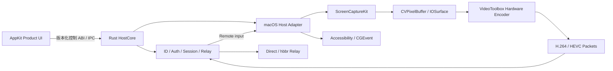
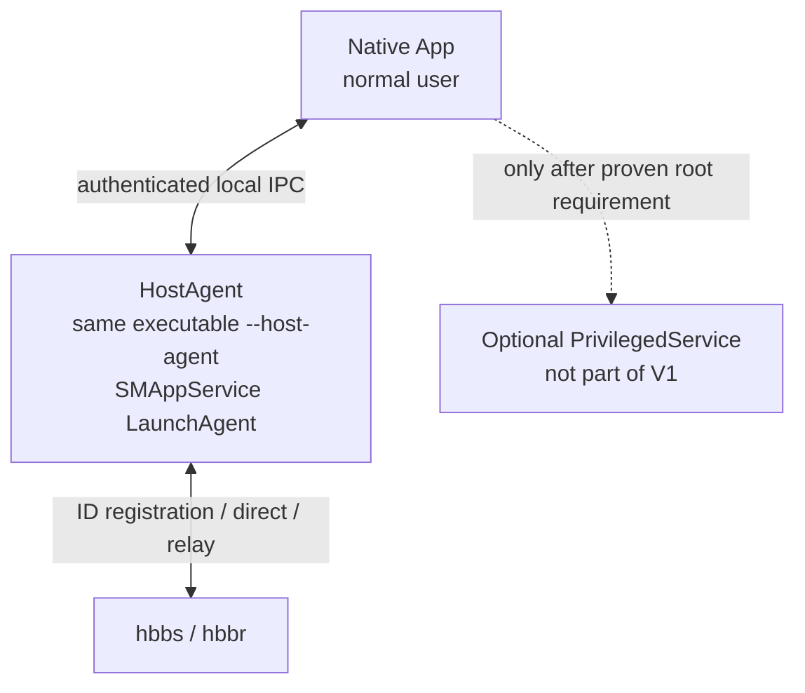
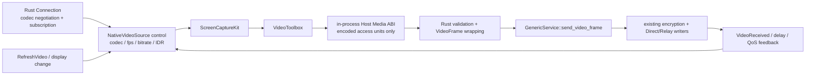
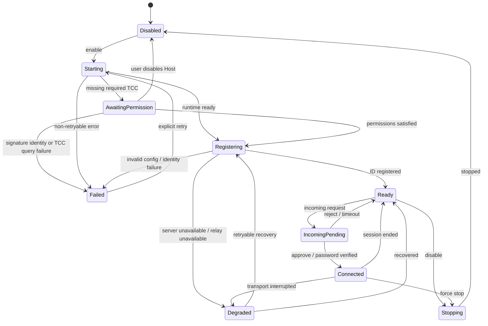
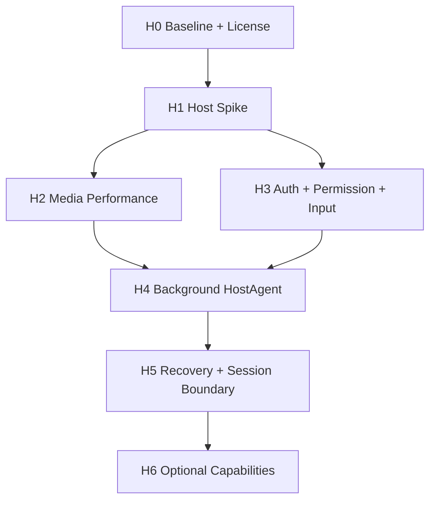

# RustDesk Native “别人连接我”详细设计

> 状态：Draft v0.2
> 日期：2026-08-04
> 范围：macOS 原生被控端（Host Mode）
> 目标读者：产品、macOS、Rust、远程桌面协议与测试开发者

## 1. 摘要

本文设计在现有 RustDesk Native viewer 基础上增加“别人连接我”能力，包括：

- 稳定的本机 ID；
- 临时密码与永久密码；
- macOS 系统权限和远程会话权限；
- 后台 Agent 注册、启动、停止、升级与状态诊断；
- 入站连接审批、会话展示、主动断开；
- 屏幕采集、硬件编码、加密传输和远程输入；
- 可量化的 CPU、内存、时延、丢帧和稳定性门禁。

本设计的核心决策是：

1. **不从零重写 RustDesk 协议、安全和网络控制面。** ID/Rendezvous、认证、加密、直连/Relay、协议协商和会话控制继续保留在 Rust。
2. **不把完整 RustDesk GUI 或内部 API 当作 SDK 嵌入。** 上游源码只作为被控端实现和互操作行为的参考/复用来源，项目对 Swift 暴露自有、稳定、语义化的 Host ABI。
3. **重写并优化 macOS 被控媒体面。** 使用 ScreenCaptureKit、IOSurface/CVPixelBuffer 和 VideoToolbox 建立原生低复制链路；Product UI 不接触原始帧。
4. **先做登录用户场景，再产品化后台运行。** 第一阶段在已登录桌面跑通真实链路；之后用 `SMAppService` 管理用户会话 LaunchAgent。V1 不为尚未证明的 root 需求预置 LaunchDaemon。
5. **Host 媒体接缝是 H1 的首要技术门禁。** VideoToolbox 产物通过独立的进程内 Host Media ABI 注入 Rust `video_service`；codec 协商、订阅、QoS、刷新请求、打包、加密和 Direct/Relay 发送仍由 Rust 权威执行。
6. **性能结论必须来自真实链路。** 固定记录机器、输入画布、drawable/capture dimensions、codec、实际硬件编码状态、FPS、CPU、内存、drops、网络和 runtime。

推荐的产品级链路如下：



## 2. 背景与问题

现有 viewer 已证明 macOS 原生实现可以显著降低远程画面展示侧的 CPU 占用。被控端比 viewer 多出屏幕采集、颜色格式处理、视频编码、变化检测和发送调度，因此同样存在较大的平台原生化收益。

用户曾观察到 Mac mini 上官方/现有被控端 CPU 约为 40–50%，但仓库内现有性能证据是控制端数据，不能用来证实该被控端数字或其归因。正式实现前必须在同一台被控机上重建可重复基线，并补齐：

- Mac mini 型号、CPU 架构和 macOS 版本；
- Activity Monitor 口径及 Host、WindowServer、videotoolboxd 分进程数据；
- 采集尺寸、显示缩放、帧率和画面内容；
- H.264/HEVC/VPx 以及实际选中的硬件或软件编码器；
- 静态桌面、普通操作、滚动/视频四种负载；
- 码率、RTT、丢包、发送队列、帧队列和 runtime。

本设计不预设“重写必然更快”，而是将低 CPU 路径定义为可验证的数据面合同。

## 3. 目标与非目标

### 3.1 产品目标

V1 应让用户在一个原生页面中完成以下操作：

1. 查看并复制稳定的本机 ID；
2. 查看/刷新临时密码，设置或删除永久密码；
3. 看懂屏幕录制、辅助功能、输入监控等 macOS 权限状态，并能跳转到对应系统设置；
4. 注册、启动、停止后台 HostAgent，看到准确的组件级状态；
5. 设置允许的远程能力和连接审批模式；
6. 收到明确的入站请求，查看远端信息并同意或拒绝；
7. 连接期间持续看到可见指示器，随时禁止输入或断开连接；
8. 在 App 退出或重启后仍可按用户选择提供后台 Host；
9. 网络变化、休眠唤醒和 HostAgent 崩溃后能够恢复或给出可诊断的失败状态。

### 3.2 技术目标

- Rust 继续作为协议、认证、加密、Relay、codec/session 的权威状态机；
- Host 数据面不跨 Product UI/Host Control ABI 传输原始视频帧；
- 采集到编码优先走 IOSurface/CVPixelBuffer 零拷贝或单次 GPU 转换路径；
- 明确验证 VideoToolbox 实际使用硬件编码；
- 所有队列有界，过载时降低帧率/分辨率或丢弃未编码旧帧；
- 任何压缩参考帧不得静默乱序或随意丢弃；
- 后台 Agent、权限、注册和会话状态均来自权威组件，不用 UI 推测；
- 上游 RustDesk 变更隔离在 adapter 层，不污染 Swift 产品接口。

### 3.3 V1 非目标

除非后续单独批准，V1 不包含：

- 自研 ID Server 或 Relay Server；
- 重写 RustDesk 密码协议、加密握手或 NAT 穿透协议；
- App Store 沙盒分发；
- Windows/Linux 被控端；
- 多个并发远程控制会话；
- 隐蔽运行、静默授权或绕过 macOS TCC；
- 完整文件管理器、远程终端、远程打印和隐私模式；
- 承诺与所有历史 RustDesk 客户端版本互操作。

音频、剪贴板和文件传输采用独立功能开关和阶段门禁，不能阻塞核心屏幕/输入 MVP。

## 4. 外部约束

### 4.1 RustDesk 不是稳定 Host SDK

RustDesk 开源客户端已经包含 `src/server`、Rendezvous、screen capture、input、clipboard 等被控端实现，但这些是应用内部模块，不是稳定、版本化的第三方 SDK。项目必须：

- 固定上游 tag/commit；
- 建立最小 patch 集；
- 用自有 adapter 和 ABI 隔离上游类型；
- 每次升级执行互操作和性能回归；
- 不把 Flutter bridge 或上游内部事件直接暴露给 Swift。

参考：<https://github.com/rustdesk/rustdesk>

### 4.2 许可证

RustDesk 客户端仓库使用 AGPL-3.0；FarPane 顶层 `LICENSE`、README 和 `docs/architecture.md` 已决定按 AGPL-3.0 分发。因此 Host Mode 不再把“开源还是闭源”作为未决架构门禁，而是执行可验证的 AGPL 合规清单。RustDesk Server Pro 或 Custom Client Generator 不应被默认理解为闭源嵌入 SDK 授权。

发布前清单至少包括：

- 随二进制提供对应源码、构建脚本和许可证/版权通知；
- 记录 pinned RustDesk commit、Host patch inventory 和本项目修改说明；
- 对网络交互场景履行 AGPL 对应源码要求；
- 产物内保留 `LICENSE`、`THIRD_PARTY_NOTICES.md` 和可访问的源码获取方式。

如未来另立闭源商业版，必须当作新产品/许可范围重新评估，不得沿用本文结论。

### 4.3 macOS TCC 与代码签名

屏幕录制、辅助功能和输入监控权限不能由应用静默授予。权限与二进制路径、签名身份和 designated requirement 存在关联，升级、改名、移动路径或签名漂移可能导致授权失效。

HostAgent 从第一版开始就应使用最终计划中的：

- App Bundle ID `io.rustdesknative.viewer`；
- LaunchAgent label / Mach service `io.rustdesknative.viewer.host-agent`；
- Team ID；
- designated requirement；
- 安装路径 `/Applications/FarPane.app`；
- Hardened Runtime 与 entitlements。

已决定 V1 HostAgent 使用同一签名 App executable 的 `--host-agent` 模式，而不是独立 helper 二进制。这使 TCC 和代码签名身份与现有 App 保持一致，同时允许 launchd 在 UI 进程退出后继续运行该 mode。参数分流必须发生在 AppKit 初始化前，HostAgent mode 不创建 Dock 图标、菜单或窗口。

开发签名、正式签名和 adhoc 签名的 TCC 结果必须分开记录。H1 可使用本地开发签名；进入 H4 预览分发前，必须完成 Developer ID notarization、stapling 和带 quarantine 的全新机安装/后台启动验收。未公证构建不得被称为可分发的后台 Host。

参考：

- <https://developer.apple.com/documentation/screencapturekit>
- <https://rustdesk.com/docs/en/client/mac/>

## 5. 建议范围与默认假设

详细设计暂按以下假设推进；任何变化都应更新本文和验收矩阵：

| 项目 | V1 假设 |
|---|---|
| 操作系统 | macOS 13，与当前 `Package.swift` 一致；只使用 13 可用的 Host 主路 API，后续系统能力用 availability gate |
| CPU | Apple Silicon 优先，Intel 做功能兼容和独立性能门禁 |
| Server | 自托管 hbbs/hbbr 优先，配置沿用现有 Rust core |
| 会话 | 同一时刻最多一个控制会话 |
| Codec | H.264 为兼容基线，HEVC 为 Apple 平台优先能力；软件 codec 仅作明确 fallback |
| 显示器 | 首版支持单显示器选择；多显示器切换在后续阶段 |
| 权限 | 查看屏幕、输入、剪贴板三个独立开关 |
| 审批 | 临时密码、永久密码、手动确认及组合模式 |
| 无人值守 | 必须由用户显式启用，默认关闭；V1 仅支持已登录的 active Aqua session，不支持 LoginWindow/重启后登录 |
| 连接可见性 | 永远显示菜单栏/窗口状态与主动断开入口 |

## 6. 总体架构

### 6.1 分层

系统分成四层：

1. **Product UI**：AppKit 页面、菜单栏状态、来访弹窗和系统设置引导；
2. **Host Control API**：稳定、版本化、低频语义 ABI/IPC；
3. **Rust HostCore**：配置、ID、认证、会话、权限、网络和编码包调度；
4. **macOS Host Adapter**：采集、编码、输入、剪贴板、TCC、显示和电源事件。

约束：

- Product UI 不直接调用 RustDesk 上游内部 API；
- Product UI 不持有 CVPixelBuffer、IOSurface、编码器或 socket；
- macOS Adapter 不决定认证结果和远程权限；
- Rust HostCore 不伪造 TCC 状态；
- UI 展示的状态必须能够映射到一个权威组件和时间戳。

### 6.2 进程模型

产品级 V1 默认使用两个。H1 Spike 先在 App 进程合并这两个；H4 再以同 executable 的不同 mode 拆成两个进程：



#### Native App

- 展示本机 ID、密码策略、权限和会话；
- 发出显式用户命令；
- 不承担后台会话存活责任；
- 退出后 HostAgent 是否继续运行取决于“允许后台被控”设置。

#### HostAgent

- 运行在当前 active Aqua session，能访问 WindowServer；
- 持有 Rust HostCore；
- 持有 ScreenCaptureKit、VideoToolbox 和输入 adapter；
- 与 hbbs/hbbr 建立网络连接；
- 产生权威 HostSnapshot 和会话事件；
- 崩溃后由 launchd 按退避策略恢复。

#### PrivilegedService（V1 不实现）

当前 V1 操作清单——注册/取消注册用户 LaunchAgent、启停 HostAgent、读写用户配置、访问用户 Keychain——均不证明需要 root LaunchDaemon。因此：

- H4 先使用 `SMAppService.agent(plistName:)` 管理随 App 签名的 LaunchAgent；
- 设置页报告 launchd 注册、用户审批、运行、崩溃循环和版本 handshake，不把 plist 存在当成安装成功；
- 只有未来出现经原型验证、不能用用户会话 API 完成的具体 root 操作，才新建 PrivilegedService 设计和安全审查；
- 该未来服务仍不得采集屏幕、处理视频、打开任意文件或接受 shell 字符串。

P0 Spike 中可先让 HostCore 跑在 Native App 进程，仅支持“用户已登录且 App 打开”；真实媒体链确认后再拆 HostAgent，避免同时调试性能和 launchd/TCC。

### 6.3 为什么不把采集放进 AppKit UI 进程

- Product UI 退出或重建窗口不应中断后台会话；
- 原始帧跨进程/跨 ABI 会增加复制和生命周期复杂度；
- UI 主线程卡顿不能反压网络和编码；
- TCC、签名与崩溃恢复应绑定稳定的 HostAgent；
- HostAgent 可独立采样 CPU、内存、编码器和队列指标。

### 6.4 Host 媒体与 RustDesk server 会话接缝

这是 H1 前必须冻结的最小 Host patch contract。当前 pinned RustDesk 1.4.9 中，`src/server/video_service.rs` 自行创建 capturer/encoder，经 `GenericService::send_video_frame` 把 protobuf `VideoFrame` 发给订阅连接；`src/server/connection.rs` 负责对端 codec 能力、订阅、`RefreshVideo*` 与 QoS 反馈。Native Host 不另起 socket，不绕开这条链。



Host patch inventory 只允许包含：

1. 新增独立 feature `rdn-native-host` 和 `rdn_host_bridge.rs`，不改变无该 feature 的上游行为；
2. 在 `video_service` 的产生者端增加 `NativeVideoSource`，保留原有 service 订阅、display switch、`VideoReceived`、QoS 和 Connection writer；
3. 将 macOS adapter 实测可用的 H.264/HEVC 能力注入 Rust codec 协商；Rust 仍产生唯一的 `selectedCodec + codecEpoch`，adapter 不能自选 codec；
4. 将 Rust 的 target FPS/bitrate、subscriber demand、display revision 和刷新请求映射为 adapter 控制事件；
5. 把经验证的压缩 access unit 包装成现有 `EncodedVideoFrame`/`VideoFrame`，再调用现有 service send 路径。

Host Media ABI 不属于 UI 控制通道。每个 access unit 必须包含 `hostInstanceId`、`connectionEpoch`、`codecEpoch`、canonical display ID/revision、codec、framing、PTS、keyframe/parameter-set flags 和有上限的 bytes。Rust 在调用返回前拷贝到 Rust-owned compressed buffer，或使用经合同测试的显式 ownership-transfer/free callback；不得保留 Swift 临时指针。迟到 epoch、错 codec、过大包、非单调 PTS 和缺失参数集的 IDR 必须 fail closed 并记稳定错误码。

VideoToolbox 常产生 AVCC/HVCC 长度前缀，现有真实 RustDesk 样本主要是 Annex-B。H1 不凭假设固定 wire framing；必须使用官方控制端黄金连接确认 H.264 framing、SPS/PPS 传递和 keyframe 标记，然后在 Media ABI 边界统一规范化。允许压缩包的一次有界拷贝，不得因此引入 raw-frame 拷贝。

刷新有两种语义：远端 `RefreshVideo*`/丢失恢复只触发当前 VT session 的下一帧 IDR；codec、尺寸、display revision 变化才执行 flush→丢弃旧 epoch→重建 encoder→参数集+IDR。不得沿用上游“一律重启 video service”来伪装 keyframe 请求。

## 7. Host 状态模型

### 7.1 顶层状态



### 7.2 后台状态不是一个 Boolean

UI 不得只展示 `serviceRunning=true/false`。权威快照至少包含：

- `applicationIdentity`: invalidLocation / developmentSigned / developerIdSigned / notarized / signatureMismatch；
- `backgroundRegistration`: notRegistered / requiresUserApproval / registered / versionMismatch / unregistering / failed；
- `agent`: unavailable / stopped / starting / running / wrongSession / crashLoop / failed；
- `privilegedService`: notRequired（V1 常态）/ requiredButMissing / running / failed；
- `registration`: offline / resolving / registering / ready / backoff / rejected；
- `permissions`: screenCapture / accessibility / inputMonitoring / microphone；
- `hostAvailability`: disabled / limited / ready / connected / degraded；
- `observedAt` 和组件版本。

`ready` 必须同时满足：

1. HostAgent 在正确会话域运行；
2. 必需权限已满足；
3. identity 可读且有效；
4. 已从权威 Rendezvous 链路获得可用 ID；
5. 入站监听/打洞/Relay 能力已初始化；
6. HostAgent 与 App 的 XPC wire 协议版本兼容；
7. 若当前有 active subscriber，媒体 codec epoch 和 adapter 能力已完成 handshake。

## 8. Host Control ABI / IPC

### 8.1 设计原则

- 本节区分三个不同合同：进程内 Host Control C ABI、进程内 Host Media C ABI、跨进程 App↔HostAgent XPC wire protocol；三者不共用 pointer 或生命周期语义；
- 新增独立 Host 命名空间，不在未实现前修改现有 Viewer ABI 语义；
- Host Control C ABI 只传低频语义控制信息和编码后的诊断快照；
- Host Media C ABI 只在 HostCore 与同进程 macOS adapter 之间传递媒体控制和压缩 access unit，禁止传 raw frame；
- 使用 opaque handle，明确 create/start/stop/destroy 生命周期；
- 每个事件包含 schema version、event ID、host instance ID 和 timestamp；
- 所有字符串明确 UTF-8、长度和释放方；
- 任何 password buffer 在使用后立即清零，不写入日志或 crash metadata；
- 回调不得在 Rust 锁内调用 Swift，也不得要求 AppKit 主线程同步返回；
- approve/reject 使用异步 command + result event，避免重入。

### 8.2 建议接口

以下为语义草案，不是最终头文件：

```c
uint32_t rdn_host_abi_version(void);

RdnHostResult rdn_host_create(
    const RdnHostCreateOptions *options,
    const RdnHostCallbacks *callbacks,
    RdnHostHandle **out_host);

RdnHostResult rdn_host_start(RdnHostHandle *host);
RdnHostResult rdn_host_stop(RdnHostHandle *host, RdnHostStopReason reason);
RdnHostResult rdn_host_command(RdnHostHandle *host, const RdnHostCommand *command);
RdnHostResult rdn_host_copy_snapshot(RdnHostHandle *host, RdnOwnedBytes *out_snapshot);
void rdn_host_free_bytes(RdnOwnedBytes bytes);
void rdn_host_destroy(RdnHostHandle *host);
```

控制事件可以使用版本化 JSON/MessagePack envelope，因为频率低、便于演进；原始帧和编码包禁止通过该控制通道。编码包只能经 §6.4 的 Host Media ABI 进入 Rust。

Host Media ABI 单独版本化，语义草案如下：

```c
uint32_t rdn_host_media_abi_version(void);

RdnHostResult rdn_host_media_set_capabilities(
    RdnHostHandle *host,
    const RdnHostEncoderCapabilities *capabilities);

RdnHostResult rdn_host_media_submit_access_unit(
    RdnHostHandle *host,
    const RdnHostEncodedAccessUnit *access_unit);

RdnHostResult rdn_host_media_report_encoder_state(
    RdnHostHandle *host,
    const RdnHostEncoderState *state);
```

Rust 通过 Host callback 发出 `startCapture`、`stopCapture`、`reconfigure(codecEpoch, codec, dimensions, fps, bitrate)` 和 `requestIdr(display, codecEpoch, reason)`。`submit_access_unit` 的成功只表示 Rust 已拷贝/接管该压缩包并通过 epoch/format 校验，不表示远端已收到；远端收到和 QoS 仍来自现有 Rust 反馈链。

### 8.3 HostSnapshot

建议字段：

```text
schemaVersion
hostInstanceId
hostState
localId
temporaryPasswordPresentation
passwordPolicy
approvalMode
unattendedAccessEnabled
backgroundStatus
systemPermissions[]
capabilityPolicies[]
activeConnectionId?
activeSession?
registrationStatus
transportAvailability
lastError?
observedAt
```

注意：

- `temporaryPasswordPresentation` 是短生命周期敏感值，单独受 UI 隐私策略控制；
- 快照不得包含永久密码明文、identity 私钥、server secret 或 raw authentication payload；
- `lastError` 使用稳定错误码和脱敏说明，不透传底层网络/协议原始错误；
- connection、display、permission 使用 canonical ID，不用数组下标表达身份。

### 8.4 Commands

至少包括：

- enableHost / disableHost；
- registerBackgroundAgent / unregisterBackgroundAgent；
- startHostAgent / stopHostAgent / retryHostAgent；
- regenerateTemporaryPassword；
- setPermanentPassword / clearPermanentPassword；
- setApprovalMode；
- setCapabilityPolicy；
- openSystemPermissionSettings；
- approveIncoming / rejectIncoming；
- disableInputForActiveSession；
- disconnectSession；
- selectDisplay；
- setQualityPolicy；
- exportSanitizedDiagnostics。

所有 command 均带 `commandId`；最终结果通过 event 回传，Swift 不以“函数返回成功”推断状态已经完成。

### 8.5 Events

- snapshotChanged；
- backgroundAgentOperationProgress；
- incomingConnectionRequested；
- incomingConnectionExpired；
- sessionStarted；
- sessionCapabilitiesChanged；
- sessionStatsUpdated；
- sessionEnded；
- permissionChanged；
- recoverableError；
- fatalError。

事件队列必须合并高频 stats，不能让 UI 消费速度反压 HostCore。

### 8.6 App↔HostAgent XPC wire 协议

H1 中 AppKit controller 通过 Host Control C ABI 直接调用同进程 HostCore。H4 拆进程后，HostCore handle 只存在 HostAgent；App 的 `HostControlClient` 改用 `io.rustdesknative.viewer.host-agent` Mach service，不尝试跨进程传 C pointer 或回调。

Wire envelope 至少包含 `wireVersion`、`messageType`、`requestId/eventId`、`hostInstanceId`、`agentBootId`、`sentAt`、payload length 与类型化 payload。命令是 request/accepted/result 三段式；`accepted` 只说明已入队，不代表注册、启停、审批或断开已完成。

重连语义：

1. App 连接后先交换支持的 wire version 和组件 build ID；不兼容时只允许导出诊断/触发修复，不发 Host command；
2. handshake 成功后必须先获取全量 HostSnapshot，再从其 `lastEventId` 订阅增量事件；
3. 断线期间事件可丢，但重连后的权威快照必须收敛最终状态；审批请求不依赖 UI 事件队列存活；
4. App 可用相同 `commandId` 重试未知结果命令，HostAgent 在有界 dedupe window 内返回原结果，不重复执行；
5. `agentBootId` 变化表示 Agent 已重启，App 废弃旧 instance 的 pending UI intent，重新以 snapshot 对账。

XPC listener 必须从 audit token 校验 euid、Team ID、`io.rustdesknative.viewer` designated requirement 和安装路径。协议对每类消息设长度/频率上限，不允许任意 selector、任意文件 URL 或类型解档。

## 9. Identity 与密码

### 9.1 本机 ID

- identity key 在首次启用 Host 时生成；
- identity 与 App 窗口生命周期解耦；
- App 重启、HostAgent 重启和小版本升级后保持稳定；
- 用户切换 server 配置时，不隐式重置 identity；
- “重置本机 ID”是单独的高风险操作，需要明确确认和审计；
- 私钥不离开 Rust/安全存储边界，不通过 Swift 或日志暴露。

UI 只有在 Rendezvous 确认注册成功后显示“可连接”。本地存在一个 ID 字符串不等于远端实际可达。

### 9.2 临时密码

- 使用系统 CSPRNG；
- 明确字符集、长度、有效期和轮换条件；
- 默认仅在 Host ready 时生成；
- 禁用 Host、显式刷新或策略到期后失效；
- 只在用户主动展示时短时显示；
- 不写文件、日志、analytics、pasteboard history 或 crash report；
- 是否在成功连接后自动轮换作为可配置策略，默认开启。

### 9.3 永久密码

- 默认未设置；
- 设置永久密码必须由本机用户完成；
- 明文仅存在于输入和导入 Rust 的短生命周期 buffer；
- 优先只持久化协议所需 verifier；若互操作必须保存可恢复 secret，仅允许存入 Keychain，并记录原因；
- 禁止写入普通 TOML、UserDefaults、日志或命令行参数；
- 密码强度、失败次数限制和冷却策略由 Rust HostCore 权威执行；
- UI 只能展示“已设置”和更新时间，不能读回明文。

### 9.4 审批模式

V1 支持：

- manualOnly：每次本机点击同意；
- temporaryPassword；
- permanentPassword；
- passwordAndLocalApproval；
- passwordOrLocalApproval。

无人值守只能选择允许 password 验证的模式，并且必须单独开启。UI 必须解释“允许在你不在电脑旁时被连接”的影响。

## 10. 权限模型

### 10.1 macOS 系统权限

| 权限 | 用途 | 缺失时行为 |
|---|---|---|
| Screen Recording | 捕获显示内容 | Host 不进入 ready；允许仅诊断连接但不建立屏幕会话 |
| Accessibility | 注入键盘鼠标 | 可建立只读会话；输入能力强制关闭 |
| Input Monitoring | 特定输入模式/完整键盘兼容 | 标记 limited；按当前 adapter 能力降级 |
| Microphone/System Audio | 远程音频 | 仅禁用音频，不阻塞屏幕 MVP |

系统权限状态由 platform adapter 实时读取。UI 的“已授权”不得基于用户点击过按钮推测。

### 10.2 远程能力权限

V1 权限：

- viewDisplay；
- controlKeyboardMouse；
- readClipboard；
- writeClipboard；
- hearSystemAudio；
- transferFiles（后续）；
- restartOrLock（后续）。

原则：

- 默认最小权限；
- policy 在认证前参与授权；
- 会话开始时生成 immutable permission snapshot；
- 用户可在会话中立即撤销输入、剪贴板等能力；
- 扩大当前会话权限需要本机显式动作；
- 修改默认 policy 默认只影响新会话，除非用户明确应用到当前会话。

### 10.3 入站连接审批

IncomingConnectionRequest 至少包含：

- canonical `connectionId`；
- 远端 ID；
- 远端声明的设备名和平台（标记为 untrusted display metadata）；
- 请求时间、超时时间；
- 请求的 capabilities；
- 预计 transport：direct / relay / unknown；
- 认证方式；
- 风险提示，如短时间多次失败。

规则：

- 一个 connectionId 只允许一次最终 approve/reject；
- 请求超时后 approve 必须失败；
- UI 重建不能丢失 pending request，应从 HostSnapshot 恢复；
- MVP 同时只允许一个 pending/active 控制会话，其余显式 busy/reject；
- 认证失败不弹出可被远端滥用的无限本机通知；
- 对连续失败做速率限制、指数退避和脱敏审计。

## 11. macOS 采集与编码数据面

### 11.1 零拷贝合同

理想路径：

```text
SCStream callback
  -> CMSampleBuffer
  -> CVPixelBuffer backed by IOSurface
  -> VTCompressionSessionEncodeFrame
  -> encoded CMSampleBuffer
  -> Rust-owned compressed packet descriptor
  -> protocol encryption / transport
```

硬约束：

- Product UI 永远不接收 raw frame；
- 不允许每帧构造全尺寸 `Data`、`Vec<u8>` 或 `CGImage`；
- capture adapter 与 encoder 必须在同一 HostAgent 进程；
- CVPixelBuffer 使用引用计数跨异步编码边界，不复制像素；
- 若输入像素格式不被硬件编码器接受，优先使用 ScreenCaptureKit 输出配置、CVPixelBufferPool 或 GPU/VideoToolbox pixel transfer；
- H1 必须在 macOS 13 真机分别探测 SCK `420v`/`420f` 直出和 BGRA 输出；不预设所有系统/显示组合都能稳定直出 NV12；
- CPU 逐像素 BGRA→NV12/I420 只允许作为带指标的 fallback；
- 每帧记录逻辑 copy count，性能验收要求主路径 copy count 为 0 或 1 次 GPU 转换。

### 11.2 ScreenCaptureKit 配置

配置项由 QualityController 统一管理：

- output width/height；
- pixel format；
- color space/range；
- minimumFrameInterval；
- queueDepth；
- cursor 是否包含在画面；
- display/window filter；
- HDR/SDR 策略。

默认策略：

- queueDepth 从较小值开始，以低时延优先；
- 不使用 `minimumFrameInterval = 0` 作为默认产品策略；
- 远端未请求 HDR 时使用 SDR，避免无必要的色彩和带宽成本；
- 捕获尺寸尽量接近实际发送尺寸，不先处理完整 5K 再在 CPU 缩放；
- display 配置变化使用 `updateConfiguration`/重建流的受控状态机处理。

ScreenCaptureKit 参考：

- <https://developer.apple.com/documentation/screencapturekit/scstreamconfiguration/minimumframeinterval>
- <https://developer.apple.com/documentation/screencapturekit/scstreamframeinfo/dirtyrects>

项目最低版本保持 macOS 13。当前 Xcode SDK 头文件中 `SCStreamFrameInfoDirtyRects` 标记为 macOS 12.3+，`queueDepth`、`pixelFormat`、`colorSpaceName` 也不是 macOS 14 专有 API，因此不因这些属性上调最低版本。但实际 sample attachment 可能缺键或给出空数组，adapter 必须安全解析，不得强转或把“无 attachment”解释为“画面永远静止”。macOS 14+ 新属性只能通过 `#available` 进入增强路径。

### 11.3 变化检测和自适应 FPS

不对完整帧做 CPU hash/diff。优先使用 ScreenCaptureKit `dirtyRects`、frame status 和 display time。当 `dirtyRects` 缺失/不可信时，降级为“有界固定采集 FPS + frame status + encoder/network 背压”；可在 idle 时逐步降 FPS，但每个心跳窗口必须强制一帧或 IDR 验证收敛，不做 CPU 全屏 diff，也不因空 dirty rect 无期停帧。

建议状态：

| 内容状态 | 建议上限 | 行为 |
|---|---:|---|
| idle | 1–5 FPS | 仅心跳/必要刷新，鼠标可走独立消息 |
| lowMotion | 10–15 FPS | 文本输入、少量窗口更新 |
| interactive | 30 FPS | 拖动、滚动、常规操作 |
| highMotion | 60 FPS（能力允许时） | 视频/动画；受网络、热状态和远端能力约束 |

切换应使用滞回和最短驻留时间，防止帧率频繁振荡。QualityController 的输入包括：

- dirty area ratio；
- 最近 N 帧变化频率；
- encoder latency；
- capture/encode queue depth；
- RTT、丢包和 send queue；
- thermal state；
- 远端 viewport、codec 和 FPS 上限。

### 11.4 VideoToolbox

编码器创建必须：

- 优先低时延实时 profile；
- 设置并读回 `kVTCompressionPropertyKey_RealTime=true`；
- 显式允许或要求硬件加速；
- 禁用不必要的帧重排序；
- 设置合理的 keyframe interval、bitrate 和 data-rate limits；
- 记录实际 encoder ID；
- 首个成功 encode callback 后读取并上报 `UsingHardwareAcceleratedVideoEncoder`，不用创建 session 前的默认值作结论；
- 当硬件编码不可用时，明确进入 softwareFallback，不得继续显示“硬件编码”。

参考：

- <https://developer.apple.com/documentation/videotoolbox>
- <https://developer.apple.com/documentation/videotoolbox/kvtvideoencoderspecification_enablehardwareacceleratedvideoencoder>

### 11.5 Codec 策略

建议优先级：

1. H.264 hardware：兼容基线；
2. HEVC hardware：双方支持时优先用于高分辨率；
3. 软件 codec：只在对端互操作必需且性能预算允许时启用；
4. 无共同 codec：连接前失败并给稳定错误码。

Codec negotiation 仍由 Rust 控制面完成。macOS adapter 只创建已被选定的 encoder，不自行改变协议结果。

能力探测按当前机器、codec、profile、像素格式和目标尺寸实测，不用“Intel/Apple Silicon”一个布尔值推断。尤其是 Intel HEVC，只有实际创建、完成首帧编码且读回 hardware=true 后才向 Rust 广告可用；否则不参与 HEVC 协商，不在会话中静默转软编。

### 11.6 背压和丢帧

队列建议：

```text
ScreenCaptureKit callback
  -> rawFrameQueue(capacity: 2, newest-wins)
  -> VideoToolbox inFlight(capacity: bounded)
  -> encodedPacketQueue(capacity: bounded, ordered)
  -> encryptedSendQueue(capacity: bounded)
```

规则：

- 尚未提交编码器的旧 raw frame 可以丢弃，保留最新帧；
- 已提交编码器的帧遵守编码器完成和引用关系；
- 已编码 H.264/HEVC 包不能随意丢弃潜在参考帧；
- 网络堵塞时优先降低采集 FPS、分辨率和码率；
- 确需重置时，显式 flush/reset encoder 并请求 IDR，不能静默跳过；
- 远端主动 `RefreshVideo`/`RefreshVideoDisplay` 必须精确映射为对应 display/codec epoch 的下一帧 IDR，与现有 viewer `rdn_client_request_keyframe` 构成对称恢复链；
- 所有 drops 按原因分类：captureSuperseded、encoderBackpressure、networkBackpressure、reconfigure、invalidFrame、shutdown。

## 12. 远程输入与剪贴板

### 12.1 输入链路

```text
Encrypted protocol event
  -> Rust session authorization
  -> normalized semantic input event
  -> macOS HostInputAdapter
  -> coordinate/layout mapping
  -> CGEvent / Accessibility injection
```

要求：

- 未授权会话的输入事件在 Rust 层拒绝；
- 输入被本机撤销后立即清空按键/鼠标按钮状态，避免 stuck key；
- display 切换和缩放变化使用 revisioned display mapping；
- 事件包含 connectionId，已结束连接的迟到事件必须丢弃；
- exclusive keyboard 等模式沿用已有安全边界，不由 Swift 直接注入；
- Secure Input、登录窗口和系统快捷键能力必须单独测试并如实降级。

### 12.2 剪贴板

- read/write 分权；
- 默认支持小型文本；
- 大对象、图片和文件使用大小上限与独立 transfer channel；
- 剪贴板去重不能无限轮询；优先事件驱动，fallback 轮询必须动态退避；
- 任何来自远端的文件名、UTI 和 payload 均视为不可信输入；
- 会话结束清理临时对象和 promise provider。

## 13. 后台 Agent 注册与生命周期

### 13.1 注册

使用 `SMAppService` 注册 App bundle 内签名 LaunchAgent plist，其 ProgramArguments 指向同一 App executable 的 `--host-agent` mode。V1 不复制 helper 到系统目录，不安装 LaunchDaemon，也不默认请求管理员授权。注册流程必须：

1. 验证 App 位于 `/Applications/FarPane.app`，Bundle ID、Team ID、designated requirement 和 notarization 符合当前 channel 的预期；
2. 验证 LaunchAgent plist label/Mach service/ProgramArguments 与 App build ID 匹配；
3. 显式说明“App 退出后仍可被连接”并由用户触发注册；
4. 处理 `requiresApproval`，引导用户到 Login Items/System Settings，不将“已发起注册”展示为 running；
5. 启动并等待 XPC 版本 handshake、HostSnapshot 和 Rendezvous health；
6. 升级通过新 App bundle 完成，旧 Agent 安全停止后再启动新 build，失败时保留可恢复状态。

### 13.2 启动和停止

- enableHost：允许被控，并按策略启动 HostAgent；
- disableHost：停止接受新连接并断开现有会话，identity 默认保留；
- stopHostAgent：停止当前 Agent 但不改变用户配置或注册状态；
- unregisterBackgroundAgent：停止并取消注册 LaunchAgent，明确说明 identity/config 默认保留；
- App 退出不等于 disableHost；
- 强制停止必须有超时和最终 kill 策略，但不得丢坏配置。

### 13.3 登录窗口和多用户

这是产品化高风险项。V1 明确只支持已登录且当前 active 的 Aqua session：锁屏、LoginWindow、无用户登录和 Fast User Switching 中的非 active session 不允许远程输入，Host 进入 `limited/sessionUnavailable`，暂停采集或只保留有界恢复信令。用户解锁回到同一 session 后可重新检查 TCC 并恢复。“无人值守”在 V1 不意味可跨重启或操作 LoginWindow。

H5 仅评估将来是否可安全扩大边界，不阻塞上述 V1。评估必须覆盖：

- LaunchAgent 在 GUI/Aqua 与 LoginWindow session 的加载行为；
- Fast User Switching 时哪个 session 可被控制；
- 屏幕采集和辅助功能授权在不同 session 的有效性；
- 不能同时启动两个 HostAgent 争用同一 identity/端口；
- 会话切换时 display、input 和 clipboard adapter 的重新绑定；
- 无用户登录时必须继续显示 unsupported/limited，不能因 launchd 进程存在伪装 ready。

参考：<https://github.com/rustdesk/rustdesk/wiki/macOS-Auto%E2%80%90Start-Service-Setup-%28for-Remote---MDM-Deployment%29>

### 13.4 休眠、唤醒与网络变化

- Host ready 但无活动会话时不持有防休眠 assertion；
- 经认证且已批准的屏幕会话期间，持有有界的 user-idle sleep assertion 以避免空闲计时器中断会话；
- assertion 不覆盖用户显式休眠、盒盖、关机或系统低电量/热保护，并在会话结束、认证失效、进入 background-without-session 或 Agent 关闭时立即释放；
- 设置页需明确说明活动连接可使 Mac 保持唤醒，诊断中记录 assertion 类型/持续时间，不记录画面内容；
- sleep 前暂停 capture、flush 或关闭 encoder、发送会话状态；
- wake 后重新枚举 display、检查 TCC、重建 capture/encoder；
- 网络变化触发 Rendezvous/Relay 恢复，不重置 identity；
- 恢复有指数退避和 jitter；
- 旧 connection epoch 的迟到事件不得进入新会话；
- 超过恢复窗口后结束会话并给出明确 reason。

### 13.5 应用防火墙与入站端口

HostCore 开始入站监听时可能触发 macOS Application Firewall 首次提示。产品必须：

- 在启用 Host 前告知用户可能出现系统入站连接提示，不模仿或遮挡系统对话框；
- 固定签名/公证身份和安装路径，避免每次升级被当作新程序；
- 区分 direct listener 不可用、Relay 仍可用与整体 offline，不凭 timeout 猜测用户点了“拒绝”；
- 验收包含干净机首启的 allow/deny 两条路径，以及 deny 时 forced relay 的真实行为。

## 14. 安全设计

### 14.1 本地 IPC

- IPC endpoint 不暴露到网络；
- 使用 audit token 验证 pid/euid；
- 校验调用方 code signing requirement；
- App↔Agent 只授权同 euid、同 Team ID 且满足 designated requirement 的正版 App；
- 未来若新增 privileged service，必须另立 threat model 且只提供枚举式 allowlist command；
- 不接受 shell 字符串、任意文件路径或任意环境变量；
- 所有消息有 schema version、长度上限和 request ID；
- 对异常断开和重放请求安全处理。

### 14.2 网络与认证

- 复用 RustDesk 已有 Rust 协议和加密实现；
- 不在 Swift 重做密码校验或 handshake；
- 对端展示信息标记为不可信，不参与授权决定；
- 对认证失败做速率限制和冷却；
- Relay 不降低端到端认证要求；
- server key/config 变更需要显式 UI 与连接重建；
- 不把 raw Provider/server/protocol 错误直接展示或上传。

### 14.3 产品安全与可见性

- 无人值守默认关闭；
- 每个活动会话始终有可见指示；
- 提供全局“停止共享/断开”入口；
- 本机键鼠可触发紧急停止策略；
- 新安装或权限变化后不自动恢复高权限会话；
- 审计只记录时间、远端 ID、结果、能力和原因码，不记录密码、剪贴板内容或画面；
- 暴力尝试告警必须合并，防止通知轰炸。

## 15. 性能设计与门禁

### 15.1 必须采集的指标

HostAgent 内部：

- process CPU、resident/private memory、threads；
- capture dimensions、pixel format、requested/actual FPS；
- capture callbacks、valid frames、dirty area ratio；
- raw frame queue depth 与 drops；
- encoder name、codec、hardware acceleration confirmed；
- encode latency p50/p95/p99、in-flight frames；
- encoded bytes、bitrate、keyframes；
- encoded/send queue depth 与 drops；
- encryption/send CPU；
- RTT、loss、relay/direct、reconnects；
- end-to-end input-to-photon latency（单独工具测量）；
- thermal state、电源来源、sleep assertion 状态和 runtime。

系统侧：

- HostAgent；
- Native App；
- WindowServer；
- videotoolboxd/相关媒体进程；
- 总系统 CPU、memory pressure 和能耗。

### 15.2 场景矩阵

每轮性能回归至少包含：

1. Host enabled、无人连接，10 分钟；
2. 已连接、静态桌面，10 分钟；
3. 1080p30 普通窗口拖动/文本/滚动，10 分钟；
4. 4K30 普通操作，10 分钟；
5. 4K30 高动态视频，10 分钟；
6. 目标产品场景 30 分钟稳定性；
7. sleep/wake、网络切换、display reconfigure 后重复场景 3；
8. Intel 与 Apple Silicon 分别运行，不互相替代。
9. 电池供电下 Host idle 与 active session 的能耗/热状态，验证无会话时不持有 sleep assertion；
10. HostAgent 后台 ready 时运行 outbound Viewer，以及 Host + Viewer 双 active session 的合并资源预算。

### 15.3 初始工程目标

下列是设计目标，不是未经测量的完成声明：

| 场景 | Host 进程 CPU 初始目标 | 其他门禁 |
|---|---:|---|
| enabled、无人连接 | < 1–2% | 无 busy loop，注册退避正常 |
| connected、静态桌面 | < 5–10% | 自适应到低 FPS，无全屏 CPU diff |
| 1080p30 普通操作 | < 15–25% | hardware encoder=true，队列稳定 |
| 4K30 普通操作 | < 25–40% | 无持续 backlog，内存稳定 |
| 30 分钟稳定性 | 不随时间单调上升 | 无 crash、无未解释 drops、无泄漏趋势 |

CPU 目标必须同时给出 WindowServer 和媒体系统进程；不能通过把工作移到系统进程后只报告 Host CPU 来宣称优化成功。

能耗也是退化门禁：Host idle 不得持有防休眠 assertion 或产生持续 capture callback；active session 的 assertion 持续时间必须与会话时间收敛；热状态达 serious/critical 时 QualityController 必须降 FPS/尺寸，不为保持标称 4K30 持续升温。

### 15.4 Profiling 方法

- Instruments Time Profiler：定位 CPU 热点；
- System Trace：观察 capture、encoder callback、锁和线程调度；
- Allocations/Leaks：验证 CVPixelBuffer、CMSampleBuffer 和 packet 生命周期；
- os_signpost：capture→encode→packet→send 各阶段；
- VideoToolbox session property：确认真实 encoder；
- 受控脚本/画布：保证每次输入一致；
- 同一机器对比上游 RustDesk、Host Spike 和最终实现。

任何优化 PR 必须说明它改变了哪个指标和数据链，不接受仅凭主观流畅度或瞬时 Activity Monitor 截图。

## 16. 可观测性与诊断

### 16.1 结构化日志

日志字段：

- timestamp、level、component；
- hostInstanceId、connectionId（可脱敏）；
- state transition from/to；
- stable error code；
- codec、dimensions、queue/drop reason；
- transport type 和 recovery attempt。

禁止记录：

- 临时/永久密码；
- identity 私钥和 server secret；
- 剪贴板内容、文件内容和屏幕像素；
- raw authentication payload；
- 未经脱敏的远端个人信息。

### 16.2 诊断导出

用户可主动导出脱敏诊断包，包含：

- App/Agent 版本与签名/公证摘要；
- launchd component status；
- TCC 状态（不含系统数据库原始内容）；
- server 地址的脱敏形式和连接结果；
- 最近状态转换和稳定错误码；
- 最近性能统计聚合；
- 不包含密码、密钥、画面和剪贴板。

## 17. 错误模型

错误按可行动作分类：

| 类别 | 示例 | UI 动作 |
|---|---|---|
| permissionRequired | screen capture denied | 打开对应系统设置、重新检测 |
| backgroundAgentOperation | Agent build/wire version mismatch | 更新 App、重新注册后台 Agent |
| configuration | invalid hbbs/key | 打开网络配置 |
| registration | DNS/server rejected | 展示退避和重试，不重置 ID |
| codecUnavailable | no common/hardware codec | 降级或明确失败 |
| captureUnavailable | display/session unavailable | 重新枚举显示器或等待登录 |
| authentication | password rejected/rate limited | 脱敏提示和冷却时间 |
| transport | relay/direct interrupted | 自动恢复或结束会话 |
| internal | invariant/ABI mismatch | 停止 Host 并导出诊断 |

错误包含：stable code、severity、retryability、suggested action、component、observedAt。Swift 不解析底层错误字符串决定业务行为。

## 18. 配置与迁移

- Host 配置有独立 schema version；
- 迁移由 Rust HostCore 执行，Swift 不直接修改 RustDesk/Host 配置文件；
- 写入采用临时文件 + fsync + atomic replace 或等价安全存储；
- 迁移失败保留旧配置并进入 degraded/failed；
- identity、server config、password verifier 和 UI preferences 分开存储；
- 敏感值进 Keychain，普通策略进版本化配置；
- 取消注册后默认保留 ID/配置；删除 identity 是另一个必须二次确认的高风险命令。

上游 `hbb_common::Config`、`APP_NAME` 和部分 codec/session 状态是进程全局的，不允许 App 内 viewer core 与 HostCore 同时对同一 RustDesk 配置目录写入。分阶段规则如下：

1. H1–H3 同进程 Spike 中 Host 与 outbound Viewer 互斥；启动 Host 前关闭 viewer core，并用自动化合同测试证明不存在残留全局状态；
2. H4/V1 通过进程隔离支持“Host 后台 ready + App outbound Viewer”并存：Viewer 保持现有配置命名空间，HostAgent 在任何 `Config` lazy initialization 前切换到专用 Host 命名空间/配置根；
3. Host identity、password verifier、host policy 和 registration state 只由 HostAgent 写；App 通过 XPC command 修改，不触碰 Host 文件；
4. 用户可见的 server 设置只有一份产品级 canonical config，每次修改带 monotonic revision；App 和 Agent 将它作为不可变启动/更新输入，不让两个 Rust core 反向改写同一 `RustDesk.toml`；
5. HostAgent 启动时获取专用单写者文件锁，lock record 包含 boot ID/build ID/config revision；旧新 Agent 升级重叠时新进程 fail closed，不并发迁移；
6. H0 必须先盘点 pinned RustDesk 实际读写文件、Keychain 和进程全局项；若单独 `APP_NAME` 不足以完成隔离，在 Host adapter 增加显式 config-root patch，不用环境变量或运行时切换猜测路径。

V1 并存验收至少包含：Host ready 时发起 outbound Viewer；Viewer 会话中接收入站请求；Host 活动会话中启动/停止 Viewer；两侧同时断线/恢复；重启 App 不改变 Host ID。资源预算分开报 Viewer、HostAgent、WindowServer 和媒体进程，不以 ABI 符号可并存替代真实双会话。

## 19. 上游复用与升级策略

### 19.1 复用范围

优先复用：

- protocol messages；
- encryption/authentication；
- Rendezvous/relay/direct transport；
- session negotiation；
- server/client interoperability tests；
- 必要的 codec packetization。

优先替换或隔离：

- Flutter/Sciter UI；
- 上游 UI event bus；
- macOS 屏幕采集热路径；
- macOS encoder selection 和 frame queue；
- 产品后台状态 projection；
- 产品权限和诊断 UI。

### 19.2 升级流程

1. 固定当前上游基线 commit；
2. 记录复用文件和 patch inventory；
3. 新上游版本先在临时分支执行 compile/focused tests；
4. 跑协议 golden tests；
5. 跑官方 RustDesk 控制端互操作矩阵；
6. 跑性能基线和 30 分钟稳定性；
7. 检查许可证和新增依赖；
8. 全部通过后才更新 pinned revision。

互操作矩阵必须同时固定“Host pinned core 版本”和“官方控制端版本”，至少覆盖与 pinned core 对应的官方版本、当前支持的 stable 版本和当前 Native Viewer。官方控制端升级后若 codec/协议行为漂移，先保存失败证据并评估 patch，不通过过度广告能力或伪造成功绕过。

## 20. 测试策略

### 20.1 单元测试

- Host 状态转换；
- approval/password policy；
- capability snapshot 和撤销；
- QualityController 滞回；
- bounded queue/drop policy；
- codec negotiation；
- error mapping 和脱敏；
- config migration；
- canonical ID/revision handling。

### 20.2 ABI 合同测试

- ABI version negotiation；
- create/start/stop/destroy 幂等和竞态；
- callback 线程与重入；
- 字符串/bytes ownership；
- Swift deinit 和 Rust shutdown；
- password buffer 清理；
- unknown field/event 的向前兼容；
- Host ABI 与 Viewer ABI 并存。

其中“ABI 并存”只证明符号、版本和生命周期合同，不代表 Host + Viewer 真实并发已通过；后者必须走 §20.3/§20.4 的双会话验收。

### 20.3 本地集成测试

- 临时 hbbs/hbbr；
- identity 注册和稳定 ID；
- direct 与 forced relay；
- 临时/永久密码；
- approve/reject/timeout；
- 权限撤销；
- encoder reset/IDR；
- 远端 `RefreshVideo*`→指定 display/codec epoch 的下一帧 IDR；
- AVCC/HVCC↔wire framing、SPS/PPS/VPS 与 keyframe golden vectors；
- 网络断开恢复；
- HostAgent crash/restart；
- App UI 重启时活动 Host 状态恢复；
- App/Agent XPC 断线重连、command dedupe、Agent boot ID 变化和全量 snapshot 对账；
- HostAgent 与 outbound Viewer 配置隔离及双 active session。

Fixture 和离线协议测试只能证明局部逻辑，不能代替真实 RustDesk 控制端和真实 macOS TCC/VideoToolbox 验收。

### 20.4 真机验收

至少覆盖：

- Apple Silicon Mac mini 作为被控端；
- Intel Mac 作为独立兼容门禁；
- 官方 RustDesk stable 控制端；
- 当前 Native Viewer 控制端；
- self-hosted direct；
- self-hosted secure relay；
- 用户已登录、锁屏、登录窗口、休眠唤醒；其中锁屏/LoginWindow 的 V1 通过标准是权威降级为 unsupported/limited 且输入无法注入，不是强行远程操作；
- 单显示器和显示配置变化；
- 正式签名构建的 TCC 延续；
- Developer ID 公证/stapled 且带 quarantine 的全新安装，包括 LaunchAgent 注册、用户审批、首次入站防火墙 allow/deny；
- H.264 与 HEVC 在 Apple Silicon/Intel 上的独立硬编探测，不支持 HEVC 硬编的 Intel 必须在协商前降级。

## 21. 分阶段实施

### H0：基线与许可证门禁

交付：

- 完成 AGPL 对应源码、通知、修改说明和网络交互合规清单；
- 固定上游 commit；
- 产出 host patch inventory：`video_service`、codec 能力/协商、refresh/IDR、display 和 config-root 接缝；
- 盘点 pinned core 的进程全局状态和实际配置/Keychain 读写集；
- 在同一 Mac mini 上测官方 RustDesk host 四场景；
- 用 Instruments 重建并定位用户所述 40–50% 的真实归属；
- 建立性能采集模板。

退出条件：知道 CPU 主要消耗在 capture、conversion、encode、network、polling 还是系统进程；Host patch/config 边界可 review；AGPL 清单对内部 Spike 无阻塞。

### H1：登录用户 Host Spike

交付：

- HostCore 在 App 打开时启动；
- 自托管 hbbs/hbbr 获取稳定 ID；
- 临时密码；
- `rdn-native-host` + `NativeVideoSource` 最小 patch；
- ScreenCaptureKit→VideoToolbox→Host Media ABI→`GenericService::send_video_frame`→现有 Rust transport；
- H.264 AVCC/Annex-B framing、SPS/PPS、PTS 和 keyframe golden vectors；
- 远端 `RefreshVideo*`→VT 下一帧 IDR；
- 官方 RustDesk 从另一台机器成功连接；
- 单显示器、只看画面、H.264 hardware。

退出条件：真实连接链成功，硬件编码在首帧后确认，远端刷新能恢复画面，压缩包经现有 Rust service/writer 发送，主路径 raw-frame copy count 为 0 或 1 次 GPU/pixel-transfer 转换且无 CPU 全帧转换。

### H2：性能媒体面

交付：

- dirty rect 可用路径与 attachment 缺失的 macOS 13 降级路径；
- adaptive FPS/resolution；
- bounded queue/backpressure；
- HEVC negotiation；
- Apple Silicon/Intel 按 codec/尺寸硬编探测；
- 完整指标和 signpost；
- 1080p30、4K30 基线。

退出条件：达到或明确记录初始性能门禁；任何失败保留为证据，不通过降低真实画布规避。

### H3：认证、权限和输入

交付：

- 永久密码安全存储；
- approval modes；
- incoming request UI；
- capability policy；
- 键盘鼠标注入和撤销；
- 会话指示、主动断开、失败速率限制。

退出条件：未授权输入无法到达 platform adapter，连接状态和权限在 App 重建后仍正确。

### H4：后台 HostAgent 产品化

交付：

- 同 executable `--host-agent` mode 与 AppKit 初始化前的 mode dispatch；
- `SMAppService` LaunchAgent 注册/审批/取消注册，不包含 LaunchDaemon/HostService；
- XPC audit-token/签名验证、wire 版本 handshake、snapshot-first 重连和 command dedupe；
- Host/Viewer 配置命名空间隔离、HostAgent 单写者锁与双 active session 验收；
- Developer ID notarization、stapling、quarantine 全新安装和防火墙首启路径；
- App 退出后后台运行；
- 后台组件级状态和诊断。

退出条件：App 重启/退出、Agent 崩溃和版本不匹配后状态真实、可恢复，不以进程存在冒充 ready；带 quarantine 的公证构建能在干净机完成用户审批并后台启动。

### H5：恢复、会话边界与稳定性

交付：

- lock/loginwindow/Fast User Switching 的 V1 安全降级与未来可行性评估，不承诺 V1 可远程操作；
- sleep/wake；
- 网络切换；
- display reconfigure；
- crash recovery；
- sleep assertion 生命周期、电池能耗与 thermal 降级；
- 30 分钟 Apple Silicon 与 Intel 证据。

退出条件：产品目标场景均有明确 pass/fail evidence；锁屏/LoginWindow 不支持边界在 UI 中准确降级且无输入泄漏；无会话时无 sleep assertion 泄漏。

### H6：可选能力

- system audio；
- 剪贴板富类型；
- 文件传输；
- 多显示器并行/切换；
- 多连接观察者；
- 远程锁定/重启等高风险能力。

每项独立做权限、安全、性能和互操作门禁。

## 22. Issue/DAG 建议



建议进一步拆为独立可 review Issue：

- H0.1 upstream pin/AGPL compliance/patch inventory；
- H0.2 Mac mini controlled-side baseline；
- H0.3 Rust config/global-state inventory；
- H1.1 Rust inbound session + NativeVideoSource seam；
- H1.2 ScreenCaptureKit adapter；
- H1.3 VideoToolbox H.264 + Host Media ABI；
- H1.4 framing/keyframe/official-client golden connection；
- H2.1 telemetry/signpost；
- H2.2 dirty rect/adaptive FPS；
- H2.3 backpressure/drop correctness；
- H2.4 HEVC negotiation；
- H3.1 password/identity secure storage；
- H3.2 permission state machine；
- H3.3 input adapter；
- H3.4 incoming UI/session controls；
- H4.1 HostAgent process split；
- H4.2 authenticated XPC + reconnect/dedupe；
- H4.3 SMAppService registration/upgrade/unregister；
- H4.4 Host/Viewer config isolation + concurrent sessions；
- H4.5 notarization/quarantine/firewall acceptance；
- H5.1 sleep/network/display recovery；
- H5.2 lock/loginwindow boundary + TCC/signing；
- H5.3 30-minute acceptance matrix。

共享 Control/Media ABI、XPC wire protocol、identity schema、配置 schema 和 Host patch inventory 由主线 Issue 所有；禁止多个实现 Issue 并行私自修改。

## 23. 主要风险与缓解

| 风险 | 影响 | 缓解 |
|---|---|---|
| AGPL 对应源码/通知不完整 | 无法合规发布 | H0 执行可复查的分发清单 |
| 上游没有稳定 SDK | 升级成本高 | pinned revision + adapter + patch inventory |
| VT 编码产物绕开 Rust server 会话 | 丢失协商/QoS/加密权威 | NativeVideoSource 注入现有 service/writer，H1 golden connection |
| 官方控制端协议/codec 漂移 | 新客户端无法连接或花屏 | 固定双向版本矩阵，每次升级跑 framing/keyframe 回归 |
| TCC/签名漂移 | 升级后无法采集或输入 | 早期固定 identifier/signing，正式签名回归 |
| 未公证后台 Agent 被 Gatekeeper 拦截 | 安装后无法稳定启动 | H4 Developer ID notarization/stapling/quarantine 干净机验收 |
| LoginWindow/多用户限制 | 无人值守边界被误解 | V1 只支持 active Aqua session，其余权威降级并拒绝输入 |
| “允许硬编”但实际软编 | CPU 目标失败 | 读取实际 VideoToolbox 属性并作为门禁 |
| 原始帧复制隐藏在桥接层 | CPU/内存高 | raw frame 不过 UI ABI，copy count 指标 |
| 网络堵塞形成帧积压 | 高延迟、高内存 | bounded queues + adaptive controller |
| 错误丢弃参考帧 | 花屏/解码断链 | 丢弃限于未编码帧，reset + IDR 明确化 |
| HostAgent 进程存在但实际不可达 | UI 假 ready | XPC/version/Rendezvous 组合 health + component snapshot |
| Host/Viewer 双 core 争用配置/全局状态 | ID 变化、配置损坏、会话串扰 | H1 互斥，H4 进程/配置根隔离 + 单写者锁 + 双会话验收 |
| 防休眠 assertion 泄漏或高热 | 电池、散热和用户信任受损 | 仅 active session 持有、RAII/崩溃恢复、能耗/thermal 门禁 |
| Application Firewall 拒绝直连 | 远端误判 Host offline | 首启引导、direct/relay 分状态、allow/deny 真机验收 |
| 只优化 Host CPU、转移给系统进程 | 性能结论失真 | 同时报 WindowServer/videotoolboxd/总能耗 |
| 远程输入成为越权通道 | 安全事故 | Rust 权限权威、IPC 校验、默认最小权限 |

## 24. 已冻结决策与剩余待确认项

本版已冻结：

1. V1 最低版本为 macOS 13，`dirtyRects` 缺失时有降级而不做 CPU 全帧 diff；
2. FarPane/Host Mode 按现有 AGPL-3.0 路径分发；
3. H.264 hardware 是 H1 首个强制互操作 codec，HEVC 在 H2 按真实能力开启；
4. V1 仅支持 active logged-in Aqua session，不支持 LoginWindow/锁屏输入；
5. HostAgent 使用同 App executable 的 `--host-agent` mode + `SMAppService` LaunchAgent，V1 无 HostService/LaunchDaemon；
6. V1 不包含 system audio，clipboard 作为独立功能门禁，不阻塞屏幕/输入核心完成；
7. Intel 是功能 release blocker，性能门禁独立记录，不用 Apple Silicon 结果代替。

仍需在对应阶段前确认：

1. V1 是否只支持自托管 hbbs/hbbr（H1 前）；
2. 永久密码为互操作必须保存可恢复 secret 还是可仅保存 verifier，以 pinned core 真实认证链为准（H3 前）；
3. canonical server config 的产品存储位置与 Host 专用 config-root patch 形态（H4 前）；
4. 性能门禁使用哪一代 Mac mini 作为主基线（H0 基线采集前）。

## 25. 完成定义

“别人连接我”不能仅以“UI 出现 ID”或“某次成功连接”作为完成。V1 完成必须同时满足：

- 稳定 ID 来自真实 Rendezvous 注册；
- 临时/永久密码和审批模式按安全策略工作；
- macOS 权限、HostAgent 后台状态和连接状态来自权威链；
- 官方控制端和 Native Viewer 均完成真实 direct/relay 验收；
- 输入权限可撤销，断开后无残留按键/会话；
- App/Agent 重启、XPC 断线对账和版本不匹配行为可诊断；
- VT 编码包通过经验证的 NativeVideoSource 注入现有 Rust service/writer，codec/framing/keyframe 合同有 golden tests；
- 主路径确认 VideoToolbox 硬件编码；
- 真实尺寸/FPS 下 CPU、内存、drops、latency、runtime 有保存证据；
- 30 分钟门禁无 crash、无泄漏趋势、无未解释 backlog；
- Host/Viewer 配置隔离和双 active session 通过，App 重启不改变 Host ID；
- 锁屏/LoginWindow 权威降级且远端输入无法注入；
- 正式签名升级不破坏既有 TCC 或对破坏有明确迁移方案；公证/stapled/quarantine 安装可启动 HostAgent；
- 无会话时无 sleep assertion 泄漏，active session 能耗/热降级有保存证据；
- AGPL 对应源码、修改说明、通知和分发义务已通过清单。

在上述证据齐全之前，状态只能是 Spike、MVP 或受限预览，不能声明产品级被控能力完成。
