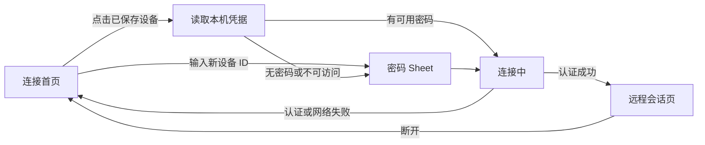

# 出站控制产品界面设计

状态：Implemented / 本地测试、隔离 Keychain 与签名 AppKit UI 验收通过；真实出站凭据链待操作者复验
更新时间：2026-08-03  
系统架构基线：[`architecture.md`](architecture.md)

## 1. 设计范围

本文只设计 Native Viewer 的产品界面及其直接依赖的状态合同，不重复 RustDesk Core、
VideoToolbox、Metal、输入协议、签名和性能架构。完整系统技术设计继续以
[`architecture.md`](architecture.md) 为准。

本次覆盖两个界面：

1. **连接首页**：快速输入设备 ID、连接过的设备列表、收藏、最近连接、保存密码和服务器
   设置。
2. **远程会话页**：全画面 Viewer、默认收起的顶部悬浮入口、展开后的 HUD、独占键盘、
   全屏与断开操作。

本次只解决“我连接别人”。“显示自己的设备 ID、别人连接我、开机服务、屏幕采集和无人
值守被控端”不在本文范围，继续由同时安装的官方 RustDesk 承担。

## 2. 产品原则

- 启动后先看到可直接使用的设备列表，不再先面对服务器、公钥等技术表单。
- 已保存有效固定密码的设备可以一次点击连接。
- 密码保存必须由用户明确选择，并且只进入 macOS Keychain。
- 一次性密码默认不保存；保存选项默认关闭。
- 设备列表不显示虚构的在线状态。当前 Core 没有可靠 presence 能力。
- 全屏远控以远端画面为主，固定工具条和默认 HUD 不得长期遮挡画面。
- 普通用户界面不出现 Core 动态库路径、验收环境名和性能测试开关。
- 官方 RustDesk 与 Native Viewer 的应用身份、设置、Keychain 和服务互不修改。

## 3. 页面结构



应用继续只使用一个主窗口。首页、连接中和 Viewer 是同一窗口中的状态切换，不新增多会话
窗口。

## 4. 连接首页

### 4.1 整体布局

建议默认窗口约 `860 × 680 pt`，最小尺寸不低于 `720 × 560 pt`。页面采用单主栏，避免
复制官方客户端中用于“本机被控端”的左侧栏，因为 Native Viewer 当前不具备那项能力。

```text
┌──────────────────────────────────────────────────────────────┐
│ RustDesk Native Viewer                     当前服务器  ⚙︎   │
│                                                              │
│ 控制远程设备                                                  │
│ ┌────────────────────────────────────────┐  ┌──────────┐     │
│ │ 输入对方设备 ID                         │  │   连接   │     │
│ └────────────────────────────────────────┘  └──────────┘     │
│                                                              │
│  最近连接                         [全部] [收藏]      搜索     │
│ ───────────────────────────────────────────────────────────  │
│  ★  工作室 Mac mini                                         │
│     313 790 560 · 2 分钟前                  🔒      连接     │
│                                                              │
│  ☆  办公室电脑                                               │
│     892 123 456 · 8 月 1 日                  —       连接     │
│                                                              │
│  ● 就绪                                                      │
└──────────────────────────────────────────────────────────────┘
```

从上到下分为：

1. 页面标题和服务器入口。
2. 快速连接输入区。
3. 设备列表工具行。
4. 可滚动设备列表或空状态。
5. 底部全局状态。

### 4.2 顶部区域

- 左侧显示产品名和页面标题“控制远程设备”。
- 右侧显示当前服务器的用户可读名称，例如“自建服务器”；点击打开服务器设置 sheet。
- 正常状态下不直接展示 hbbs 地址和公钥。
- 服务器配置缺失或无效时，右侧显示橙色状态并引导配置；快速连接按钮禁用。

### 4.3 快速连接

- 输入框占据主宽度，placeholder 为“输入对方设备 ID”。
- `Return` 与“连接”按钮行为一致。
- 输入只做首尾空白清理，不擅自删除内部字符；最终有效性由 RustDesk Core 判断。
- 空值时连接按钮禁用。
- 若设备 ID 已存在，复用对应设备记录和凭据，不创建重复设备。
- 若是新设备，打开密码 sheet；只有认证成功后才进入正常最近列表。
- 连接中禁用输入和主按钮，按钮变为进度状态；重复按 Return 或双击不能启动第二个会话。

### 4.4 设备列表

设备列表提供“全部”和“收藏”两个过滤状态。默认“全部”，按以下顺序排列：

1. 收藏设备按最近成功连接时间降序。
2. 其他设备按最近成功连接时间降序。
3. 从旧配置迁移但尚未重新认证的设备排在最后，并明确显示“尚未验证”。

每个设备行显示：

- 收藏星标。
- 设备别名；没有别名时使用格式化后的设备 ID 作为主标题。
- 完整设备 ID。
- 最近成功连接的相对时间。
- Keychain 凭据状态：锁图标表示本机保存了密码；横线表示连接时需要输入。
- 主操作“连接”。
- 行尾更多菜单。

设备行不显示“在线/离线”绿点。底部的“就绪”只表示 Native Viewer 当前可发起连接，不
代表某台远端设备在线。

### 4.5 设备行操作

更多菜单包含：

- 重命名。
- 收藏/取消收藏。
- 输入并更新密码。
- 删除已保存密码。
- 删除设备。

“删除已保存密码”不删除设备。“删除设备”需要轻量确认，并同时删除本应用保存的对应
Keychain item。当前正在连接的设备不能直接删除，必须先断开。

### 4.6 搜索与空状态

- 搜索只在本地按别名和设备 ID 过滤，不发起网络请求。
- 无设备时显示简洁空状态：“还没有最近连接，输入对方设备 ID 开始连接。”
- 收藏过滤为空时提示“还没有收藏设备”，并提供回到全部列表的操作。
- 搜索无结果时保留搜索框内容并显示“没有匹配设备”，不误导用户重新配置服务器。

## 5. 密码 Sheet

### 5.1 新设备

```text
┌───────────────────────────────────────────────┐
│ 连接 313 790 560                              │
│                                               │
│ 访问密码  [••••••••••••••••••••••••••••]    │
│                                               │
│ □ 保存到此 Mac 的钥匙串                      │
│   仅建议用于固定密码，一次性密码不要保存。     │
│                                               │
│                         取消        连接       │
└───────────────────────────────────────────────┘
```

- 使用 `NSSecureTextField`。
- 标题显示设备别名或设备 ID，副标题可显示服务器名称。
- 保存密码默认关闭。
- 取消、sheet 关闭或连接进入终态后立即清空输入框。
- 认证成功后才保存设备；勾选保存时才把密码写入 Keychain。
- 网络失败不保存新设备或新密码，因为还没有证明目标与凭据有效。

### 5.2 已保存密码失效

一次快速连接收到 `passwordRequired` 或 `authenticationFailed` 后：

- 停止自动尝试，不循环重试。
- 返回密码 sheet，提示“已保存的密码不可用，请重新输入”。
- 保存选项默认开启，表示认证成功后更新原有 Keychain item；用户可以主动关闭，只用于
  本次连接。
- 认证失败时不得覆盖旧密码；只有新密码认证成功后才更新。

### 5.3 Keychain 不可访问

钥匙串锁定、签名身份变化或访问被拒绝时：

- 设备仍可使用。
- 回退到手动输入密码。
- 提示“无法读取已保存密码，请手动输入”，不展示原始 OSStatus。
- 不自动删除旧 item，也不把问题误报成远端密码错误。

## 6. 服务器设置 Sheet

首版只暴露一个默认服务器，字段为：

- 名称，例如“自建服务器”。
- RustDesk ID 服务器地址。
- 服务器公钥。
- 高级选项“始终通过中继连接”，默认关闭。

hbbr 地址继续由 RustDesk Core 发现。保存前复用当前连接表单的非空与格式检查。编辑服务器
后影响所有关联设备，因此 sheet 要显示受影响的设备数量；正在连接时禁止修改。

服务器地址和公钥属于普通本地配置，不进入 Keychain，但也不写入普通运行日志。产品 UI
不提供 Core library 路径输入。

## 7. 首页状态模型

页面由一个主状态驱动，禁止各按钮自行维护“是否正在连接”的局部真相：

```swift
enum HomePresentationState: Equatable {
    case loading
    case ready
    case awaitingPassword(deviceID: UUID?, peerID: String)
    case connecting(attemptID: UUID, peerID: String)
    case failed(ConnectionFailurePresentation)
}
```

设备列表使用只读 ViewModel：

```swift
struct DeviceRowViewModel: Identifiable, Equatable {
    let id: UUID
    let displayName: String
    let peerID: String
    let lastConnectedText: String
    let isFavorite: Bool
    let hasSavedPassword: Bool
    let isLegacyUnverified: Bool
    let canConnect: Bool
}
```

每次连接生成新的 `attemptID`。Core 回调只有在 attempt ID 仍是当前值时才能改变页面、保存
设备或进入 Viewer，避免断开旧连接后的晚到回调覆盖新页面。

持久化门槛固定为 Core 进入 `authenticated`：

- `authenticated`：可以写入/更新设备和用户选择保存的新密码。
- `streaming`：切换为正常远程画面状态。
- `controlReady`：允许启用独占键盘等控制能力。
- 认证失败、网络错误、用户取消：不持久化新设备或新密码。

## 8. 页面直接依赖的数据

页面只需要以下设备元数据：

```swift
struct SavedDevice: Codable, Identifiable, Equatable {
    let id: UUID
    var peerID: String
    var displayName: String?
    var isFavorite: Bool
    let createdAt: Date
    var lastSuccessfulConnectionAt: Date?
    var source: DeviceSource
}
```

密码不能出现在 `SavedDevice`、JSON、`UserDefaults`、日志或 Evidence 中。密码以
`SavedDevice.id` 为 Keychain account，service 固定为：

```text
io.rustdesknative.viewer.device-password
```

使用 `kSecAttrAccessibleWhenUnlockedThisDeviceOnly`，不启用 iCloud 同步，不与官方
RustDesk 共享 access group。

设备列表建议保存在：

```text
~/Library/Application Support/RustDesk Native Viewer/catalog-v1.json
```

采用版本化 Codable JSON 和原子写入即可；当前设备量不需要 SQLite。文件损坏时保留原始
副本并提示用户，不得静默清空列表。

## 9. 当前单配置迁移

当前 `viewer.connection-profile.v1` 不含密码，而且是在连接尝试前保存，不能证明连接成功。
升级时：

1. 新设备目录不存在时才读取旧 profile。
2. 将服务器、公钥和设备 ID 迁移成一条 `source = migratedLegacy` 的记录。
3. `lastSuccessfulConnectionAt` 保持空，首页显示“尚未验证”。
4. 新目录原子写入成功后再删除旧 key。
5. 第一次真实认证成功后把该记录转换为普通设备并更新时间。

迁移不读取官方 RustDesk 配置，也不存在旧密码迁移。

## 10. 远程会话页

### 10.1 默认状态

远程画面继续四边铺满窗口。进入会话后：

- 固定顶部操作条不再出现。
- HUD 默认关闭。
- 顶部中央只保留一个小型半透明悬浮按钮。
- 连接状态正常时，除小按钮外没有 UI 遮挡远端桌面。

```text
┌───────────────────────────⌄──────────────────────────────────┐
│                                                              │
│                                                              │
│                       远端桌面画面                            │
│                                                              │
│                                                              │
└──────────────────────────────────────────────────────────────┘
```

### 10.2 收起入口

- 位于顶部安全区下方中央，建议约 `36 × 24 pt`。
- 默认使用半透明深色材质和圆角，静止时降低不透明度。
- 包含向下箭头和连接状态点。
- 独占键盘已开启时增加键盘标识，不能只靠颜色表达。
- 点击后展开；首版不依赖 hover 才能发现，保证触控板和辅助功能可操作。
- 收起按钮自身拦截点击，按钮之外的画面继续发送给远端。

### 10.3 展开状态

```text
┌──────────────────────────────────────────────────────────────┐
│ ● 实时画面  │ 独占键盘 │ HUD │ 退出全屏 │        断开       │
└──────────────────────────────────────────────────────────────┘
```

从左到右：

1. 脱敏连接状态。
2. 独占键盘/退出独占。
3. HUD 开关。
4. 全屏/退出全屏。
5. 断开连接。

“断开”使用危险色并与其他按钮拉开距离。普通产品会话不显示“验收记录”；验收模式仍可由
内部启动参数控制，不进入正常用户入口。

### 10.4 自动收起

- 用户最后一次交互后约 4 秒自动收起。
- 鼠标仍在浮层内、有本地键盘焦点、权限提示打开或连接错误待处理时不自动收起。
- 点击浮层外部立即收起。
- 连接状态变为错误时自动展开并保持，直到用户处理或断开。
- Viewer 销毁时必须取消 Timer，旧会话不能影响新会话。

### 10.5 HUD

- 普通连接默认关闭。
- 用户主动打开后显示现有 FPS、延迟、解码、呈现、队列、CPU、内存与输入统计。
- HUD 仍是浮层，不改变 Metal drawable 或视频 aspect-fit 区域。
- 可用 `UserDefaults` 记住 HUD UI 偏好；benchmark/验收强制配置与普通用户偏好隔离。
- 关闭控制菜单后，用户主动开启的 HUD 可以继续显示；再次点击顶部按钮可以关闭。

## 11. 悬浮控件的输入边界

当前视频坐标映射已经过真实链路验收，因此悬浮控件必须作为 overlay，而不是占据布局高度：

- `ViewerMetalView` 继续约束到容器四边。
- 展开和收起前后的 drawable 尺寸保持不变。
- 只有悬浮控件可见 bounds 参与 hit-test。
- 隐藏后的按钮不得残留不可见 hit area。
- 浮层外的鼠标移动、点击、拖拽和滚轮继续交给 `ViewerMetalView`。
- 浮层内操作不生成远端 pointer event。

独占键盘开启时，打开本地悬浮菜单应暂时 suspend event tap，避免 Tab、Space 等操作被发送
到远端；菜单收起后，只有用户原本明确开启且连接仍处于 `controlReady` 时才恢复。手动退出
独占、逃生组合、权限失败和连接失控仍清除恢复意图。

`Control-Option-Shift-Escape` 始终保留为本地逃生组合。

## 12. 会话页状态模型

```swift
enum SessionOverlayPresentation: Equatable {
    case collapsed
    case expanded
    case pinned(OverlayAttentionReason)
}

enum OverlayAttentionReason: Equatable {
    case keyboardPermissionRequired
    case controlUnavailable
    case connectionError
}
```

悬浮 UI 继续消费现有连接状态、`PipelineHUDSnapshot` 和独占键盘状态，不创建第二套连接
状态。控件动作仍通过 closure 交给既有 App 协调层：

- `onToggleKeyboardGrab`
- `onToggleHUD`
- `onToggleFullscreen`
- `onDisconnect`
- `onOpenKeyboardPermissions`

## 13. 组件拆分

建议在现有 AppKit 实现上做最小拆分：

```text
Sources/RustDeskNative/
├── HomeView.swift
├── DeviceRowView.swift
├── PasswordSheetController.swift
├── ServerSettingsSheetController.swift
├── ConnectionFlowController.swift
├── SessionControlOverlay.swift
├── ViewerUI.swift
└── RustDeskNativeApp.swift

Sources/ConnectionCatalog/
├── SavedDevice.swift
├── DeviceCatalogStore.swift
├── DeviceCredentialStore.swift
└── LegacyProfileMigrator.swift
```

- `HomeView` 只渲染状态并发送用户意图，不直接调用 Core 或 Keychain。
- `ConnectionFlowController` 负责一次连接尝试、密码来源、认证结果和页面切换。
- `DeviceCatalogStore` 管理非秘密设备元数据。
- `DeviceCredentialStore` 是可注入协议，生产实现使用 Security.framework，测试使用内存 fake。
- `SessionControlOverlay` 只负责会话控件的展示和 hit-test，不修改 Renderer 与坐标映射。
- `AppDelegate` 保留应用生命周期，但不继续承载设备列表的业务规则。

## 14. 错误文案与行为

| 场景 | 页面行为 | 数据行为 |
| --- | --- | --- |
| 设备 ID 为空 | 连接按钮禁用 | 不写入 |
| 服务器未配置 | 引导打开设置 | 不写入 |
| 需要密码 | 打开密码 sheet | 保留已有设备 |
| 认证失败 | 提示重新输入 | 不覆盖旧密码 |
| 网络不可达 | 回首页并显示脱敏错误 | 保留设备和密码 |
| Keychain 不可读 | 回退手动输入 | 不删除设备或 item |
| Core 不兼容 | 提示更新或重新安装 | 不触碰用户数据 |
| 目录损坏 | 展示恢复提示 | 保留损坏副本 |
| 连接断开 | 返回首页 | 最近时间不伪造更新 |

原始 RustDesk、Security.framework 和文件系统错误不得直接显示给用户。设备 ID、公钥、密码
和完整认证消息不得进入普通日志。

## 15. 辅助功能与 macOS 行为

- 所有图标按钮提供明确 Accessibility label 和 toolTip。
- 收藏、保存密码和独占键盘不能只靠颜色表达状态。
- VoiceOver 顺序与视觉顺序一致。
- `Return` 触发当前 sheet 或首页的主操作，`Escape` 取消 sheet；独占键盘的专用逃生组合
  优先级更高。
- 相对时间使用系统 locale；设备 ID 和日志标识不参与本地化。
- 窗口缩小时设备列表保持单列，操作进入更多菜单，不把按钮挤到两行。
- 全屏切换遵循 macOS 原生 Space 行为，悬浮控件锚定 safe area，不能触发视频 drawable 重建
  之外的额外布局抖动。

## 16. 页面验收清单

### 16.1 首页

- 可保存至少多个设备，关闭并重新打开 App 后列表仍存在。
- 新设备只有认证成功后才进入最近列表。
- 别名、收藏、搜索、删除设备和删除密码行为正确。
- 当前单 profile 只迁移一次，显示“尚未验证”，不伪造成功时间。
- 未保存密码的设备点击后只需输入密码，不再填写服务器和设备 ID。
- 保存有效固定密码后，完全退出并重启 App，点击设备可以直接连接。
- 错误密码不会覆盖原有 Keychain item；正确认证后才更新。
- JSON、`UserDefaults`、日志和 Evidence 的 secret scan 找不到测试密码。

### 16.2 会话页

- 进入全屏后默认只有顶部小入口，没有固定操作条和默认 HUD。
- 展开、收起和 HUD 开关不改变远端输入尺寸、drawable 或 aspect-fit 映射。
- 浮层外点击能控制远端；浮层内点击不发送远端输入。
- 独占键盘状态在收起按钮上可见，悬浮菜单打开时本地操作不会发往远端。
- 全屏、退出全屏、权限设置、HUD、独占键盘和断开均可从展开菜单完成。
- 错误发生时菜单自动展开且不会立即消失。
- 真实 4096×2304 会话记录分辨率、drawable、FPS、CPU、内存、drops 和 runtime，证明页面
  改造没有影响既有性能与稳定性。

### 16.3 共存

- `/Applications/RustDesk.app` 可以继续运行并接收入站连接。
- `~/Applications/RustDesk Native Viewer.app` 可以同时建立出站连接。
- 两个应用的设置、密码、权限身份和系统服务互不覆盖。

## 17. 完成定义

以下全部满足后，页面改造才算完成：

- 首页从单连接表单升级为可用的最近/收藏设备入口。
- 保存密码明确、自愿且只使用本应用 Keychain。
- 有密码设备实现一次点击连接，无密码或失效时有清晰回退。
- 全屏会话不再被固定操作条遮挡，所有会话操作可从小型悬浮入口到达。
- 页面状态由统一连接状态驱动，没有按钮局部状态与 Core 状态不一致的问题。
- 旧配置迁移、App 重启、Keychain、全屏 hit-test、独占键盘与真实链路都有新鲜验证证据。
- 不新增任何被控端能力，也不影响官方 RustDesk 同时使用。
